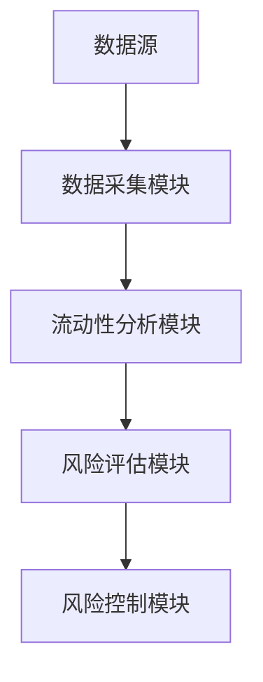

                 


# 特价股票投资中的流动性风险管理

> 关键词：流动性风险管理，特价股票，风险管理，股票投资，市场流动性

> 摘要：本文深入探讨了特价股票投资中的流动性风险管理，从核心概念到数学模型，从系统架构到项目实战，全面分析流动性风险管理的重要性及其在特价股票投资中的应用。文章结合理论与实践，旨在为投资者提供有效的风险管理策略。

---

# 第一部分: 特价股票与流动性风险管理概述

## 第1章: 特价股票的定义与特点

### 1.1 特价股票的定义与特点

#### 1.1.1 特价股票的定义
特价股票（Penny Stock）是指价格较低的股票，通常指价格在1美元以下的股票。这类股票通常来自小市值公司，流动性较低，波动性较高。

#### 1.1.2 特价股票的市场特性
- 价格低廉：通常低于1美元，吸引小额投资者。
- 市场流动性低：交易量小，买卖价差大。
- 波动性高：价格波动剧烈，受市场情绪影响大。

#### 1.1.3 特价股票的投资风险
- 流动性风险：交易量小，难以快速买卖。
- 信息不透明：公司信息披露较少，投资者难以评估价值。
- 波动风险：价格波动大，可能导致投资损失。

### 1.2 流动性风险管理的定义与重要性

#### 1.2.1 流动性风险管理的定义
流动性风险管理是指在投资过程中，通过分析和控制流动性风险，以确保投资组合能够在需要时以合理价格变现。

#### 1.2.2 流动性风险的来源与特征
- 市场深度不足：交易量小，难以迅速成交。
- 市场波动：价格波动大，影响流动性。
- 市场参与度低：投资者少，交易不活跃。

#### 1.2.3 流动性风险管理的重要性
- 保护投资者资金安全：避免因流动性不足导致损失。
- 提高投资效率：确保在需要时能够及时交易。
- 控制投资风险：降低因流动性不足引发的市场风险。

### 1.3 特价股票投资中的流动性风险

#### 1.3.1 特价股票流动性风险的特殊性
- 交易量小：买卖订单簿深度不足。
- 价格波动大：市场情绪影响显著。
- 市场关注度低：信息较少，关注度低。

#### 1.3.2 特价股票流动性风险的影响因素
- 市场深度：交易量和未成交订单数量。
- 市场广度：买卖双方的参与度。
- 市场情绪：投资者情绪影响交易行为。

#### 1.3.3 特价股票流动性风险管理的目标
- 确保交易订单能够及时成交。
- 降低因流动性不足导致的价格冲击。
- 优化投资组合的流动性结构。

---

## 第2章: 特价股票流动性风险管理的核心概念

### 2.1 流动性风险的核心要素

#### 2.1.1 市场深度
市场深度是指在特定价格水平上可以成交的订单数量。深度越大，流动性越好。

#### 2.1.2 市场广度
市场广度是指在一定价格区间内可以成交的订单总量。广度越大，市场流动性越强。

#### 2.1.3 市场稳定性
市场稳定性反映了市场价格的波动程度，稳定性越高，流动性风险越低。

### 2.2 特价股票流动性风险管理的框架

#### 2.2.1 风险识别
- 识别流动性风险的来源。
- 分析市场深度和广度。

#### 2.2.2 风险评估
- 评估流动性风险的严重程度。
- 使用数学模型量化风险。

#### 2.2.3 风险控制
- 制定风险管理策略。
- 实施风险控制措施。

### 2.3 特价股票流动性风险管理的参与者

#### 2.3.1 投资者
- 个人投资者：小额投资，关注流动性。
- 机构投资者：管理大量资金，注重流动性。

#### 2.3.2 市场做市商
- 提供流动性，维护市场稳定。
- 通过买卖价差获利。

#### 2.3.3 监管机构
- 制定流动性风险管理规则。
- 监督市场交易行为。

---

## 第3章: 特价股票流动性风险管理的数学模型与算法

### 3.1 流动性风险的量化指标

#### 3.1.1 市场深度指标
- 成交量：一定价格水平上的订单数量。
- 未成交订单：市场深度的重要组成部分。

#### 3.1.2 市场广度指标
- 平均成交量：衡量市场活跃度。
- 成交价区间：反映市场广度。

#### 3.1.3 市场冲击模型
- 市场冲击：大额交易对市场价格的影响。
- 冲击程度：与交易量和市场深度相关。

### 3.2 流动性风险的数学模型

#### 3.2.1 市场冲击模型
$$ \text{Market Impact} = k \times \sqrt{Q} $$
其中，\( Q \) 是交易量，\( k \) 是冲击系数。

#### 3.2.2 队列模型
队列模型通过分析订单簿中的订单，预测市场深度和流动性。

#### 3.2.3 交易成本模型
$$ \text{交易成本} = \text{买卖价差} \times \text{交易量} $$

### 3.3 算法原理与实现

#### 3.3.1 流动性风险管理算法
```python
def calculate_market_depth(order_book):
    # 计算市场深度
    buy_volume = sum(order_book['buy'])
    sell_volume = sum(order_book['sell'])
    return {'buy': buy_volume, 'sell': sell_volume}

def calculate_market_impact(trade_volume, market_depth):
    # 计算市场冲击
    if market_depth == 0:
        return float('inf')
    return (trade_volume ** 0.5) / market_depth

def liquidity_risk_assessment(trade_volume, market_depth):
    # 评估流动性风险
    impact = calculate_market_impact(trade_volume, market_depth)
    return impact < 0.05  # 示例阈值
```

#### 3.3.2 流动性风险管理流程
1. **数据收集**：获取订单簿和交易数据。
2. **市场深度计算**：使用队列模型分析市场深度。
3. **市场冲击预测**：基于交易量和市场深度预测冲击。
4. **风险评估**：判断冲击是否在可接受范围内。
5. **风险控制**：调整交易策略或分批交易。

---

## 第4章: 特价股票流动性风险管理的系统架构与实现

### 4.1 系统架构设计

#### 4.1.1 系统功能模块
- 数据采集模块：收集订单簿和交易数据。
- 流动性分析模块：计算市场深度和广度。
- 风险评估模块：预测市场冲击和风险等级。
- 风险控制模块：调整交易策略。

#### 4.1.2 系统架构图


### 4.2 接口设计与交互流程

#### 4.2.1 系统接口
- 数据接口：提供订单簿和交易数据。
- 分析接口：返回市场深度和冲击预测结果。
- 控制接口：调整交易策略。

#### 4.2.2 交互流程
1. 投资者提交交易请求。
2. 系统采集相关数据。
3. 分析市场深度和冲击。
4. 评估风险并给出建议。
5. 调整交易策略以控制风险。

---

## 第5章: 特价股票流动性风险管理的项目实战

### 5.1 项目环境安装

#### 5.1.1 安装依赖
- Python 3.8+
- NumPy
- Pandas
- Mermaid
- Matplotlib

```bash
pip install numpy pandas mermaid matplotlib
```

### 5.2 核心代码实现

#### 5.2.1 数据采集模块
```python
import pandas as pd

def fetch_order_book(ticker):
    # 示例：从API获取订单簿数据
    return pd.DataFrame({
        'buy': [100, 200, 300],
        'sell': [90, 180, 270]
    })
```

#### 5.2.2 流动性分析模块
```python
def calculate_market_depth(order_book):
    buy_volume = sum(order_book['buy'])
    sell_volume = sum(order_book['sell'])
    return buy_volume, sell_volume
```

#### 5.2.3 风险评估模块
```python
def assess_liquidityRisk(buy_depth, sell_depth):
    # 示例：基于市场深度评估风险
    if buy_depth < 100 or sell_depth < 100:
        return 'High Risk'
    elif buy_depth < 200 or sell_depth < 200:
        return 'Medium Risk'
    else:
        return 'Low Risk'
```

### 5.3 代码应用解读与分析

#### 5.3.1 数据采集模块
- 从API获取订单簿数据，分析市场深度和广度。

#### 5.3.2 风险评估模块
- 基于市场深度和广度评估流动性风险等级。

### 5.4 实际案例分析

#### 5.4.1 案例背景
- 特价股票：假设股票代码为`AAPL`，价格为0.8美元。
- 市场深度：买方订单总量为500，卖方订单总量为400。

#### 5.4.2 数据分析
- 市场深度：买方500，卖方400。
- 市场冲击：假设交易量为100，市场深度为450，冲击系数为0.02。
$$ \text{Market Impact} = 0.02 \times \sqrt{100} = 0.2 $$

#### 5.4.3 风险评估
- 市场冲击为0.2，低于阈值0.3，风险等级为中等。

### 5.5 项目小结

- 通过系统架构和代码实现，能够有效评估和管理流动性风险。
- 特价股票的流动性风险管理需要结合市场深度、广度和交易策略。

---

## 第6章: 特价股票流动性风险管理的最佳实践

### 6.1 小结
- 流动性风险管理是特价股票投资的重要环节。
- 通过数学模型和系统架构，可以有效评估和控制风险。

### 6.2 注意事项
- 定期监控市场深度和广度。
- 根据市场变化调整风险管理策略。
- 避免集中大额交易，分散交易以降低冲击。

### 6.3 拓展阅读
- 《金融市场流动性风险管理》
- 《Python金融算法》
- 《机器学习在金融中的应用》

---

# 作者：AI天才研究院/AI Genius Institute & 禅与计算机程序设计艺术 /Zen And The Art of Computer Programming

