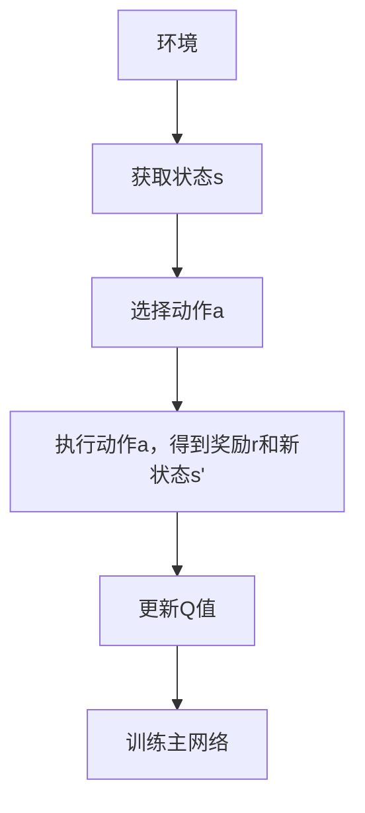
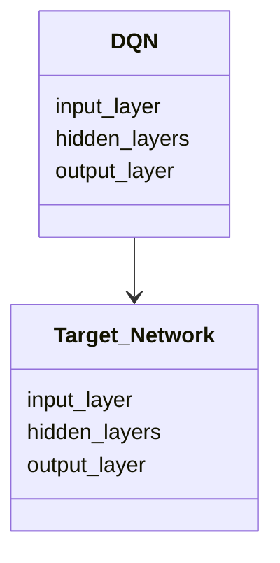
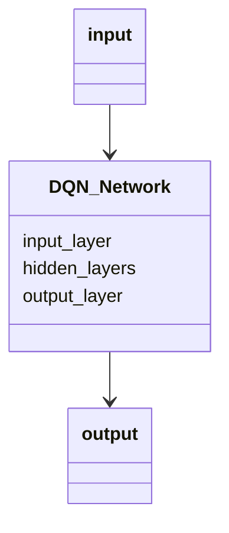
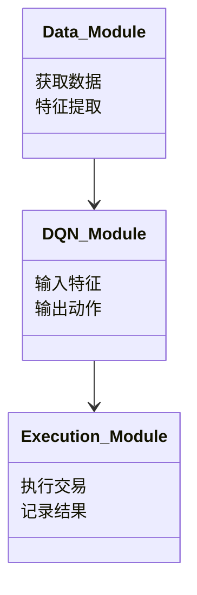
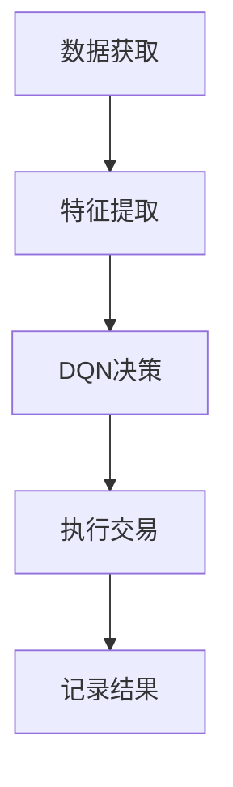

                 


# 特价股票投资中的深度强化学习模型构建与优化

## 关键词
- 特价股票投资
- 深度强化学习
- DQN算法
- 股票数据特征
- 模型优化

## 摘要
本文深入探讨了深度强化学习在特价股票投资中的应用，从模型构建到优化，详细阐述了DQN算法的实现过程，并结合实际案例分析，展示了如何利用深度强化学习提升股票投资的决策效率和准确性。

---

## 第1章: 特价股票投资与深度强化学习概述

### 1.1 特价股票投资的定义与特点
#### 1.1.1 特价股票的定义
特价股票是指价格相对较低，具有上涨潜力的股票。这类股票通常被市场低估，适合长期投资或短期炒作。

#### 1.1.2 特价股票投资的核心要素
- **市场分析**：通过技术分析和基本面分析判断股票价值。
- **风险管理**：控制投资风险，避免重大损失。
- **交易策略**：制定买入、卖出策略，优化投资回报。

#### 1.1.3 特价股票投资的市场特点
- **波动性**：市场波动大，机会与风险并存。
- **信息不对称**：投资者获取信息的能力影响投资决策。
- **复杂性**：涉及多种因素，如宏观经济、行业动态等。

### 1.2 深度强化学习的基本概念
#### 1.2.1 深度学习与强化学习的结合
深度学习擅长处理非结构化数据，强化学习通过与环境互动优化决策，结合两者优势，提升模型的决策能力。

#### 1.2.2 深度强化学习的核心原理
- **状态（State）**：模型所处的环境情况。
- **动作（Action）**：模型根据状态做出的决策。
- **奖励（Reward）**：模型决策后获得的反馈，用于优化策略。

#### 1.2.3 深度强化学习在金融领域的应用潜力
- **自动化交易**：通过模型自动执行买卖决策。
- **风险控制**：利用模型预测市场风险，优化投资组合。
- **市场情绪分析**：通过自然语言处理分析新闻和社交媒体，辅助决策。

### 1.3 深度强化学习与特价股票投资的结合意义
#### 1.3.1 深度强化学习在股票投资中的优势
- **数据驱动**：利用历史数据训练模型，提升预测准确性。
- **自适应性**：模型能根据市场变化调整策略，适应性强。
- **高效决策**：通过深度强化学习快速做出决策，减少人为错误。

#### 1.3.2 特价股票投资中使用深度强化学习的必要性
- **复杂决策**：股票市场复杂多变，人工决策效率低。
- **数据量大**：深度强化学习能处理海量数据，提取有效信息。
- **自动化优化**：模型能自动优化策略，提升投资回报。

#### 1.3.3 深度强化学习在特价股票投资中的应用前景
随着技术进步，深度强化学习在股票投资中的应用将更加广泛，可能成为未来投资的重要工具。

### 1.4 本章小结
本章介绍了特价股票投资和深度强化学习的基本概念，分析了它们的结合意义，为后续章节奠定了基础。

---

## 第2章: 深度强化学习的核心概念与算法原理

### 2.1 深度强化学习的核心概念
#### 2.1.1 状态空间与动作空间的定义
- **状态空间**：模型所处环境的所有可能状态。
- **动作空间**：模型在每个状态下可以执行的所有动作。

#### 2.1.2 奖励机制的设计
- **奖励函数**：定义模型在每个动作后获得的奖励，引导模型做出最优决策。
- **折扣因子γ**：用于平衡当前奖励和未来奖励的重要性。

#### 2.1.3 策略函数与价值函数的区别
- **策略函数**：直接决定动作选择，如DQN中的ε-greedy策略。
- **价值函数**：评估当前状态下各动作的期望收益，如Q-learning中的Q值。

### 2.2 深度强化学习的算法原理
#### 2.2.1 Q-learning算法的原理
Q-learning通过更新Q值表，学习最优策略。公式：
$$ Q(s,a) = Q(s,a) + \alpha [r + \max Q(s',a') - Q(s,a)] $$

#### 2.2.2 DQN（Deep Q-Network）算法的实现
DQN结合深度学习和Q-learning，使用两个神经网络：主网络和目标网络。流程图如下：



#### 2.2.3 策略梯度法（Policy Gradient）的原理
策略梯度法直接优化策略，目标是最化期望奖励。公式：
$$ \theta = \theta + \alpha \nabla_\theta J(\theta) $$

### 2.3 深度强化学习的数学模型与公式
#### 2.3.1 Q-learning的数学公式
$$ Q(s,a) = Q(s,a) + \alpha [r + \max Q(s',a') - Q(s,a)] $$

#### 2.3.2 DQN算法的网络结构
DQN使用两个深度神经网络，主网络和目标网络，结构如下：



#### 2.3.3 策略梯度法的优化目标
$$ \theta = \theta + \alpha \nabla_\theta J(\theta) $$

### 2.4 本章小结
本章详细讲解了深度强化学习的核心概念和算法原理，为后续模型构建奠定了理论基础。

---

## 第3章: 股票数据特征分析与预处理

### 3.1 股票数据的特征提取
#### 3.1.1 技术指标的定义与计算
- **移动平均线（MA）**：一定周期内的平均价格，用于判断趋势。
- **相对强弱指数（RSI）**：衡量股票超买或超卖状态。
- **成交量（Volume）**：交易量大小，反映市场热度。

#### 3.1.2 市场情绪指标的引入
- **新闻情感分析**：通过自然语言处理分析新闻标题，判断市场情绪。
- **社交媒体情绪**：分析Twitter、Reddit等平台的用户情绪。

#### 3.1.3 历史价格与成交量的分析
- **价格走势**：分析历史价格走势，预测未来价格。
- **成交量配合**：成交量与价格走势配合，判断趋势强度。

### 3.2 数据预处理方法
#### 3.2.1 数据清洗与标准化
- **数据清洗**：去除缺失值和异常值。
- **标准化**：将数据标准化到相同范围，方便模型训练。

#### 3.2.2 时间序列数据的处理
- **滑动窗口**：提取固定长度的历史数据作为输入。
- **差分法**：处理趋势和周期性，使数据平稳。

#### 3.2.3 数据集的划分与交叉验证
- **训练集、验证集、测试集**：按比例划分数据集，避免过拟合。
- **交叉验证**：多次划分数据集，评估模型稳定性。

### 3.3 特价股票数据的特征工程
#### 3.3.1 特征选择
- **重要特征筛选**：通过相关性分析，选择对模型影响大的特征。
- **特征组合**：将多个特征组合，形成更有意义的新特征。

#### 3.3.2 特征变换
- **归一化**：将特征值归一化到0-1范围。
- **对数变换**：处理偏态分布，使数据更符合正态分布。

#### 3.3.3 特征降维
- **主成分分析（PCA）**：降低特征维度，减少计算量。
- **自动编码器**：通过神经网络提取特征，降维同时保留重要信息。

### 3.4 本章小结
本章详细介绍了股票数据特征分析与预处理的方法，为模型构建提供了高质量的数据支持。

---

## 第4章: 深度强化学习模型的构建与训练

### 4.1 模型构建
#### 4.1.1 神经网络的设计
- **输入层**：接收股票数据特征。
- **隐藏层**：通过多个隐藏层提取特征。
- **输出层**：输出动作值，如买、卖或持有。

#### 4.1.2 神经网络的训练
- **损失函数**：使用均方误差或交叉熵损失。
- **优化器**：使用Adam优化器，调整学习率。

#### 4.1.3 模型结构示意图


### 4.2 模型训练
#### 4.2.1 训练策略
- **经验回放**：存储历史经验，随机抽取样本训练，减少相关样本偏差。
- **目标网络更新**：定期更新目标网络权重，保持稳定。

#### 4.2.2 超参数调优
- **学习率**：调整学习率，影响收敛速度和稳定性。
- **网络层数**：增加或减少网络层数，优化模型复杂度。
- **批次大小**：调整批量大小，平衡训练效率和稳定性。

#### 4.2.3 训练过程
1. 收集经验：通过模拟或真实数据收集经验。
2. 训练模型：使用经验回放更新神经网络。
3. 更新目标网络：定期更新目标网络权重。
4. 评估模型：验证模型在测试集上的表现。

### 4.3 本章小结
本章详细讲解了深度强化学习模型的构建与训练过程，为后续优化奠定了基础。

---

## 第5章: 深度强化学习模型的优化与调优

### 5.1 模型优化
#### 5.1.1 策略优化
- **ε-greedy策略**：平衡探索与利用，避免过度冒险。
- **策略调整**：根据市场变化动态调整策略，适应新环境。

#### 5.1.2 模型加速
- **并行计算**：利用多GPU加速训练，提高计算效率。
- **模型剪枝**：去除冗余参数，减少计算量。

#### 5.1.3 模型压缩
- **量化**：将模型参数量化，减少存储和计算需求。
- **知识蒸馏**：使用小模型继承大模型的知识，降低计算成本。

### 5.2 模型调优
#### 5.2.1 超参数优化
- **网格搜索**：遍历所有可能的超参数组合，找到最优配置。
- **随机搜索**：随机选择超参数组合，减少计算量。

#### 5.2.2 模型结构优化
- **网络结构调整**：尝试不同的网络结构，如更深或更宽的网络。
- **注意力机制**：引入注意力机制，捕捉数据中的重要特征。

#### 5.2.3 训练优化
- **学习率调度器**：动态调整学习率，加速收敛。
- **早停法**：监控验证集表现，防止过拟合。

### 5.3 本章小结
本章详细探讨了模型优化与调优的方法，展示了如何提升模型的性能和效率。

---

## 第6章: 深度强化学习在股票投资中的系统架构与实现

### 6.1 系统设计
#### 6.1.1 问题场景介绍
- **目标**：构建一个自动化股票交易系统，实现基于深度强化学习的买卖决策。
- **输入**：股票数据特征，如价格、成交量、技术指标等。
- **输出**：买卖决策，如买入、卖出或持有。

#### 6.1.2 系统功能设计
- **数据获取**：实时获取股票数据，包括历史价格、交易量等。
- **特征提取**：提取技术指标和市场情绪特征。
- **决策模块**：基于深度强化学习模型做出买卖决策。
- **执行模块**：根据决策执行交易，记录交易结果。

#### 6.1.3 系统架构设计


### 6.2 系统架构实现
#### 6.2.1 系统架构图


#### 6.2.2 接口设计
- **数据接口**：提供API获取股票数据。
- **决策接口**：提供API接收特征，返回动作。
- **执行接口**：提供API接收动作，执行交易并返回结果。

#### 6.2.3 交互流程
1. 数据获取模块获取股票数据。
2. 特征提取模块提取特征。
3. DQN模块根据特征做出决策。
4. 执行模块根据决策执行交易。
5. 记录交易结果，更新数据。

### 6.3 本章小结
本章详细介绍了系统架构与实现，展示了如何将深度强化学习应用于实际股票交易系统中。

---

## 第7章: 项目实战——基于DQN的特价股票投资系统

### 7.1 项目介绍
#### 7.1.1 项目目标
构建一个基于DQN的特价股票投资系统，实现自动化买卖决策，提升投资收益。

#### 7.1.2 项目架构
- **数据模块**：负责数据获取和预处理。
- **模型模块**：负责模型训练和预测。
- **执行模块**：负责交易执行和结果记录。

#### 7.1.3 项目工具
- **数据获取**：使用Yahoo Finance API获取股票数据。
- **模型训练**：使用Keras或TensorFlow框架。
- **交易执行**：模拟交易或对接真实交易接口。

### 7.2 核心实现
#### 7.2.1 环境搭建
- **安装依赖**：安装Python、TensorFlow、Pandas等库。
- **数据获取**：编写代码获取股票数据。
- **数据预处理**：对数据进行清洗和归一化处理。

#### 7.2.2 模型实现
- **定义网络结构**：使用Keras定义DQN网络。
- **训练模型**：编写训练循环，训练DQN模型。
- **保存与加载模型**：保存训练好的模型，方便后续使用。

#### 7.2.3 交易策略实现
- **决策函数**：根据模型输出做出买卖决策。
- **交易执行**：模拟或真实执行交易，记录交易结果。

### 7.3 项目实战
#### 7.3.1 环境搭建代码
```python
import pandas as pd
import numpy as np
import tensorflow as tf
from tensorflow.keras.models import Sequential
from tensorflow.keras.layers import Dense, LSTM, Dropout
import yfinance as yf
```

#### 7.3.2 模型实现代码
```python
def build_dqn_model(input_shape):
    model = Sequential()
    model.add(Dense(64, activation='relu', input_shape=input_shape))
    model.add(Dropout(0.2))
    model.add(Dense(32, activation='relu'))
    model.add(Dropout(0.2))
    model.add(Dense(1, activation='linear'))
    model.compile(optimizer='adam', loss='mse')
    return model
```

#### 7.3.3 交易策略实现代码
```python
def decide_action(model, state):
    if np.random.random() < 0.1:  # ε-greedy策略
        return np.random.randint(3)  # 0: 卖出, 1: 持有, 2: 买入
    q_values = model.predict(state)
    return np.argmax(q_values[0])
```

### 7.4 案例分析
#### 7.4.1 训练过程
- 训练模型，记录损失值，观察模型收敛情况。
- 调整超参数，优化模型性能。

#### 7.4.2 测试结果
- 在测试集上评估模型表现，计算收益和回撤。
- 对比不同策略，验证模型的有效性。

#### 7.4.3 实际交易表现
- 模拟交易，观察模型在实际市场中的表现。
- 根据回测结果，优化交易策略。

### 7.5 本章小结
本章通过实际项目展示了深度强化学习在特价股票投资中的应用，详细讲解了项目的实现过程和实际效果。

---

## 第8章: 深度强化学习模型优化与未来展望

### 8.1 模型优化
#### 8.1.1 策略优化
- **动态调整策略**：根据市场变化，实时调整策略参数。
- **多目标优化**：在追求收益的同时，控制风险。

#### 8.1.2 模型加速
- **量化模型**：将模型量化，减少计算资源消耗。
- **分布式计算**：利用分布式计算加速模型训练和推理。

#### 8.1.3 模型鲁棒性提升
- **增强数据多样性**：引入更多数据源，提升模型泛化能力。
- **多模型集成**：结合多个模型的优势，提升决策准确性。

### 8.2 未来展望
#### 8.2.1 深度强化学习的进一步研究
- **更复杂的网络结构**：如Transformer、Graph Neural Network等。
- **多智能体协作**：多个模型协作，提升整体决策能力。

#### 8.2.2 在股票投资中的应用扩展
- **跨市场投资**：利用深度强化学习进行多市场投资，分散风险。
- **个性化投资策略**：根据投资者风险偏好，定制个性化策略。

#### 8.2.3 结合其他技术
- **自然语言处理**：结合NLP技术，分析新闻和社交媒体，辅助决策。
- **区块链技术**：结合区块链，提升交易安全性和透明度。

### 8.3 本章小结
本章总结了模型优化的方法，并展望了深度强化学习在股票投资中的未来发展方向。

---

## 作者：AI天才研究院/AI Genius Institute & 禅与计算机程序设计艺术 /Zen And The Art of Computer Programming

---

以上是《特价股票投资中的深度强化学习模型构建与优化》的完整内容，涵盖了从理论到实践的各个方面，通过详细的分析和具体的代码示例，帮助读者深入了解深度强化学习在股票投资中的应用。

