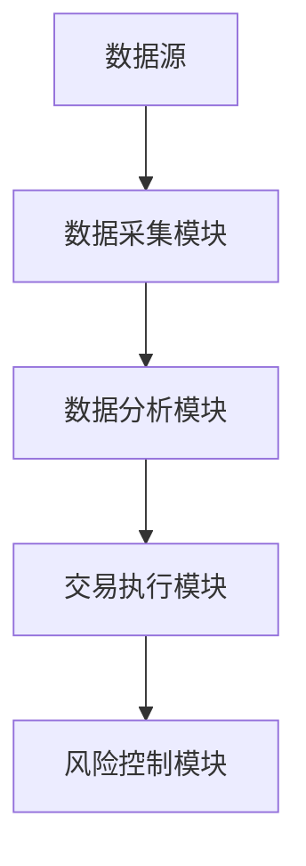

                 

# 特价股票投资中的监管套利策略

> 关键词：特价股票，监管套利，数学模型，系统架构，项目实战

> 摘要：本文详细探讨了特价股票投资中的监管套利策略，从基本概念、数学模型到系统架构和项目实战，分析了如何利用监管差异在特价股票市场中寻找投资机会。通过具体案例分析，展示了监管套利的实现过程和潜在风险，为投资者提供了实用的指导和建议。

---

# 第一部分: 监管套利的基础

## 第1章: 特价股票与监管套利概述

### 1.1 特价股票的基本概念

#### 1.1.1 特价股票的定义与特性
特价股票是指价格低于面值的股票，通常由于市场波动、公司业绩不佳或行业政策变化等原因导致。其特性包括低估值、高波动性和较高的风险回报比。

#### 1.1.2 特价股票的市场定位
特价股票通常在二级市场中交易，尤其是在股市的低价股板块。这些股票可能因公司市值较小、流动性较低而被投资者忽视，但也可能因其潜在的反转机会而受到关注。

#### 1.1.3 特价股票的投资价值分析
特价股票的投资价值可以通过市盈率（P/E）、市净率（P/B）等指标进行评估。由于其价格低廉，投资者可能通过低价买入高价卖出的方式获利。

---

### 1.2 监管套利的基本原理

#### 1.2.1 监管套利的定义
监管套利是指利用不同地区或市场之间的监管政策差异，通过合法或半合法的方式获取超额收益。在股票投资中，这通常涉及跨市场套利或利用监管漏洞。

#### 1.2.2 监管套利的核心机制
监管套利的核心机制在于发现并利用价格差异。例如，在A股和港股市场中，同一家公司的股票可能存在价格差异，投资者可以通过在低价市场买入、高价市场卖出的方式获利。

#### 1.2.3 监管套利的合法与非法边界
监管套利需要在法律允许的范围内进行。投资者需要了解相关法律法规，避免触犯市场操纵等违法行为。

---

## 第2章: 特价股票与监管套利的关联性

### 2.1 特价股票市场的监管框架

#### 2.1.1 特价股票的监管政策分析
特价股票的监管政策因市场而异。例如，A股市场对低价股的监管较为严格，而港股市场则相对宽松。

#### 2.1.2 特价股票市场的监管机构与职责
监管机构包括证监会、交易所等。它们负责监督市场交易，确保公平、公正。

#### 2.1.3 特价股票市场的主要参与者
参与者包括个人投资者、机构投资者和做市商等。监管套利通常涉及机构投资者和专业交易员。

---

### 2.2 监管套利在特价股票中的应用

#### 2.2.1 特价股票市场的套利机会
跨市场套利是常见的监管套利方式。例如，利用A股和港股市场的价格差异，进行套利交易。

#### 2.2.2 监管套利在特价股票中的具体表现
投资者可能通过低买高卖、配对交易等方式进行套利。例如，在A股买入某公司股票，同时在香港市场卖出同一家公司的股票。

#### 2.2.3 特价股票市场套利的可行性分析
套利的可行性取决于价格差异的大小、交易成本以及监管风险。投资者需要综合考虑这些因素。

---

# 第二部分: 监管套利策略的核心概念与原理

## 第3章: 监管套利的数学模型与公式

### 3.1 监管套利的基本数学模型

#### 3.1.1 套利机会的数学表达式
套利机会可以通过价格差来衡量：
$$ \text{套利机会} = \text{市场价差} \times \text{交易量} $$

#### 3.1.2 套利收益的计算公式
单笔套利收益计算：
$$ \text{收益} = \text{买入价} - \text{卖出价} $$

#### 3.1.3 套利风险的评估模型
套利风险与市场波动相关：
$$ \text{风险} = \text{市场波动} \times \text{交易量} $$

---

## 第4章: 监管套利的系统架构设计

### 4.1 系统功能模块划分

#### 4.1.1 数据采集模块
数据采集模块负责收集不同市场的股票价格数据，包括A股和港股市场的实时行情。

#### 4.1.2 数据分析模块
数据分析模块对收集到的数据进行处理，识别价格差异并生成套利信号。

#### 4.1.3 交易执行模块
交易执行模块根据套利信号执行交易指令，确保交易的高效性和准确性。

#### 4.1.4 风险控制模块
风险控制模块实时监控交易风险，调整头寸以应对市场波动。

---

### 4.2 系统架构图

---

# 第三部分: 监管套利的系统实现与项目实战

## 第5章: 监管套利的系统实现

### 5.1 系统环境搭建

#### 5.1.1 数据源选择
选择A股和港股市场作为数据源，确保数据的实时性和准确性。

#### 5.1.2 工具安装
安装相关交易接口和数据分析工具，如Python的pandas库和交易平台的API。

---

## 第6章: 项目实战

### 6.1 特价股票监管套利案例分析

#### 6.1.1 案例背景介绍
假设某公司在A股和港股市场的股价存在差异，投资者可以通过跨市场套利获利。

#### 6.1.2 案例分析
通过分析A股和港股市场的价格差异，识别套利机会。

#### 6.1.3 案例结果分析
计算套利收益和风险，评估策略的有效性。

---

## 第7章: 总结与展望

### 7.1 总结
监管套利是一种有效的投资策略，但需要综合考虑市场、监管和风险等因素。

### 7.2 展望
未来，随着市场的发展和技术的进步，监管套利将更加智能化和自动化。

---

作者：AI天才研究院/AI Genius Institute & 禅与计算机程序设计艺术 /Zen And The Art of Computer Programming

