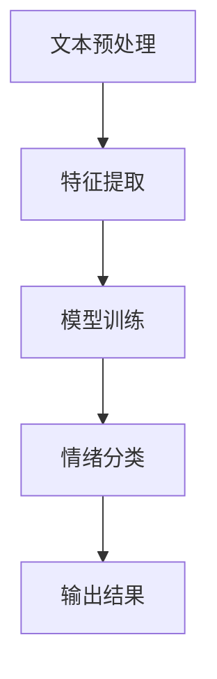
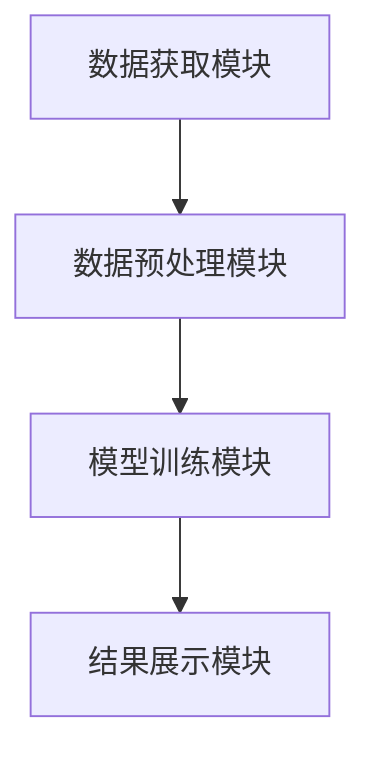
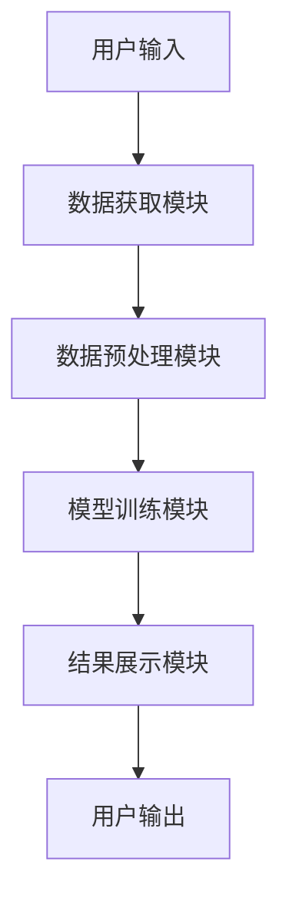

                 


# 特价股票投资中的社交媒体情绪分析与应用

---

## 关键词：
- 社会媒体情绪分析
- 特价股票投资
- 自然语言处理
- 机器学习
- 股票市场预测

---

## 摘要：
本文探讨了在特价股票投资中，如何利用社交媒体上的情绪数据进行分析，以辅助投资决策。通过介绍情绪分析的基本概念、算法原理、系统架构及实际案例，展示了如何从社交媒体数据中提取情绪信息，并将其应用于股票价格预测。文章详细讲解了从数据获取到模型构建的全过程，结合Python代码和mermaid流程图，帮助读者理解情绪分析在金融投资中的实际应用。

---

## 第一部分：社交媒体情绪分析概述

### 第1章：社交媒体情绪分析的背景与概念

#### 1.1 情绪分析的定义与背景
情绪分析是自然语言处理（NLP）领域的重要任务，旨在通过分析文本数据，识别出作者表达的情绪状态（如正面、负面、中性）。在股票投资中，情绪分析可以帮助投资者理解市场参与者的心理状态，从而预测股价波动。

- **情绪分析的基本概念**：情绪分析通过对文本的情感倾向进行分类，帮助投资者了解市场情绪。例如，社交媒体上的评论、新闻标题的情绪倾向可以反映市场对某只股票的看法。
- **在股票投资中的应用**：情绪分析可以帮助投资者识别市场情绪的变化，进而预测股价走势。例如，当市场情绪从乐观转向悲观时，股价可能下跌。
- **相关工具和技术**：常用的工具包括Python的自然语言处理库（如NLTK、spaCy）和机器学习算法（如SVM、随机森林）。

#### 1.2 特价股票投资中的情绪分析
- **特价股票的基本概念**：特价股票通常指价格较低的股票，具有较高的波动性和潜在的投资机会。
- **情绪分析在特价股票投资中的重要性**：社交媒体上的情绪数据可以帮助投资者识别市场情绪的变化，从而做出更明智的投资决策。
- **情绪分析的边界与外延**：情绪分析仅提供情绪信息，不能直接预测股价，但可以作为投资决策的辅助工具。

#### 1.3 情绪分析的核心要素与组成
- **数据来源**：社交媒体平台的选择，如Twitter、Reddit、东方财富网等。
- **情绪分类**：正面、负面、中性三种分类。
- **情绪强度**：情绪的强弱程度，如非常正面、轻微负面等。

---

## 第二部分：情绪分析的理论与方法

### 第2章：文本预处理与特征提取

#### 2.1 文本预处理
- **分词处理**：使用分词工具（如jieba）对中文文本进行分词。
- **停用词处理**：去除无意义词汇（如“的”、“了”）。
- **词干提取与词性标注**：提取词语的根形式，并标注词性（如名词、动词）。

#### 2.2 特征提取
- **词袋模型**：基于词频的特征提取方法，统计每个词语在文本中的出现次数。
- **词嵌入**：使用Word2Vec或GloVe生成词向量，捕捉词语的语义信息。
- **情感特征**：基于情感词典的特征提取，如使用哈工大的情感词典。

### 第3章：情绪分类算法

#### 3.1 基于机器学习的情绪分类
- **支持向量机（SVM）**：线性分类器，适用于高维数据的分类。
- **随机森林**：集成学习方法，通过构建多个决策树进行投票分类。

**算法流程图：**



**Python代码示例：**

```python
from sklearn.svm import SVC
from sklearn.feature_extraction.text import TfidfVectorizer
from sklearn.model_selection import train_test_split
import pandas as pd

# 数据加载
data = pd.read_csv('data.csv')

# 特征提取
vectorizer = TfidfVectorizer(max_features=5000)
X = vectorizer.fit_transform(data['text'])
y = data['label']

# 数据划分
X_train, X_test, y_train, y_test = train_test_split(X, y, test_size=0.2)

# 模型训练
model = SVC(C=1.0, gamma='auto')
model.fit(X_train, y_train)

# 模型预测
y_pred = model.predict(X_test)
print("Accuracy:", metrics.accuracy_score(y_test, y_pred))
```

---

## 第三部分：系统架构与实现

### 第4章：系统架构设计

#### 4.1 系统功能设计
- **数据获取模块**：从社交媒体获取文本数据。
- **数据预处理模块**：清洗和分词处理。
- **模型训练模块**：基于特征提取和机器学习算法进行情绪分类。
- **结果展示模块**：可视化情绪分布和预测结果。

**系统架构图：**



#### 4.2 接口设计与交互流程
- **接口设计**：API接口用于数据获取和模型调用。
- **交互流程**：用户输入查询条件，系统返回情绪分析结果。

**交互流程图：**



---

## 第四部分：项目实战

### 第5章：项目实战与案例分析

#### 5.1 项目环境安装
- 安装必要的库：`pip install jieba scikit-learn pandas`

#### 5.2 数据获取与清洗
- 使用API从社交媒体获取数据，并清洗无效数据。

#### 5.3 特征提取与模型训练
- 使用TF-IDF进行特征提取，训练SVM模型。

#### 5.4 案例分析
- 以某段时间内的市场情绪变化为例，分析情绪分析对股价的影响。

---

## 第五部分：实际应用与案例分析

### 第6章：实际应用与案例分析

#### 6.1 案例分析
- 分析某段时间内的情绪变化对股价的影响，验证情绪分析的有效性。

#### 6.2 情绪分析的优缺点
- **优点**：能够捕捉市场情绪，辅助投资决策。
- **缺点**：情绪分析无法直接预测股价，且存在数据噪声。

---

## 第六部分：总结与展望

### 第7章：总结与展望

#### 7.1 总结
- 情绪分析是一种有效的工具，能够帮助投资者理解市场情绪，辅助投资决策。

#### 7.2 展望
- 结合更多数据源（如新闻、财报）进行综合分析。
- 研究更复杂的情绪模型（如深度学习模型）。

---

## 作者信息

作者：AI天才研究院/AI Genius Institute & 禅与计算机程序设计艺术 /Zen And The Art of Computer Programming

---

感谢您的阅读！希望这篇文章能够帮助您理解社交媒体情绪分析在特价股票投资中的应用。如需进一步探讨或获取代码示例，请随时联系！

