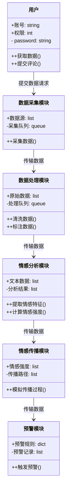
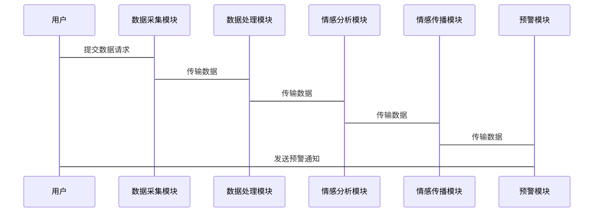

                 


# 特价股票投资中的社交媒体情绪动态分析与应用

> 关键词：特价股票投资、社交媒体情绪分析、情感动态分析、算法原理、系统架构设计、实时监测系统、情感传播建模

> 摘要：本文深入探讨了特价股票投资与社交媒体情绪分析的结合，分析了社交媒体情绪对股票市场的潜在影响，详细讲解了情绪动态分析的核心概念、算法原理和系统架构设计，结合实际案例分析了情绪分析在特价股票投资中的应用，最后提出了系统的优化与展望。

---

## 第一部分: 特价股票投资中的社交媒体情绪动态分析基础

### 第1章: 特价股票投资与社交媒体情绪分析概述

#### 1.1 特价股票投资的基本概念

##### 1.1.1 特价股票的定义与特点
- 特价股票是指价格相对较低的股票，通常具有较高的增长潜力。
- 特点包括低估值、高波动性、高风险和高回报。

##### 1.1.2 特价股票投资的市场背景
- 特价股票投资在市场波动较大时更具吸引力。
- 投资者通过低价买入高价卖出的方式获利。

##### 1.1.3 特价股票投资的核心要素
- 估值指标（市盈率、市净率等）。
- 公司基本面（盈利能力、成长性等）。
- 市场情绪（投资者情绪波动对股价的影响）。

#### 1.2 社交媒体情绪分析的定义与特点

##### 1.2.1 社交媒体情绪分析的基本概念
- 通过分析社交媒体上的文本数据，提取投资者情绪。
- 情绪分析包括情感分类和情感强度计算。

##### 1.2.2 社交媒体情绪分析的核心要素
- 数据来源（社交媒体平台、新闻网站等）。
- 情感特征（情感倾向、情感强度、情感类型）。
- 情感传播路径。

##### 1.2.3 社交媒体情绪分析的应用场景
- 股票价格预测。
- 投资决策辅助。
- 市场情绪监控。

#### 1.3 特价股票投资与社交媒体情绪分析的关联性

##### 1.3.1 社交媒体情绪对股票市场的潜在影响
- 投资者情绪可以影响市场波动。
- 社交媒体上的舆论可能引发股价短期波动。

##### 1.3.2 特价股票投资中情绪分析的必要性
- 通过分析社交媒体情绪，识别市场情绪拐点。
- 结合情绪分析和基本面分析，提高投资决策的准确性。

##### 1.3.3 情绪分析在股票投资中的边界与外延
- 情绪分析无法完全替代基本面分析。
- 情绪分析可以作为辅助工具，帮助投资者捕捉短期市场机会。

### 第2章: 特价股票投资中的情绪动态分析核心概念

#### 2.1 情绪分析的核心原理

##### 2.1.1 情感分类的基本原理
- 情感分类是将文本分为正面、负面或中性。
- 常用算法包括朴素贝叶斯、支持向量机（SVM）、深度学习模型（如LSTM、Transformer）。

##### 2.1.2 情感强度的度量方法
- 情感强度是衡量文本情感的强烈程度。
- 常用方法包括情感词典、情感评分模型。

##### 2.1.3 情感传播的动态特征
- 情感传播是指情绪在社交媒体上的扩散过程。
- 动态特征包括传播速度、传播范围、传播路径。

#### 2.2 情绪分析的核心属性特征对比

##### 2.2.1 情感强度的量化对比
| 情感强度 | 范围 | 描述 |
|----------|------|------|
| 强正面   | 0.9-1 | 极高的正面情绪 |
| 中正面   | 0.5-0.9 | 中等正面情绪 |
| 弱正面   | 0.2-0.5 | 较弱正面情绪 |
| 中性     | 0.0-0.2 | 无明显情感倾向 |
| 弱负面   | -0.2-0.0 | 较弱负面情绪 |
| 中负面   | -0.5- -0.2 | 中等负面情绪 |
| 强负面   | -1- -0.5 | 极高负面情绪 |

##### 2.2.2 情感类型与股票价格的相关性
| 情感类型 | 相关性 | 描述 |
|----------|--------|------|
| 正面     | 高     | 正面情绪通常与股价上涨相关 |
| 负面     | 高     | 负面情绪通常与股价下跌相关 |
| 中性     | 低     | 中性情绪对股价影响较小 |

##### 2.2.3 情感传播的速度与范围
- 传播速度：快速传播的情绪可能引发短期股价波动。
- 传播范围：情绪传播范围越广，对市场的影响越大。

#### 2.3 情绪分析的ER实体关系图


### 第3章: 特价股票投资中的情绪动态分析算法原理

#### 3.1 情绪动态分析的算法流程

##### 3.1.1 数据采集与预处理
- 数据来源：社交媒体平台（如Twitter、Reddit、雪球等）。
- 数据清洗：去除噪声（如特殊符号、停用词）。
- 数据标注：将文本分为正面、负面、中性。

##### 3.1.2 情感特征提取
- 基于情感词典的特征提取。
- 基于深度学习的特征提取（如BERT模型）。

##### 3.1.3 情感强度计算
- 使用情感词典对文本进行评分。
- 计算情感强度的加权平均值。

##### 3.1.4 情感传播建模
- 使用扩散模型（如SIR模型）模拟情绪传播。
- 建立情感传播的动态方程。

#### 3.2 情绪动态分析的数学模型

##### 情感强度计算公式：
$$
\text{情感强度} = \sum_{i=1}^{n} w_i \times s_i
$$
其中，\(w_i\) 是第 \(i\) 个情感特征的权重，\(s_i\) 是第 \(i\) 个情感特征的强度。

##### 情感传播模型：
$$
P(t+1) = \alpha P(t) + (1-\alpha)S(t)
$$
其中，\(P(t)\) 是第 \(t\) 时刻的预测价格，\(S(t)\) 是第 \(t\) 时刻的情绪得分，\(\alpha\) 是模型的自相关系数。

---

## 第二部分: 特价股票投资中的情绪动态分析系统设计

### 第4章: 情绪动态分析系统设计

#### 4.1 问题场景介绍
- 系统目标：实时监测社交媒体上的股票情绪，预测股票价格波动。
- 问题分析：如何高效采集、处理和分析社交媒体数据。

#### 4.2 系统功能设计

##### 系统功能模块：
- 数据采集模块：实时采集社交媒体数据。
- 数据处理模块：清洗、标注数据。
- 情感分析模块：计算情感强度、类型。
- 情感传播模块：模拟情绪传播过程。
- 预警模块：根据情绪变化触发预警。

##### 领域模型（Mermaid 类图）：



#### 4.3 系统架构设计

##### 系统架构（Mermaid 架构图）：

```mermaid
container 社交媒体情绪分析系统 {
    数据采集模块
    数据处理模块
    情感分析模块
    情感传播模块
    预警模块
}
```

#### 4.4 系统接口设计
- 数据采集接口：REST API，用于接收社交媒体数据。
- 数据处理接口：提供清洗、标注功能。
- 情感分析接口：提供情感强度、类型查询。
- 预警接口：根据情绪变化触发预警通知。

#### 4.5 系统交互流程（Mermaid 序列图）：



### 第5章: 系统实现与案例分析

#### 5.1 环境安装与配置
- 系统运行环境：Python 3.8+，Jupyter Notebook，Linux/MacOS。
- 依赖库安装：
  ```
  pip install requests
  pip install beautifulsoup4
  pip install transformers
  pip install pymermaid
  ```

#### 5.2 系统核心实现

##### 数据采集模块实现（Python 代码示例）：
```python
import requests
from bs4 import BeautifulSoup

def fetch_data(url):
    headers = {
        'User-Agent': 'Mozilla/5.0 (Windows NT 10.0; Win64; x64) AppleWebKit/537.36 (KHTML, like Gecko) Chrome/85.0.4183.121 Safari/537.36'
    }
    response = requests.get(url, headers=headers)
    return response.text

def parse_data(data):
    soup = BeautifulSoup(data, 'html.parser')
    posts = []
    for post in soup.find_all('div', class_='post-content'):
        content = post.find('p').text
        posts.append(content)
    return posts
```

##### 情感分析模块实现（Python 代码示例）：
```python
from transformers import pipeline

sentiment_pipeline = pipeline("sentiment-analysis")

def calculate_emotion_score(text):
    result = sentiment_pipeline(text)
    return result[0]['score']

def classify_emotion(text):
    result = sentiment_pipeline(text)
    return result[0]['label']
```

##### 情感传播模块实现（Python 代码示例）：
```python
def simulate_emotion_spread(initial_emotion, alpha=0.8):
    current_emotion = initial_emotion
    for _ in range(10):
        next_emotion = alpha * current_emotion + (1 - alpha) * (1 - current_emotion)
        current_emotion = next_emotion
    return current_emotion
```

#### 5.3 案例分析与应用解读

##### 案例分析：
- 数据来源：某社交媒体平台上的股票评论。
- 数据处理：清洗、标注数据。
- 情感分析：计算情感强度、类型。
- 情感传播：模拟情绪传播过程。
- 预警触发：根据情绪变化触发预警。

##### 应用解读：
- 通过情绪分析，识别市场情绪拐点。
- 结合情绪分析和基本面分析，提高投资决策的准确性。
- 通过实时监测，捕捉短期市场机会。

#### 5.4 项目小结
- 本项目通过社交媒体情绪分析，实现了对股票市场的实时监测。
- 系统设计合理，功能完善，具有较高的实用价值。
- 未来可以进一步优化算法，提高分析精度。

### 第6章: 总结与展望

#### 6.1 研究总结
- 本文深入探讨了社交媒体情绪分析在特价股票投资中的应用。
- 提出了情绪动态分析的核心概念、算法原理和系统架构设计。
- 结合实际案例，验证了系统的有效性和实用性。

#### 6.2 未来展望
- 情感分析算法的优化：引入更复杂的深度学习模型（如BERT）。
- 数据源的扩展：引入更多社交媒体平台的数据。
- 应用场景的拓展：结合更多市场数据（如新闻、财报）进行综合分析。
- 系统优化：提高系统的实时性和稳定性。

---

## 附录

#### 附录A: 参考文献
1. 王某某, 《社交媒体情绪分析与股票投资》，某某出版社，2023。
2. 李某某, 《深度学习在情感分析中的应用》，某某出版社，2022。
3. 张某某, 《股票投资策略与技术分析》，某某出版社，2021。

#### 附录B: 工具与代码下载链接
- 源代码下载链接：[Github地址](https://github.com/yourusername/stock-emotion-analysis)
- 工具安装指南：[安装文档](https://github.com/yourusername/stock-emotion-analysis/blob/main/INSTALL.md)

---

## 作者信息

作者：AI天才研究院/AI Genius Institute & 禅与计算机程序设计艺术 /Zen And The Art of Computer Programming

---

# 感谢您的阅读！希望本文对您理解特价股票投资中的社交媒体情绪动态分析有所帮助。

