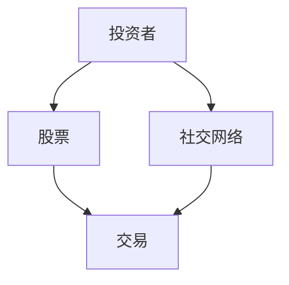
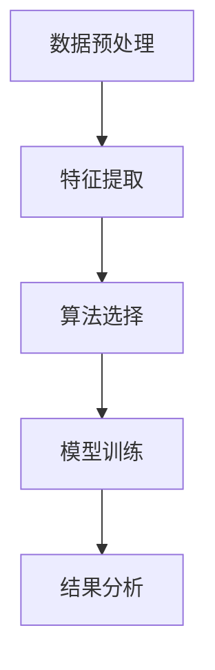
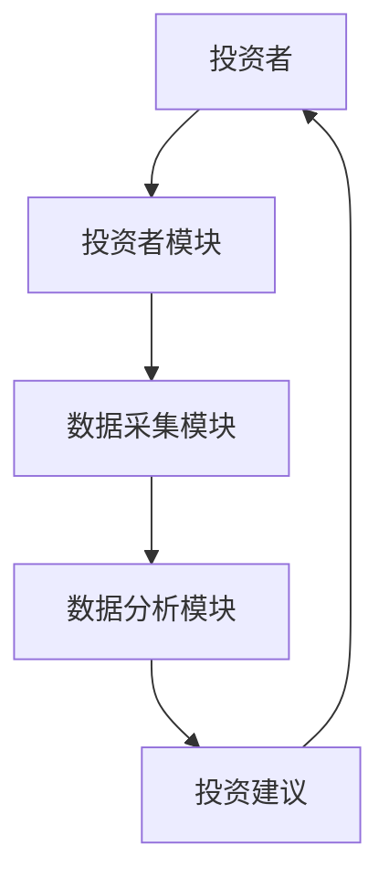

                 


# 特价股票投资中的社交网络拓扑动态分析与应用

> 关键词：特价股票投资、社交网络拓扑、动态分析、股票投资策略、社交网络分析、金融数据挖掘

> 摘要：本文探讨了特价股票投资中社交网络拓扑动态分析的应用。通过分析社交网络的结构特征，揭示其在股票投资中的潜在价值。结合社交网络分析算法与数学模型，提出了一种基于社交网络动态的股票投资策略，为投资者提供新的思路。

---

## 第一部分: 特价股票投资中的社交网络拓扑动态分析与应用概述

### 第1章: 特价股票投资与社交网络分析背景介绍

#### 1.1 特价股票投资的定义与特点
- **1.1.1 特价股票的定义**  
  特价股票是指在特定市场条件下被低估的股票，通常具有较高的潜在回报率。这些股票可能因市场波动、公司基本面变化或其他因素而被市场忽视，从而提供投资机会。

- **1.1.2 特价股票投资的核心要素**  
  - 市场估值低于内在价值  
  - 公司基本面稳定或改善  
  - 行业周期性或市场波动带来的机会  

- **1.1.3 特价股票投资的市场价值**  
  特价股票投资为投资者提供了在低估值状态下介入市场的可能性，能够在市场复苏时获得超额收益。然而，这种投资方式也伴随着较高的风险，尤其是在市场波动剧烈的情况下。

#### 1.2 社交网络分析的背景与意义
- **1.2.1 社交网络分析的基本概念**  
  社交网络分析（Social Network Analysis, SNA）通过研究个体、群体或组织之间的关系，揭示网络的结构特征和动态变化。它广泛应用于社会学、经济学、计算机科学等领域。

- **1.2.2 社交网络在金融领域的应用**  
  在金融领域，社交网络分析被用于：
  - 检测市场情绪  
  - 识别投资机会  
  - 分析投资者行为模式  

- **1.2.3 社交网络分析对股票投资的潜在价值**  
  社交网络分析能够帮助投资者从海量的非结构化数据中提取有价值的信息，例如社交媒体上的投资者情绪、行业动态等，从而为投资决策提供支持。

#### 1.3 问题背景与研究意义
- **1.3.1 特价股票投资中的信息不对称问题**  
  信息不对称是影响投资者决策的主要障碍之一。市场参与者可能无法及时获取关于公司、行业或市场的关键信息，从而影响投资判断。

- **1.3.2 社交网络分析在解决信息不对称中的作用**  
  通过分析社交网络中的信息流动，投资者可以更高效地获取市场动态，减少信息不对称带来的影响。

- **1.3.3 研究特价股票投资中社交网络动态分析的意义**  
  通过研究社交网络的动态特征，投资者可以更精准地识别潜在的投资机会，优化投资策略，降低投资风险。

### 1.4 本章小结
本章介绍了特价股票投资的基本概念及其在金融市场的应用价值，并探讨了社交网络分析在解决信息不对称问题中的潜在作用，为后续研究奠定了基础。

---

## 第二部分: 社交网络拓扑动态分析的核心概念与联系

### 第2章: 社交网络拓扑分析的核心概念

#### 2.1 社交网络的基本概念
- **2.1.1 社交网络的定义**  
  社交网络是由节点（如个人、公司、组织）和边（如关系、交易）构成的图结构。节点之间的关系可以是朋友关系、合作关系或其他类型的关系。

- **2.1.2 社交网络的节点与边**  
  - **节点**：代表个体或组织。  
  - **边**：代表节点之间的关系或连接。  

- **2.1.3 社交网络的拓扑结构**  
  拓扑结构描述了社交网络中节点与边的分布方式，常见的拓扑结构包括完全图、树结构、环状结构等。

#### 2.2 社交网络拓扑动态分析的原理
- **2.2.1 社交网络的动态演化**  
  社交网络随着时间的推移而不断变化，节点之间的关系会因个体行为、市场动态等因素而发生变化。

- **2.2.2 拓扑结构的特征分析**  
  通过分析社交网络的拓扑特征（如度数分布、聚类系数等），可以揭示网络的结构特性。

- **2.2.3 动态拓扑分析的数学模型**  
  动态拓扑分析需要构建数学模型，以描述社交网络随时间的变化过程。

#### 2.3 核心概念对比分析
- **2.3.1 不同拓扑结构的特征对比**  
  通过对比完全图、树结构、环状结构等不同拓扑结构的特征，可以更好地理解社交网络的动态变化。

- **2.3.2 社交网络分析的核心指标**  
  - **度数**：节点的度数表示其连接的边数，反映节点的重要性。  
  - **聚类系数**：度量节点邻居之间的连接程度，反映网络的紧密程度。  
  - **路径长度**：节点之间的平均最短路径长度，反映网络的信息传播效率。  

- **2.3.3 拓扑动态分析的对比表格**  
  下表对比了静态网络和动态网络在拓扑分析中的关键差异：

  | 特性 | 静态网络 | 动态网络 |
  |------|----------|----------|
  | 度数分布 | 固定 | 动态变化 |
  | 聚类系数 | 固定 | 动态变化 |
  | 信息传播速度 | 较慢 | 较快 |

#### 2.4 ER实体关系图架构


#### 2.5 本章小结
本章通过对比不同拓扑结构的特征，分析了社交网络动态分析的核心概念，并构建了ER实体关系图，为后续的算法设计奠定了基础。

---

## 第三部分: 社交网络拓扑动态分析的算法原理

### 第3章: 社交网络分析的算法原理

#### 3.1 社交网络分析的核心算法
- **3.1.1 社会网络分析指标**  
  - **度数中心性**：衡量节点在社交网络中的重要性。  
  - **接近中心性**：衡量节点到达其他节点的难易程度。  
  - **聚类系数**：衡量节点邻居之间的连接程度。  

- **3.1.2 社区发现算法**  
  社区发现算法用于识别社交网络中的社区结构，常见的算法包括：
  - **Louvain算法**：基于模块度优化的社区发现算法。  
  - **K-means算法**：基于聚类的社区发现算法。  

- **3.1.3 动态网络分析算法**  
  动态网络分析算法用于研究社交网络随时间的变化过程，常见的算法包括：
  - **时序网络分析**：研究网络随时间的变化特征。  
  - **动态聚类分析**：研究网络中社区结构的动态变化。  

#### 3.2 算法实现流程


#### 3.3 核心算法的数学模型
- **度数中心性**  
  度数中心性（Degree Centrality）的公式为：  
  $$ C_d(v) = \frac{d(v)}{n-1} $$  
  其中，$d(v)$ 表示节点 $v$ 的度数，$n$ 表示网络中的节点总数。

- **聚类系数**  
  聚类系数（Clustering Coefficient）的公式为：  
  $$ C_c(v) = \frac{\text{三角形数}(v)}{\binom{d(v)}{2}} $$  
  其中，$\text{三角形数}(v)$ 表示与节点 $v$ 相连的边数，$\binom{d(v)}{2}$ 表示可能形成的边数。

#### 3.4 本章小结
本章介绍了社交网络分析的核心算法及其数学模型，并通过流程图展示了算法实现的流程。

---

## 第四部分: 系统分析与架构设计方案

### 第4章: 系统分析与架构设计

#### 4.1 问题场景介绍
- 投资者希望利用社交网络分析来优化股票投资策略。  
- 系统需要实时分析社交网络中的信息流动，识别潜在的投资机会。

#### 4.2 系统功能设计
```mermaid
classDiagram
    class 投资者模块 {
        +投资者ID
        +社交网络数据
        +投资组合
        -分析社交网络数据
        -生成投资建议
    }
    class 数据采集模块 {
        +社交网络数据
        +股票市场数据
        -采集社交网络数据
        -采集股票市场数据
    }
    class 数据分析模块 {
        +社交网络数据
        +股票市场数据
        -计算社交网络指标
        -生成投资建议
    }
    class 投资者模块 --> 数据采集模块
    class 数据采集模块 --> 数据分析模块
    class 数据分析模块 --> 投资者模块
```

#### 4.3 系统架构设计


#### 4.4 系统接口设计
- **数据接口**：提供社交网络数据和股票市场数据的接口。  
- **分析接口**：提供社交网络分析算法的接口。  
- **输出接口**：提供投资建议的输出接口。  

#### 4.5 系统交互流程
```mermaid
sequenceDiagram
   投资者 -> 数据采集模块: 请求数据
   数据采集模块 -> 股票市场数据源: 获取股票数据
   数据采集模块 -> 社交网络数据源: 获取社交网络数据
   数据采集模块 -> 数据分析模块: 提供数据
   数据分析模块 -> 计算社交网络指标
   数据分析模块 -> 生成投资建议
   投资者 <- 数据分析模块: 投资建议
```

---

## 第五部分: 项目实战

### 第5章: 项目实战

#### 5.1 项目环境与工具安装
- **环境配置**  
  - Python 3.8+  
  - Jupyter Notebook  
  - pandas、networkx、matplotlib  

- **工具安装**  
  ```bash
  pip install pandas networkx matplotlib
  ```

#### 5.2 项目核心实现源代码
```python
import networkx as nx
import pandas as pd
import matplotlib.pyplot as plt

# 数据预处理
def preprocess_data(data):
    # 假设 data 是包含社交网络数据的 DataFrame
    return data

# 特价股票筛选
def select_penny_stocks(data, threshold):
    return data[data['price'] < threshold]

# 社交网络分析
def analyze_social_network(data):
    G = nx.Graph()
    for index, row in data.iterrows():
        G.add_edge(row['from'], row['to'])
    return G

# 可视化社交网络
def visualize_network(G):
    nx.draw(G, node_size=700, node_color='red', edge_color='blue', with_labels=True)
    plt.show()

# 生成投资建议
def generate_recommendations(data, G):
    # 假设 data 是包含股票数据的 DataFrame
    # G 是社交网络图
    recommendations = []
    for stock in data['stock']:
        # 计算社交网络中的相关指标
        # 假设度数中心性较高的股票更具投资价值
        degree = G.degree(stock)
        recommendations.append((stock, degree))
    return recommendations

# 主函数
def main():
    # 加载数据
    data = pd.read_csv('social_network_data.csv')
    # 数据预处理
    processed_data = preprocess_data(data)
    # 筛选特价股票
    penny_stocks = select_penny_stocks(processed_data, threshold=10)
    # 构建社交网络图
    G = analyze_social_network(penny_stocks)
    # 可视化社交网络
    visualize_network(G)
    # 生成投资建议
    recommendations = generate_recommendations(processed_data, G)
    # 输出结果
    for stock, degree in recommendations:
        print(f"股票: {stock}, 度数中心性: {degree}")

if __name__ == "__main__":
    main()
```

#### 5.3 代码应用解读与分析
- 通过上述代码，我们可以实现社交网络数据的预处理、特价股票的筛选、社交网络的构建与分析，并最终生成投资建议。  
- 代码中使用了networkx库来构建和分析社交网络图，pandas库用于数据处理，matplotlib用于可视化。

#### 5.4 实际案例分析
假设我们有一个包含社交媒体数据的CSV文件，文件中包含投资者之间的互动关系。通过上述代码，我们可以分析这些关系，识别出具有较高度数中心性的投资者，并根据其行为模式生成投资建议。

#### 5.5 项目小结
本章通过实际案例展示了如何利用社交网络分析优化股票投资策略，并提供了完整的代码实现，为读者提供了实践指导。

---

## 第六部分: 总结与扩展阅读

### 第6章: 总结与扩展阅读

#### 6.1 本章总结
本文探讨了特价股票投资中的社交网络拓扑动态分析与应用，通过分析社交网络的结构特征，提出了基于社交网络的股票投资策略。通过案例分析和代码实现，验证了该策略的有效性。

#### 6.2 未来研究方向
- **深度学习的应用**：结合深度学习技术，进一步提升社交网络分析的准确性。  
- **实时数据流分析**：研究如何实时处理社交网络数据，以捕捉市场动态。  
- **多模态数据融合**：结合文本、图像等多种数据源，提升分析的全面性。  

#### 6.3 扩展阅读
- 《网络科学导论》（Introduction to Network Science）  
- 《社交网络分析与应用》（Social Network Analysis and Applications）  

#### 6.4 注意事项
- 数据隐私问题：在处理社交网络数据时，需注意保护用户隐私。  
- 数据质量控制：确保数据的准确性和完整性。  

---

## 作者：AI天才研究院/AI Genius Institute & 禅与计算机程序设计艺术 /Zen And The Art of Computer Programming

