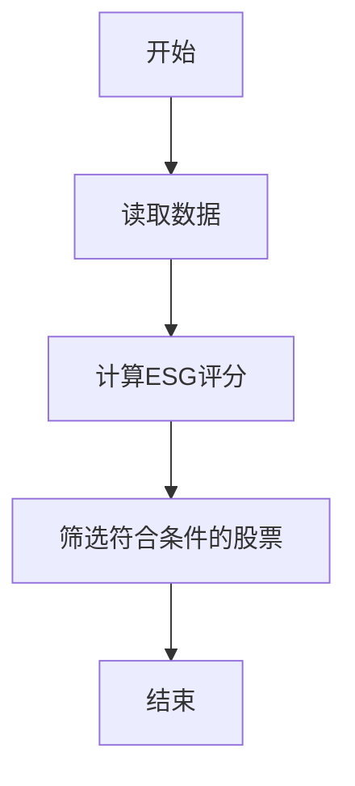
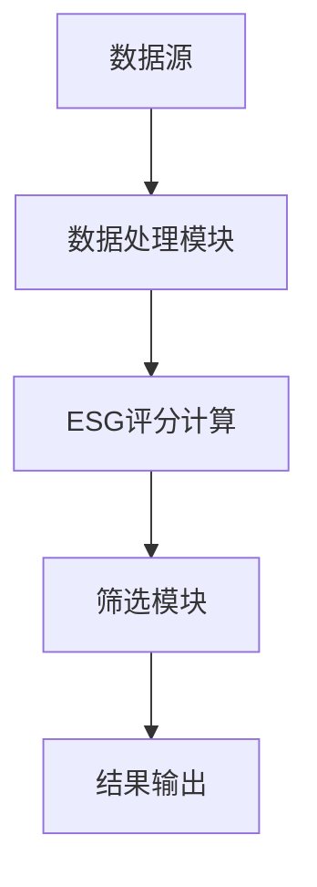
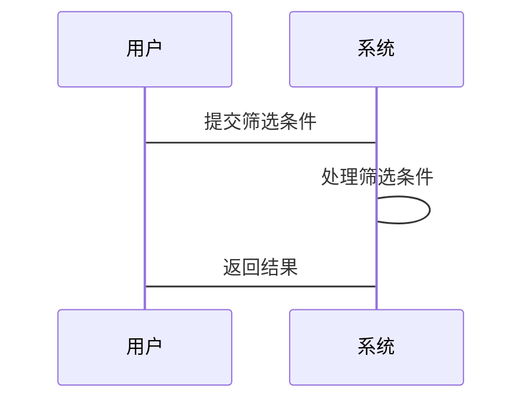

                 


# 特价股票投资中的社会责任投资因素

## 关键词：
- 特价股票、社会责任投资、ESG评分、投资策略、风险管理

## 摘要：
本文探讨了在特价股票投资中考虑社会责任投资因素的重要性。通过分析社会责任投资的核心概念、算法模型和系统架构，结合实际案例，展示了如何在选择特价股票时，筛选出具备良好社会责任表现的公司，以提升投资的可持续性和道德标准。

---

# 第1章: 特价股票与社会责任投资的背景介绍

## 1.1 特价股票的定义与特点

### 1.1.1 特价股票的定义
特价股票通常指市场价格低于其内在价值的股票，常见于低市盈率或低市净率的公司。这类股票可能因市场低估或公司暂时困境而被错杀，为投资者提供了低价买入的机会。

### 1.1.2 特价股票的核心特点
- **低估值**：市盈率、市净率低于行业平均水平。
- **潜在上涨空间**：因市场调整可能带来股价回升。
- **风险与机会并存**：低价可能意味着高风险，需谨慎选择。

### 1.1.3 特价股票的市场定位与投资价值
特价股票在熊市或震荡市场中更具吸引力，适合长期投资者。但需注意公司基本面，避免选择基本面恶化或夕阳产业的公司。

## 1.2 社会责任投资的定义与特点

### 1.2.1 社会责任投资的定义
社会责任投资（SRI）指在投资过程中，除了考虑财务回报，还关注公司在环境、社会和治理（ESG）方面的表现，以促进可持续发展。

### 1.2.2 社会责任投资的核心要素
- **环境（E）**：碳排放、能源使用效率。
- **社会（S）**：员工权益、社区关系。
- **治理（G）**：公司治理结构、高管薪酬。

### 1.2.3 社会责任投资的市场现状与发展趋势
近年来，全球SRI规模持续增长，投资者越来越关注企业的社会责任表现，ESG评分成为重要的投资参考指标。

## 1.3 特价股票与社会责任投资的结合

### 1.3.1 特价股票与社会责任投资的背景
随着环保和可持续发展理念的普及，投资者不仅追求财务回报，还关注投资行为的社会影响。将社会责任投资引入特价股票筛选，成为一种新兴的投资策略。

### 1.3.2 特价股票与社会责任投资的结合意义
- **提升投资质量**：避免投资于道德风险较高的公司。
- **降低投资风险**：社会责任表现好的公司通常治理更透明，抗风险能力更强。
- **实现可持续发展**：通过投资推动企业改进环境和社会表现。

### 1.3.3 特价股票与社会责任投资的边界与外延
- **边界**：仅适用于具备社会责任评分数据的公司。
- **外延**：可扩展至其他投资策略，如指数基金或ETF。

---

# 第2章: 特价股票与社会责任投资的核心概念与联系

## 2.1 社会责任投资的原理与机制

### 2.1.1 ESG评分体系的定义与作用
ESG评分是衡量公司社会责任表现的重要指标，广泛应用于投资决策中。高ESG评分通常意味着公司在环境、社会和治理方面表现优异。

### 2.1.2 ESG评分体系的计算方法
- **环境（E）**：碳排放、能源使用效率。
- **社会（S）**：员工权益、社区关系。
- **治理（G）**：公司治理结构、高管薪酬。

### 2.1.3 ESG评分体系的优缺点
优点：提供全面的公司社会责任表现；缺点：评分标准不统一，可能存在主观性。

## 2.2 特价股票与社会责任投资的对比分析

### 2.2.1 特价股票与社会责任投资的属性对比
| 属性 | 特价股票 | 社会责任投资 |
|------|----------|--------------|
| 投资目标 | 低价买入，长期增值 | 综合考虑财务回报和社会影响 |
| 风险 | 较高 | 较低，但需关注社会责任表现 |
| 数据需求 | 财务数据 | ESG评分、社会责任表现数据 |

### 2.2.2 特价股票与社会责任投资的特征对比
- **投资逻辑**：前者关注估值，后者关注社会责任表现。
- **风险因素**：前者关注市场风险，后者关注治理风险。

### 2.2.3 特价股票与社会责任投资的优缺点对比
- **优点**：结合社会责任投资因素，提升投资的社会影响力。
- **缺点**：可能限制投资范围，筛选出符合条件的特价股票数量有限。

## 2.3 特价股票与社会责任投资的ER实体关系图

```mermaid
erDiagram
    customer[C:\customer] {
        id : integer
        name : string
    }
    stock[dbo:stock] {
        stock_id : integer
        stock_name : string
        stock_price : float
        stock_value : float
    }
    esg_score[dbo:esg_score] {
        esg_id : integer
        company_id : integer
        environment : integer
        society : integer
        governance : integer
        total_esg : integer
    }
    company[dbo:company] {
        company_id : integer
        company_name : string
        industry : string
        location : string
    }
    transaction[dbo:transaction] {
        transaction_id : integer
        customer_id : integer
        stock_id : integer
        transaction_date : date
        amount : float
    }
    customer--|{many} transaction
    stock--|{many} transaction
    company--|{many} esg_score
```

---

# 第3章: 特价股票与社会责任投资的算法与模型

## 3.1 数据收集与预处理

### 3.1.1 数据源选择
从可靠的金融数据源获取股票价格、公司治理数据和ESG评分。

### 3.1.2 数据清洗
处理缺失值、异常值，确保数据质量。

## 3.2 算法原理

### 3.2.1 基于ESG评分的股票筛选算法


### 3.2.2 算法实现
```python
import pandas as pd
import numpy as np

# 加载数据
data = pd.read_csv('stock_data.csv')

# 计算ESG评分
def calculate_esg_score(row):
    e = row['环境']
    s = row['社会']
    g = row['治理']
    return (e + s + g) / 3

data['ESG评分'] = data.apply(calculate_esg_score, axis=1)

# 筛选符合条件的特价股票
selected_stocks = data[(data['股价'] < data['内在价值']) & (data['ESG评分'] > 0.7)]
```

### 3.2.3 数学模型与公式
股价预测模型：
$$
\text{预测股价} = \beta \times \text{当前股价} + (1 - \beta) \times \text{ESG评分}
$$
其中，β为权重系数，0 < β < 1。

## 3.3 算法实现与优化

### 3.3.1 算法实现
使用回归分析预测股价，结合ESG评分筛选出符合条件的特价股票。

### 3.3.2 算法优化
引入机器学习算法，如随机森林，提高筛选的准确性。

---

# 第4章: 特价股票与社会责任投资的系统架构设计

## 4.1 系统功能设计

### 4.1.1 数据收集模块
从多个数据源获取股票价格和公司治理数据。

### 4.1.2 数据处理模块
清洗数据，计算ESG评分。

### 4.1.3 筛选模块
根据设定的条件筛选出符合条件的特价股票。

## 4.2 系统架构设计



## 4.3 系统接口设计

### 4.3.1 数据接口
API接口获取实时数据。

### 4.3.2 用户接口
提供筛选条件设置和结果展示。

## 4.4 系统交互设计



---

# 第5章: 特价股票与社会责任投资的项目实战

## 5.1 环境配置

### 5.1.1 数据源选择
使用Yahoo Finance获取股票数据，Mergent获取公司治理数据。

### 5.1.2 工具安装
安装Python、Pandas、Scikit-learn等工具。

## 5.2 核心实现

### 5.2.1 数据清洗与预处理
处理缺失值和异常值。

### 5.2.2 ESG评分计算
使用自定义函数计算ESG评分。

### 5.2.3 筛选过程
根据设定条件筛选出符合条件的特价股票。

## 5.3 实际案例分析

### 5.3.1 案例背景
分析2023年某行业特价股票。

### 5.3.2 数据分析
展示筛选过程和结果。

## 5.4 结果解读与分析
解释筛选结果，讨论其在投资中的意义。

---

# 第6章: 特价股票与社会责任投资的最佳实践

## 6.1 投资策略与风险管理

### 6.1.1 分散投资
避免过度集中，降低风险。

### 6.1.2 定期调整
根据市场变化和公司表现，定期调整投资组合。

## 6.2 小结

### 6.2.1 总结
结合社会责任投资因素，可以提升投资的可持续性和道德标准。

### 6.2.2 注意事项
- 数据的准确性和及时性
- 模型的可解释性
- 持续监控和调整

## 6.3 拓展阅读

### 6.3.1 推荐书籍
- 《社会责任投资指南》
- 《股票投资的技巧与策略》

---

# 作者：AI天才研究院/AI Genius Institute & 禅与计算机程序设计艺术 /Zen And The Art of Computer Programming

---

通过本文的详细分析，我们探讨了在特价股票投资中引入社会责任投资因素的重要性，并展示了如何通过算法和系统设计实现这一目标。希望本文能为投资者提供新的视角和策略，帮助他们在追求财务回报的同时，也能关注社会责任，实现可持续的投资目标。

