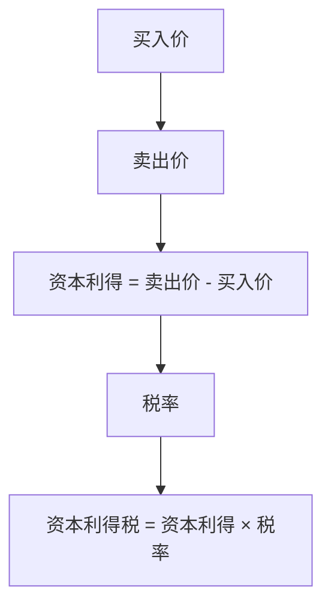
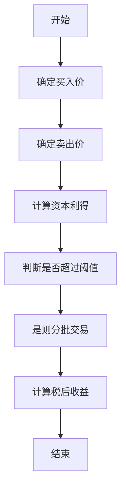
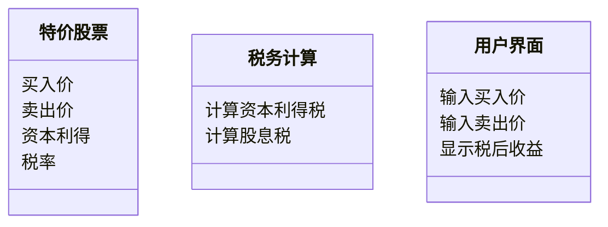
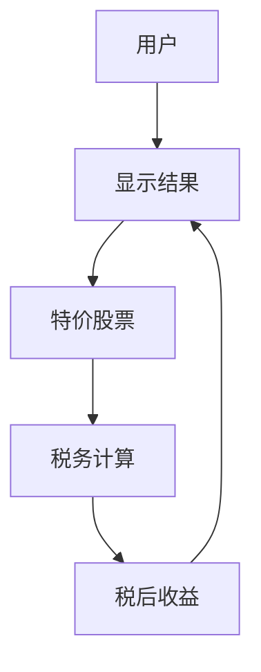

                 


```markdown
# 特价股票投资中的税收考虑

> 关键词：特价股票，投资，税收，税务优化，税务风险

> 摘要：本文详细探讨了在特价股票投资中税收的影响，分析了税务处理的基本原则、风险与合规性，并提供了优化策略和实际案例，帮助投资者有效降低税务负担，提升投资收益。

---

## 第一部分: 特价股票投资中的税收考虑概述

### 第1章: 特价股票投资的基本概念

#### 1.1 特价股票的定义与特点
- **1.1.1 特价股票的定义**  
  特价股票是指以低于面值价格购买的股票，通常由于公司财务状况不佳或市场低迷导致价格被低估。
- **1.1.2 特价股票的特点**  
  - 价格低廉，潜在回报高。
  - 风险较高，波动性较大。
  - 适合长期投资或价值投资者。

#### 1.2 税收的基本概念
- **1.2.1 税收的定义**  
  税收是政府为公共支出而征收的强制性收入，影响个人和企业的财务状况。
- **1.2.2 税收的种类**  
  - 所得税：针对个人或企业所得征收。
  - 资本利得税：针对资本资产（如股票）出售收益征收。
  - 股息税：针对股票股息收入征收。
- **1.2.3 税收在投资中的重要性**  
  税收直接影响投资收益，需在投资决策中充分考虑。

#### 1.3 特价股票投资中的税收考虑
- **1.3.1 税收对投资收益的影响**  
  税收会减少净收益，影响投资回报。
- **1.3.2 特价股票投资中的税务风险**  
  税法变化、计算错误可能导致税务负担增加。
- **1.3.3 税收优化的基本原则**  
  合规性、最大化收益、长期规划。

---

### 第2章: 特价股票投资中的税务处理

#### 2.1 特价股票交易的税务处理
- **2.1.1 交易中的税务计算**  
  - 买入价：购买特价股票的总成本。
  - 卖出价：出售时的总收入。
  - 资本利得：卖出价 - 买入价。
  - 资本利得税 = 资本利得 × 税率。

  **公式：**
  \[
  \text{资本利得税} = (\text{卖出价} - \text{买入价}) \times \text{税率}
  \]

- **2.1.2 税率的确定与计算公式**  
  税率因地区和收益类型而异，需结合当地税法。
- **2.1.3 交易中的税务风险与合规性**  
  确保交易记录清晰，避免税务违规。

#### 2.2 特价股票持有期间的税务影响
- **2.2.1 股息收入的税务处理**  
  股息税 = 股息收入 × 股息税率。
  \[
  \text{股息税} = \text{股息收入} \times \text{股息税率}
  \]
- **2.2.2 资本增值的税务影响**  
  资本增值需在出售时计算资本利得税。
- **2.2.3 其他收益的税务考虑**  
  例如，认沽权、认购权的税务处理。

#### 2.3 特价股票投资中的税务优化策略
- **2.3.1 税务优化的基本思路**  
  利用税收优惠政策，合理规划买卖时机。
- **2.3.2 税务优化的具体策略**  
  - 分批买卖，分散税务负担。
  - 利用亏损抵销收益。
  - 选择低税率地区或国家进行投资。
- **2.3.3 税务优化的实施步骤**  
  评估税务负担，制定优化方案，定期审查调整。

---

### 第3章: 特价股票投资中的税务风险与合规性

#### 3.1 税务风险的来源
- **3.1.1 税法变化的风险**  
  政策调整可能导致税务负担增加。
- **3.1.2 税务计算错误的风险**  
  计算失误可能导致税务问题。
- **3.1.3 税务政策差异的风险**  
  不同地区税法差异影响投资策略。

#### 3.2 税务合规性的基本要求
- **3.2.1 税务合规性的定义**  
  遵守税法规定，避免税务违规。
- **3.2.2 税务合规的具体要求**  
  准确记录交易，按时申报纳税。
- **3.2.3 税务合规的实施步骤**  
  学习税法知识，咨询专业人士，定期审查税务处理。

#### 3.3 应对税务风险的具体策略
- **3.3.1 税务保险**  
  购买税务保险，降低风险。
- **3.3.2 税务顾问的使用**  
  专业顾问帮助制定合规策略。
- **3.3.3 税务审计的应对**  
  配合税务机关，及时提供资料。

---

## 第四部分: 数学模型与算法原理

### 4.1 特价股票投资中的数学模型
- **4.1.1 资本利得税计算模型**  
  使用公式计算税后收益。
- **4.1.2 股息税计算模型**  
  计算股息税后净收益。

#### 4.1.3 计算流程图


### 4.2 税务优化算法
- **4.2.1 算法原理**  
  分批买卖，降低每笔交易的税率。

#### 4.2.2 算法流程图


### 4.3 Python实现示例
```python
def calculate_capital_gains_tax(buy_price, sell_price, tax_rate):
    capital_gains = sell_price - buy_price
    tax = capital_gains * tax_rate
    return tax

# 示例
buy_price = 100
sell_price = 150
tax_rate = 0.15
tax = calculate_capital_gains_tax(buy_price, sell_price, tax_rate)
print(f"资本利得税为：{tax}")
```

---

## 第五部分: 系统架构与设计方案

### 5.1 系统架构设计
- **5.1.1 领域模型类图**


- **5.1.2 系统架构图**


---

## 第六部分: 项目实战与案例分析

### 6.1 实际案例分析
- **案例背景**  
  投资者以$100买入100股特价股票，卖出价为$150/股，税率15%。
- **税务计算**  
  资本利得税 = (150 - 100) × 100 × 15% = $750。

### 6.2 优化策略
- 分批买卖，降低每笔交易的税率。
- 结合股息收入，优化整体税务负担。

---

## 第七部分: 最佳实践与总结

### 7.1 最佳实践
- 定期更新税务知识，了解最新税法变化。
- 咨询专业税务顾问，制定个性化策略。
- 使用税务计算工具，提高计算准确性。

### 7.2 小结
特价股票投资中的税收考虑是实现投资收益最大化的重要因素。通过合理规划和优化策略，投资者可以有效降低税务负担，提升整体投资回报。

### 7.3 注意事项
- 税法变化快，需及时调整策略。
- 避免税务违规，确保合规性。
- 定期审查税务处理，确保优化效果。

### 7.4 拓展阅读
- 阅读当地税法手册，了解具体规定。
- 学习税务优化技巧，提升投资效率。
- 关注税务优惠政策，抓住有利时机。

---

## 作者信息

作者：AI天才研究院/AI Genius Institute & 禅与计算机程序设计艺术 /Zen And The Art of Computer Programming

```

