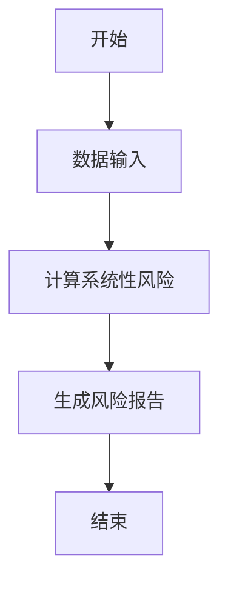
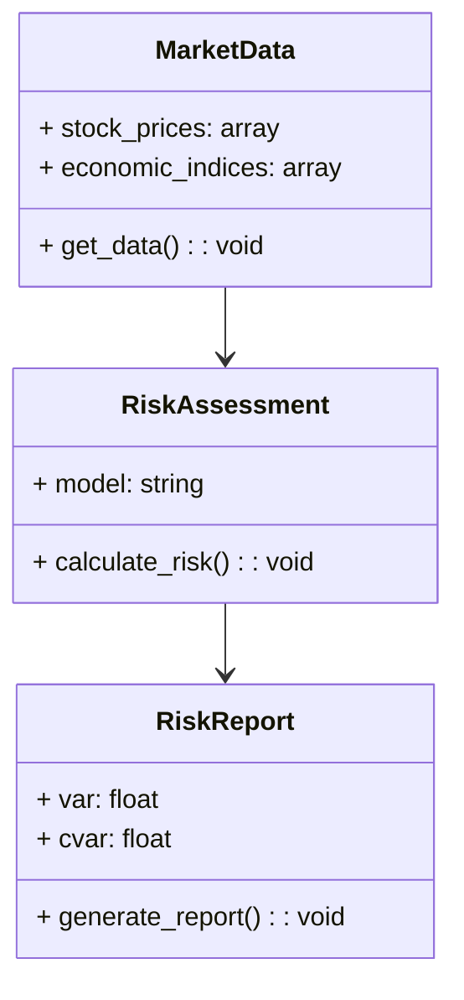
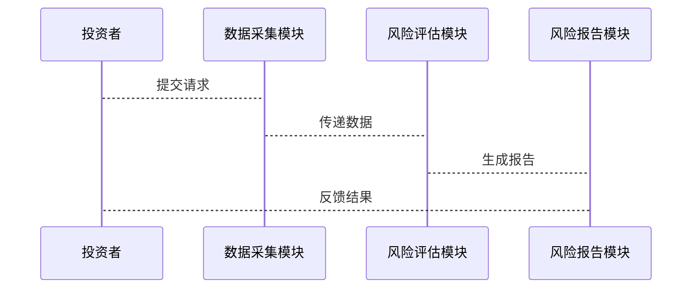

                 


```markdown
# 特价股票投资中的系统性风险管理方法

## 关键词
- 特价股票投资
- 系统性风险管理
- 风险评估模型
- 风险控制策略
- 系统性风险

## 摘要
本文详细探讨了特价股票投资中的系统性风险管理方法。首先介绍了系统性风险管理的基本概念和重要性，然后分析了系统性风险的来源和特征。接着，从数学模型、算法原理、系统架构等多个维度深入探讨了系统性风险管理的实现方法。最后，通过实战案例展示了如何在实际投资中应用这些方法，并提出了相应的风险控制策略。

---

## 第1章: 特价股票投资与系统性风险管理概述

### 1.1 特价股票投资的基本概念
#### 1.1.1 特价股票的定义与特点
特价股票是指以低于市场价或内在价值的价格购买的股票。其特点包括价格低廉、潜在收益高、风险可控等。投资者通常通过分析市场波动、公司基本面等因素来寻找特价股票。

#### 1.1.2 特价股票投资的背景与现状
随着金融市场的发展，投资者对低成本、高收益的投资方式需求增加。特价股票投资因其低门槛和高潜力，吸引了大量投资者。然而，投资过程中也面临着系统性风险的挑战。

#### 1.1.3 特价股票投资的核心要素
- **市场分析**：包括宏观经济指标、行业趋势等。
- **公司基本面分析**：如财务状况、盈利能力等。
- **风险管理**：通过系统性方法控制投资风险。

### 1.2 系统性风险管理的定义与特点
#### 1.2.1 系统性风险的定义
系统性风险是指影响整个市场的风险，如经济衰退、政策变化等，无法通过分散投资完全消除。

#### 1.2.2 系统性风险的核心特征
- **全局性**：影响整个市场或经济体系。
- **不可分散性**：无法通过多样化投资降低。
- **不确定性**：难以预测和量化。

#### 1.2.3 系统性风险与非系统性风险的区别
| 特性         | 系统性风险             | 非系统性风险           |
|--------------|-----------------------|-----------------------|
| 影响范围     | 整个市场               | 单一资产或行业         |
| 可分散性     | 不可分散               | 可分散                 |
| 来源         | 经济波动、政策变化     | 公司业绩、财务问题等   |

### 1.3 特价股票投资中的系统性风险管理的重要性
#### 1.3.1 系统性风险管理在投资中的作用
- **保护投资本金**：通过风险管理降低整体投资风险。
- **提高收益稳定性**：在市场波动中保持投资组合的稳定性。
- **增强投资信心**：通过科学的风险管理方法，提升投资者信心。

#### 1.3.2 特价股票投资中的系统性风险来源
- **市场波动**：如股市大跌可能导致投资损失。
- **经济政策变化**：如加息、财政紧缩政策可能影响市场。
- **系统性事件**：如金融危机、全球经济衰退等。

#### 1.3.3 系统性风险管理的必要性与可行性
- **必要性**：系统性风险不可避免，必须进行有效管理。
- **可行性**：通过数学模型和系统架构设计，系统性风险管理是可行的。

### 1.4 本章小结
本章介绍了特价股票投资的基本概念和系统性风险管理的重要性，分析了系统性风险的特点及其在投资中的作用。下一章将深入探讨系统性风险管理的核心概念和相关联系。

---

## 第2章: 系统性风险管理的核心概念与联系

### 2.1 系统性风险管理的原理
#### 2.1.1 系统性风险管理的基本原理
系统性风险管理通过识别、评估和控制系统性风险，降低整体投资组合的波动性。

#### 2.1.2 系统性风险管理的核心要素
- **风险识别**：识别系统性风险的来源和潜在影响。
- **风险评估**：量化系统性风险的影响程度。
- **风险控制**：制定和实施风险控制策略。

#### 2.1.3 系统性风险管理的数学模型
系统性风险管理通常使用概率论和统计学模型，如马科维茨的有效前沿模型和VaR模型。

### 2.2 系统性风险与非系统性风险的对比
通过对比分析，明确了系统性风险和非系统性风险在来源、影响范围和管理方法上的差异，为投资者制定全面的风险管理策略提供了理论基础。

### 2.3 系统性风险管理的ER实体关系图
```mermaid
er
    actor:投资者
    actor --> system:提交请求
    system --> risk_assessment:进行风险评估
    risk_assessment --> report:生成风险报告
    report --> actor:反馈结果
```

### 2.4 本章小结
本章详细分析了系统性风险管理的核心概念和相关联系，通过对比和实体关系图，明确了系统性风险管理的重要性。下一章将深入探讨系统性风险管理的算法原理与数学模型。

---

## 第3章: 系统性风险管理的算法原理与数学模型

### 3.1 系统性风险管理的数学模型
#### 3.1.1 系统性风险管理的线性回归模型
通过线性回归分析，识别系统性风险与市场变量之间的关系。

#### 3.1.2 马科维茨有效前沿模型
用于优化投资组合，平衡风险与收益。

#### 3.1.3 VaR模型
Value at Risk（VaR）用于衡量投资组合在一定置信水平下的最大损失。

#### 3.1.4 CVaR模型
Conditional Value at Risk（CVaR）用于衡量在超过VaR情况下的平均损失。

### 3.2 算法原理的mermaid流程图


### 3.3 算法实现的Python代码
```python
import numpy as np
import pandas as pd

# 示例数据
np.random.seed(42)
returns = np.random.normal(0, 1, 100)

# 计算VaR（95%置信水平）
alpha = 0.05
sorted_returns = sorted(returns)
var = sorted_returns[int(alpha * len(sorted_returns))]
print(f"VaR at 95% confidence level: {var}")
```

### 3.4 本章小结
本章通过数学模型和算法流程图，详细讲解了系统性风险管理的实现方法。下一章将探讨系统性风险管理的系统架构设计。

---

## 第4章: 系统性风险管理的系统架构设计

### 4.1 问题场景介绍
投资者需要一个系统化的风险管理平台，实时监控市场波动，评估系统性风险，并制定相应的风险控制策略。

### 4.2 系统功能设计
#### 4.2.1 系统功能模块
- **数据采集**：收集市场数据、公司财务数据等。
- **风险评估**：计算VaR、CVaR等风险指标。
- **风险预警**：设置风险预警阈值，及时通知投资者。

#### 4.2.2 领域模型类图


### 4.3 系统架构设计
#### 4.3.1 系统架构图


### 4.4 系统接口设计
- **数据接口**：与数据源对接，获取市场数据。
- **用户接口**：提供风险报告查询和预警通知功能。

### 4.5 系统交互流程


### 4.6 本章小结
本章通过系统架构设计，展示了如何构建一个完整的系统性风险管理平台。下一章将通过实战案例进一步验证这些方法的实际应用效果。

---

## 第5章: 特价股票投资中的系统性风险管理实战

### 5.1 项目实战
#### 5.1.1 环境安装
- 安装Python、Pandas、NumPy等工具。

#### 5.1.2 系统核心实现源代码
```python
import numpy as np
import pandas as pd

# 数据处理
data = pd.read_csv('market_data.csv')
returns = data['stock_returns'].values

# 计算VaR
def calculate_var(returns, confidence_level=0.05):
    sorted_returns = np.sort(returns)
    var_index = int(confidence_level * len(sorted_returns))
    var = sorted_returns[var_index]
    return var

var = calculate_var(returns)
print(f"VaR at {confidence_level * 100}% confidence level: {var}")
```

#### 5.1.3 代码应用解读与分析
通过代码实现VaR计算，帮助投资者评估系统性风险。

#### 5.1.4 实际案例分析
以某段时间内的市场数据为例，展示如何应用系统性风险管理方法进行投资决策。

### 5.2 项目小结
通过实战项目，验证了系统性风险管理方法的有效性，为投资者提供了实际操作的参考。

### 5.3 本章小结
本章通过实战案例，展示了系统性风险管理方法的实际应用。最后一章将总结最佳实践、注意事项和拓展阅读内容。

---

## 第6章: 系统性风险管理的最佳实践

### 6.1 最佳实践 tips
- 定期评估和更新风险管理模型。
- 结合市场变化及时调整投资策略。
- 多与其他投资者和专家交流，获取经验教训。

### 6.2 小结
通过本文的系统性风险管理方法，投资者可以在特价股票投资中更好地控制风险，实现稳健收益。

### 6.3 注意事项
- 风险管理模型需要定期更新和优化。
- 投资者需根据自身风险承受能力调整风险管理策略。

### 6.4 拓展阅读
- 马科维茨的有效前沿理论。
- VaR和CVaR的高级应用。

### 6.5 本章小结
本章总结了系统性风险管理的最佳实践，为投资者提供了宝贵的参考信息。

---

## 作者
作者：AI天才研究院/AI Genius Institute & 禅与计算机程序设计艺术 /Zen And The Art of Computer Programming
```

