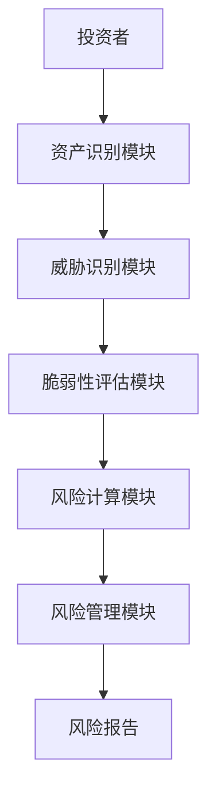

                 


# 特价股票投资中的网络安全风险评估方法

> **关键词**: 特价股票投资, 网络安全风险, 风险评估, 网络威胁, 风险模型

> **摘要**: 本文详细探讨了在特价股票投资中面临的网络安全风险，分析了网络安全威胁对投资决策的影响，并提出了基于数学模型的网络安全风险评估方法。通过构建风险评估模型和算法，结合实际案例分析，为投资者提供有效的风险管理策略，以确保投资决策的安全性和稳定性。

---

## 第一部分: 特价股票投资中的网络安全风险概述

### 第1章: 特价股票投资与网络安全风险概述

#### 1.1 特价股票投资的定义与特点

##### 1.1.1 特价股票的定义
特价股票是指市场价格低于其内在价值的股票。通常，这类股票可能被市场低估，具有较大的增值潜力。投资者通过低价买入，等待股价回升时卖出，从而获得收益。

##### 1.1.2 特价股票投资的核心特点
- **低买高卖**：投资者在低价时买入，高价时卖出。
- **高波动性**：特价股票往往存在于波动较大的市场环境中，价格波动剧烈。
- **高风险高回报**：由于市场价格被低估，潜在回报较高，但同时风险也较大。

##### 1.1.3 特价股票投资的潜在风险
- **市场波动风险**：股价波动剧烈，可能导致投资者损失。
- **信息不对称风险**：投资者可能无法及时获取准确的信息。
- **流动性风险**：某些特价股票可能流动性较差，难以快速变现。

#### 1.2 网络安全风险的基本概念

##### 1.2.1 网络安全风险的定义
网络安全风险是指由于网络攻击、数据泄露、系统故障等原因，可能对企业的资产、数据或业务造成的潜在损失或威胁。

##### 1.2.2 网络安全风险的分类
- **基于威胁来源的分类**：
  - 外部攻击：来自黑客、竞争对手等外部势力。
  - 内部威胁：来自企业内部员工或合作伙伴的恶意或疏忽行为。
- **基于影响的分类**：
  - 机密性风险：数据泄露导致的信息损失。
  - 完整性风险：数据被篡改导致的信息失真。
  - 可用性风险：系统故障导致的服务中断。

##### 1.2.3 网络安全风险的特征
- **隐蔽性**：很多网络安全威胁在早期可能不易被发现。
- **扩散性**：一次攻击可能导致多方面的损失。
- **动态性**：网络安全威胁随着技术的发展不断变化。

#### 1.3 特价股票投资中的网络安全风险

##### 1.3.1 特价股票投资中的网络安全威胁
- **信息泄露风险**：投资者的交易信息、账户信息可能被泄露，导致资金损失。
- **账户安全风险**：账户可能被黑客入侵，导致资金被盗。
- **投资决策中的网络诈骗风险**：投资者可能因虚假信息误导而做出错误决策。

##### 1.3.2 网络安全风险对投资决策的影响
- **影响投资判断**：虚假信息可能导致投资者做出错误的买卖决策。
- **增加投资成本**：由于网络安全事件导致的损失可能增加投资成本。
- **损害投资信心**：网络安全事件可能削弱投资者对市场的信心。

##### 1.3.3 特价股票投资中的网络安全风险评估的重要性
- **保护投资者利益**：通过风险评估，识别潜在的网络安全威胁，降低投资风险。
- **优化投资策略**：基于风险评估结果，调整投资策略，提高投资回报。
- **提升市场稳定性**：通过风险管理，减少网络安全事件对市场的冲击，提升市场稳定性。

---

### 第2章: 网络安全风险评估的核心概念

#### 2.1 网络安全风险评估的定义与目标

##### 2.1.1 网络安全风险评估的定义
网络安全风险评估是通过分析系统的资产、威胁和脆弱性，评估可能发生的网络安全事件及其影响的过程。

##### 2.1.2 网络安全风险评估的目标
- **识别风险**：发现系统中存在的网络安全风险。
- **量化风险**：评估每个风险的可能性和影响程度。
- **制定对策**：根据风险评估结果，制定相应的风险管理策略。

##### 2.1.3 网络安全风险评估的流程
1. **资产识别**：识别系统中的关键资产。
2. **威胁分析**：分析可能面临的威胁。
3. **脆弱性评估**：评估资产的脆弱性。
4. **风险计算**：计算每个风险的可能性和影响。
5. **风险报告**：生成风险报告，提出管理建议。

#### 2.2 网络安全风险评估的框架

##### 2.2.1 风险评估的基本框架
- **资产识别**：明确系统的资产，如数据、系统、设备等。
- **威胁分析**：分析可能的威胁来源和性质。
- **脆弱性评估**：评估资产的易受攻击程度。
- **风险计算**：综合威胁和脆弱性，评估风险。

##### 2.2.2 风险评估的主要步骤
1. **资产识别与分类**：根据资产的重要性进行分类。
2. **威胁识别与分析**：识别可能的威胁，并分析其特征。
3. **脆弱性评估**：评估资产在面对威胁时的脆弱性。
4. **风险计算**：计算每个风险的综合评分。
5. **风险报告与应对策略**：根据评估结果，制定应对策略。

##### 2.2.3 风险评估的实施方法
- **定性评估**：通过描述和分类进行风险评估。
- **定量评估**：通过数据和模型进行量化评估。
- **混合评估**：结合定性和定量方法进行综合评估。

#### 2.3 特价股票投资中的网络安全风险评估模型

##### 2.3.1 风险评估模型的构建
- **资产识别**：识别投资者的交易账户、资金等关键资产。
- **威胁识别**：分析可能的网络攻击、信息泄露等威胁。
- **脆弱性评估**：评估系统的安全漏洞。
- **风险计算**：综合威胁和脆弱性，评估风险。

##### 2.3.2 风险评估模型的输入与输出
- **输入**：资产清单、威胁列表、脆弱性评估结果。
- **输出**：风险评分、风险排序、风险管理建议。

##### 2.3.3 风险评估模型的验证与优化
- **验证**：通过实际案例验证模型的有效性。
- **优化**：根据验证结果，优化模型的参数和算法。

---

### 第3章: 网络安全威胁分析与风险评估

#### 3.1 网络安全威胁的分类与特征

##### 3.1.1 网络攻击的主要类型
- **病毒攻击**：通过病毒、蠕虫等恶意软件进行攻击。
- **钓鱼攻击**：通过钓鱼邮件、虚假网站等诱导用户泄露信息。
- **DDoS攻击**：通过大量请求攻击服务器，导致服务中断。
- **数据泄露**：未经授权的访问和数据泄露。

##### 3.1.2 网络威胁的特征分析
- **隐蔽性**：很多威胁在早期难以被发现。
- **扩散性**：一次攻击可能导致多方面的影响。
- **动态性**：威胁随着技术的发展不断变化。

##### 3.1.3 网络威胁的来源与传播途径
- **来源**：外部攻击、内部威胁。
- **传播途径**：网络、邮件、社交媒体等。

#### 3.2 特价股票投资中的网络安全威胁

##### 3.2.1 信息泄露风险
- **账户信息泄露**：投资者的账户信息可能被泄露，导致资金损失。
- **交易信息泄露**：交易记录、订单信息可能被泄露，影响投资策略。

##### 3.2.2 账户安全风险
- **账户入侵**：黑客可能通过钓鱼攻击、暴力破解等方式入侵投资者的账户。
- **账户滥用**：账户可能被他人滥用，进行非法交易。

##### 3.2.3 投资决策中的网络诈骗风险
- **虚假信息误导**：投资者可能因虚假的市场信息、公司公告而做出错误决策。
- **网络钓鱼诈骗**：投资者可能因钓鱼邮件、虚假网站而遭受资金损失。

#### 3.3 网络安全威胁对投资决策的影响

##### 3.3.1 威胁对投资信心的影响
- **信心下降**：网络安全事件可能导致投资者对市场的信心下降。
- **投资行为改变**：投资者可能因信心下降而减少投资，或改变投资策略。

##### 3.3.2 威胁对投资收益的影响
- **直接损失**：因账户入侵、数据泄露等导致的直接资金损失。
- **间接损失**：因虚假信息误导导致的交易损失。

##### 3.3.3 威胁对投资策略的影响
- **策略调整**：投资者可能需要调整投资策略，以应对网络安全威胁。
- **风险管理加强**：投资者可能加强风险管理，以降低网络安全威胁的影响。

---

### 第4章: 网络安全风险评估的数学模型与算法

#### 4.1 网络安全风险评估的数学模型

##### 4.1.1 风险评估模型的构建
- **资产价值**：资产的价值，如账户资金、交易记录等。
- **威胁可能性**：威胁发生的概率。
- **脆弱性程度**：资产在面对威胁时的脆弱性。
- **风险评分**：综合以上因素，计算风险评分。

##### 4.1.2 风险评估模型的数学表达
$$ \text{风险评分} = \text{资产价值} \times \text{威胁可能性} \times \text{脆弱性程度} $$

##### 4.1.3 模型的验证与优化
- **验证**：通过实际案例验证模型的有效性。
- **优化**：根据验证结果，调整模型的参数和权重。

#### 4.2 基于机器学习的风险评估算法

##### 4.2.1 算法选择
- **分类算法**：如决策树、随机森林等。
- **回归算法**：如线性回归、逻辑回归等。

##### 4.2.2 算法实现
1. **数据收集**：收集相关数据，包括资产价值、威胁可能性、脆弱性程度等。
2. **数据预处理**：清洗数据，处理缺失值、异常值等。
3. **特征提取**：提取对风险评估有影响的关键特征。
4. **模型训练**：使用训练数据训练模型。
5. **模型测试**：使用测试数据验证模型的准确性。
6. **模型优化**：根据测试结果，优化模型的参数和结构。

##### 4.2.3 算法的数学公式
$$ \text{预测风险} = \sum_{i=1}^{n} w_i \times x_i $$

其中，$w_i$ 是特征 $x_i$ 的权重。

---

### 第5章: 网络安全风险评估的系统架构设计

#### 5.1 系统功能设计

##### 5.1.1 功能模块
- **资产识别模块**：识别投资者的资产，如账户、资金、交易记录等。
- **威胁识别模块**：识别可能的网络安全威胁，如攻击、数据泄露等。
- **脆弱性评估模块**：评估资产的脆弱性，如系统的安全性、防护措施等。
- **风险计算模块**：计算每个风险的可能性和影响程度。
- **风险管理模块**：根据风险评估结果，制定应对策略。

##### 5.1.2 功能流程
1. **资产识别**：识别投资者的关键资产。
2. **威胁识别**：分析可能的网络安全威胁。
3. **脆弱性评估**：评估资产的脆弱性。
4. **风险计算**：综合威胁和脆弱性，计算风险评分。
5. **风险管理**：根据风险评分，制定应对策略。

#### 5.2 系统架构设计

##### 5.2.1 系统架构图


##### 5.2.2 系统交互流程
1. **投资者输入**：投资者输入资产信息、交易记录等。
2. **资产识别**：系统识别投资者的关键资产。
3. **威胁识别**：系统分析可能的网络安全威胁。
4. **脆弱性评估**：系统评估资产的脆弱性。
5. **风险计算**：系统计算每个风险的可能性和影响程度。
6. **风险管理**：系统根据风险评分，制定应对策略。
7. **风险报告**：系统生成风险报告，提供给投资者。

#### 5.3 系统接口设计

##### 5.3.1 输入接口
- **资产识别接口**：接收投资者的资产信息。
- **威胁识别接口**：接收系统的威胁数据。
- **脆弱性评估接口**：接收系统的脆弱性数据。

##### 5.3.2 输出接口
- **风险计算接口**：输出风险评分。
- **风险管理接口**：输出应对策略。
- **风险报告接口**：输出风险报告。

---

### 第6章: 项目实战

#### 6.1 环境安装

##### 6.1.1 系统环境
- **操作系统**：Windows 10 或更高版本。
- **编程语言**：Python 3.8 或更高版本。
- **开发工具**：Jupyter Notebook、PyCharm等。

##### 6.1.2 库的安装
```bash
pip install numpy
pip install pandas
pip install scikit-learn
pip install matplotlib
```

#### 6.2 核心实现源代码

##### 6.2.1 数据预处理
```python
import pandas as pd
import numpy as np

# 读取数据
data = pd.read_csv('risk_data.csv')

# 处理缺失值
data.dropna(inplace=True)

# 标准化处理
from sklearn.preprocessing import StandardScaler
scaler = StandardScaler()
data_scaled = scaler.fit_transform(data)
```

##### 6.2.2 模型训练
```python
from sklearn.model_selection import train_test_split
from sklearn.tree import DecisionTreeClassifier

# 划分训练集和测试集
X_train, X_test, y_train, y_test = train_test_split(data_scaled, data['label'], test_size=0.2)

# 训练模型
model = DecisionTreeClassifier()
model.fit(X_train, y_train)

# 预测结果
y_pred = model.predict(X_test)

# 计算准确率
from sklearn.metrics import accuracy_score
print(accuracy_score(y_test, y_pred))
```

##### 6.2.3 模型优化
```python
from sklearn.model_selection import GridSearchCV

# 定义参数范围
param_grid = {'criterion': ['gini', 'entropy'], 'max_depth': [2, 3, 4]}

# 网格搜索优化
grid_search = GridSearchCV(model, param_grid, cv=5)
grid_search.fit(X_train, y_train)

# 输出最佳参数
print(grid_search.best_params_)
```

#### 6.3 代码应用解读与分析

##### 6.3.1 数据预处理
- **读取数据**：从CSV文件中读取数据。
- **处理缺失值**：删除包含缺失值的行。
- **标准化处理**：对数据进行标准化，以便模型训练。

##### 6.3.2 模型训练
- **划分数据集**：将数据划分为训练集和测试集。
- **选择模型**：选择决策树模型进行训练。
- **预测与评估**：使用测试集进行预测，并计算准确率。

##### 6.3.3 模型优化
- **网格搜索**：通过网格搜索优化模型的参数，提高模型的准确率。

#### 6.4 实际案例分析

##### 6.4.1 案例背景
某投资者在特价股票投资中，账户信息多次被泄露，导致资金损失。

##### 6.4.2 案例分析
- **资产识别**：识别投资者的账户资金、交易记录等关键资产。
- **威胁识别**：分析可能的网络攻击、数据泄露等威胁。
- **脆弱性评估**：评估系统在面对威胁时的脆弱性。
- **风险计算**：综合威胁和脆弱性，计算风险评分。
- **风险管理**：根据风险评分，制定应对策略，如加强账户安全、加密交易数据等。

##### 6.4.3 案例小结
通过风险评估模型，识别了投资者的账户信息泄露风险，并制定了一系列应对措施，有效降低了投资风险。

---

### 第7章: 最佳实践、小结与展望

#### 7.1 最佳实践

##### 7.1.1 加强账户安全
- **设置强密码**：使用复杂密码，避免简单的密码。
- **启用双重认证**：启用两步验证，增加账户安全性。

##### 7.1.2 提高信息安全性
- **加密数据**：对敏感数据进行加密处理，防止数据泄露。
- **定期备份**：定期备份重要数据，防止数据丢失。

##### 7.1.3 加强风险管理
- **实时监控**：实时监控账户和交易活动，及时发现异常。
- **定期评估**：定期进行风险评估，及时调整风险管理策略。

#### 7.2 小结

本文详细探讨了特价股票投资中的网络安全风险，分析了网络安全威胁对投资决策的影响，并提出了基于数学模型的网络安全风险评估方法。通过构建风险评估模型和算法，结合实际案例分析，为投资者提供有效的风险管理策略，以确保投资决策的安全性和稳定性。

#### 7.3 展望

未来，随着网络安全威胁的不断变化，网络安全风险评估方法也将不断优化和创新。投资者需要持续关注网络安全技术的发展，及时调整风险管理策略，以应对日益复杂的网络安全挑战。

---

### 作者：AI天才研究院/AI Genius Institute & 禅与计算机程序设计艺术/Zen And The Art of Computer Programming

