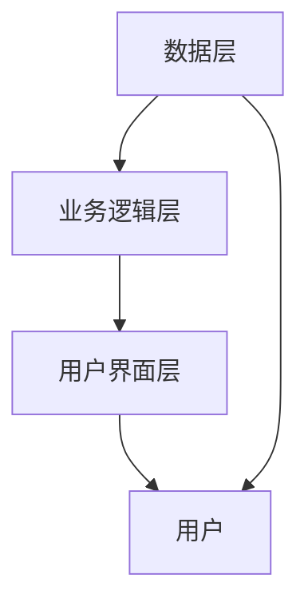

                 


# 特价股票投资中的群体智慧与集体决策方法

> **关键词**：特价股票投资，群体智慧，集体决策，投资决策，算法优化

> **摘要**：  
本文深入探讨了特价股票投资中如何利用群体智慧与集体决策方法来优化投资策略。通过分析群体智慧的基本原理、集体决策的数学模型以及在股票投资中的具体应用，本文提出了基于信息整合与算法优化的投资方法。通过实际案例分析与系统架构设计，本文展示了如何构建高效的投资决策支持系统，帮助投资者在复杂多变的市场环境中做出更明智的投资决策。

---

## 第一部分: 特价股票投资的背景与概念

### 第1章: 特价股票投资的背景与重要性

#### 1.1 什么是特价股票
- **定义**：特价股票是指市场价格低于其内在价值的股票，通常被视为被市场低估的投资机会。
- **特点**：低估值、高潜力、风险可控。
- **分类**：根据行业、市值、市盈率等指标进行分类。

#### 1.2 群体智慧与集体决策的定义
- **群体智慧**：指通过多个个体的知识、经验和信息整合，形成更优决策的过程。
- **集体决策**：指通过集体讨论、分析和投票等方式，形成最终决策的过程。
- **关系**：群体智慧是集体决策的基础，而集体决策是群体智慧的具体体现。

#### 1.3 特价股票投资中的群体智慧应用
- **背景**：投资者通过群体智慧分析市场情绪、挖掘潜在机会。
- **优势**：降低个体决策风险，提高决策的准确性和稳定性。

---

## 第二部分: 群体智慧与集体决策的理论基础

### 第2章: 群体智慧的理论模型

#### 2.1 群体智慧的基本原理
- **信息扩散模型**：个体通过交流传播信息，形成群体共识。
- **共识模型**：群体通过多次讨论达成一致意见。
- **投票机制**：通过投票方式整合个体意见，形成最终决策。

#### 2.2 群体智慧的数学模型
- **信息整合模型**：
  - 每个个体的信息权重：$w_i$，满足$\sum w_i = 1$。
  - 综合信息：$I = \sum w_i I_i$，其中$I_i$为个体$i$的信息。
- **共识算法**：基于投票机制的共识达成，如投票数超过阈值则形成共识。

#### 2.3 群体智慧的算法实现
- **步骤**：
  1. 收集个体意见。
  2. 计算个体权重。
  3. 综合信息，形成群体决策。
- **实现案例**：使用Python实现简单的投票机制。

```python
def group_decision(votes):
    from collections import Counter
    vote_counts = Counter(votes)
    max_vote = max(vote_counts.values())
    for key, value in vote_counts.items():
        if value == max_vote:
            return key
    return None
```

---

## 第三部分: 特价股票投资中的集体决策方法

### 第3章: 集体决策在特价股票投资中的应用

#### 3.1 集体决策的基本原则
- **公平性**：每个个体的意见都应被平等对待。
- **效率性**：决策过程应高效，避免冗长的讨论。
- **科学性**：决策基于数据和逻辑分析。

#### 3.2 集体决策的实施步骤
- **确定决策目标**：明确投资目标和范围。
- **收集相关信息**：通过市场分析、财务数据等获取信息。
- **制定决策方案**：基于信息制定多个投资方案。
- **评估决策方案**：通过数据分析和模拟测试评估方案的可行性。
- **实施决策方案**：选择最优方案进行投资。

#### 3.3 集体决策中的信息整合方法
- **信息整合模型**：
  - 使用加权平均法整合个体意见。
  - 使用投票机制达成共识。
- **案例分析**：通过整合多个投资者的意见，选择最优股票。

---

## 第四部分: 系统分析与架构设计方案

### 第4章: 投资决策支持系统的构建

#### 4.1 问题场景介绍
- 投资者需要一个系统来辅助决策，包括数据收集、分析和模拟测试。

#### 4.2 系统功能设计
- **数据收集模块**：收集市场数据、新闻、社交媒体情绪等。
- **数据分析模块**：对数据进行清洗、建模和分析。
- **决策支持模块**：基于分析结果，提供投资建议。

#### 4.3 系统架构设计
- 使用分层架构，包括数据层、业务逻辑层和用户界面层。



#### 4.4 系统接口设计
- **API接口**：提供REST API用于数据查询和分析结果获取。

#### 4.5 系统交互设计
- **用户流程**：用户输入需求，系统返回分析结果。

---

## 第五部分: 项目实战

### 第5章: 投资决策支持系统的实现

#### 5.1 环境安装
- **工具安装**：安装Python、Pandas、NumPy等工具。

#### 5.2 核心实现代码
- **数据清洗代码**：
  ```python
  import pandas as pd
  df = pd.read_csv('stock_data.csv')
  df.dropna(inplace=True)
  df = df[df['price'] < df['intrinsic_value']]
  ```

- **分析代码**：
  ```python
  from sklearn import linear_model
  model = linear_model.LinearRegression()
  model.fit(df[['price']], df['value'])
  ```

#### 5.3 案例分析
- **实战案例**：分析某行业特价股票的投资机会。

---

## 第六部分: 总结与展望

### 第6章: 总结与最佳实践

#### 6.1 本章总结
- 群体智慧与集体决策在特价股票投资中的重要性。
- 系统设计与实战案例的应用价值。

#### 6.2 最佳实践
- 投资者应结合群体智慧与个人分析，做出最优决策。
- 注重风险管理，避免过度依赖群体决策。

#### 6.3 未来展望
- 结合AI技术，进一步优化群体智慧的应用。
- 开发更高效的决策支持系统。

---

## 作者

作者：AI天才研究院/AI Genius Institute & 禅与计算机程序设计艺术 /Zen And The Art of Computer Programming

