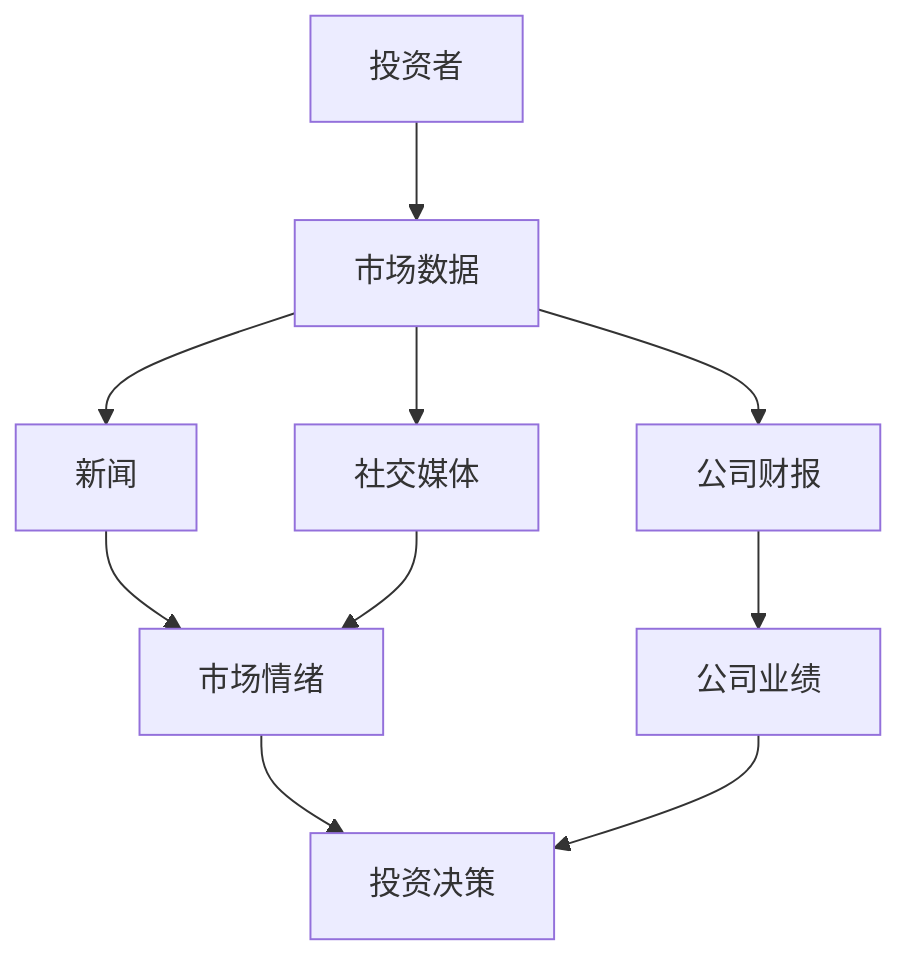
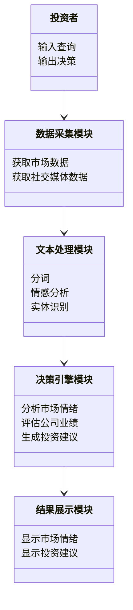
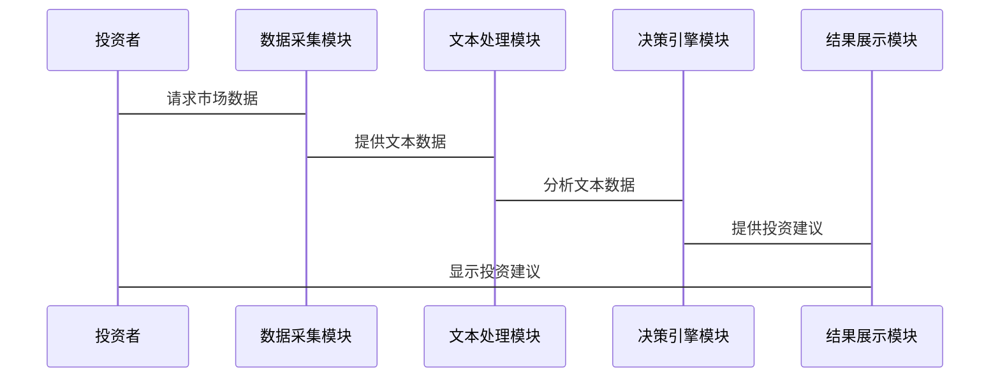

                 


# 特价股票投资中的自然语言处理辅助决策系统

## 关键词：自然语言处理，股票投资，文本挖掘，情感分析，机器学习

## 摘要：本文探讨自然语言处理技术在股票投资中的应用，通过分析文本数据，如新闻、社交媒体和公司财报，辅助投资者做出更明智的决策。文章详细介绍了自然语言处理的核心概念、算法原理、系统架构以及实际项目案例，展示了如何利用这些技术提高投资决策的准确性和效率。

---

# 第一部分：背景介绍

## 第1章：自然语言处理与股票投资的结合

### 1.1 自然语言处理的基本概念

#### 1.1.1 自然语言处理的定义
自然语言处理（NLP）是人工智能的一个分支，旨在使计算机能够理解和处理人类语言。NLP技术包括文本解析、情感分析、实体识别和机器翻译等。

#### 1.1.2 自然语言处理的核心技术
- 文本预处理：包括分词、停用词处理和词干提取。
- 情感分析：判断文本的情感倾向。
- 实体识别：识别文本中的命名实体，如人名、地名和组织名。
- 主题建模：发现文本的主题结构。

#### 1.1.3 自然语言处理在金融领域中的应用
- 分析新闻和社交媒体，预测市场情绪。
- 解析公司财报，提取财务数据和关键指标。
- 监测行业趋势，识别市场机会和风险。

### 1.2 股票投资的基本概念

#### 1.2.1 股票投资的定义
股票投资是通过购买公司股份，期望从股价上涨中获得收益的投资行为。

#### 1.2.2 股票市场的基本运作机制
股票市场是一个买卖股票的市场，价格受供需关系、公司业绩和宏观经济因素影响。

#### 1.2.3 股票投资的策略与方法
- 基本面分析：分析公司的财务状况、行业地位和盈利能力。
- 技术分析：通过价格和成交量数据预测未来走势。
- 量化投资：利用数学模型进行投资决策。

### 1.3 自然语言处理在股票投资中的价值

#### 1.3.1 文本数据在股票投资中的重要性
文本数据，如新闻、社交媒体和公司公告，提供了大量关于市场情绪和公司动态的信息。

#### 1.3.2 自然语言处理如何辅助股票投资决策
- 通过情感分析判断市场情绪，预测股价走势。
- 通过实体识别提取公司名称和财务数据，进行基本面分析。
- 通过主题建模发现市场趋势，识别投资机会。

#### 1.3.3 自然语言处理在股票投资中的应用场
- 实时监控市场新闻，捕捉突发事件的影响。
- 分析社交媒体情绪，预测市场反应。
- 解析公司财报，评估财务健康状况。

---

## 第2章：自然语言处理与股票投资的核心概念与联系

### 2.1 自然语言处理在股票投资中的核心概念

#### 2.1.1 情感分析
情感分析用于判断文本中的情感倾向，如积极、消极或中性。在股票投资中，情感分析可以帮助投资者判断市场情绪，预测股价走势。

#### 2.1.2 实体识别
实体识别用于从文本中提取命名实体，如公司名称、人名和地名。在股票投资中，实体识别可以帮助投资者快速定位相关公司和事件。

#### 2.1.3 主题建模
主题建模用于发现文本的主题结构，帮助投资者识别市场趋势和行业动态。

### 2.2 自然语言处理在股票投资中的应用对比

| 技术 | 优点 | 缺点 | 适用场景 |
|------|------|------|----------|
| 情感分析 | 实时监控市场情绪 | 易受主观因素影响 | 新闻和社交媒体分析 |
| 实体识别 | 快速提取关键信息 | 需要大量训练数据 | 公司财报和新闻分析 |
| 主题建模 | 发现市场趋势 | 计算复杂，需要大量数据 | 行业动态和市场趋势分析 |

### 2.3 自然语言处理在股票投资中的ER图



---

## 第3章：自然语言处理在股票投资中的算法原理

### 3.1 基于LSTM的情感分析算法

#### 3.1.1 LSTM的基本原理
长短时记忆网络（LSTM）是一种特殊的RNN，能够有效捕捉时间序列中的长程依赖关系。

#### 3.1.2 LSTM在情感分析中的应用
使用LSTM处理文本数据，提取情感特征，预测文本情感倾向。

#### 3.1.3 LSTM的Python实现

```python
import tensorflow as tf
from tensorflow.keras import layers

model = tf.keras.Sequential()
model.add(layers.Embedding(input_dim= vocabulary_size, output_dim= embedding_dim))
model.add(layers.LSTM(units= lstm_units))
model.add(layers.Dense(units= num_classes, activation='softmax'))
model.compile(optimizer='adam', loss='sparse_categorical_crossentropy', metrics=['accuracy'])
```

### 3.2 基于注意力机制的文本挖掘算法

#### 3.2.1 注意力机制的基本原理
注意力机制通过计算文本中每个词的重要性，聚焦于关键信息。

#### 3.2.2 注意力机制在文本挖掘中的应用
使用注意力机制进行文本摘要和关键词提取。

#### 3.2.3 注意力机制的Python实现

```python
import tensorflow as tf
from tensorflow.keras import layers

model = tf.keras.Sequential()
model.add(layers.Embedding(input_dim= vocabulary_size, output_dim= embedding_dim))
model.add(layers.Attention())
model.add(layers.Dense(units= num_classes, activation='softmax'))
model.compile(optimizer='adam', loss='sparse_categorical_crossentropy', metrics=['accuracy'])
```

### 3.3 自然语言处理在股票投资中的数学模型

#### 3.3.1 LSTM的数学模型

$$
f_t = \sigma(W_f \cdot [h_{t-1}, x_t] + b_f)
$$

#### 3.3.2 注意力机制的数学模型

$$
\alpha_i = \frac{\exp(s_i)}{\sum_{j=1}^{n} \exp(s_j)}
$$

---

## 第4章：自然语言处理在股票投资中的系统架构

### 4.1 系统功能设计



### 4.2 系统架构设计


### 4.3 系统交互设计



---

## 第5章：自然语言处理在股票投资中的项目实战

### 5.1 项目环境安装

```bash
pip install numpy
pip install pandas
pip install tensorflow
pip install keras
pip install nltk
```

### 5.2 系统核心实现源代码

```python
import pandas as pd
import numpy as np
from sklearn.model_selection import train_test_split
from tensorflow.keras import layers
from tensorflow.keras import models

# 数据加载
data = pd.read_csv('market_news.csv')

# 数据预处理
X = data['text'].values
y = data['sentiment'].values

X_train, X_test, y_train, y_test = train_test_split(X, y, test_size=0.2)

# 模型构建
model = models.Sequential()
model.add(layers.Embedding(input_dim= vocabulary_size, output_dim= embedding_dim))
model.add(layers.LSTM(units= lstm_units))
model.add(layers.Dense(units= num_classes, activation='softmax'))
model.compile(optimizer='adam', loss='sparse_categorical_crossentropy', metrics=['accuracy'])

# 模型训练
model.fit(X_train, y_train, epochs=10, batch_size=32, validation_data=(X_test, y_test))
```

### 5.3 项目案例分析

#### 5.3.1 案例背景
假设我们要分析某家科技公司的新闻，预测其股价走势。

#### 5.3.2 数据准备
从新闻中提取文本数据，标注情感倾向。

#### 5.3.3 模型训练
使用LSTM模型训练情感分析任务，评估模型性能。

#### 5.3.4 模型结果
模型预测新闻情感，生成投资建议。

### 5.4 项目小结

---

## 第6章：总结与展望

### 6.1 最佳实践 tips
- 数据清洗和特征提取是关键步骤。
- 模型选择和调优影响性能。
- 结果验证和解释是实际应用的重要环节。

### 6.2 小结
自然语言处理技术为股票投资提供了强大的工具，帮助投资者从文本数据中提取有价值的信息，做出更明智的决策。

### 6.3 注意事项
- 数据隐私和安全问题需要重视。
- 模型的解释性和可性需要考虑。
- 结合多种技术，提高系统的鲁棒性和准确性。

### 6.4 拓展阅读
- 《自然语言处理实战：Python核心技巧与机器学习》
- 《股票投资实战：技术分析与量化策略》
- 《深度学习与自然语言处理：应用与案例》

---

## 作者：AI天才研究院 & 禅与计算机程序设计艺术

通过本文，我们系统地介绍了自然语言处理技术在股票投资中的应用，从理论到实践，帮助读者掌握相关技术，并能够实际应用到投资决策中。希望本文能为读者提供有价值的参考和启发。

