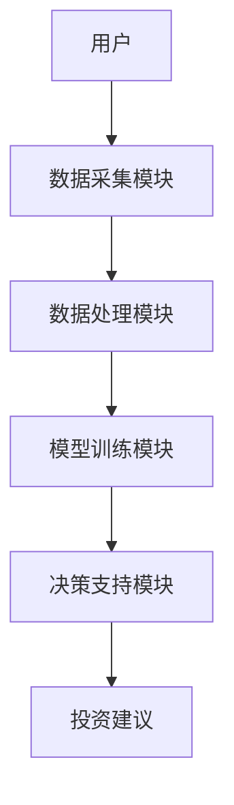
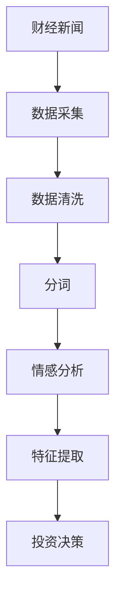
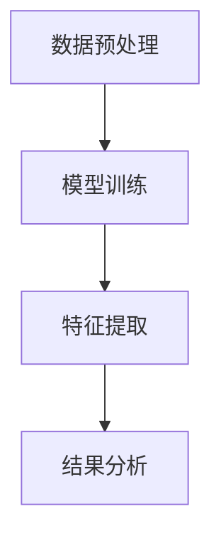

                 


# 特价股票投资中的自然语言理解辅助决策系统

> 关键词：特价股票，自然语言理解，投资决策，NLP算法，量化投资

> 摘要：本文探讨了如何利用自然语言理解技术辅助特价股票投资决策。首先介绍了特价股票的特点和投资价值，接着分析了自然语言理解技术在金融领域的应用，详细讲解了构建辅助决策系统的算法原理、系统架构设计和项目实现。最后通过实际案例展示了系统的应用效果，并展望了未来的研究方向。

---

## 第1章：特价股票投资概述

### 1.1 特价股票的定义与特点

#### 1.1.1 什么是特价股票

特价股票是指那些市场价格波动较大，且具有较高投资回报潜力的股票。这类股票通常在市场波动剧烈时出现，投资者可以通过精准的分析和决策，在低价时买入，高价时卖出，从而获得超额收益。

#### 1.1.2 特价股票的特点

- **高波动性**：价格波动剧烈，短期内可能有较大的涨跌幅度。
- **低估值**：市场价格可能低于其内在价值，具有较高的上涨潜力。
- **高风险**：由于价格波动大，投资风险较高，需要谨慎选择。

#### 1.1.3 投资者为何关注特价股票

投资者关注特价股票的原因包括追求高回报、市场热点捕捉、套利机会等。然而，由于市场的不确定性和波动性，投资者需要借助有效的工具和方法来提高决策的准确性。

### 1.2 自然语言理解在金融领域的应用

#### 1.2.1 自然语言理解的定义

自然语言理解（Natural Language Processing, NLP）是人工智能的一个分支，旨在使计算机能够理解、解析和生成人类语言。NLP技术在金融领域的应用广泛，包括情感分析、信息提取、新闻标题分类等。

#### 1.2.2 NLP在金融中的应用领域

- **情感分析**：分析市场情绪，预测股价走势。
- **信息提取**：从新闻、财报中提取关键信息，辅助投资决策。
- **新闻分类**：根据新闻内容进行分类，识别潜在的投资机会。

#### 1.2.3 NLP如何辅助投资决策

通过分析财经新闻、社交媒体评论等文本数据，NLP可以帮助投资者识别市场情绪、发现隐藏信息，从而做出更明智的投资决策。

---

## 第2章：自然语言理解技术的核心概念

### 2.1 自然语言处理的关键技术

#### 2.1.1 分词技术

分词是将连续的文本分割成有意义的词语或短语的过程。在中文中，分词技术尤为重要，常用的工具包括jieba。

#### 2.1.2 语法分析

语法分析旨在理解文本的语法结构，包括句法分析和语义分析。语法分析有助于识别句子中的主语、谓语等成分，进一步理解文本的意义。

#### 2.1.3 情感分析

情感分析旨在判断文本中表达的情感倾向，如正面、负面或中性。在金融领域，情感分析常用于分析市场情绪，预测股价走势。

### 2.2 自然语言理解的数学模型

#### 2.2.1 词向量模型

词向量模型将词语表示为向量，常用的模型包括Word2Vec和GloVe。例如，使用Word2Vec训练得到的词向量可以表示词语的语义信息。

#### 2.2.2 神经网络模型

神经网络模型如LSTM和Transformer在NLP任务中表现出色。这些模型能够捕捉文本中的长距离依赖关系，适合处理复杂的语言任务。

#### 2.2.3 注意力机制

注意力机制是一种权重分配策略，用于关注输入中的重要部分。例如，Transformer模型中的注意力机制可以帮助模型聚焦于与当前任务相关的文本部分。

---

## 第3章：系统架构设计

### 3.1 系统功能模块

#### 3.1.1 数据采集模块

数据采集模块负责从新闻网站、社交媒体等渠道获取实时的财经数据。

#### 3.1.2 数据处理模块

数据处理模块对采集到的文本数据进行清洗、分词和情感分析等预处理。

#### 3.1.3 模型训练模块

模型训练模块使用预处理后的数据训练NLP模型，生成可用于投资决策的特征。

#### 3.1.4 决策支持模块

决策支持模块根据模型输出的结果，生成投资建议，如买入、卖出或持有。

### 3.2 系统架构图



### 3.3 数据流分析



---

## 第4章：算法原理与实现

### 4.1 自然语言处理算法

#### 4.1.1 BERT模型

BERT（Bidirectional Encoder Representations from Transformers）是一种基于Transformer的预训练模型，常用于文本分类和问答系统。

#### 4.1.2 GPT模型

GPT（Generative Pre-trained Transformer）是一种生成式模型，能够生成连贯的文本，常用于生成投资报告和市场分析。

#### 4.1.3 情感分析算法

情感分析算法通过分类模型判断文本的情感倾向，例如使用支持向量机（SVM）或长短期记忆网络（LSTM）进行分类。

### 4.2 算法实现流程



### 4.3 数学模型与公式

#### 4.3.1 词向量模型公式

$$v_i = \sum_{j} w_{ij} \cdot v_j$$

#### 4.3.2 注意力机制公式

$$\text{Attention}(Q, K, V) = \text{softmax}\left(\frac{QK^T}{\sqrt{d_k}}\right)V$$

---

## 第5章：项目实战

### 5.1 环境安装

安装必要的Python库，如jieba、transformers、numpy等。

### 5.2 核心实现代码

```python
import jieba
from transformers import BertTokenizer, BertModel
import torch

# 分词示例
text = "今天股市大涨，科技股表现强劲"
words = jieba.lcut(text)
print(words)  # 输出: ['今天', '股市', '大涨', '科技股', '表现', '强劲']

# BERT模型示例
tokenizer = BertTokenizer.from_pretrained('bert-base-chinese')
model = BertModel.from_pretrained('bert-base-chinese')

inputs = tokenizer("今天股市大涨", return_tensors='pt')
with torch.no_grad():
    outputs = model(**inputs)
print(outputs.last_hidden_state)
```

### 5.3 案例分析

通过分析某篇财经新闻，展示系统如何提取关键信息并生成投资建议。

---

## 第6章：系统优化与扩展

### 6.1 系统优化

优化模型性能，例如使用更先进的模型如BERT-Large，或者优化数据预处理流程。

### 6.2 系统扩展

扩展系统功能，例如加入实时数据源，或者与其他数据源结合，如财务报表数据。

---

## 第7章：总结与展望

### 7.1 总结

本文详细介绍了特价股票投资中的自然语言理解辅助决策系统，从系统设计到算法实现，再到项目实战，为投资者提供了有效的工具和方法。

### 7.2 未来展望

未来，随着NLP技术的不断发展，辅助决策系统将更加智能化和高效化，投资者可以利用更精准的分析工具，做出更明智的投资决策。

---

## 作者

作者：AI天才研究院/AI Genius Institute & 禅与计算机程序设计艺术 /Zen And The Art of Computer Programming

