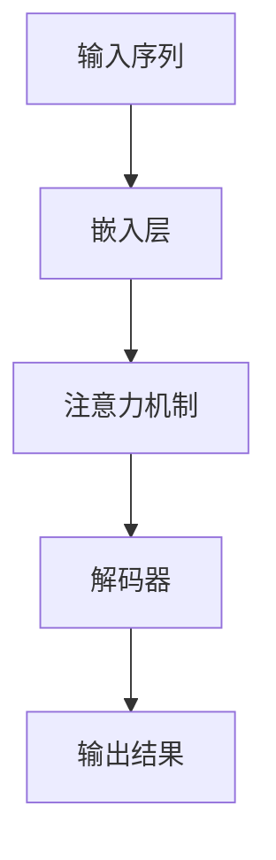
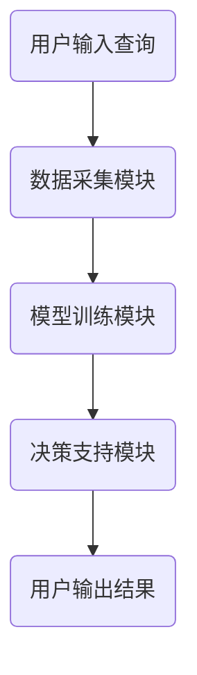
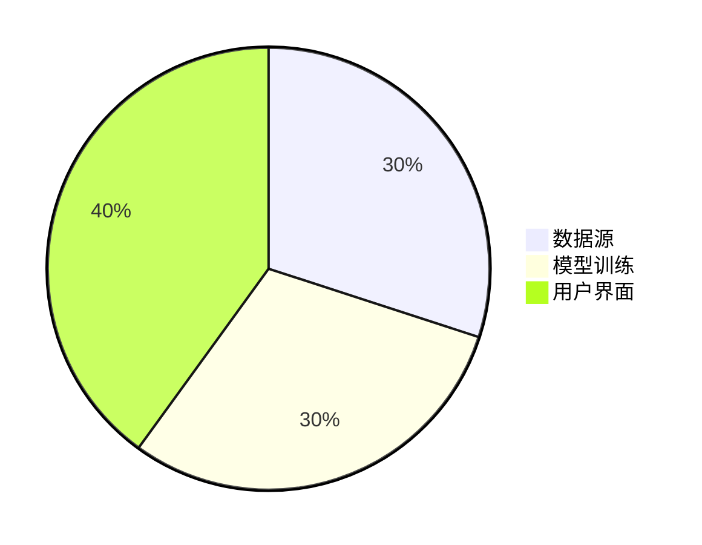

                 


# 特价股票投资中的自然语言生成辅助决策系统

> 关键词：特价股票，自然语言生成，辅助决策，股票投资，人工智能

> 摘要：本文探讨了自然语言生成技术在特价股票投资中的应用，分析了其辅助决策的原理、系统架构及实际案例，为投资者提供智能化的决策支持。

---

# 第一章: 特价股票投资与自然语言生成技术的结合

## 1.1 特价股票投资的背景与特点

### 1.1.1 特价股票的定义与特点

特价股票通常指市盈率、市净率等估值指标低于行业平均水平的股票，具有价格低廉、成长潜力大等特点。投资者常利用技术分析、基本面分析等方法寻找投资机会，但面临信息过载和情绪影响的挑战。

### 1.1.2 特价股票投资的常见策略

常见的策略包括价值投资、趋势投资和事件驱动投资。投资者通过分析财务报表、行业趋势等因素，寻找被市场低估的股票。

### 1.1.3 特价股票投资中的信息获取挑战

信息来源分散、复杂，且存在噪音，投资者难以高效处理信息。情绪化决策和信息不全可能导致投资失误。

## 1.2 自然语言生成技术的背景与应用

### 1.2.1 自然语言生成技术的定义

自然语言生成（Natural Language Generation, NLG）是将结构化数据转化为自然语言文本的技术，常用模型包括基于规则的和统计模型。

### 1.2.2 自然语言生成技术的核心特点

数据驱动、生成多样性、上下文理解能力强。

### 1.2.3 自然语言生成技术在金融领域的应用

生成市场分析报告、新闻摘要、投资建议等，帮助投资者快速获取关键信息。

## 1.3 特价股票投资与自然语言生成技术的结合

### 1.3.1 自然语言生成技术在股票分析中的应用

自动生成财务分析报告、市场趋势预测等，提高分析效率。

### 1.3.2 特价股票投资中信息处理的难点

信息量大、复杂，投资者难以快速提取有效信息。

### 1.3.3 自然语言生成技术如何辅助决策

通过生成简明扼要的分析报告，帮助投资者快速做出决策。

---

# 第二章: 自然语言生成辅助决策系统的原理

## 2.1 自然语言生成模型的核心原理

### 2.1.1 变换器架构（Transformer）的简介

Transformer模型由编码器和解码器组成，编码器将输入数据转换为嵌入向量，解码器生成输出序列。

### 2.1.2 注意力机制（Attention）的原理

注意力机制计算输入序列中各词的重要性权重，提升模型对上下文的理解能力。

### 2.1.3 解码器（Decoder）的工作流程

解码器逐步生成输出，利用注意力机制获取输入信息，通过自适应调整生成上下文相关的文本。

## 2.2 自然语言生成模型的训练过程

### 2.2.1 数据预处理与特征提取

对数据进行清洗、分词和向量化处理，提取关键特征。

### 2.2.2 损失函数的定义与优化

常用交叉熵损失函数，通过梯度下降优化模型参数。

### 2.2.3 模型训练的流程

包括数据准备、模型构建、训练和评估四个阶段。

## 2.3 自然语言生成模型的评估指标

### 2.3.1 常见的生成模型评估指标

包括困惑度（Perplexity）、BLEU、ROUGE等。

### 2.3.2 基于股票分析的定制化评估指标

如准确率、召回率和F1值，评估生成文本的实用性。

## 2.4 本章小结

自然语言生成模型通过Transformer架构和注意力机制，实现高效的文本生成，帮助投资者快速获取关键信息。

---

# 第三章: 自然语言生成辅助决策系统的算法原理

## 3.1 自然语言生成模型的数学模型

### 3.1.1 注意力机制的计算公式

$$ \text{Attention}(Q, K, V) = \text{softmax}\left( \frac{QK^T}{\sqrt{d_k}} \right)V $$

其中，$Q$是查询向量，$K$是键向量，$V$是值向量，$d_k$是向量维度。

### 3.1.2 损失函数的计算公式

交叉熵损失函数：

$$ \text{Loss} = -\frac{1}{N}\sum_{i=1}^{N}\sum_{j=1}^{M} \text{log}(p(y_{ij}|x_i)) $$

其中，$N$是样本数量，$M$是类别数量，$p(y_{ij}|x_i)$是模型预测的概率。

## 3.2 自然语言生成模型的代码实现

### 3.2.1 环境安装

安装Python和必要的库，如TensorFlow或Keras。

### 3.2.2 模型训练代码

```python
import tensorflow as tf
from tensorflow.keras import layers

# 定义Transformer模型
def transformer_model():
    inputs = layers.Input(shape=(None, 100))
    embed_layer = layers.Embedding(10000, 64)(inputs)
    attn_layer = layers.MultiHeadAttention(heads=4, key_dim=8)(embed_layer, embed_layer)
    attn_layer = layers.Dropout(0.1)(attn_layer)
    outputs = layers.Dense(10, activation='softmax')(attn_layer)
    return tf.keras.Model(inputs=inputs, outputs=outputs)

model = transformer_model()
model.compile(optimizer='adam', loss='sparse_categorical_crossentropy', metrics=['accuracy'])
model.fit(...)
```

### 3.2.3 模型推理代码

```python
# 推理阶段
def generate_text(model, start_seq, length=10):
    for _ in range(length):
        predictions = model.predict(start_seq)
        predicted_token = np.argmax(predictions, axis=-1)
        start_seq = np.append(start_seq, predicted_token)
```

## 3.3 算法流程图



---

# 第四章: 自然语言生成辅助决策系统的系统分析与架构设计

## 4.1 系统功能设计

### 4.1.1 功能模块

- 数据采集模块：收集股票数据。
- 模型训练模块：训练自然语言生成模型。
- 决策支持模块：生成分析报告和投资建议。

### 4.1.2 功能流程图



## 4.2 系统架构设计

### 4.2.1 系统架构图



---

# 第五章: 项目实战

## 5.1 项目环境安装

安装必要的库，如TensorFlow、Pandas等。

## 5.2 核心代码实现

### 5.2.1 数据预处理代码

```python
import pandas as pd

# 加载数据
data = pd.read_csv('stock_data.csv')

# 分词处理
from sklearn.feature_extraction.text import CountVectorizer

vectorizer = CountVectorizer()
X = vectorizer.fit_transform(data['text'])
```

### 5.2.2 模型训练代码

```python
model = transformer_model()
model.fit(X, y)
```

## 5.3 代码应用解读与分析

解释代码的功能和作用，展示模型如何生成分析报告。

## 5.4 实际案例分析

分析一个具体案例，展示系统如何帮助投资者做出决策。

---

# 第六章: 最佳实践与总结

## 6.1 小结

自然语言生成技术有效辅助特价股票投资，提高决策效率。

## 6.2 注意事项

模型依赖高质量数据，需注意数据质量和模型可解释性。

## 6.3 拓展阅读

推荐相关书籍和论文，供进一步学习。

---

作者：AI天才研究院 & 禅与计算机程序设计艺术

