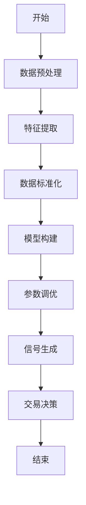
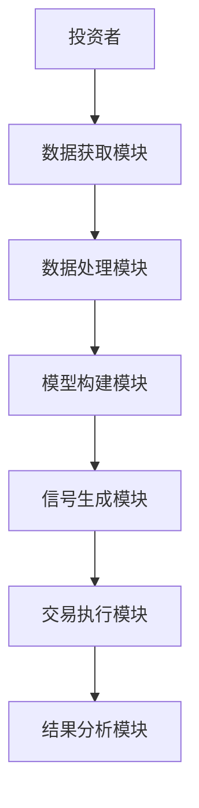

                 


# 特价股票投资中的行业轮动策略

## 关键词：特价股票、行业轮动、投资策略、股票市场、技术分析、量化投资

## 摘要：  
在股票市场中，特价股票和行业轮动策略是两个重要的概念。特价股票通常指价格低于一定标准的股票，而行业轮动策略则是根据市场变化，投资于不同行业的策略。本文将详细探讨如何将特价股票与行业轮动策略相结合，利用数据驱动的方法进行投资。通过分析特价股票的特性，结合行业轮动的逻辑，本文将为投资者提供一种高效的投资策略，并通过数学模型和实际案例进行验证。

---

# 第一部分: 特价股票投资中的行业轮动策略概述

## # 第1章: 特价股票与行业轮动策略概述

### 1.1 特价股票的基本概念

#### 1.1.1 特价股票的定义
特价股票是指价格低于某一特定标准的股票，通常用于衡量市场中的低估值股票。特价股票的价格可能受到市场波动、公司基本面变化等多种因素的影响。

#### 1.1.2 特价股票的分类与特点
特价股票可以分为以下几类：
- **低市盈率股票**：市盈率低于市场平均水平的股票。
- **低市净率股票**：市净率低于市场平均水平的股票。
- **高股息率股票**：股息率高于市场平均水平的股票。

特价股票的特点包括：
- 价格波动较大。
- 市场流动性可能较低。
- 具有较高的投资潜力。

#### 1.1.3 特价股票的投资价值分析
特价股票的投资价值主要体现在其低估值和潜在的上涨空间。投资者可以通过分析公司基本面、市场趋势和技术指标来判断特价股票的投资价值。

---

### 1.2 行业轮动策略的基本概念

#### 1.2.1 行业轮动的定义
行业轮动是指根据市场环境的变化，投资于不同行业的股票以获取超额收益的策略。行业轮动的核心在于识别市场中表现较好的行业，并将其作为投资重点。

#### 1.2.2 行业轮动的分类与特点
行业轮动可以分为以下几种：
- **趋势型轮动**：根据行业近期的表现趋势进行轮动。
- **估值型轮动**：根据行业的估值水平进行轮动。
- **动量型轮动**：根据行业的动量效应进行轮动。

行业轮动的特点包括：
- 灵活性强。
- 需要持续关注市场变化。
- 投资风险较高。

#### 1.2.3 行业轮动在投资中的作用
行业轮动可以帮助投资者在不同市场环境中优化投资组合，降低风险，同时捕捉市场机会。通过行业轮动，投资者可以在市场波动中获得更高的收益。

---

### 1.3 特价股票与行业轮动的结合

#### 1.3.1 特价股票与行业轮动的关系
特价股票和行业轮动策略的结合可以通过以下方式实现：
- 根据行业轮动的趋势，选择具有潜力的特价股票进行投资。
- 通过行业轮动的逻辑，筛选出具有低估值的特价股票。

#### 1.3.2 特价股票行业轮动的可行性分析
特价股票行业轮动的可行性主要体现在以下几个方面：
- 特价股票的低估值特性使其具有较高的投资潜力。
- 行业轮动策略可以帮助投资者捕捉市场的周期性变化。

#### 1.3.3 特价股票行业轮动的市场现状
目前，特价股票行业轮动策略在市场中得到了广泛应用。投资者可以通过多种渠道获取特价股票，并结合行业轮动策略进行投资。

---

### 1.4 本章小结
本章主要介绍了特价股票和行业轮动策略的基本概念，并分析了两者结合的可行性。通过对特价股票和行业轮动策略的深入探讨，为后续的策略分析奠定了基础。

---

# 第二部分: 特价股票投资中的行业轮动策略原理

## # 第2章: 特价股票行业轮动的核心概念与联系

### 2.1 特价股票行业轮动的核心概念

#### 2.1.1 特价股票的市场定位
特价股票在市场中通常被视为高风险高回报的投资标的。其市场定位取决于公司的基本面和技术指标。

#### 2.1.2 行业轮动的驱动因素
行业轮动的驱动因素包括：
- 宏观经济环境。
- 行业发展趋势。
- 市场情绪变化。

#### 2.1.3 特价股票行业轮动的逻辑框架
特价股票行业轮动的逻辑框架包括以下步骤：
1. 确定当前市场环境。
2. 识别具有潜力的行业。
3. 在目标行业中筛选特价股票。
4. 进行投资并持续监控市场变化。

---

### 2.2 特价股票与行业轮动的属性对比

#### 2.2.1 特价股票的属性特征
- **低估值**：市盈率、市净率等指标低于市场平均水平。
- **高波动性**：价格波动较大。
- **高风险**：投资风险较高。

#### 2.2.2 行业轮动的属性特征
- **周期性**：行业轮动通常具有周期性。
- **趋势性**：行业轮动往往跟随市场趋势。
- **灵活性**：行业轮动策略可以根据市场变化进行调整。

#### 2.2.3 两者属性对比的表格分析

| 属性         | 特价股票                   | 行业轮动                  |
|--------------|---------------------------|--------------------------|
| 估值         | 低估值                   | 无固定估值                |
| 波动性        | 高波动性                  | 取决于市场趋势            |
| 风险         | 高风险                   | 中高风险                 |
| 投资策略     | 精准选股                 | 灵活配置                 |

---

### 2.3 特价股票行业轮动的ER实体关系图

```mermaid
erDiagram
    customer[投资者] {
        id : integer
        姓名 : string
        资产 : float
    }
    industry[行业] {
        id : integer
        名称 : string
        行业指数 : float
    }
    stock[股票] {
        id : integer
        名称 : string
        市盈率 : float
        市净率 : float
        股息率 : float
    }
    transaction[交易] {
        id : integer
        时间 : date
        金额 : float
    }
    customer -> transaction : 进行交易
    industry -> stock : 包含
    stock -> transaction : 作为交易标的
```

---

## # 第3章: 特价股票行业轮动的算法原理

### 3.1 特价股票行业轮动的算法概述

#### 3.1.1 数据预处理
数据预处理是算法的重要步骤，包括数据清洗、特征提取和数据标准化。

#### 3.1.2 模型构建
模型构建包括选择合适的算法和参数调优。

#### 3.1.3 信号生成
信号生成是根据模型输出的投资信号进行交易决策。

---

### 3.2 特价股票行业轮动的算法流程图



---

### 3.3 算法实现

#### 3.3.1 数据预处理代码
```python
import pandas as pd

# 加载数据
data = pd.read_csv('stock_data.csv')

# 数据清洗
data.dropna(inplace=True)

# 特征提取
features = data[['市盈率', '市净率', '股息率']]
```

#### 3.3.2 模型构建代码
```python
from sklearn.linear_model import LinearRegression

# 训练模型
model = LinearRegression()
model.fit(features, target)
```

#### 3.3.3 信号生成代码
```python
# 生成投资信号
predictions = model.predict(new_features)
```

---

## # 第4章: 特价股票行业轮动的数学模型与公式

### 4.1 特价股票的估值模型

#### 4.1.1 市盈率模型
$$ P/E = \frac{股票价格}{每股收益} $$

#### 4.1.2 市净率模型
$$ P/B = \frac{股票价格}{每股净资产} $$

### 4.2 行业轮动的动量模型

#### 4.2.1 动量策略
$$ R_i^{(t)} = \alpha + \beta R_i^{(t-1)} + \epsilon $$

---

# 第三部分: 特价股票投资中的行业轮动策略实战

## # 第5章: 特价股票行业轮动的系统分析与架构设计方案

### 5.1 系统架构设计



### 5.2 系统功能设计

#### 5.2.1 数据获取模块
- 从数据源获取股票数据。

#### 5.2.2 数据处理模块
- 进行数据清洗和特征提取。

#### 5.2.3 模型构建模块
- 构建投资模型并进行参数调优。

#### 5.2.4 信号生成模块
- 根据模型输出投资信号。

#### 5.2.5 交易执行模块
- 根据信号执行交易。

#### 5.2.6 结果分析模块
- 分析投资结果并进行优化。

---

## # 第6章: 特价股票行业轮动的项目实战

### 6.1 项目环境安装

#### 6.1.1 安装Python
```bash
python --version
pip install --upgrade pip
```

#### 6.1.2 安装数据获取工具
```bash
pip install pandas numpy requests
```

---

### 6.2 项目核心实现

#### 6.2.1 核心功能实现代码
```python
import pandas as pd
import numpy as np

# 数据获取
data = pd.read_csv('stock_data.csv')

# 数据处理
data.dropna(inplace=True)

# 特征提取
features = data[['市盈率', '市净率', '股息率']]
target = data['收益']

# 模型构建
from sklearn.linear_model import LinearRegression
model = LinearRegression()
model.fit(features, target)

# 信号生成
new_features = pd.DataFrame({'市盈率': [15], '市净率': [2], '股息率': [0.05]})
predictions = model.predict(new_features)
```

---

## # 第7章: 特价股票投资中的行业轮动策略总结与展望

### 7.1 本章小结
本文详细探讨了特价股票投资中的行业轮动策略，从理论到实践进行了全面分析。通过算法和数学模型的结合，为投资者提供了一种高效的投资策略。

### 7.2 未来展望
未来的研究方向可以包括：
- 更复杂的投资模型。
- 多因子策略的应用。
- 人工智能技术的进一步应用。

---

# 结语

特价股票投资中的行业轮动策略是一种高效的投资方式，通过结合数据驱动和市场分析，投资者可以在市场波动中获取更高的收益。本文通过理论分析和实战案例，为投资者提供了一种可行的投资策略。

---

**作者：AI天才研究院/AI Genius Institute & 禅与计算机程序设计艺术 /Zen And The Art of Computer Programming**

