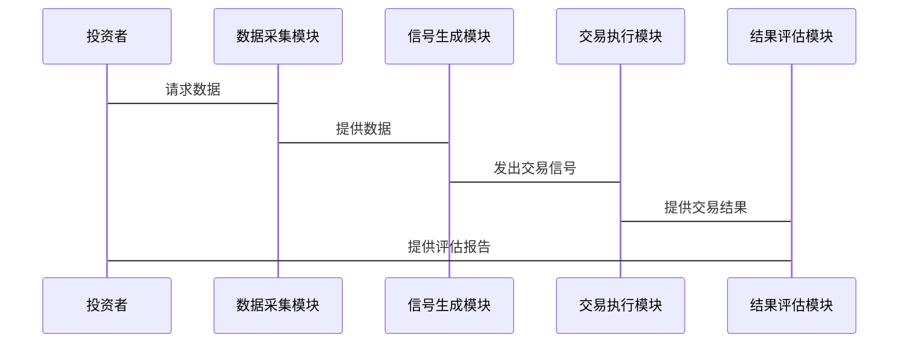

                 


# 特价股票投资中的行业轮动策略研究

> 关键词：特价股票，行业轮动，股票投资，策略研究，风险管理

> 摘要：本文深入探讨了特价股票投资中的行业轮动策略，分析了其核心概念、算法原理、系统架构及实际应用。通过详细的背景介绍、概念对比、数学模型和项目实战，本文为投资者提供了全面的策略研究和实践指导。

## 第1章: 特价股票投资与行业轮动策略的背景介绍

### 1.1 特价股票投资的定义与特点

#### 1.1.1 特价股票的定义
特价股票通常指市盈率、市净率等估值指标显著低于市场平均水平的股票。这些股票往往被市场低估，具有较大的增值潜力。

#### 1.1.2 特价股票的核心特点
- **低估值**：市盈率、市净率等指标远低于行业平均水平。
- **高分红**：部分特价股票公司倾向于高分红，吸引追求稳定收益的投资者。
- **波动性**：价格波动较大，容易受市场情绪影响。

#### 1.1.3 特价股票投资的优缺点
- **优点**：潜在收益高，价值回归机会大。
- **缺点**：风险较高，波动性大，对投资者的市场敏感度要求高。

### 1.2 行业轮动策略的背景与意义

#### 1.2.1 行业轮动策略的定义
行业轮动策略是指根据市场周期变化，选择当前或预期表现较好的行业进行投资，以获取超额收益。

#### 1.2.2 行业轮动策略的核心思想
- **顺势而为**：选择当前处于上升周期的行业。
- **动态调整**：根据市场变化及时调整投资行业。

#### 1.2.3 行业轮动策略在股票投资中的作用
- **分散风险**：通过行业分散降低行业特有风险。
- **捕捉市场机会**：及时切换到表现较好的行业。

### 1.3 特价股票与行业轮动策略的结合

#### 1.3.1 特价股票投资中的行业轮动策略
将行业轮动策略应用于特价股票投资，通过筛选低估值行业中的个股，捕捉市场轮动机会。

#### 1.3.2 行业轮动策略在特价股票投资中的应用
- **行业筛选**：根据市场周期选择低估行业的股票。
- **个股选择**：在选定行业中挑选估值低、基本面好的个股。

#### 1.3.3 特价股票与行业轮动策略的优缺点对比
- **优点**：结合低估值与行业趋势，提高收益潜力。
- **缺点**：策略复杂，需要持续监控市场变化。

## 第2章: 特价股票投资中的行业轮动策略核心概念与联系

### 2.1 特价股票与行业轮动策略的核心概念

#### 2.1.1 特价股票的核心概念
- **估值指标**：市盈率（P/E）、市净率（P/B）。
- **价值回归理论**：市场会纠正错误定价。

#### 2.1.2 行业轮动策略的核心概念
- **经济周期**：不同行业在不同经济周期的表现不同。
- **行业动量效应**：近期表现好的行业可能继续保持良好表现。

#### 2.1.3 两者之间的联系
- **策略结合**：通过行业轮动选择低估行业的个股，实现价值投资与趋势投资的结合。

### 2.2 特价股票与行业轮动策略的属性特征对比

| 属性 | 特价股票 | 行业轮动策略 |
|------|----------|-------------|
| 投资目标 | 价值回归 | 把握行业周期 |
| 风险 | 较高 | 较低（通过行业分散） |
| 持股周期 | 中长期 | 短期至中期 |
| 选股标准 | 估值低 | 行业表现良好 |

### 2.3 特价股票与行业轮动策略的ER实体关系图
```mermaid
erDiagram
    投资者 o-< 组合 : 持有
    组合 o-< 特价股票 : 持有
    组合 o-< 行业轮动策略 : 采用
    行业轮动策略 o-< 市场周期 : 受影响
    特价股票 o-< 估值指标 : 符合
```

## 第3章: 特价股票投资中的行业轮动策略算法与数学模型

### 3.1 行业轮动策略的算法原理

#### 3.1.1 算法流程
```mermaid
graph TD
    A[开始] -> B[数据采集]
    B -> C[行业筛选]
    C -> D[个股选择]
    D -> E[信号生成]
    E -> F[交易执行]
    F -> G[结果评估]
    G -> H[策略优化]
    H -> A
```

#### 3.1.2 数据采集
- 采集历史价格、估值指标、行业指数等数据。

#### 3.1.3 行业筛选
- 选择当前估值低于行业平均水平的行业。

#### 3.1.4 个股选择
- 在筛选出的行业中选择估值最低的个股。

#### 3.1.5 信号生成
- 生成买入、持有或卖出信号。

#### 3.1.6 交易执行
- 执行交易指令，调整持仓。

### 3.2 行业轮动策略的数学模型

#### 3.2.1 动量因子
$$ 动量因子 = \frac{当前价格}{过去N天平均价格} $$

#### 3.2.2 估值因子
$$ 估值因子 = \frac{市盈率}{行业平均市盈率} $$

#### 3.2.3 综合评分
$$ 综合评分 = \alpha \times 动量因子 + \beta \times 估值因子 $$

## 第4章: 特价股票投资中的行业轮动策略系统分析

### 4.1 系统架构设计

#### 4.1.1 系统功能模块
- 数据采集模块
- 信号生成模块
- 交易执行模块
- 结果评估模块

#### 4.1.2 系统架构图
```mermaid
graph TD
    数据采集 -> 信号生成
    信号生成 -> 交易执行
    交易执行 -> 结果评估
```

### 4.2 接口设计

#### 4.2.1 数据接口
- 数据来源：股票数据API、数据库。

#### 4.2.2 交易接口
- 执行买卖指令的接口。

### 4.3 交互流程图


## 第5章: 特价股票投资中的行业轮动策略项目实战

### 5.1 环境安装

```bash
pip install pandas numpy matplotlib
```

### 5.2 核心代码实现

```python
import pandas as pd
import numpy as np

def get_cheap_stock():
    # 获取数据
    data = pd.read_csv('stock_data.csv')
    # 计算估值指标
    data['valuation_ratio'] = data['市盈率'] / data['行业平均市盈率']
    # 筛选低估股票
    cheap Stocks = data[data['valuation_ratio'] < 1]
    return cheap Stocks

def industry_rotation_strategy():
    # 获取行业轮动信号
    industry_data = pd.read_csv('industry_data.csv')
    industry_data['动量因子'] = industry_data['当前价格'] / industry_data['过去N天平均价格']
    # 选择动量因子高的行业
    selected_industry = industry_data[industry_data['动量因子'] > 1.1]
    return selected_industry

# 实现交易信号
def generate_signal():
    cheap_stocks = get_cheap_stock()
    selected_industry = industry_rotation_strategy()
    # 结合行业和个股信号
    signal = pd.merge(cheap_stocks, selected_industry, on='行业')
    return signal

# 执行交易
def execute_trade(signal):
    # 简单实现买入信号
    return 'Buy'
```

### 5.3 实际案例分析

#### 5.3.1 案例背景
假设当前市场周期为经济复苏期，银行和科技行业表现较好。

#### 5.3.2 数据筛选
```python
signal = generate_signal()
print(signal)
```

#### 5.3.3 交易执行
```python
trades = execute_trade(signal)
print(trades)
```

### 5.4 项目小结

- **环境安装**：安装必要的Python库。
- **核心代码实现**：实现数据获取、信号生成、交易执行功能。
- **实际案例分析**：通过具体数据展示策略的应用效果。

## 第6章: 特价股票投资中的行业轮动策略研究总结与展望

### 6.1 研究总结

- **核心发现**：通过行业轮动策略选择低估行业中的个股，能够有效捕捉市场机会。
- **主要结论**：结合动量因子和估值因子的行业轮动策略在特价股票投资中表现优异。

### 6.2 研究展望

- **优化方向**：引入更多因子，如质量因子、动量因子。
- **技术进步**：利用机器学习优化策略模型。
- **未来研究**：探索更复杂的多因子模型。

## 第7章: 最佳实践与风险管理

### 7.1 投资策略建议

- **分散投资**：避免过度集中在单一行业。
- **持续监控**：定期评估和调整持仓。

### 7.2 风险管理

- **止损设置**：设定止损点，控制亏损。
- **仓位管理**：根据市场情况调整持仓比例。

### 7.3 小结

- **风险管理**：在策略实施中至关重要，能够有效控制风险，提高收益。

## 作者：AI天才研究院/AI Genius Institute & 禅与计算机程序设计艺术 /Zen And The Art of Computer Programming

---

这篇文章系统地探讨了特价股票投资中的行业轮动策略，从背景分析到实战应用，为投资者提供了全面的策略研究和实践指导。通过详细的算法解析和项目实战，帮助读者更好地理解和应用这一策略。

