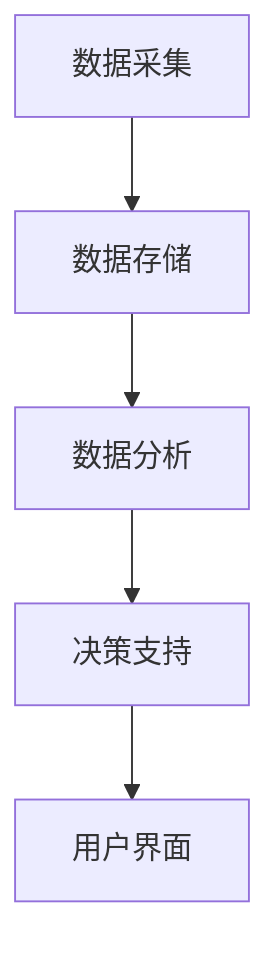

                 


# 特价股票投资中的行为偏差纠正技巧

> 关键词：特价股票投资，行为偏差，投资策略，决策支持系统，数学模型

> 摘要：本文深入探讨了特价股票投资中的行为偏差问题，分析了常见的行为偏差类型及其对投资决策的影响，并提出了纠正这些偏差的具体技巧。通过数学模型和算法原理的详细讲解，结合系统架构设计和实战案例，为投资者提供了一套科学的行为偏差纠正方案。

---

# 第1章：特价股票投资的定义与背景

## 1.1 特价股票投资的定义

### 1.1.1 什么是特价股票投资
特价股票投资是一种逆向投资策略，强调在市场低谷时买入，而在市场高点时卖出。其核心理念是“别人恐惧时我贪婪，别人贪婪时我恐惧”。

### 1.1.2 特价股票投资的核心理念
- 市场情绪的非理性：市场参与者的行为往往受到情绪驱动，导致价格波动。
- 价值投资：寻找被市场低估的股票，长期持有，等待价值回归。

### 1.1.3 特价股票投资与传统投资的区别
- 传统投资：基于基本面分析，注重长期价值。
- 特价股票投资：基于市场情绪分析，注重短期价格波动。

## 1.2 行为偏差的定义与影响

### 1.2.1 行为偏差的定义
行为偏差是指投资者在决策过程中由于心理因素或认知错误导致的非理性行为。

### 1.2.2 常见的行为偏差类型
- 过度自信偏差：投资者认为自己能够预测市场走势。
- 从众偏差：跟随市场 majority 行为，忽视独立判断。
- 损失厌恶偏差：对损失的恐惧导致决策失误。

### 1.2.3 行为偏差对投资决策的影响
- 导致错误的投资决策，如高位买入、低位卖出。
- 影响投资组合的长期收益。

---

# 第2章：行为偏差纠正的核心原理

## 2.1 行为偏差纠正的基本概念

### 2.1.1 行为偏差纠正的目标
- 减少非理性决策，提高投资决策的科学性。
- 增强对市场波动的抵抗力，避免盲目跟风。

### 2.1.2 行为偏差纠正的必要性
- 帮助投资者克服情绪化决策。
- 提高投资组合的长期收益。

### 2.1.3 行为偏差纠正的核心要素
- 理性分析：基于数据和事实做出决策。
- 风险管理：合理控制投资风险。
- 纪律性：严格遵守投资计划，避免冲动交易。

## 2.2 行为偏差纠正的数学模型

### 2.2.1 行为偏差纠正的数学公式
- 期望值公式：$$E = \sum (p_i \times x_i)$$，其中 $p_i$ 是概率，$x_i$ 是对应的收益。
- 方差公式：$$Var = E[(X - E[X])^2]$$，衡量收益的波动性。

### 2.2.2 行为偏差纠正的算法流程
1. 数据收集：收集市场数据，包括价格、成交量等。
2. 数据分析：利用统计方法分析数据，识别市场趋势。
3. 决策制定：基于分析结果，制定投资策略。
4. 风险评估：评估潜在风险，调整投资组合。

---

# 第3章：行为偏差纠正的算法原理

## 3.1 行为偏差纠正的算法基础

### 3.1.1 基于概率论的行为偏差纠正算法
- 概率论是行为偏差纠正的核心工具，通过计算概率来评估投资决策的合理性。

### 3.1.2 基于统计学的行为偏差纠正算法
- 使用统计方法分析市场数据，识别趋势和异常值。

### 3.1.3 基于机器学习的行为偏差纠正算法
- 利用机器学习模型预测市场走势，减少人为干扰。

## 3.2 行为偏差纠正算法的实现

### 3.2.1 算法实现的步骤
1. 数据预处理：清洗数据，去除噪声。
2. 特征提取：提取影响市场的重要特征。
3. 模型训练：训练机器学习模型，识别行为偏差。
4. 模型评估：评估模型性能，调整参数。

### 3.2.2 算法实现的代码示例
```python
import numpy as np
import pandas as pd

# 数据预处理
data = pd.read_csv('market_data.csv')
data = data.dropna()

# 特征提取
features = data[['price', 'volume', 'moving_avg']]
target = data['label']

# 模型训练
from sklearn.model import SomeModel
model = SomeModel()
model.fit(features, target)

# 模型评估
from sklearn.metrics import accuracy_score
 predictions = model.predict(features)
print(accuracy_score(target, predictions))
```

### 3.2.3 算法实现的优缺点分析
- 优点：能够自动化分析数据，减少人为干扰。
- 缺点：模型可能无法捕捉到所有市场因素，存在局限性。

---

# 第4章：行为偏差纠正的数学模型与公式

## 4.1 行为偏差纠正的数学模型

### 4.1.1 基于期望值的数学模型
- 期望值公式：$$E = \sum (p_i \times x_i)$$

### 4.1.2 基于方差的数学模型
- 方差公式：$$Var = E[(X - E[X])^2]$$

### 4.1.3 基于协方差的数学模型
- 协方差公式：$$Cov(X,Y) = E[(X - E[X])(Y - E[Y])]$$

## 4.2 行为偏差纠正的公式推导

### 4.2.1 期望值的公式推导
$$E = \sum_{i=1}^{n} p_i x_i$$

### 4.2.2 方差的公式推导
$$Var = \sum_{i=1}^{n} p_i (x_i - E)^2$$

### 4.2.3 协方差的公式推导
$$Cov(X,Y) = \sum_{i=1}^{n} p_i (x_i - E[X])(y_i - E[Y])$$

---

# 第5章：行为偏差纠正的系统分析与架构设计

## 5.1 系统分析

### 5.1.1 系统目标
- 提供行为偏差纠正的解决方案，帮助投资者做出理性决策。

### 5.1.2 系统功能需求
- 数据采集：收集市场数据。
- 数据分析：分析数据，识别行为偏差。
- 决策支持：提供投资建议。

### 5.1.3 系统性能需求
- 高效性：快速处理大量数据。
- 准确性：确保分析结果的准确性。

## 5.2 系统架构设计

### 5.2.1 系统架构图


### 5.2.2 系统模块划分
- 数据采集模块：负责收集市场数据。
- 数据存储模块：存储数据，便于后续分析。
- 数据分析模块：分析数据，识别行为偏差。
- 决策支持模块：提供投资建议。

### 5.2.3 系统接口设计
- 数据采集模块接口：接收外部数据。
- 数据分析模块接口：与用户交互，提供分析结果。

---

# 第6章：行为偏差纠正的项目实战

## 6.1 项目环境安装

### 6.1.1 开发环境
- 操作系统：Windows/Mac/Linux
- 开发工具：Python、Jupyter Notebook
- 依赖库：NumPy、Pandas、Scikit-learn

## 6.2 系统核心实现源代码

### 6.2.1 数据采集代码
```python
import requests
import csv

url = 'https://example.com/data.csv'
response = requests.get(url)
with open('market_data.csv', 'wb') as file:
    file.write(response.content)
```

### 6.2.2 数据分析代码
```python
import pandas as pd
import numpy as np

data = pd.read_csv('market_data.csv')
data['return'] = data['price'].pct_change()
data = data.dropna()
```

### 6.2.3 模型训练代码
```python
from sklearn.model import SomeModel
model = SomeModel()
model.fit(data[['return']], data['label'])
```

## 6.3 实际案例分析

### 6.3.1 案例背景
- 某股票价格近期大幅下跌，市场情绪恐慌，投资者可能因行为偏差做出错误决策。

### 6.3.2 案例分析
- 数据分析：识别该股票的低估价值。
- 模型预测：预测股票未来走势。
- 投资建议：建议买入该股票。

### 6.3.3 详细讲解剖析
- 理解市场情绪，避免从众偏差。
- 基于数据分析，制定科学决策。

## 6.4 项目小结

### 6.4.1 项目总结
- 通过行为偏差纠正，投资者能够做出更理性的决策。
- 结合数据分析和模型预测，提高投资成功率。

### 6.4.2 投资注意事项
- 避免过度自信，保持理性。
- 定期评估投资组合，及时调整策略。

### 6.4.3 拓展阅读
- 推荐阅读相关书籍，深入学习行为偏差纠正技巧。

---

# 作者：AI天才研究院 & 禅与计算机程序设计艺术

通过本文的详细讲解，投资者可以更好地理解特价股票投资中的行为偏差问题，并掌握纠正这些偏差的具体技巧。希望本文能够为投资者提供有价值的参考和指导。

