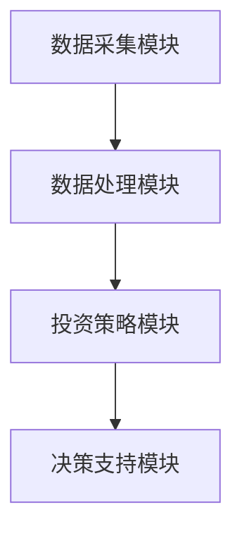

                 

# 特价股票投资中的认知偏差及其克服方法

> 关键词：认知偏差，特价股票，投资策略，系统架构，决策支持

> 摘要：本文系统地探讨了特价股票投资中常见的认知偏差类型及其对投资决策的影响，分析了如何通过认知行为疗法、决策框架优化和系统化投资策略来克服这些偏差。文章结合实际案例，提出了系统化的解决方案，并通过项目实战展示了如何在实际投资中应用这些方法。

---

# 第1章 认知偏差的基本概念

## 1.1 认知偏差的定义与分类

### 1.1.1 认知偏差的定义
认知偏差（Cognitive Bias）是指人们在信息处理和决策过程中，由于心理、情感或经验的影响，导致系统性地偏离逻辑推理或统计规律的现象。认知偏差广泛存在于人类决策过程中，尤其是在高风险和高不确定性的领域，如投资。

### 1.1.2 常见的认知偏差类型
以下是常见的认知偏差类型及其简要说明：
1. **过度自信偏差（Overconfidence Bias）**：投资者倾向于过度相信自己的判断能力，认为自己能够准确预测市场走势。
2. **损失厌恶（Loss Aversion）**：投资者对损失的厌恶程度远超过对收益的追求，导致在面对潜在损失时做出非理性的决策。
3. **从众心理（Conformity Bias）**：投资者倾向于跟随大众的决策，而非基于独立分析做出判断。
4. **确认偏差（Confirmation Bias）**：投资者倾向于寻找和关注支持自己已有观点的信息，而忽略相反的证据。
5. **处置效应（Disposition Effect）**：投资者在处理现有资产时，倾向于迅速出售亏损的资产，而长期持有盈利的资产。

### 1.1.3 认知偏差的特征与表现
认知偏差的特征包括：
- **系统性**：认知偏差是系统性的，而非随机的。
- **普遍性**：几乎所有人都可能受到认知偏差的影响。
- **情境性**：认知偏差的表现因情境而异。

---

## 1.2 认知偏差在投资中的影响

### 1.2.1 投资决策中的认知偏差
在投资决策中，认知偏差会导致投资者做出非理性的决策，例如：
- 过度交易：投资者频繁买卖股票，试图通过短期波动获利。
- 选择性信息处理：只关注支持自己观点的信息，忽略不利于自己的信息。

### 1.2.2 认知偏差对投资结果的具体影响
认知偏差可能导致以下后果：
- **过度交易**：频繁买卖导致交易成本增加，影响投资收益。
- **决策失误**：由于从众心理或过度自信，投资者可能在市场高点买入，在低点卖出。
- **错失机会**：由于损失厌恶，投资者可能错过低价买入的机会。

### 1.2.3 认知偏差与投资心理的关系
认知偏差与投资心理密切相关，例如：
- **贪婪与恐惧**：认知偏差可能导致投资者在市场繁荣时贪婪，在市场下跌时恐惧。
- **情绪化决策**：认知偏差会加剧投资者的情绪化决策，而非理性决策。

---

## 1.3 认知偏差的经典案例分析

### 1.3.1 过度自信偏差案例
某投资者相信自己能够准确预测市场走势，频繁交易，结果导致交易成本过高，最终亏损。

### 1.3.2 损失厌恶偏差案例
某投资者在市场下跌时，由于害怕进一步亏损，迅速卖出股票，错失后续反弹的机会。

### 1.3.3 从众偏差案例
某投资者看到多数人买入某只股票，也跟随买入，结果该股票随后下跌，导致亏损。

---

## 1.4 本章小结
本章介绍了认知偏差的基本概念、分类及其在投资中的影响，并通过经典案例分析了认知偏差对投资决策的具体影响。认知偏差是投资者在特价股票投资中需要克服的主要障碍。

---

# 第2章 特价股票投资中的认知偏差分析

## 2.1 特价股票投资的基本特点

### 2.1.1 特价股票的定义与分类
特价股票通常指价格低于市场平均水平的股票，按市值可分为小盘股、中盘股和大盘股。特价股票通常具有较高的波动性和不确定性。

### 2.1.2 特价股票市场的特点
- **高波动性**：特价股票价格波动较大，容易受到市场情绪影响。
- **高风险**：特价股票投资风险较高，容易受到市场环境变化的影响。
- **高潜力**：特价股票可能隐藏着较大的投资机会，尤其是在市场复苏时。

### 2.1.3 特价股票投资的风险与机会
- **风险**：市场波动大、流动性差、公司基本面不稳定。
- **机会**：低价股票可能在市场回升时带来超额收益。

---

## 2.2 特价股票投资中的常见认知偏差

### 2.2.1 处置效应
处置效应是指投资者倾向于迅速出售亏损的股票，而长期持有盈利的股票。这种偏差可能导致投资者错失低价买入的机会，尤其是在市场底部。

### 2.2.2 从众心理
从众心理导致投资者跟随市场潮流，而非基于独立分析做出决策。在特价股票投资中，从众心理可能导致投资者在市场高点买入，而在市场低点卖出。

### 2.2.3 过度自信
过度自信偏差导致投资者过于相信自己的判断能力，可能在市场底部卖出股票，而在市场顶部买入股票。

### 2.2.4 损失厌恶
损失厌恶导致投资者在面对潜在亏损时，倾向于采取保守策略，错失低价买入的机会。

### 2.2.5 确认偏差
确认偏差导致投资者只关注支持自己观点的信息，忽略相反的证据。例如，投资者可能只关注特价股票的利好消息，而忽略潜在的风险因素。

---

## 2.3 认知偏差对投资决策的具体影响

### 2.3.1 认知偏差如何影响投资决策
- **决策失误**：认知偏差可能导致投资者做出错误的买卖决策。
- **交易成本增加**：频繁交易可能导致交易成本增加，影响投资收益。
- **错失机会**：认知偏差可能导致投资者错失低价买入的机会。

### 2.3.2 认知偏差如何影响投资结果
- **投资亏损**：认知偏差可能导致投资亏损，尤其是在市场波动较大的情况下。
- **投资机会错失**：认知偏差可能导致投资者错失潜在的投资机会。

### 2.3.3 认知偏差对投资者心理的影响
- **情绪波动**：认知偏差可能导致投资者情绪波动，影响投资决策。
- **决策疲劳**：认知偏差可能导致投资者决策疲劳，影响投资效果。

---

## 2.4 本章小结
本章分析了特价股票投资中的常见认知偏差及其对投资决策的具体影响。认知偏差是投资者在特价股票投资中需要克服的主要障碍，只有通过克服认知偏差，才能做出理性的投资决策。

---

# 第3章 克服认知偏差的方法与策略

## 3.1 认知行为疗法在投资中的应用

### 3.1.1 认知重构
认知重构是指通过改变投资者的认知方式，帮助其克服认知偏差。例如，投资者可以通过记录投资决策日志，反思自己的决策过程，识别并纠正认知偏差。

### 3.1.2 行为调整
行为调整是指通过改变投资者的行为习惯，帮助其克服认知偏差。例如，投资者可以制定投资计划，并严格按照计划执行，避免情绪化决策。

### 3.1.3 认知行为疗法的具体步骤
1. **识别认知偏差**：投资者需要识别自己的认知偏差。
2. **分析认知偏差**：投资者需要分析认知偏差的具体表现。
3. **纠正认知偏差**：投资者需要通过认知重构和行为调整，纠正认知偏差。

---

## 3.2 投资决策框架的优化

### 3.2.1 理性决策框架
理性决策框架是指基于事实和数据，而非情感和直觉做出决策。例如，投资者可以通过数据可视化工具，分析市场趋势，做出理性的投资决策。

### 3.2.2 情感决策框架
情感决策框架是指基于情感和直觉做出决策，但需要避免情感化决策。

### 3.2.3 综合决策框架
综合决策框架是指结合理性决策和情感决策，做出综合性的投资决策。

---

## 3.3 系统化投资策略的制定

### 3.3.1 投资目标的设定
投资者需要设定明确的投资目标，例如追求长期稳定收益，而非短期暴利。

### 3.3.2 投资策略的制定
投资者需要制定系统化的投资策略，例如基于价值投资的策略，选择基本面良好的特价股票。

### 3.3.3 投资策略的执行与监控
投资者需要严格按照投资策略执行，并定期监控投资组合的表现，及时调整投资策略。

---

## 3.4 本章小结
本章介绍了克服认知偏差的方法与策略，包括认知行为疗法、决策框架优化和系统化投资策略。通过这些方法，投资者可以克服认知偏差，做出理性的投资决策。

---

# 第4章 特价股票投资中的系统架构与技术实现

## 4.1 系统架构设计

### 4.1.1 系统模块划分
系统模块包括：
- 数据采集模块：采集市场数据。
- 数据处理模块：处理数据，分析市场趋势。
- 投资策略模块：制定投资策略。
- 决策支持模块：提供决策支持。

### 4.1.2 系统功能设计
系统功能包括：
- 数据可视化：通过图表展示市场数据。
- 投资策略优化：通过算法优化投资策略。
- 决策支持：提供基于数据的决策支持。

### 4.1.3 系统架构图

---

## 4.2 数据分析与处理

### 4.2.1 数据采集
数据采集包括从市场数据源获取特价股票的实时数据。

### 4.2.2 数据清洗
数据清洗包括去除噪声数据，填补缺失值。

### 4.2.3 数据分析
数据分析包括统计分析和机器学习分析，识别市场趋势和投资机会。

---

## 4.3 系统实现

### 4.3.1 系统功能实现
系统功能实现包括：
- 数据可视化：使用Matplotlib等工具绘制图表。
- 投资策略优化：使用Python编写算法优化投资策略。
- 决策支持：基于数据提供决策支持。

### 4.3.2 系统界面设计
系统界面设计包括用户友好的界面设计，方便投资者使用。

### 4.3.3 系统测试
系统测试包括单元测试和集成测试，确保系统稳定运行。

---

## 4.4 本章小结
本章介绍了特价股票投资中的系统架构与技术实现，包括系统模块划分、数据处理和系统实现。通过技术手段，投资者可以克服认知偏差，做出理性的投资决策。

---

# 第5章 项目实战——特价股票投资中的认知偏差克服

## 5.1 项目背景与目标

### 5.1.1 项目背景
某投资者希望克服认知偏差，实现理性的特价股票投资。

### 5.1.2 项目目标
通过系统化的方法，帮助投资者克服认知偏差，实现理性的投资决策。

### 5.1.3 项目范围
项目范围包括认知偏差识别、投资策略制定和系统实现。

---

## 5.2 项目实施过程

### 5.2.1 需求分析
投资者需要克服的认知偏差包括过度自信、从众心理等。

### 5.2.2 系统设计
系统设计包括数据采集、数据处理和决策支持模块。

### 5.2.3 系统实现
系统实现包括数据采集、数据处理和决策支持模块的开发。

### 5.2.4 系统测试
系统测试包括功能测试和性能测试。

---

## 5.3 项目成果与分析

### 5.3.1 项目成果
通过系统化的项目实施，投资者克服了认知偏差，实现了理性的投资决策。

### 5.3.2 成果分析
通过项目实施，投资者的投资收益显著提高，投资决策更加理性。

### 5.3.3

---

## 5.4 本章小结
本章通过项目实战，展示了如何通过系统化的方法克服认知偏差，实现理性的特价股票投资。项目成果证明了系统化方法的有效性。

---

# 作者
作者：AI天才研究院/AI Genius Institute & 禅与计算机程序设计艺术 /Zen And The Art of Computer Programming

---

以上是《特价股票投资中的认知偏差及其克服方法》的技术博客文章的完整内容，涵盖了认知偏差的基本概念、特价股票投资中的认知偏差分析、克服认知偏差的方法与策略、系统架构与技术实现，以及项目实战等内容。通过系统化的分析和实践，投资者可以克服认知偏差，实现理性的特价股票投资。

