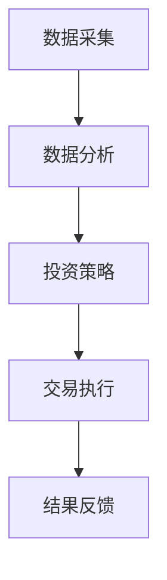

                 


# 特价股票投资中的认知科学与行为经济学应用

> 关键词：特价股票投资，认知科学，行为经济学，投资决策，行为模型，认知偏差，情绪指标

> 摘要：本文深入探讨了认知科学与行为经济学在特价股票投资中的应用。通过分析投资者的认知偏差、情绪影响及行为模式，结合行为经济学理论与认知科学模型，提出了基于行为偏差的选股策略和情绪驱动的投资决策框架。文章还结合实际案例，详细阐述了认知模型、行为模型及其在投资系统中的应用，为投资者提供了科学的投资决策支持。

---

## 第1章: 特价股票投资概述

### 1.1 特价股票投资的定义与特点

#### 1.1.1 特价股票的定义
特价股票是指在特定条件下价格大幅低于市场平均值的股票，通常具有较高的潜在收益和风险。其特点是价格波动大、市场关注度低、信息不对称性强。

#### 1.1.2 特价股票投资的特点
- 高风险：价格波动剧烈，容易受市场情绪影响。
- 高收益：潜在回报率高。
- 低流动性：交易量小，买卖价差大。
- 信息不对称：投资者需要通过深入研究发现价值。

#### 1.1.3 特价股票与传统股票投资的区别
- 投资策略：传统股票投资注重长期价值，特价股票投资注重短期机会。
- 风险特征：传统股票风险较低，特价股票风险较高。
- 投资周期：传统股票投资周期长，特价股票投资周期短。

### 1.2 行为经济学与认知科学的基本原理

#### 1.2.1 行为经济学的核心概念
- **有限理性**：投资者在决策时受到信息处理能力的限制。
- **行为偏差**：投资者在决策中常见的认知偏差，如确认偏差、锚定效应等。
- **情绪影响**：情绪波动对投资决策的影响。

#### 1.2.2 认知科学的基本原理
- **认知层次理论**：投资者在决策时会考虑其他投资者的决策。
- **信息处理**：投资者通过有限的信息做出决策。
- **认知负荷**：信息过载对决策的影响。

#### 1.2.3 行为偏差与认知偏差对投资决策的影响
- **行为偏差**：如过度自信、从众心理等。
- **认知偏差**：如确认偏差、锚定效应等。
- **情绪偏差**：如贪婪和恐惧。

---

## 第2章: 投资者认知与行为分析

### 2.1 投资者认知偏差

#### 2.1.1 确认偏差
投资者倾向于寻找支持自己观点的信息，忽略或忽视与自己观点不符的信息。

#### 2.1.2 过度自信偏差
投资者对自己的判断过于自信，低估市场的不确定性。

#### 2.1.3 锚定效应
投资者在决策时过于依赖某个初始信息，导致判断失误。

### 2.2 投资者情绪与决策

#### 2.2.1 情绪对投资决策的影响
情绪波动会导致投资者做出非理性决策，如追涨杀跌。

#### 2.2.2 市场情绪周期与股票价格波动
市场情绪周期会影响股票价格的波动，投资者可以通过情绪指标捕捉市场趋势。

#### 2.2.3 情绪指标与投资策略
- **情绪指标**：如恐慌指数、市场情绪指数等。
- **投资策略**：基于情绪指标制定逆向投资策略。

---

## 第3章: 特价股票投资中的行为经济学应用

### 3.1 行为经济学在选股策略中的应用

#### 3.1.1 基于行为偏差的选股策略
- **低关注度股票**：避免过度拥挤的市场情绪。
- **价格偏离价值股票**：寻找被市场忽视的价值洼地。

#### 3.1.2 情绪指标与投资时机选择
- **情绪低谷**：买入时机。
- **情绪高峰**：卖出时机。

#### 3.1.3 行为经济学视角下的市场有效性
- **市场无效性**：行为偏差导致市场定价偏差。
- **套利机会**：利用市场无效性获取超额收益。

### 3.2 特价股票投资中的认知科学应用

#### 3.2.1 认知框架对投资决策的影响
- **框架效应**：不同的信息呈现方式影响决策。
- **信息处理**：投资者通过有限信息构建认知框架。

#### 3.2.2 信息处理与投资判断
- **信息过滤**：投资者筛选信息的过程。
- **信息整合**：投资者如何将分散信息整合成决策依据。

#### 3.2.3 认知负荷对投资行为的影响
- **认知负荷过载**：信息过载导致决策失误。
- **简化决策**：投资者通过简化决策过程降低认知负荷。

---

## 第4章: 特价股票投资中的认知科学与行为经济学模型

### 4.1 认知模型在特价股票投资中的应用

#### 4.1.1 认知层次模型
- **一级认知**：投资者基于自身信息做出决策。
- **二级认知**：考虑其他投资者的决策。
- **三级认知**：考虑投资者对其他投资者的预期。

#### 4.1.2 行为决策模型
- **基于行为偏差的决策模型**：考虑行为偏差对决策的影响。
- **基于情绪的决策模型**：考虑情绪波动对决策的影响。

#### 4.1.3 情感驱动模型
- **情感驱动决策**：情绪对投资决策的驱动作用。
- **情感指标与投资策略**：利用情感指标制定投资策略。

---

## 第5章: 特价股票投资中的行为模型

### 5.1 行为模型构建

#### 5.1.1 基于行为偏差的行为模型
- **行为偏差的分类与影响**：确认偏差、锚定效应等。
- **行为偏差与投资策略**：利用行为偏差制定反向策略。

#### 5.1.2 情绪驱动的行为模型
- **情绪波动与行为模式**：情绪波动对交易行为的影响。
- **情绪周期与投资策略**：基于情绪周期制定投资策略。

---

## 第6章: 特价股票投资中的算法与系统设计

### 6.1 算法原理讲解

#### 6.1.1 基于行为偏差的算法模型
- **行为偏差检测算法**：识别投资者的行为偏差。
- **行为偏差预测算法**：预测行为偏差对市场的影响。

#### 6.1.2 情绪指标算法
- **情绪指标计算算法**：计算市场情绪指数。
- **情绪驱动的交易算法**：基于情绪指标进行交易决策。

### 6.2 系统架构设计

#### 6.2.1 系统功能设计
- **数据采集模块**：采集市场数据、情绪数据。
- **数据分析模块**：分析数据，识别行为偏差。
- **投资策略模块**：制定投资策略，输出交易信号。

#### 6.2.2 系统架构图


---

## 第7章: 特价股票投资中的项目实战

### 7.1 环境安装与配置

#### 7.1.1 系统环境
- 操作系统：Linux/Windows
- 开发工具：Python、Jupyter Notebook
- 数据源：股票数据API、情绪数据API

### 7.2 核心代码实现

#### 7.2.1 情绪指标计算
```python
import pandas as pd
import numpy as np

def calculate_emotion_index(data):
    # 计算情绪指数
    emotion_index = data['volume'].rolling(window=20).mean()
    return emotion_index
```

#### 7.2.2 行为偏差检测
```python
def detect_behavior_bias(data):
    # 计算行为偏差
    bias_score = data['price'].rolling(window=10).std()
    return bias_score
```

### 7.3 系统实现与案例分析

#### 7.3.1 系统实现
- 数据采集：通过API获取股票数据和情绪数据。
- 数据分析：计算情绪指数和行为偏差。
- 投资策略：基于情绪指数和行为偏差制定交易策略。

#### 7.3.2 案例分析
- **案例1**：某特价股票的情绪指数与价格波动分析。
- **案例2**：行为偏差对某特价股票交易的影响。

---

## 第8章: 总结与展望

### 8.1 总结
本文从认知科学与行为经济学的角度，探讨了特价股票投资中的行为偏差、情绪影响及投资策略。通过算法与系统设计，提出了基于行为偏差和情绪指标的投资模型。

### 8.2 展望
未来的研究可以进一步结合大数据和人工智能技术，开发更复杂的投资者行为预测模型，提升投资决策的科学性与准确性。

---

## 作者：AI天才研究院/AI Genius Institute & 禅与计算机程序设计艺术 /Zen And The Art of Computer Programming

