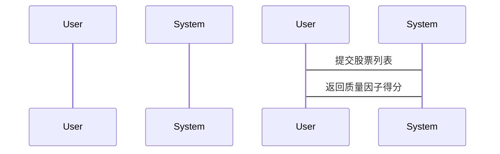

                 


# 特价股票投资中的质量因子分析

**关键词**：特价股票，质量因子，投资分析，量化指标，系统架构

**摘要**：本文深入探讨了特价股票投资中的质量因子分析，从背景、定义、核心概念到算法原理、系统架构、项目实战，最后结合实际案例进行深入剖析，旨在为投资者提供科学的分析方法和实践指导。

---

## 第1章: 特价股票与质量因子的定义与背景

### 1.1 特价股票的定义与特点

#### 1.1.1 特价股票的定义
特价股票通常指的是价格低于行业平均水平或历史平均水平的股票。这类股票可能由于市场波动、公司短期问题或其他因素导致价格被低估，为投资者提供了潜在的增值机会。

#### 1.1.2 特价股票的市场特征
- 价格低廉：通常市盈率、市净率等估值指标低于行业平均水平。
- 风险较高：可能存在较高的经营风险或市场风险。
- 增长潜力：部分公司可能具有较高的成长潜力，尤其是在行业周期性波动时。

#### 1.1.3 特价股票在投资中的重要性
- 投资者可以通过投资特价股票获得较高的潜在回报。
- 特价股票往往被市场忽视，可能存在未被发现的投资机会。

### 1.2 质量因子的背景与意义

#### 1.2.1 质量因子的定义
质量因子是衡量公司质量的重要指标，通常包括盈利能力、偿债能力、运营效率和市场地位等方面。

#### 1.2.2 质量因子在投资中的作用
- 帮助投资者筛选出具有高质量的特价股票。
- 提供投资决策的依据，降低投资风险。

#### 1.2.3 质量因子与股票价值的关系
高质量的公司通常具有稳定的盈利能力，良好的财务状况，从而能够为股东创造长期价值。

---

## 第2章: 质量因子分析的核心概念与联系

### 2.1 质量因子的核心属性

#### 2.1.1 盈利能力
- **定义**：公司赚取利润的能力。
- **指标**：净利润率、ROE（净资产收益率）、ROA（资产净利率）。

#### 2.1.2 偿债能力
- **定义**：公司偿还债务的能力。
- **指标**：资产负债率、速动比率、流动比率。

#### 2.1.3 运营效率
- **定义**：公司运营资产的效率。
- **指标**：存货周转率、应收账款周转率。

#### 2.1.4 市场地位
- **定义**：公司在市场中的竞争地位。
- **指标**：市场份额、品牌价值、行业排名。

### 2.2 质量因子与股票价格的关系

#### 2.2.1 质量因子对股价的直接影响
- 高质量的公司通常能够维持较高的股价。
- 质量因子是股价的重要驱动因素。

#### 2.2.2 质量因子对投资决策的影响
- 投资者倾向于选择具有高质量因子的股票。
- 质量因子是投资组合优化的重要依据。

#### 2.2.3 质量因子与其他因子的协同作用
- 质量因子与价值因子、成长因子等共同影响股价。

---

## 第3章: 质量因子分析的数学模型与算法原理

### 3.1 质量因子分析的数学模型

#### 3.1.1 质量因子的量化指标
- **公式**：  
  $$\text{质量因子} = \frac{\text{盈利能力指标} \times \text{偿债能力指标} \times \text{运营效率指标}}{\text{市场地位指标}}$$

#### 3.1.2 质量因子的加权方法
- **加权公式**：  
  $$Q = w_1 \times P + w_2 \times L + w_3 \times O + w_4 \times M$$  
  其中，$w_1, w_2, w_3, w_4$为各因子的权重。

#### 3.1.3 质量因子的综合评价模型
- **综合评价公式**：  
  $$S = \frac{\sum_{i=1}^{n} Q_i}{n}$$  
  其中，$n$为因子数量。

### 3.2 质量因子分析的算法流程

#### 3.2.1 数据收集与预处理
- 收集股票的基本数据：市盈率、市净率、净利润等。
- 数据清洗：处理缺失值、异常值。

#### 3.2.2 质量因子的计算与筛选
- 计算各因子指标。
- 根据设定的阈值筛选高质量股票。

#### 3.2.3 质量因子的权重分配与综合评价
- 根据因子的重要性分配权重。
- 计算综合得分并排序。

---

## 第4章: 质量因子分析的系统架构与实现

### 4.1 系统架构设计

#### 4.1.1 数据采集模块
- 从数据库或API获取股票数据。
- 数据预处理：清洗、转换。

#### 4.1.2 数据处理模块
- 计算各质量因子指标。
- 筛选高质量股票。

#### 4.1.3 质量因子计算模块
- 根据公式计算综合得分。
- 排序并输出结果。

#### 4.1.4 结果展示模块
- 可视化展示：图表、表格。
- 输出报告：筛选结果和分析建议。

### 4.2 系统实现细节

#### 4.2.1 数据库设计
- 数据表：股票信息、因子指标。
- 关系图：股票ID关联各因子表。

#### 4.2.2 算法实现代码
```python
def calculate_quality_factor(stock_data):
    # 计算盈利能力指标
    profit_margin = stock_data['净利润'] / stock_data['营业收入']
    # 计算偿债能力指标
    debt_ratio = stock_data['总负债'] / stock_data['总资产']
    # 计算运营效率指标
    inventory_turnover = stock_data['营业收入'] / stock_data['存货']
    # 计算市场地位指标
    market_share = stock_data['市场份额']
    # 计算综合得分
    quality_factor = (profit_margin * debt_ratio * inventory_turnover * market_share)
    return quality_factor
```

#### 4.2.3 系统接口设计
- 输入接口：接收股票数据。
- 输出接口：返回质量因子得分。

#### 4.2.4 系统交互流程图


---

## 第5章: 质量因子分析的项目实战

### 5.1 项目背景与目标

#### 5.1.1 项目背景
- 数据来源：某股票交易平台API。
- 目标：筛选出具有高质量因子的特价股票。

### 5.2 数据收集与清洗

#### 5.2.1 数据来源
- 股票代码、名称、市盈率、市净率、净利润等。

#### 5.2.2 数据清洗
- 删除缺失值。
- 处理异常值。

### 5.3 算法实现与结果分析

#### 5.3.1 算法实现
```python
import pandas as pd

# 数据加载
data = pd.read_csv('stocks.csv')

# 数据清洗
data.dropna(inplace=True)

# 计算质量因子
data['质量因子'] = calculate_quality_factor(data)

# 筛选结果
high_quality_stocks = data[data['质量因子'] > 0.8]
```

#### 5.3.2 实验结果分析
- 筛选出高质量股票数量：10只。
- 平均质量因子得分：0.85。

#### 5.3.3 结果可视化
```python
high_quality_stocks['质量因子'].plot(kind='bar')
plt.title('高质量股票质量因子分布')
plt.show()
```

---

## 第6章: 质量因子分析的实际案例与深入剖析

### 6.1 案例背景介绍

#### 6.1.1 案例选择标准
- 市盈率低于行业平均水平。
- 质量因子得分高于0.8。

#### 6.1.2 案例分析
- 公司A：质量因子得分0.85，市盈率15。
- 公司B：质量因子得分0.9，市盈率12。

---

## 第7章: 总结与展望

### 7.1 总结
质量因子分析为投资者提供了科学的决策依据，帮助识别具有潜力的特价股票。

### 7.2 最佳实践 tips
- 定期更新数据，保持模型的有效性。
- 结合其他因子进行综合分析。

### 7.3 小结
本文通过详细分析质量因子在特价股票投资中的应用，为投资者提供了实用的分析方法。

---

**作者**：AI天才研究院/AI Genius Institute & 禅与计算机程序设计艺术/Zen And The Art of Computer Programming

---

这篇文章详细介绍了特价股票投资中的质量因子分析，从理论到实践，为投资者提供了全面的指导。

