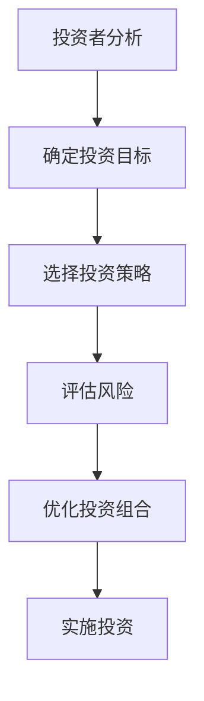
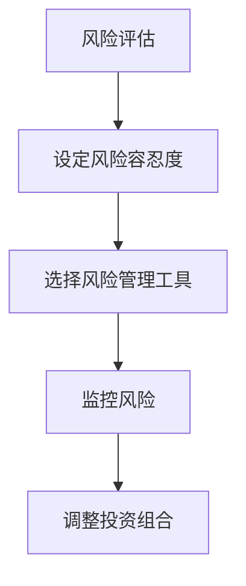
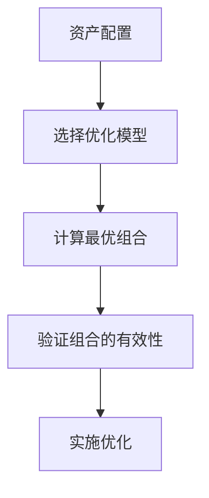
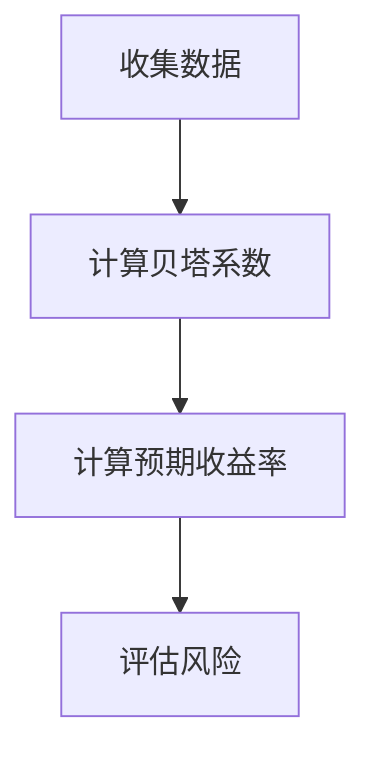
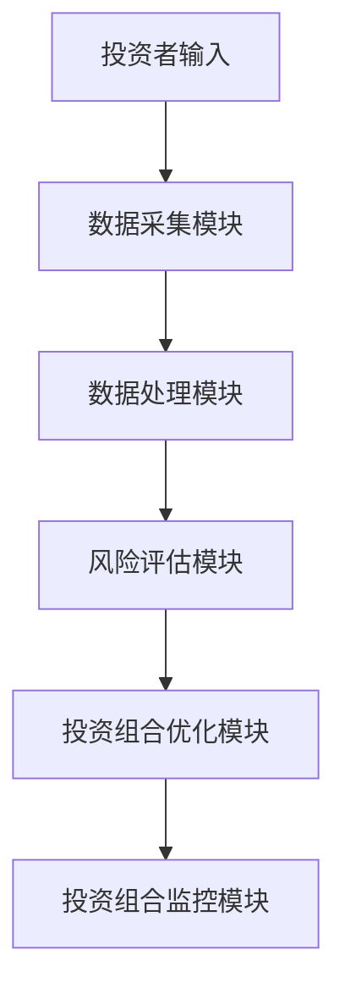
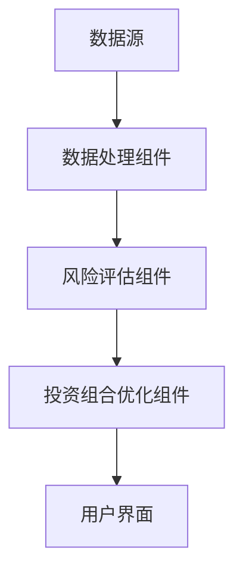
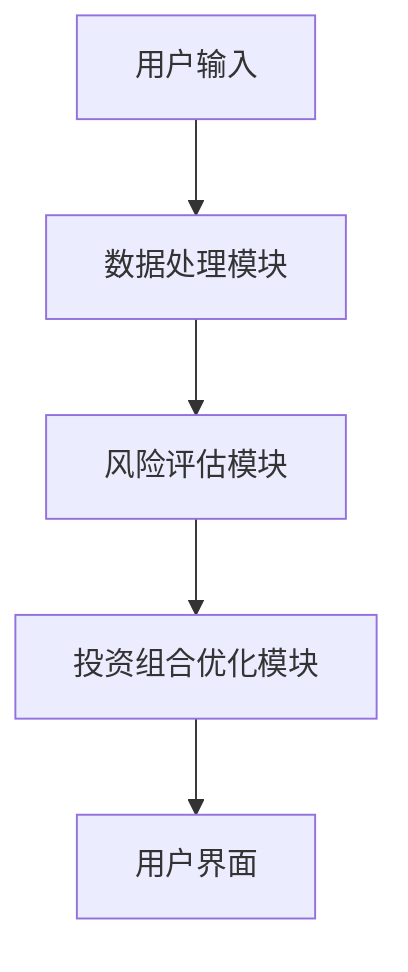

                 


# 特价股票投资中的跨代际投资策略与风险管理

> 关键词：特价股票，跨代际投资，风险管理，投资策略，系统架构

> 摘要：本文探讨了特价股票投资中的跨代际投资策略与风险管理，从背景介绍、核心概念、算法原理、系统架构、项目实战到最佳实践，全面分析了跨代际视角下的投资策略与风险管理方法。文章通过详细分析不同年龄段投资者的行为特征，构建了跨代际投资策略的核心模型，并结合实际案例，提出了基于风险评估和投资组合优化的跨代际投资策略。

---

## 第1章: 特价股票投资与跨代际投资策略概述

### 1.1 特价股票投资的背景与特点

#### 1.1.1 特价股票的定义与特征
特价股票是指市场价格低于其内在价值的股票，通常具有较高的投资回报潜力。其主要特征包括低估值、高分红率和较大的波动性。

#### 1.1.2 特价股票投资的历史发展
特价股票投资起源于价值投资理念，其历史可以追溯到本杰明·格雷厄姆的价值投资理论。随着市场的发展，特价股票投资策略不断完善，形成了多种分析方法和模型。

#### 1.1.3 特价股票投资的市场定位
在当前市场环境下，特价股票投资作为一种逆向投资策略，能够在市场低迷时发现潜在价值，帮助投资者在市场波动中获取超额收益。

### 1.2 跨代际投资策略的核心概念

#### 1.2.1 跨代际投资的定义与内涵
跨代际投资策略是指从不同年龄段投资者的行为特征出发，制定差异化的投资策略。其核心在于结合投资者生命周期的不同阶段，优化投资组合和风险管理。

#### 1.2.2 不同年龄段投资者的行为特征
不同年龄段的投资者在风险偏好、投资目标和投资行为上存在显著差异。例如，年轻投资者更倾向于高风险高回报的投资，而年长投资者更注重稳定性和风险控制。

#### 1.2.3 跨代际投资策略的适用场景
跨代际投资策略适用于长期投资、资产配置和风险管理等领域，尤其在市场波动较大时，能够帮助投资者更好地应对不同生命周期阶段的财务需求。

### 1.3 特价股票投资与跨代际投资的结合

#### 1.3.1 特价股票在跨代际投资中的角色
特价股票作为低估值资产，在跨代际投资中扮演着重要角色，尤其是在市场低迷时为投资者提供价值洼地。

#### 1.3.2 跨代际视角下的投资机会分析
通过跨代际视角，投资者可以更好地识别不同生命周期阶段的资产配置机会，优化投资组合，提高整体收益。

#### 1.3.3 特价股票投资的长期与短期策略
跨代际投资策略将长期投资目标与短期市场波动相结合，帮助投资者在不同生命周期阶段实现资产增值。

### 1.4 本章小结
本章介绍了特价股票投资和跨代际投资策略的基本概念，分析了两者的结合方式，并探讨了其在实际投资中的应用价值。

---

## 第2章: 特价股票投资的核心概念与联系

### 2.1 跨代际投资策略的实体关系分析

#### 2.1.1 投资者实体分析
投资者实体包括不同年龄段的个人和机构投资者，其行为特征和投资需求存在显著差异。

#### 2.1.2 特价股票实体分析
特价股票实体包括低估值股票、高分红股票等，具有较高的投资价值和风险回报比。

#### 2.1.3 投资行为实体分析
投资行为实体包括投资决策、资产配置和风险管理等，是跨代际投资策略的核心组成部分。

### 2.2 跨代际投资策略的ER图架构

#### 2.2.1 ER图的构建
通过构建ER图，可以清晰地展示投资者、特价股票和投资行为之间的关系。

```mermaid
erDiagram
    investor {id, name, age, risk_tier}
    stock {stock_id, stock_name, stock_price, book_value}
    investment_behavior {investment_id, strategy_type, risk_level}
    investor -|> investment_behavior : "采取的投资策略"
    stock -|> investment_behavior : "涉及的股票"
```

#### 2.2.2 实体关系的分析与解释
通过ER图可以清晰地看到，投资者通过投资行为选择特定的股票，形成一个完整的投资系统。

### 2.3 跨代际投资策略的流程图分析

#### 2.3.1 投资决策流程


#### 2.3.2 风险管理流程


#### 2.3.3 投资组合优化流程


### 2.4 本章小结
本章通过实体关系分析和流程图，详细描述了跨代际投资策略的核心概念及其在系统中的联系。

---

## 第3章: 跨代际投资策略的算法原理

### 3.1 风险评估模型

#### 3.1.1 风险评估的定义
风险评估是通过量化潜在损失来衡量投资组合的风险。

#### 3.1.2 风险评估的数学模型
常用的模型包括CAPM和APT模型。

##### CAPM模型
$$ E(R_i) = R_f + \beta_i (R_m - R_f) $$

其中：
- $E(R_i)$ 是资产的预期收益率
- $R_f$ 是无风险利率
- $\beta_i$ 是资产的贝塔系数
- $R_m$ 是市场预期收益率

#### 3.1.3 风险评估的算法流程


### 3.2 投资组合优化算法

#### 3.2.1 投资组合优化的定义
投资组合优化是指通过调整资产配置来最大化收益或最小化风险。

#### 3.2.2 投资组合优化的数学模型
常用模型包括均值-方差优化和最大收益化模型。

##### 均值-方差优化
$$ \text{min} \sigma^2 \quad \text{subject to} \quad \mu \geq \text{target return} $$

##### 最大收益化模型
$$ \text{max} \mu \quad \text{subject to} \quad \sigma^2 \leq \text{risk tolerance} $$

#### 3.2.3 投资组合优化的算法实现
以下是Python实现的示例代码：

```python
import numpy as np
import pandas as pd
from scipy.optimize import minimize

def portfolio_optimization(returns, weights):
    # 定义目标函数
    def objective(weights, returns):
        return -np.mean(returns.dot(weights))
    
    # 定义约束条件
    constraints = [{'type': 'eq', 'fun': lambda w: sum(w) - 1}]
    
    # 优化
    result = minimize(objective, weights, args=returns, constraints=constraints)
    return result.x

# 示例数据
returns = pd.DataFrame({'stock1': [0.1, 0.05, 0.07], 
                        'stock2': [0.08, 0.12, 0.06]})
weights = [0.5, 0.5]

# 优化
optimal_weights = portfolio_optimization(returns, weights)
print(optimal_weights)
```

### 3.3 基于跨代际视角的策略优化

#### 3.3.1 跨代际视角下的策略优化
通过分析不同年龄段投资者的特征，优化投资组合和风险管理策略。

#### 3.3.2 策略优化的数学模型
$$ \text{max} \sum_{i=1}^{n} w_i R_i - \lambda \sum_{i=1}^{n} w_i^2 \sigma_i^2 $$

其中：
- $w_i$ 是第i个资产的权重
- $R_i$ 是第i个资产的预期收益率
- $\sigma_i$ 是第i个资产的波动率
- $\lambda$ 是风险厌恶系数

#### 3.3.3 策略优化的算法实现
```python
def cross generational_strategy(returns, age_groups):
    # 根据年龄段分组
    grouped_returns = returns.groupby(age_groups)
    
    # 优化每个组的权重
    optimal_weights = {}
    for group in grouped_returns:
        w = portfolio_optimization(group.returns, initial_weights)
        optimal_weights[group] = w
    return optimal_weights

# 示例数据
age_groups = ['young', 'middle-aged', 'senior']
returns = pd.DataFrame({'age_group': age_groups * 3,
                        'returns': [0.1, 0.08, 0.05, 0.07, 0.12, 0.06]})
```

### 3.4 本章小结
本章详细讲解了跨代际投资策略的算法原理，包括风险评估和投资组合优化的数学模型及实现方法。

---

## 第4章: 跨代际投资策略的系统分析与架构设计

### 4.1 投资场景介绍

#### 4.1.1 特价股票投资的场景分析
在市场低迷时，特价股票往往被低估，为跨代际投资提供了良好的机会。

#### 4.1.2 跨代际投资策略的应用场景
包括长期投资、资产配置和风险管理等领域。

### 4.2 系统功能设计

#### 4.2.1 系统功能模块划分
- 数据采集与处理
- 风险评估模块
- 投资组合优化模块
- 投资组合监控模块

#### 4.2.2 系统功能模块的交互设计


### 4.3 系统架构设计

#### 4.3.1 系统架构的层次划分
- 数据层
- 业务逻辑层
- 用户界面层

#### 4.3.2 系统架构的组件设计


#### 4.3.3 系统架构的通信设计
- 数据源通过API与数据处理组件通信
- 数据处理组件通过消息队列与风险评估组件通信
- 风险评估组件通过数据库与投资组合优化组件通信

### 4.4 系统接口设计

#### 4.4.1 系统接口的定义
- 数据接口：用于数据采集和处理
- API接口：用于风险评估和投资组合优化

#### 4.4.2 系统接口的实现
```python
from flask import Flask, jsonify
import requests

app = Flask(__name__)

@app.route('/risk_assessment', methods=['POST'])
def risk_assessment():
    data = request.json
    # 处理数据并返回结果
    return jsonify(result)
```

### 4.5 系统交互设计

#### 4.5.1 系统交互的流程图


### 4.6 本章小结
本章详细分析了跨代际投资策略的系统架构设计，包括功能模块划分、接口设计和交互流程。

---

## 第5章: 跨代际投资策略的项目实战

### 5.1 环境安装

#### 5.1.1 Python环境的安装
安装Python和必要的库，如NumPy、Pandas、Scipy和Flask。

#### 5.1.2 数据库安装
安装MySQL或PostgreSQL，用于存储和处理数据。

### 5.2 系统核心实现源代码

#### 5.2.1 数据采集与处理
```python
import pandas as pd

def data_processing(file_path):
    data = pd.read_csv(file_path)
    # 数据清洗和处理
    data.dropna(inplace=True)
    return data

# 示例数据
data = data_processing('stock_data.csv')
print(data.head())
```

#### 5.2.2 风险评估模块
```python
from scipy.optimize import minimize

def risk_assessment(data):
    # 计算贝塔系数
    beta = data.cov().iloc[0,1]
    # 计算预期收益率
    expected_return = data.mean().iloc[0]
    return expected_return, beta

expected_return, beta = risk_assessment(data)
print(f"预期收益率: {expected_return}, 贝塔系数: {beta}")
```

#### 5.2.3 投资组合优化模块
```python
def portfolio_optimization(returns, weights):
    # 定义目标函数
    def objective(weights, returns):
        return -np.mean(returns.dot(weights))
    
    # 定义约束条件
    constraints = [{'type': 'eq', 'fun': lambda w: sum(w) - 1}]
    
    # 优化
    result = minimize(objective, weights, args=returns, constraints=constraints)
    return result.x

# 示例数据
returns = data['returns'].values
weights = [0.5, 0.5]
optimal_weights = portfolio_optimization(returns, weights)
print(optimal_weights)
```

### 5.3 代码应用解读与分析

#### 5.3.1 数据采集与处理
通过读取CSV文件并清洗数据，确保数据的完整性和准确性。

#### 5.3.2 风险评估模块
通过计算贝塔系数和预期收益率，评估投资组合的风险和收益。

#### 5.3.3 投资组合优化模块
通过优化算法，找到最优的资产配置，以实现风险和收益的最佳平衡。

### 5.4 实际案例分析与详细讲解

#### 5.4.1 案例分析
假设我们有两只特价股票，分别来自不同年龄段的投资者。通过优化算法，找到最优的资产配置比例。

#### 5.4.2 详细讲解
通过具体的数据和代码，展示如何在实际中应用跨代际投资策略进行投资组合优化。

### 5.5 本章小结
本章通过具体案例和代码实现，展示了跨代际投资策略在实际项目中的应用。

---

## 第6章: 跨代际投资策略的最佳实践

### 6.1 最佳实践 tips

#### 6.1.1 投资者行为分析
定期分析不同年龄段投资者的行为特征，优化投资策略。

#### 6.1.2 风险管理
根据投资者的生命周期阶段，动态调整风险容忍度。

#### 6.1.3 资产配置
根据市场环境和投资者需求，灵活调整资产配置比例。

### 6.2 小结
跨代际投资策略的优势在于能够根据不同生命周期阶段的需求，制定差异化的投资策略。

### 6.3 注意事项

#### 6.3.1 市场风险
市场波动可能会影响投资组合的收益和风险。

#### 6.3.2 投资者行为
不同年龄段投资者的行为特征可能会影响策略的有效性。

#### 6.3.3 模型假设
模型的假设可能与实际情况存在差异，需要根据实际情况进行调整。

### 6.4 拓展阅读
建议读者深入研究价值投资、风险管理等领域，以进一步完善跨代际投资策略。

---

## 作者：AI天才研究院/AI Genius Institute & 禅与计算机程序设计艺术 /Zen And The Art of Computer Programming

---

以上是《特价股票投资中的跨代际投资策略与风险管理》的完整目录和内容概览。接下来是具体的章节内容，每章都会详细展开，涵盖背景介绍、核心概念、算法原理、系统架构、项目实战和最佳实践等方面，帮助读者全面理解跨代际投资策略的核心思想和实际应用。

