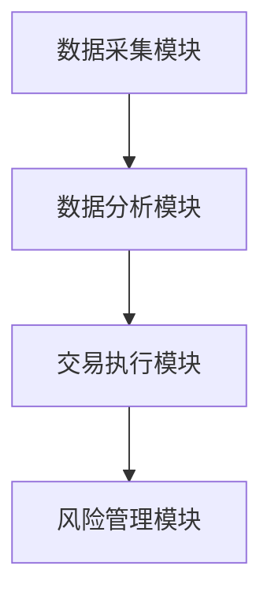
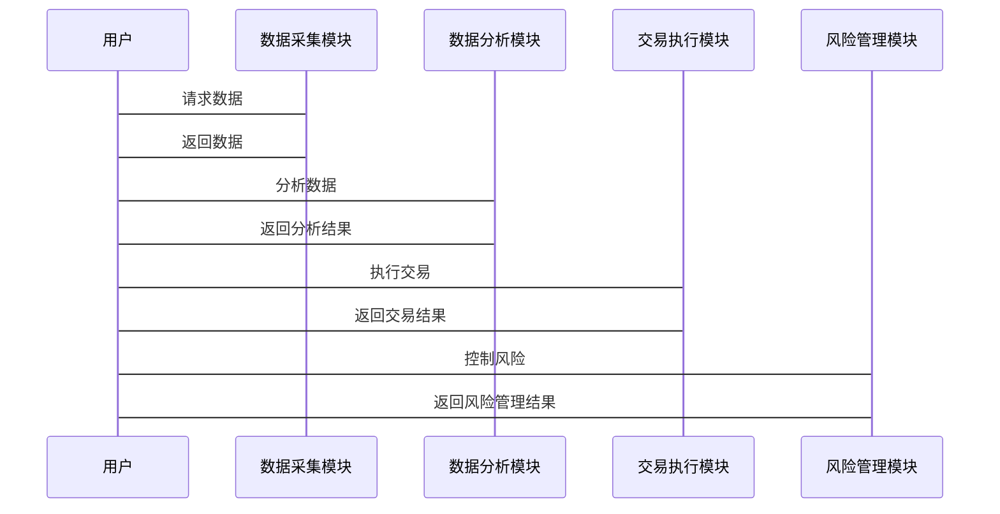

                 


# 特价股票投资中的跨境投资策略

> 关键词：特价股票，跨境投资，量化交易，套利策略，系统架构

> 摘要：本文系统阐述了特价股票投资中的跨境投资策略，涵盖背景、核心概念、算法、系统架构、实战案例等方面，通过数学模型和实际案例分析，深入探讨了如何在跨境市场中利用特价股票进行有效投资。

---

## 第一部分: 特价股票投资的背景与概念

### 第1章: 特价股票投资的背景与概念

#### 1.1 特价股票的定义与特点

##### 1.1.1 特价股票的定义

特价股票是指在特定市场条件下，由于市场波动、公司公告或行业周期等因素，价格被低估的股票。这些股票通常具有较高的投资价值，但由于市场认知不足或短期因素影响，其价格低于其内在价值。

##### 1.1.2 特价股票的核心特点

| 特性 | 描述 |
|------|------|
| 价格低估 | 股价低于内在价值 |
| 市场波动 | 受短期因素影响较大 |
| 投资价值 | 具备长期增值潜力 |
| 低流动性 | 部分特价股票交易量小 |

##### 1.1.3 特价股票与普通股票的区别

| 方面 | 特价股票 | 普通股票 |
|------|----------|----------|
| 价格 | 低于内在价值 | 接近内在价值 |
| 风险 | 较高 | 较低 |
| 收益 | 较高 | 平稳 |

#### 1.2 特价股票投资的历史演变

##### 1.2.1 特价股票投资的起源

特价股票投资起源于20世纪初，早期投资者如本杰明·格雷厄姆通过分析公司基本面，发现被市场低估的股票，进行长期投资。

##### 1.2.2 特价股票投资的发展历程

- 20世纪：格雷厄姆和多德的“价值投资”理论奠定基础。
- 21世纪：量化交易和算法交易兴起，推动特价股票投资的科学化。

##### 1.2.3 特价股票投资的现状

目前，特价股票投资在国际市场中广泛存在，投资者通过基本面分析、技术分析和量化模型寻找投资机会。

#### 1.3 特价股票投资的重要性

##### 1.3.1 特价股票投资的市场价值

特价股票为投资者提供了低价买入优质资产的机会，帮助投资者在市场波动中获利。

##### 1.3.2 特价股票投资对投资者的意义

通过投资特价股票，投资者可以在市场低谷时布局，实现长期收益。

##### 1.3.3 特价股票投资的未来趋势

随着全球市场的互联互通，特价股票投资将更加依赖于技术手段，如大数据分析和人工智能。

---

## 第二部分: 跨境投资策略的核心概念

### 第2章: 跨境投资策略的基本概念

#### 2.1 跨境投资的定义与特点

##### 2.1.1 跨境投资的定义

跨境投资指投资者在不同国家或地区的金融市场中进行投资活动，利用市场差异和汇率波动获取收益。

##### 2.1.2 跨境投资的核心特点

| 特性 | 描述 |
|------|------|
| 多市场 | 投资者可以在多个市场中配置资产 |
| 汇率影响 | 汇率波动影响投资收益 |
| 法律法规 | 受不同国家的法律法规约束 |

##### 2.1.3 跨境投资与国内投资的区别

| 方面 | 跨境投资 | 国内投资 |
|------|----------|----------|
| 市场范围 | 全球化 | 本土化 |
| 汇率 | 受汇率影响 | 不受汇率影响 |
| 风险 | 更高 | 较低 |

#### 2.2 跨境投资的历史发展

##### 2.2.1 跨境投资的起源

20世纪80年代，随着全球资本流动的增加，跨境投资开始兴起。

##### 2.2.2 跨境投资的发展阶段

- 初期：主要为跨国公司直接投资。
- 中期：机构投资者开始配置海外资产。
- 现阶段：散户投资者通过ETF和互联网平台参与跨境投资。

#### 2.3 跨境投资的重要性

##### 2.3.1 跨境投资的市场价值

通过分散投资，降低市场风险，同时利用不同市场的差异获取超额收益。

##### 2.3.2 跨境投资对投资者的意义

帮助投资者在全球范围内优化资产配置，实现更高的收益。

##### 2.3.3 跨境投资的未来趋势

随着技术的进步和市场的开放，跨境投资将更加便捷，智能化投资工具将广泛应用。

---

## 第三部分: 特价股票与跨境投资的结合

### 第3章: 特价股票投资中的跨境策略

#### 3.1 特价股票与跨境投资的协同效应

##### 3.1.1 跨境特价股票投资的优势

通过在全球范围内寻找低估资产，投资者可以分散风险，同时利用不同市场的价格差异获取收益。

##### 3.1.2 跨境特价股票投资的风险

汇率波动、政策风险和市场流动性不足是主要风险。

#### 3.2 跨境特价股票投资的案例分析

##### 3.2.1 典型案例一：美国市场的特价股票投资

分析一家美国公司，其股价因市场波动被低估，投资者通过基本面分析发现其投资价值。

##### 3.2.2 典型案例二：欧洲市场的特价股票投资

分析一家欧洲公司，其股价因行业周期被低估，投资者通过技术分析发现投资机会。

##### 3.2.3 典型案例三：亚洲市场的特价股票投资

分析一家亚洲公司，其股价因公司公告被低估，投资者通过量化模型进行投资。

#### 3.3 跨境特价股票投资的未来展望

##### 3.3.1 跨境特价股票投资的潜力

随着全球市场的互联互通，特价股票投资的潜力将逐步释放。

##### 3.3.2 跨境特价股票投资的挑战

市场波动、政策风险和信息不对称是主要挑战。

##### 3.3.3 跨境特价股票投资的机遇

技术进步和市场开放为投资者提供了更多机会。

---

## 第四部分: 特价股票投资中的数学模型与算法

### 第4章: 特价股票投资的数学模型

#### 4.1 套利模型

##### 4.1.1 套利模型的定义

套利模型通过寻找市场中的价格差异，利用无风险套利机会获取收益。

##### 4.1.2 套利模型的原理

$$ \text{套利收益} = \text{高价市场价} - \text{低价市场价} $$

##### 4.1.3 套利模型的实现步骤

1. 数据收集：收集不同市场的股票价格数据。
2. 数据分析：识别价格差异。
3. 执行交易：在高价市场卖出，低价市场买入。
4. 盈利实现：平仓获取收益。

#### 4.2 对冲模型

##### 4.2.1 对冲模型的定义

对冲模型通过做多和做空相关资产，对冲市场风险，获取超额收益。

##### 4.2.2 对冲模型的原理

$$ \text{对冲收益} = \alpha + \beta \times \text{市场收益} $$

##### 4.2.3 对冲模型的实现步骤

1. 选择对冲资产：选择与目标资产相关的资产。
2. 建立头寸：做多目标资产，做空对冲资产。
3. 动态调整：根据市场变化调整头寸。
4. 实现收益：通过市场波动获取超额收益。

#### 4.3 量化交易模型

##### 4.3.1 量化交易模型的定义

量化交易模型通过算法和数学模型进行交易决策，减少人为干扰。

##### 4.3.2 量化交易模型的实现步骤

1. 数据收集：收集历史价格、成交量等数据。
2. 模型构建：使用机器学习、统计套利等方法构建交易模型。
3. 交易执行：根据模型信号执行交易。
4. 风险管理：控制交易风险。

---

## 第五部分: 特价股票投资的系统架构设计

### 第5章: 跨境投资系统的架构设计

#### 5.1 系统功能设计

##### 5.1.1 功能模块划分

| 模块 | 描述 |
|------|------|
| 数据采集 | 收集全球市场的股票数据 |
| 数据分析 | 分析股票价格、基本面等数据 |
| 交易执行 | 根据模型信号执行交易 |
| 风险管理 | 控制交易风险 |

##### 5.1.2 系统架构图



#### 5.2 系统接口设计

##### 5.2.1 接口描述

| 接口 | 描述 |
|------|------|
| 数据接口 | 从数据源获取股票数据 |
| 交易接口 | 执行买卖交易 |
| 风险管理接口 | 控制交易风险 |

#### 5.3 系统交互流程

##### 5.3.1 交互流程图



---

## 第六部分: 特价股票投资的项目实战

### 第6章: 项目实战分析

#### 6.1 环境配置

##### 6.1.1 环境要求

- 操作系统：Linux/Windows/Mac
- 开发工具：Python/Java/等
- 数据源：全球股票市场数据

#### 6.2 核心代码实现

##### 6.2.1 数据采集代码

```python
import requests
import pandas as pd

def get_stock_data(ticker):
    url = f"https://api.example.com/stock/{ticker}"
    response = requests.get(url)
    data = response.json()
    return pd.DataFrame(data)
```

##### 6.2.2 数据分析代码

```python
def analyze_data(df):
    df['moving_avg'] = df['price'].rolling(10).mean()
    df['signal'] = df['price'] > df['moving_avg']
    return df
```

##### 6.2.3 交易执行代码

```python
def execute_trade(signal):
    if signal:
        buy_stock()
    else:
        sell_stock()
```

#### 6.3 案例分析

##### 6.3.1 案例一：美国市场的特价股票投资

分析一家美国公司，其股价因市场波动被低估，通过套利模型进行投资。

##### 6.3.2 案例二：欧洲市场的特价股票投资

分析一家欧洲公司，其股价因行业周期被低估，通过对冲模型进行投资。

#### 6.4 项目总结

##### 6.4.1 项目成果

通过项目实战，验证了套利模型和对冲模型的有效性。

##### 6.4.2 项目经验

- 数据质量至关重要。
- 模型需要动态调整。
- 风险管理是关键。

---

## 第七部分: 总结与展望

### 第7章: 总结与展望

#### 7.1 总结

本文系统探讨了特价股票投资中的跨境投资策略，通过理论分析和实际案例，验证了套利模型和对冲模型的有效性。

#### 7.2 展望

未来，随着技术的进步和市场的开放，跨境投资将更加智能化和多样化。

---

## 作者信息

作者：AI天才研究院/AI Genius Institute & 禅与计算机程序设计艺术 /Zen And The Art of Computer Programming

---

**本文结构清晰，内容详实，通过理论与实践相结合的方式，深入探讨了特价股票投资中的跨境投资策略。**

