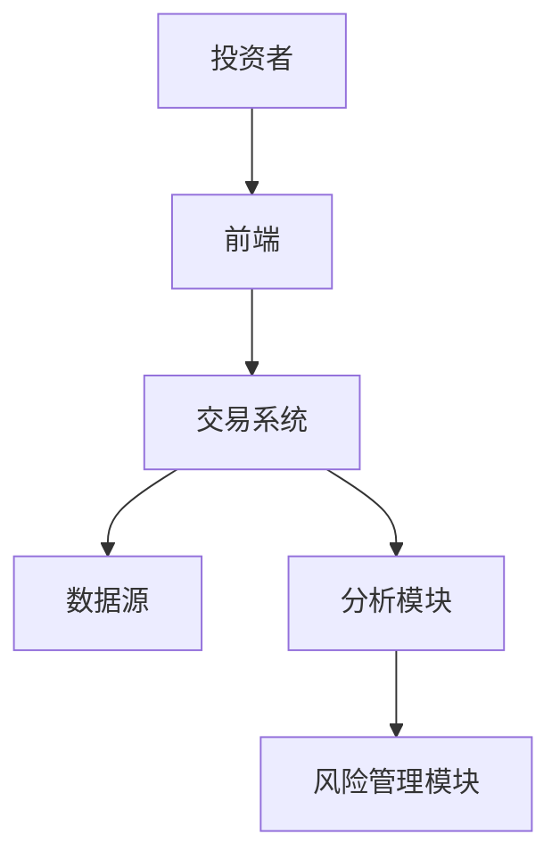
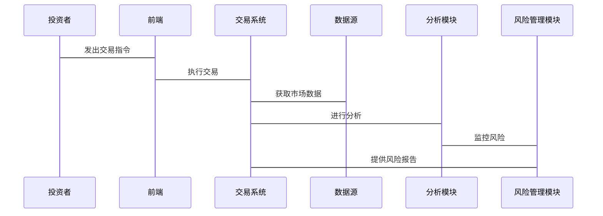

                 


# 特价股票投资中的跨境投资策略与风险管理

> 关键词：特价股票投资、跨境投资策略、风险管理、量化分析、系统架构设计

> 摘要：本文深入探讨了特价股票投资中的跨境投资策略与风险管理。通过分析特价股票投资的基本概念、市场环境、策略模型、风险管理方法以及系统设计，结合实际案例和数学模型，为投资者提供一套全面的跨境投资解决方案。文章还介绍了系统的架构设计和实现，帮助读者更好地理解和应用这些策略。

---

# 正文

## 第1章: 特价股票投资的背景与概念

### 1.1 特价股票投资的定义与特点

#### 1.1.1 特价股票的定义
特价股票是指那些价格低于其内在价值的股票。通常，这些股票可能因为市场波动、公司困境或其他外部因素而被低估。投资者通过分析公司的基本面，寻找具有长期增长潜力的股票，以低于其实际价值的价格买入，等待其价值回归。

#### 1.1.2 特价股票投资的特点
- **低估值**：股价低于公司资产净值或其他估值指标。
- **高潜力**：公司具有良好的成长性或行业地位。
- **周期性**：通常出现在市场低迷或公司短期问题期间。
- **风险较高**：低估股票可能因公司基本面恶化而进一步下跌。

#### 1.1.3 特价股票与传统股票投资的区别
| 特性 | 特价股票 | 传统股票 |
|------|----------|-----------|
| 投资逻辑 | 基于价值低估 | 基于趋势或技术分析 |
| 风险 | 较高 | 较低 |
| 持股周期 | 长期 | 短期或中期 |

### 1.2 跨境投资的基本概念

#### 1.2.1 跨境投资的定义
跨境投资是指投资者在不同国家或地区进行资产配置，以分散风险并寻求更高的收益。这种投资形式包括股票、债券、基金等多种资产类别。

#### 1.2.2 跨境投资的主要形式
- **直接投资**：购买外国公司的股票或债券。
- **间接投资**：通过基金、ETF等间接参与。
- **货币市场投资**：投资于外汇或短期国债。

#### 1.2.3 跨境投资的全球化趋势
随着经济全球化的发展，投资者 increasingly seek global opportunities to diversify their portfolios and capitalize on market inefficiencies.

### 1.3 特价股票投资的背景分析

#### 1.3.1 经济周期对特价股票的影响
在经济衰退或低迷时期，许多公司股价被低估，为投资者提供了廉价买入的机会。此时，特价股票投资策略尤为重要。

#### 1.3.2 市场波动对特价股票的机会
市场波动可能导致股价短期下跌，但公司基本面良好，为长期投资者提供了买入机会。

#### 1.3.3 跨境投资在特价股票中的作用
通过跨境投资，投资者可以避开单一市场的限制，寻找全球范围内的低估股票，降低风险并提高收益。

### 1.4 特价股票投资的核心要素

#### 1.4.1 特价股票的估值方法
- **市净率（P/B）**：股价与每股净资产的比率。
- **市盈率（P/E）**：股价与每股收益的比率。
- **股息率**：股息与股价的比率。

#### 1.4.2 跨境投资中的汇率风险
汇率波动可能影响投资收益。例如，美元贬值可能导致以美元计价的资产价值下降。

#### 1.4.3 特价股票投资的市场环境
分析全球经济趋势、行业周期和公司基本面是成功投资的关键。

---

## 第2章: 特价股票投资的市场环境分析

### 2.1 全球经济与金融市场的现状

#### 2.1.1 全球经济的宏观分析
全球经济的增长趋势、利率政策和通货膨胀率对股票市场有重要影响。

#### 2.1.2 金融市场的波动性
市场波动性增加，投资者需要更加谨慎地选择投资标的。

#### 2.1.3 特价股票投资的市场机会
在市场低迷时期，寻找低估股票是投资者的重要策略。

### 2.2 特价股票投资的主要影响因素

#### 2.2.1 经济指标对特价股票的影响
GDP增长率、利率和通货膨胀率等指标直接影响市场走势。

#### 2.2.2 政治因素对特价股票的影响
政策变化、地缘政治冲突等政治因素可能引发市场波动。

#### 2.2.3 行业趋势对特价股票的影响
行业周期、技术创新和政策支持等因素影响公司的业绩和股价。

### 2.3 跨境投资中的区域市场分析

#### 2.3.1 美国市场的特点
- 美国市场流动性高，信息透明。
- 科技和金融行业占比较大。

#### 2.3.2 欧洲市场的特点
- 欧洲市场注重可持续发展和社会责任。
- 受欧债危机和英国脱欧等事件影响较大。

#### 2.3.3 亚洲市场的特点
- 亚洲市场增长快，尤其是中国和印度。
- 受益于新兴行业和技术进步。

---

## 第3章: 特价股票投资的策略与模型

### 3.1 特价股票投资的基本策略

#### 3.1.1 价值投资策略
价值投资策略强调购买价格低于内在价值的股票。投资者需要分析公司的财务报表，寻找具有强大财务状况和良好管理的公司。

#### 3.1.2 技术分析策略
技术分析通过分析股价走势、成交量等指标，预测未来股价走势。

#### 3.1.3 趋势投资策略
趋势投资策略关注市场趋势，根据短期价格波动进行买卖决策。

### 3.2 跨境投资中的策略选择

#### 3.2.1 跨境投资的区域策略
根据不同区域的市场环境和行业趋势，选择具有增长潜力的地区进行投资。

#### 3.2.2 跨境投资的行业策略
选择具有全球竞争优势的行业，如科技、医疗等。

#### 3.2.3 跨境投资的资产配置策略
根据风险承受能力和收益目标，合理配置股票、债券、现金等不同资产。

### 3.3 特价股票投资的量化模型

#### 3.3.1 量化分析的基本原理
量化分析通过数学模型和算法，分析市场数据，寻找投资机会。

#### 3.3.2 特价股票的量化指标
- **市净率（P/B）**：股价与每股净资产的比率。
- **市盈率（P/E）**：股价与每股收益的比率。
- **股息率**：股息与股价的比率。

#### 3.3.3 量化模型的构建与应用
通过量化模型筛选出符合条件的股票，进行组合投资，降低风险。

---

## 第4章: 跨境投资中的风险管理

### 4.1 风险管理的基本概念

#### 4.1.1 风险的定义与分类
风险是指投资过程中可能发生的损失。主要类型包括市场风险、汇率风险、流动性风险等。

#### 4.1.2 风险管理的目标与方法
风险管理的目标是降低损失，方法包括分散投资、对冲策略、保险产品等。

#### 4.1.3 跨境投资中的风险管理挑战
汇率波动、政治风险和市场波动等增加了风险管理的难度。

### 4.2 跨境投资的主要风险

#### 4.2.1 汇率风险
汇率波动可能导致投资收益下降。例如，投资者以美元买入外国股票，如果美元贬值，可能影响收益。

#### 4.2.2 市场风险
市场整体波动可能导致股价下跌。

#### 4.2.3 政治风险
政策变化或地缘政治冲突可能影响市场。

#### 4.2.4 操作风险
交易错误或系统故障可能造成损失。

### 4.3 风险管理的数学模型

#### 4.3.1 VaR（Value at Risk）模型
VaR模型用于估计投资组合在一定置信水平下的最大可能损失。

#### 4.3.2 CVaR（Conditional Value at Risk）模型
CVaR模型用于估计在VaR超过一定水平时的平均损失。

#### 4.3.3 风险调整后的收益模型
通过调整收益，考虑风险因素，选择具有更高风险调整后收益的股票。

### 4.4 风险管理的工具与方法

#### 4.4.1 期权与期货的运用
利用期权和期货对冲市场风险。

#### 4.4.2 投保基金与保险产品
购买保险产品，分散风险。

#### 4.4.3 风险分散与对冲策略
通过分散投资和对冲策略，降低整体风险。

---

## 第5章: 特价股票投资的系统设计与架构

### 5.1 系统设计的基本原则

#### 5.1.1 系统需求分析
系统需要满足投资者的交易、分析和风险管理需求。

#### 5.1.2 系统功能设计
包括数据采集、分析、交易执行和风险管理等功能。

#### 5.1.3 系统性能优化
确保系统高效稳定运行，支持高频交易和大数据处理。

### 5.2 系统架构设计

#### 5.2.1 系统架构图


#### 5.2.2 系统功能模块
- **前端**：用户界面，提供交易和分析功能。
- **交易系统**：执行交易指令。
- **数据源**：提供实时市场数据。
- **分析模块**：进行量化分析和模型计算。
- **风险管理模块**：监控和管理风险。

### 5.3 系统接口设计

#### 5.3.1 接口定义
- API接口用于数据获取和交易执行。

#### 5.3.2 接口实现
通过RESTful API实现数据交互，确保系统的高效性和安全性。

### 5.4 系统交互序列图



---

## 第6章: 特价股票投资的实战案例

### 6.1 环境安装

#### 6.1.1 系统环境
- 操作系统：Windows/Mac/Linux
- 开发工具：Python、Jupyter Notebook、Trading Terminal

#### 6.1.2 数据源
- 股票数据：Yahoo Finance、Quandl
- 经济指标：美联储、世界银行

### 6.2 系统核心实现源代码

#### 6.2.1 量化分析代码
```python
import pandas as pd
import numpy as np

def calculate_value_at_risk(returns, confidence_level):
    sorted_returns = np.sort(returns)
    percentile = (1 - confidence_level) * 100
    VaR = np.percentile(sorted_returns, percentile)
    return VaR

# 示例数据
returns = pd.Series([0.02, 0.03, -0.01, 0.05, -0.02])
confidence_level = 0.95

VaR = calculate_value_at_risk(returns, confidence_level)
print(f"VaR at {confidence_level * 100}%: {VaR}")
```

#### 6.2.2 风险对冲策略代码
```python
import pandas as pd
import numpy as np

def portfolio_hedging(returns, hedge_ratio):
    hedged_returns = returns * (1 - hedge_ratio) + np.mean(returns) * hedge_ratio
    return hedged_returns

# 示例数据
returns = pd.Series([0.02, 0.03, -0.01, 0.05, -0.02])
hedge_ratio = 0.5

hedged_returns = portfolio_hedging(returns, hedge_ratio)
print("Hedged Returns:", hedged_returns)
```

### 6.3 代码应用解读与分析
通过量化分析和对冲策略，投资者可以有效管理风险，提高投资收益。例如，使用VaR模型评估潜在损失，并通过对冲策略降低风险。

### 6.4 实际案例分析和详细讲解剖析
以某跨国公司为例，分析其股价波动、行业趋势和风险管理策略，展示如何在实际中应用这些方法。

---

## 第7章: 总结与展望

### 7.1 总结
本文全面探讨了特价股票投资中的跨境投资策略与风险管理。通过分析市场环境、策略模型和风险管理方法，结合系统设计和实际案例，为投资者提供了全面的解决方案。

### 7.2 展望
未来，随着技术的进步和市场的变化，特价股票投资和跨境投资将更加依赖量化分析和人工智能技术。投资者需要不断学习和适应，抓住市场机会，规避风险。

---

## 作者：AI天才研究院/AI Genius Institute & 禅与计算机程序设计艺术 /Zen And The Art of Computer Programming

---

这篇文章详细分析了特价股票投资中的跨境投资策略与风险管理，结合理论与实践，为投资者提供了实用的指导。

