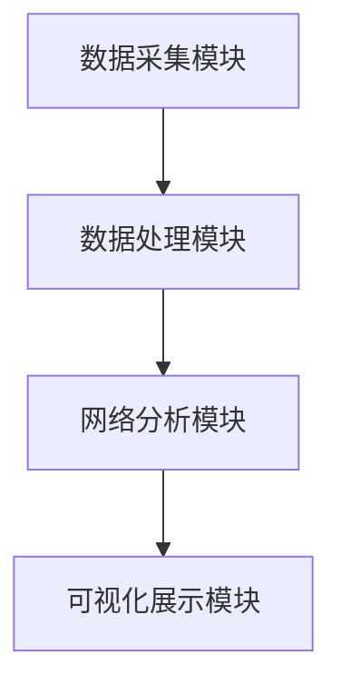
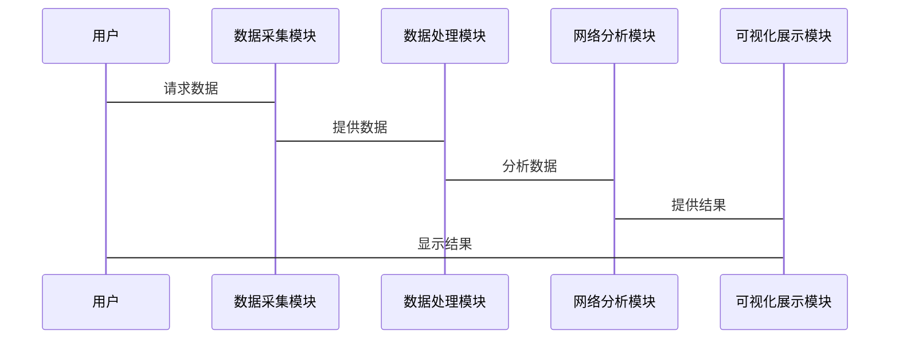

                 


# 特价股票投资中的跨境数据流动与数字资产价值网络拓扑评估策略

> **关键词**：特价股票投资、跨境数据流动、数字资产、网络拓扑、价值评估

> **摘要**：本文探讨了在特价股票投资中，如何利用跨境数据流动与数字资产价值网络拓扑评估策略进行投资决策优化。文章详细分析了特价股票投资的基本原理、跨境数据流动的挑战、数字资产价值网络拓扑的构建方法，并通过具体案例展示了算法原理和系统架构设计。最后，文章总结了最佳实践和注意事项，为投资者提供了有价值的参考。

---

## 第1章：特价股票投资概述

### 1.1 特价股票的定义与特点

#### 1.1.1 特价股票的定义
特价股票通常指价格低于市场平均水平的股票，或具有特殊投资价值的股票。这类股票可能因市场波动、公司基本面变化或投资者情绪影响而被低估，为投资者提供了潜在的获利机会。

#### 1.1.2 特价股票的投资价值
特价股票的投资价值体现在其低买高卖的潜力。投资者通过分析市场趋势、公司财务状况和行业前景，可以在低价时买入，高价时卖出，实现收益。

#### 1.1.3 特价股票与普通股票的区别
| 属性       | 特价股票                   | 普通股票                   |
|------------|----------------------------|-----------------------------|
| 价格       | 低于市场平均水平           | 市场平均水平或较高           |
| 投资策略   | 寻找被低估的机会           | 稳定收益或长期增长           |
| 风险       | 较高（波动性大）           | 较低（相对稳定）             |

### 1.2 股票投资的基本原理

#### 1.2.1 股票市场的基本运作机制
股票市场是企业融资和投资者投资的重要场所。投资者通过购买股票成为公司的部分所有者，股票价格受供求关系、公司业绩和宏观经济因素影响。

#### 1.2.2 投资者行为分析
投资者行为受理性分析和情绪影响。理性投资者基于基本面分析做出决策，而情绪化投资者可能因市场波动而做出非理性决策。

#### 1.2.3 股票价格波动的影响因素
股票价格受多种因素影响，包括宏观经济环境、公司业绩、行业趋势、政策变化和市场情绪等。

---

## 第2章：跨境数据流动的背景与挑战

### 2.1 跨境数据流动的定义与现状

#### 2.1.1 跨境数据流动的定义
跨境数据流动指数据在不同国家或地区之间的传输，涉及数据的收集、存储和处理。

#### 2.1.2 当前跨境数据流动的主要趋势
随着全球化和数字化的发展，跨境数据流动日益频繁，尤其是在金融、电子商务和通信领域。

#### 2.1.3 跨境数据流动的关键技术
- 数据加密技术
- 数据传输协议（如HTTPS）
- 数据存储技术

### 2.2 数据流动中的法律与合规问题

#### 2.2.1 数据隐私保护的国际法规
- 《通用数据保护条例》（GDPR）：欧盟的数据保护法规
- 《加州消费者隐私法》（CCPA）：美国加州的数据保护法规

#### 2.2.2 跨境数据流动的合规要求
- 数据存储地的选择
- 数据处理者的资质要求
- 数据传输的合法性

#### 2.2.3 数据流动中的技术挑战
- 数据加密与解密
- 跨境数据传输的延迟
- 数据安全防护

---

## 第3章：数字资产的价值网络拓扑

### 3.1 数字资产的基本概念

#### 3.1.1 数字资产的定义与分类
数字资产包括比特币、以太坊等加密货币，以及NFT（非同质化代币）和其他代币。

#### 3.1.2 数字资产的主要类型
- 加密货币：比特币、以太坊
- NFT：数字艺术品、收藏品
- 代币：平台币、积分币

#### 3.1.3 数字资产的特性与优势
- 去中心化
- 不可篡改
- 全球流通

### 3.2 数字资产价值网络的构建

#### 3.2.1 数字资产价值网络的定义
数字资产价值网络是一个由数字资产组成的网络，通过拓扑结构反映其价值关联。

#### 3.2.2 网络拓扑结构的构建方法
- 数据收集：收集数字资产的价格、交易量等数据
- 数据分析：构建节点和边的关系
- 拓扑可视化：使用图论方法进行网络分析

#### 3.2.3 网络拓扑与数字资产价值的关系
通过分析网络拓扑，可以识别高价值资产和低价值资产，为投资决策提供依据。

---

## 第4章：跨境数据流动分析算法

### 4.1 数据流动分析的基本原理

#### 4.1.1 数据流动分析的步骤
- 数据收集
- 数据清洗
- 数据分析
- 数据可视化

#### 4.1.2 数据流动分析的算法选择
- 基于图论的网络分析算法
- 时间序列分析算法

### 4.2 数据流动分析的数学模型

#### 4.2.1 数据流动网络模型
- 节点表示：数字资产
- 边表示：资产之间的关联性

#### 4.2.2 网络拓扑特征
- 度数：节点的连接数量
- 中间性：节点在网络中的重要性

### 4.3 算法实现

#### 4.3.1 算法步骤
1. 数据收集：获取数字资产的价格和交易数据
2. 数据预处理：清洗数据，去除异常值
3. 网络构建：基于相关性构建网络拓扑
4. 拓扑分析：计算节点的度数和中间性

#### 4.3.2 代码实现
```python
import networkx as nx
import pandas as pd

# 数据收集
data = pd.read_csv('digital_assets.csv')

# 数据预处理
data_clean = data.dropna()

# 网络构建
correlation_matrix = data_clean.corr()
network = nx.Graph()
for i in range(len(correlation_matrix)):
    for j in range(i+1, len(correlation_matrix)):
        if correlation_matrix.iloc[i,j] > 0.5:
            network.add_edge(i, j)

# 拓扑分析
degrees = nx.degree(network)
centrality = nx.betweenness_centrality(network)
```

---

## 第5章：数字资产价值网络拓扑评估策略

### 5.1 数字资产价值评估的基本原理

#### 5.1.1 数字资产价值评估的方法
- 市值法
- 流动性分析
- 技术指标分析

### 5.2 数字资产价值网络的评估策略

#### 5.2.1 网络拓扑特征与价值评估
- 中心性高的节点具有更高的价值
- 网络密度反映整体价值关联性

#### 5.2.2 价值评估模型
$$ Value = \alpha \cdot Degree + \beta \cdot Centrality $$

---

## 第6章：系统架构设计与实现

### 6.1 问题场景介绍

#### 6.1.1 问题背景
如何构建一个实时监控数字资产价值网络的系统。

### 6.1.2 系统功能需求
- 数据采集模块
- 数据处理模块
- 网络分析模块
- 可视化展示模块

### 6.2 系统架构设计

#### 6.2.1 系统架构图


### 6.3 系统接口设计

#### 6.3.1 数据接口
- 数据来源：API接口
- 数据格式：JSON格式

### 6.4 系统交互设计

#### 6.4.1 交互流程图


---

## 第7章：项目实战与案例分析

### 7.1 项目环境安装

#### 7.1.1 安装依赖
- Python 3.8+
- networkx、pandas、numpy

### 7.2 核心实现代码

#### 7.2.1 数据采集代码
```python
import requests

def get_data(api_url):
    response = requests.get(api_url)
    return response.json()
```

#### 7.2.2 网络分析代码
```python
def analyze_network(data):
    G = nx.Graph()
    nodes = list(data.keys())
    for i in nodes:
        for j in nodes[i]:
            G.add_edge(i, j)
    return G
```

### 7.3 案例分析

#### 7.3.1 案例背景
分析某数字资产网络的拓扑结构，识别高价值资产。

#### 7.3.2 分析结果
- 高度中心化的网络结构
- 某些节点具有较高的中心性

### 7.4 代码实现与解读

#### 7.4.1 代码解读
- 数据采集模块：从API获取数据
- 数据处理模块：清洗和转换数据
- 网络分析模块：构建网络拓扑并计算中心性
- 可视化展示模块：展示分析结果

---

## 第8章：最佳实践与小结

### 8.1 最佳实践

#### 8.1.1 数据隐私保护
- 使用加密技术
- 遵守相关法律法规

#### 8.1.2 系统优化
- 提高数据处理效率
- 优化网络分析算法

### 8.2 小结

本文通过分析特价股票投资中的跨境数据流动与数字资产价值网络拓扑评估策略，提出了有效的投资决策方法。通过网络拓扑分析，投资者可以更好地识别高价值资产，优化投资组合。

---

## 作者：AI天才研究院 & 禅与计算机程序设计艺术

本文作者是AI天才研究院，专注于人工智能与计算机程序设计的研究与实践，致力于为读者提供高质量的技术内容和创新见解。

