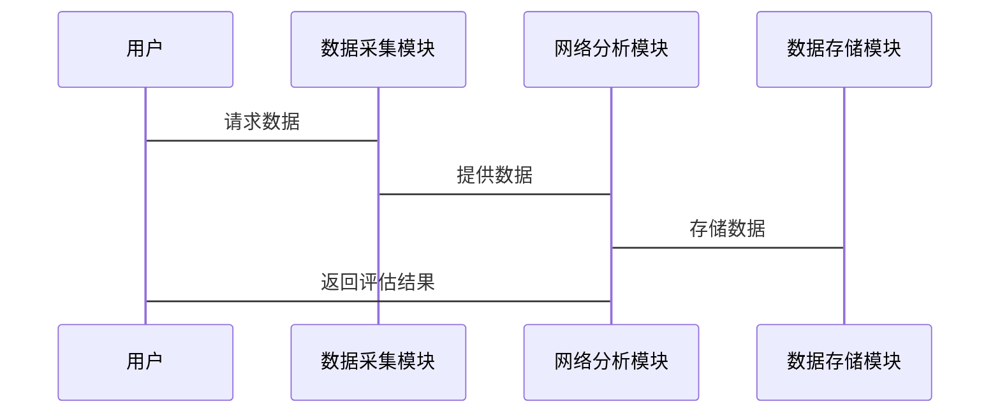

                 


# 特价股票投资中的跨境数据流动与数字资产价值网络评估策略

> **关键词**：特价股票投资、跨境数据流动、数字资产、价值网络评估、数据安全与隐私保护

> **摘要**：本文深入探讨了特价股票投资中的跨境数据流动与数字资产价值网络评估策略。通过对数字资产价值网络的核心概念、算法原理、系统架构设计以及项目实战的详细分析，结合实际案例和最佳实践，为投资者和相关从业者提供了系统的解决方案和指导。

---

## 第一部分: 特价股票投资中的跨境数据流动与数字资产价值网络评估背景

### 第1章: 特价股票投资的背景与挑战

#### 1.1 特价股票投资的定义与特点
- **1.1.1 特价股票的定义**
  特价股票是指在特定市场环境下，由于市场波动、公司基本面变化或其他因素导致股价低于其内在价值的股票。这类股票通常被视为具有长期增值潜力的投资标的。
- **1.1.2 特价股票投资的核心特点**
  - 市场波动性高，但潜在回报大。
  - 投资者需要具备较强的技术分析和基本面分析能力。
  - 需要关注宏观经济环境、行业趋势和公司财务状况。
- **1.1.3 特价股票投资的市场定位**
  特价股票投资在资本市场中属于中高风险投资策略，适合有一定投资经验的个人或机构投资者。

#### 1.2 跨境数据流动的背景与挑战
- **1.2.1 跨境数据流动的定义**
  跨境数据流动是指数据在不同国家或地区之间的传输，涉及技术、法律和隐私等多个层面。
- **1.2.2 跨境数据流动的主要挑战**
  - 数据隐私与安全问题：不同国家的隐私保护法规差异大，可能导致数据泄露风险。
  - 法律与合规性问题：各国对数据跨境流动的监管政策不一，可能导致合规成本增加。
  - 技术挑战：跨境数据传输可能面临网络延迟、数据完整性等问题。
- **1.2.3 跨境数据流动的法律与合规性问题**
  - 数据跨境传输需要遵守《通用数据保护条例》（GDPR）等法规。
  - 企业需要建立合规的数据跨境传输机制，如数据加密、数据分类管理等。

#### 1.3 数字资产价值网络的兴起
- **1.3.1 数字资产的定义与分类**
  数字资产是指以数字形式存在的资产，包括加密货币（如比特币）、代币（如NFT）、数字股票等。
- **1.3.2 数字资产价值网络的概念**
  数字资产价值网络是指通过区块链等技术构建的，连接数字资产、用户和交易的网络，具有去中心化、透明性和不可篡改等特点。
- **1.3.3 数字资产价值网络的市场现状**
  随着区块链技术的快速发展，数字资产价值网络在金融、供应链、医疗等领域得到广泛应用。

#### 1.4 数字资产价值网络评估策略的重要性
- **1.4.1 价值网络评估的核心目标**
  通过评估数字资产的价值网络，帮助投资者识别高价值资产，优化投资组合。
- **1.4.2 价值网络评估的挑战与机遇**
  - 挑战：数字资产市场波动大，评估指标多样且复杂。
  - 机遇：通过技术创新（如人工智能、大数据分析）提升评估效率和准确性。
- **1.4.3 价值网络评估的边界与外延**
  数字资产价值网络评估不仅关注资产本身的价值，还需考虑其在生态系统中的地位和影响力。

#### 1.5 本章小结
本章从特价股票投资、跨境数据流动和数字资产价值网络三个核心概念出发，分析了它们的定义、特点和市场现状，为后续的深入分析奠定了基础。

---

## 第二部分: 数字资产价值网络的核心概念与联系

### 第2章: 数字资产价值网络的核心概念

#### 2.1 数字资产价值网络的构成要素
- **2.1.1 数字资产的价值评估维度**
  - 市场流动性：资产在市场上的交易活跃度。
  - 技术特性：区块链的技术参数（如交易速度、安全性）。
  - 用户基数：数字资产的用户规模和活跃度。
- **2.1.2 价值网络**
  - 价值网络的定义：由数字资产、用户、交易构成的网络结构。
  - 网络节点：包括数字资产、用户、交易平台等。
  - 网络边：表示节点之间的关联关系，如资产之间的交易关系。

#### 2.2 数字资产价值网络的核心要素对比
| **要素**       | **特点**                                                                 |
|-----------------|--------------------------------------------------------------------------|
| 数字资产类型   | 加密货币、代币、数字股票等                                               |
| 价值评估维度   | 市场流动性、技术特性、用户基数                                           |
| 网络结构       | 包括节点和边，节点代表资产和用户，边代表交易关系                         |
| 数据流动方向   | 数据从用户到平台，从平台到资产，形成闭环数据流                           |

#### 2.3 数字资产价值网络的ER实体关系图
```mermaid
erDiagram
    customer[CUSTOMER] {
        +id: int
        +name: string
    }
    asset[ASSET] {
        +id: int
        +name: string
        +type: string
    }
    transaction[TRANSACTION] {
        +id: int
        +amount: float
        +time: datetime
    }
    customer --> transaction : "发起交易"
    asset --> transaction : "涉及的资产"
    customer --> asset : "持有资产"
```

#### 2.4 本章小结
本章通过对比数字资产价值网络的核心要素，构建了ER实体关系图，为后续的网络分析和算法设计提供了基础。

---

## 第三部分: 数字资产价值网络的算法原理

### 第3章: 数字资产价值网络的算法原理

#### 3.1 网络流算法的原理与实现
- **网络流算法的核心目标**
  - 通过算法优化数字资产价值网络中的流量分配，最大化网络价值。
- **网络流算法的实现步骤**
  1. 构建网络图，包括节点和边。
  2. 确定源节点和汇节点。
  3. 计算最大流，优化网络价值。

#### 3.2 图论算法在价值网络评估中的应用
- **图论算法的核心原理**
  - 利用图的遍历算法（如DFS、BFS）识别网络中的关键节点和边。
- **图论算法的应用场景**
  - 识别高价值资产。
  - 分析网络中的交易关系。

#### 3.3 数学模型与公式
- **最大流问题的数学模型**
  $$ \text{max} \sum_{s} f(s, t) $$
  $$ \text{s.t.} \quad 0 \leq f(s, t) \leq c(s, t) $$
  其中，\( f(s, t) \) 表示从源节点 \( s \) 到汇节点 \( t \) 的流量，\( c(s, t) \) 表示边 \( (s, t) \) 的容量。

#### 3.4 算法实现的Python代码示例
```python
import networkx as nx

def max_flow(graph, source, sink):
    flow = 0
    while True:
        path = bfs(graph, source, sink, flow)
        if not path:
            break
        min_edge = find_min_edge(graph, path)
        flow += min_edge
        update_flows(graph, path, min_edge)
    return flow

def bfs(graph, source, sink, flow):
    queue = deque()
    queue.append(source)
    parent = {node: None for node in graph.nodes}
    while queue:
        u = queue.popleft()
        for v in graph.nodes:
            if graph[u][v]['capacity'] > graph[u][v]['flow']:
                if parent[v] is None:
                    parent[v] = u
                    queue.append(v)
                    if v == sink:
                        return parent
    return parent

def find_min_edge(graph, parent):
    min_edge = float('inf')
    v = sink
    while v != source:
        u = parent[v]
        edge = graph[u][v]
        min_edge = min(min_edge, edge['capacity'] - edge['flow'])
        v = u
    return min_edge

def update_flows(graph, parent, min_edge):
    v = sink
    while v != source:
        u = parent[v]
        edge = graph[u][v]
        edge['flow'] += min_edge
        v = u
```

#### 3.5 本章小结
本章通过网络流算法和图论算法，详细讲解了数字资产价值网络的评估方法，并通过Python代码实现，为后续的系统设计提供了技术支持。

---

## 第四部分: 数字资产价值网络的系统设计与实现

### 第4章: 数字资产价值网络的系统设计

#### 4.1 系统功能模块设计
- **功能模块1: 数据采集与处理**
  - 数据来源：API接口、数据库。
  - 数据处理：清洗、转换、存储。
- **功能模块2: 网络分析与评估**
  - 网络构建：基于数据构建数字资产价值网络。
  - 网络评估：利用算法计算网络价值。

#### 4.2 系统架构设计


#### 4.3 系统接口设计
- **API接口**
  - 数据接口：提供数字资产数据的接口。
  - 评估接口：提供网络评估结果的接口。

#### 4.4 系统交互流程


#### 4.5 本章小结
本章通过系统设计，构建了数字资产价值网络的完整架构，为后续的项目实施提供了指导。

---

## 第五部分: 数字资产价值网络的项目实战

### 第5章: 数字资产价值网络的项目实战

#### 5.1 项目环境与工具安装
- **工具安装**
  - Python环境：建议使用Anaconda。
  - 数据分析库：Pandas、NetworkX。
  - 可视化工具：Matplotlib、Plotly。

#### 5.2 项目核心实现
- **核心代码实现**
  ```python
  import networkx as nx
  G = nx.DiGraph()
  G.add_nodes_from(['A', 'B', 'C', 'D'])
  G.add_edges_from([('A', 'B', {'capacity': 5}), ('B', 'C', {'capacity': 3}), ('C', 'D', {'capacity': 4})])
  max_flow(G, 'A', 'D')
  ```

#### 5.3 项目案例分析
- **案例分析**
  - 数据来源：虚拟数字资产数据。
  - 数据处理：清洗、转换。
  - 网络分析：构建价值网络，计算最大流。

#### 5.4 项目小结
本章通过实际案例，详细讲解了数字资产价值网络的项目实施过程，帮助读者掌握核心代码实现和实际应用。

---

## 第六部分: 数字资产价值网络的总结与展望

### 第6章: 数字资产价值网络的总结与展望

#### 6.1 最佳实践与注意事项
- **数据安全与隐私保护**
  - 数据加密存储和传输。
  - 遵守相关法律法规。
- **风险管理**
  - 建立风险评估机制。
  - 定期更新评估模型。

#### 6.2 未来研究方向
- **技术优化**
  - 探索更高效的网络流算法。
  - 研究人工智能在价值网络评估中的应用。
- **应用场景拓展**
  - 拓展至更多金融领域。
  - 探索与其他行业的交叉应用。

#### 6.3 本章小结
本章总结了数字资产价值网络的评估策略，并展望了未来的研究方向，为读者提供了进一步的学习和研究方向。

---

## 作者：AI天才研究院/AI Genius Institute & 禅与计算机程序设计艺术 /Zen And The Art of Computer Programming

---

这篇文章通过系统地分析数字资产价值网络的核心概念、算法原理、系统设计与实现，结合实际案例和最佳实践，为投资者和相关从业者提供了全面的指导和参考。

