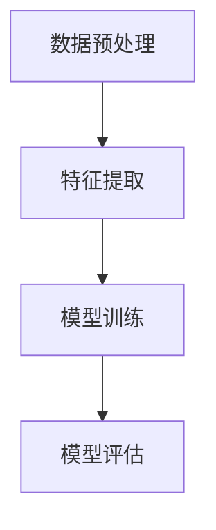
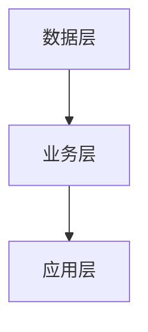
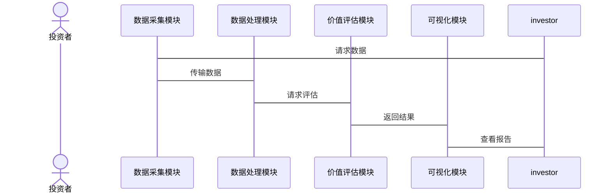

                 


# 特价股票投资中的跨境数据流动与数字资产价值评估策略

## 关键词
特价股票投资、跨境数据流动、数字资产价值评估、金融数据分析、机器学习算法、区块链技术

## 摘要
本文探讨了特价股票投资中的跨境数据流动对数字资产价值评估的影响。通过分析数据流动的机制、算法评估模型以及系统架构，提出了一种创新的价值评估策略。文章结合实际案例和系统实现，为投资者提供科学的决策支持。

---

# 第1章: 特价股票投资与数字资产概述

## 1.1 特价股票投资的基本概念

### 1.1.1 特价股票的定义与特点
特价股票是指以低于市场价格发行的股票，常见于新股发行或公司促销活动。其特点包括低发行价、高流通性、潜在高回报。

### 1.1.2 特价股票投资的基本原理
投资者通过低价买入、高价卖出获利。投资原理包括市场分析、技术分析、基本面分析。

### 1.1.3 特价股票投资的市场环境
市场环境涉及宏观经济、政策法规、行业趋势等因素，影响投资者的决策。

---

## 1.2 数字资产与价值评估的基本概念

### 1.2.1 数字资产的定义与分类
数字资产包括比特币、以太坊等，分类依据包括技术特点、用途、发行方式。

### 1.2.2 数字资产的价值评估方法
常用方法有市场法、成本法、收益法，需考虑流动性、风险等因素。

### 1.2.3 数字资产与传统金融资产的区别
区别包括流动性、风险、监管等方面，数字资产更具波动性和去中心化。

---

## 1.3 跨境数据流动与金融市场的关联

### 1.3.1 跨境数据流动的定义与特点
数据流动是指跨国界的金融数据传输，具有实时性、高效性特点。

### 1.3.2 跨境数据流动对金融市场的的影响
信息不对称导致价格波动，影响市场效率和投资者行为。

### 1.3.3 跨境数据流动与数字资产的关系
数据流动影响数字资产的供需和价格，推动全球化金融市场的发展。

---

# 第2章: 特价股票投资中的数据流动与价值评估背景

## 2.1 数据流动在金融投资中的作用

### 2.1.1 数据流动对投资决策的影响
高效数据流动提供实时信息，辅助投资决策。

### 2.1.2 数据流动的效率与成本
高效数据流动降低成本，但需考虑传输延迟和数据隐私。

### 2.1.3 数据流动的合规性与安全性
合规性要求遵循各国法规，安全性涉及数据加密和隐私保护。

---

## 2.2 数字资产价值评估的挑战与机遇

### 2.2.1 数字资产价值评估的主要挑战
价格波动大、市场操纵、数据不足。

### 2.2.2 数字资产价值评估的创新方法
采用机器学习算法，如线性回归、随机森林。

### 2.2.3 数字资产价值评估的未来趋势
区块链技术提升透明度和安全性。

---

## 2.3 跨境数据流动对数字资产价值的影响

### 2.3.1 跨境数据流动对数字资产流动的影响
推动全球化流动，影响市场供需。

### 2.3.2 跨境数据流动对数字资产价格波动的影响
信息传递引发价格波动。

### 2.3.3 跨境数据流动对数字资产监管的影响
推动国际合作和监管框架建设。

---

# 第3章: 特价股票投资中的跨境数据流动分析

## 3.1 跨境数据流动的基本原理

### 3.1.1 数据流动的定义与分类
数据流动分为实时数据和批量数据。

### 3.1.2 跨境数据流动的驱动因素
技术进步和全球化推动数据流动。

### 3.1.3 跨境数据流动的模式与路径
直接连接和中介传输是主要模式。

---

## 3.2 跨境数据流动对金融市场的具体影响

### 3.2.1 跨境数据流动对股票价格的影响
信息传递影响股票价格波动。

### 3.2.2 跨境数据流动对市场波动的影响
信息不对称引发市场波动。

### 3.2.3 跨境数据流动对投资者行为的影响
数据驱动决策影响投资者行为。

---

## 3.3 跨境数据流动的监管与合规性

### 3.3.1 跨境数据流动的监管框架
各国法规差异大，需制定统一标准。

### 3.3.2 跨境数据流动的合规要求
数据加密、隐私保护、遵守当地法规。

### 3.3.3 跨境数据流动的未来趋势
数据主权和国际合作是未来重点。

---

# 第4章: 数字资产价值评估的核心算法与模型

## 4.1 数字资产价值评估的基本原理

### 4.1.1 数字资产价值评估的定义与目标
通过分析影响价格的因素，预测价格走势。

### 4.1.2 数字资产价值评估的核心要素
市场供需、技术特性、政策法规。

---

## 4.2 数字资产价值评估的算法与模型

### 4.2.1 机器学习算法
常用算法包括线性回归、随机森林。

### 4.2.2 算法流程图


### 4.2.3 数学模型
线性回归公式：$$y = \beta_0 + \beta_1x + \epsilon$$

---

## 4.3 数字资产价值评估的实现

### 4.3.1 数据采集与预处理
使用Python代码清洗数据。

### 4.3.2 特征工程
提取关键特征，如交易量、价格波动。

### 4.3.3 模型训练与优化
通过网格搜索优化模型参数。

---

# 第5章: 系统架构设计与实现

## 5.1 系统功能设计

### 5.1.1 数据采集模块
从多个数据源获取实时数据。

### 5.1.2 数据处理模块
清洗数据，提取特征。

### 5.1.3 价值评估模块
应用机器学习模型进行预测。

### 5.1.4 可视化模块
展示分析结果和预测报告。

---

## 5.2 系统架构设计

### 5.2.1 分层架构


### 5.2.2 模块交互


---

## 5.3 系统实现

### 5.3.1 核心代码
```python
import pandas as pd
from sklearn.linear_model import LinearRegression

# 数据加载
data = pd.read_csv('stock_data.csv')

# 特征提取
X = data[['交易量', '价格波动']]
y = data['收盘价']

# 模型训练
model = LinearRegression()
model.fit(X, y)

# 预测
predicted_price = model.predict(X)
```

---

## 5.4 系统优化

### 5.4.1 模型优化
使用网格搜索优化参数，提高预测精度。

### 5.4.2 数据优化
引入更多数据源，提高模型泛化能力。

### 5.4.3 系统性能优化
优化数据处理流程，提升运行效率。

---

# 第6章: 项目实战与案例分析

## 6.1 项目背景

### 6.1.1 项目目标
建立一个高效的数字资产价值评估系统。

### 6.1.2 数据来源
包括股票市场数据、新闻数据、社交媒体数据。

---

## 6.2 项目实现

### 6.2.1 环境搭建
安装Python、Pandas、Scikit-learn等库。

### 6.2.2 核心代码实现
```python
import pandas as pd
from sklearn.ensemble import RandomForestRegressor

# 数据加载
data = pd.read_csv('digital_asset_data.csv')

# 特征工程
data['交易量'] = data['交易量'].fillna(data['交易量'].mean())

# 模型训练
model = RandomForestRegressor()
model.fit(data[['交易量', '市场情绪']], data['收盘价'])

# 预测
predicted_price = model.predict([[1000, 0.8]])
```

---

## 6.3 案例分析

### 6.3.1 数据分析
分析历史数据，提取关键特征。

### 6.3.2 模型评估
评估模型准确率，调整参数优化性能。

### 6.3.3 结果解读
解读预测结果，指导投资决策。

---

## 6.4 项目小结

### 6.4.1 成果总结
成功构建价值评估系统，准确预测价格。

### 6.4.2 经验教训
数据质量、模型选择、系统优化等方面的经验。

---

# 第7章: 最佳实践与总结

## 7.1 最佳实践Tips

### 7.1.1 数据清洗的重要性
确保数据准确性和完整性。

### 7.1.2 模型调优技巧
使用交叉验证和网格搜索优化模型。

---

## 7.2 小结

本文系统探讨了特价股票投资中的跨境数据流动与数字资产价值评估策略，结合理论分析和实际案例，为投资者提供了科学的决策支持。

---

## 7.3 注意事项

### 7.3.1 数据隐私保护
遵守数据保护法规，确保数据安全。

### 7.3.2 模型风险控制
避免过拟合，确保模型的泛化能力。

---

## 7.4 拓展阅读

推荐书籍：《Python机器学习实战》、《区块链技术与应用》。

---

# 结论

跨境数据流动和数字资产价值评估是当前金融领域的热点问题。本文通过理论分析和实践案例，展示了如何利用技术手段提升投资决策的科学性和准确性。

---

# 作者

作者：AI天才研究院 & 禅与计算机程序设计艺术

