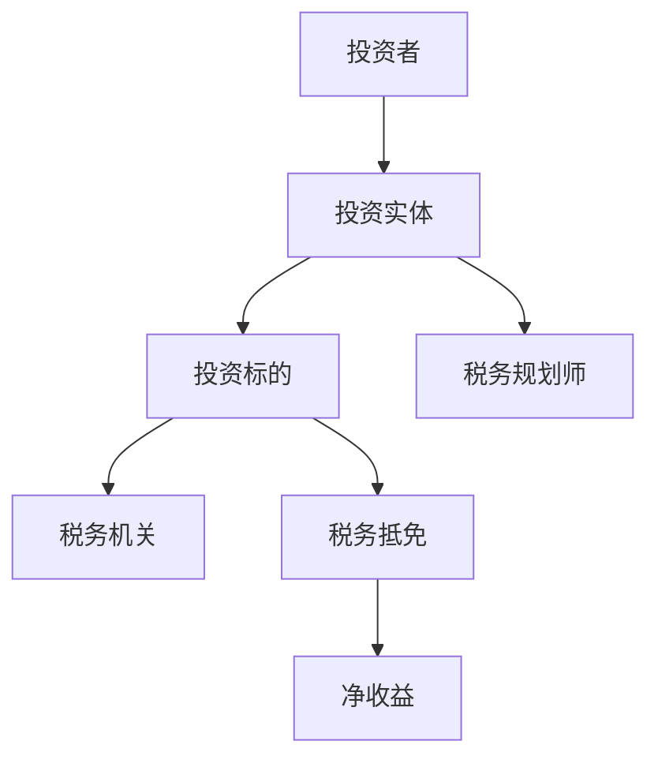
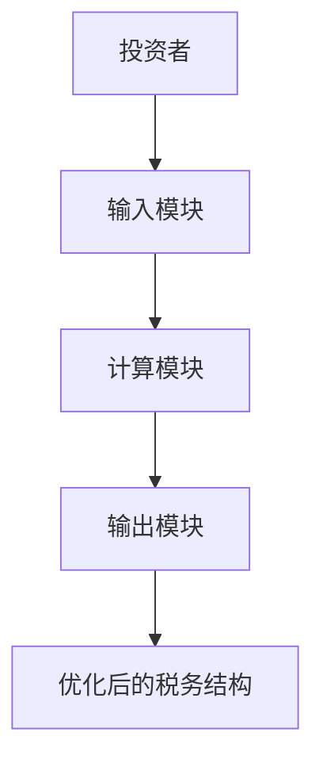
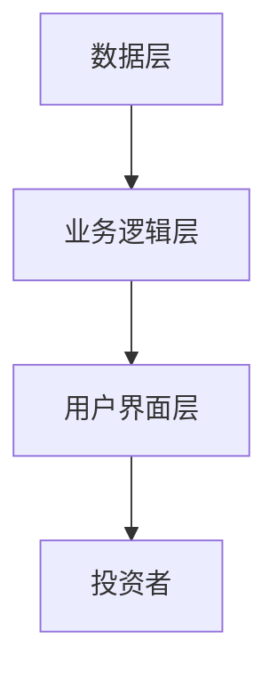

                 


# 特价股票投资中的跨境税务优化策略

> 关键词：特价股票、跨境税务优化、税务规划、算法原理、系统架构

> 摘要：本文探讨了在特价股票投资中如何通过跨境税务优化策略来降低税务负担，提高投资收益。文章从背景介绍、核心概念、算法原理、系统架构设计、项目实战到最佳实践，详细阐述了如何在跨境投资中优化税务结构，避免税务风险，实现最大化收益。

---

# 第一部分: 特价股票投资中的跨境税务优化背景

## 第1章: 特价股票投资与跨境税务优化概述

### 1.1 特价股票投资的定义与特点

#### 1.1.1 特价股票的定义
特价股票是指市场价格低于其内在价值的股票。这种股票通常因为市场波动、公司短期问题或市场低估等原因被投资者视为具有较高的投资价值。

#### 1.1.2 特价股票投资的特点
- **低估值**：市场价格低于内在价值。
- **高潜力**：具备较高的增长潜力。
- **风险较高**：通常涉及较大的市场波动和不确定性。

#### 1.1.3 特价股票投资的市场背景
近年来，全球股市波动加剧，投资者 increasingly seek opportunities to invest in undervalued stocks, especially in cross-border markets.

---

### 1.2 跨境税务优化的定义与重要性

#### 1.2.1 跨境税务优化的定义
跨境税务优化是指在跨国投资中，通过合法手段优化税务结构，减少税务负担，提高投资收益。

#### 1.2.2 跨境税务优化的重要性
- **降低税务成本**：通过合理规划，减少跨国投资的税务支出。
- **提高投资收益**：优化税务结构可以增加净收益。
- **合规性**：确保投资行为符合相关国家的税务法规。

#### 1.2.3 跨境税务优化的法律框架
- **国际税法**：涉及双重征税协定、税收抵免等。
- **各国税务政策**：不同国家的税率、税收优惠各不相同。

---

### 1.3 特价股票投资中的税务问题

#### 1.3.1 特价股票投资中的税务风险
- **双重征税**：在不同国家可能面临重复征税。
- **税率差异**：不同国家的税率差异可能导致税务负担增加。
- **法律风险**：不合规的税务规划可能引发法律问题。

#### 1.3.2 特价股票投资中的税务机会
- **税收优惠**：某些国家提供税收减免或优惠。
- **税率差异**：通过合理配置资产，利用不同国家的税率差异降低税务负担。

#### 1.3.3 特价股票投资中的税务规划
- **税务居民身份**：通过设立公司或信托结构优化税务身份。
- **税务抵免**：利用双重征税协定减少税务负担。
- **税务合规性**：确保投资行为符合相关国家的税务法规。

---

## 1.4 本章小结

本章介绍了特价股票投资的基本概念、特点，以及跨境税务优化的重要性。在跨境投资中，税务规划是不可忽视的一部分，合理优化税务结构可以有效降低税务成本，提高投资收益。

---

# 第二部分: 特价股票投资中的跨境税务优化策略

## 第2章: 跨境税务优化的核心概念与联系

### 2.1 跨境税务优化的核心概念

#### 2.1.1 税收居民身份的确定
- **定义**：税收居民是指在一个国家或地区拥有永久居所或经济利益中心的个人或企业。
- **影响**：税收居民通常需要缴纳更多的税种，包括所得税、资本利得税等。

#### 2.1.2 税收抵免与双重征税协定
- **税收抵免**：避免在两个国家同时缴纳相同税种的机制。
- **双重征税协定**：通过双边协定减少双重征税，优化税务结构。

#### 2.1.3 税收规划的合法性边界
- **合法性**：税务规划必须在法律允许的范围内进行。
- **合规性**：确保所有税务规划行为符合相关法律法规。

---

### 2.2 特价股票投资中的税务优化原理

#### 2.2.1 特价股票投资中的税务计算模型
- **公式**：$$\text{净收益} = \text{投资收益} - \text{税务支出}$$
- **分析**：通过优化税务支出，可以提高净收益。

#### 2.2.2 特价股票投资中的税务优化路径
1. 选择税收优惠的国家进行投资。
2. 合理配置资产，分散税务负担。
3. 利用双重征税协定减少重复征税。

#### 2.2.3 特价股票投资中的税务风险评估
- **风险因素**：税率变化、税收政策调整、法律风险。
- **应对策略**：定期评估税务结构，及时调整优化策略。

---

### 2.3 跨境税务优化的实体关系图



---

## 第3章: 特价股票投资中的税务优化算法原理

### 3.1 税务优化算法的基本原理

#### 3.1.1 税务优化算法的输入与输出
- **输入**：投资者的资产配置、投资标的、税务政策。
- **输出**：优化后的税务结构、净收益最大化方案。

#### 3.1.2 税务优化算法的核心步骤
1. 确定投资实体的税收居民身份。
2. 计算不同国家的税率差异。
3. 利用双重征税协定优化税务支出。

#### 3.1.3 税务优化算法的数学模型
- **公式**：$$\text{优化目标} = \max \left( \text{净收益} \right)$$
  $$\text{约束条件} = \left\{ 
    \begin{array}{l} 
      \text{税率} \leq \text{最优税率} \\
      \text{税务合规性} \geq 0.9 
    \end{array} 
  \right.$$

---

### 3.2 税务优化算法的数学公式

#### 3.2.1 税收抵免公式
- **公式**：$$\text{净税务支出} = \text{应纳税所得} \times \text{税率} - \text{税收抵免}$$

#### 3.2.2 双重征税协定公式
- **公式**：$$\text{最终税务支出} = \text{应纳税所得} \times \min(\text{税率}_1, \text{税率}_2)$$

#### 3.2.3 税后利润最大化公式
- **公式**：$$\text{净收益} = \text{投资收益} - \text{优化后的税务支出}$$

---

### 3.3 税务优化算法的实现

#### 3.3.1 算法实现的代码框架
```python
def tax_optimization(investment, tax_policy):
    # 计算应纳税所得
    taxable_income = investment - tax_policy['threshold']
    # 计算优化后的税率
    optimized_tax_rate = min(tax_policy['rate1'], tax_policy['rate2'])
    # 计算净收益
    net_profit = taxable_income * optimized_tax_rate
    return net_profit
```

#### 3.3.2 算法实现的具体步骤
1. 确定投资实体的税收居民身份。
2. 计算应纳税所得。
3. 利用双重征税协定优化税率。
4. 计算净收益。

---

## 第4章: 特价股票投资中的税务优化系统分析

### 4.1 税务优化系统的功能设计

#### 4.1.1 系统功能模块划分
- **输入模块**：接收投资者的资产配置和投资标的。
- **计算模块**：计算应纳税所得和优化税率。
- **输出模块**：提供优化后的税务结构和净收益。

#### 4.1.2 系统功能模块的交互流程


---

### 4.2 税务优化系统的架构设计

#### 4.2.1 系统架构的分层设计
- **数据层**：存储税务政策和投资数据。
- **业务逻辑层**：实现税务优化算法。
- **用户界面层**：展示优化结果。

#### 4.2.2 系统架构的模块化设计


---

## 第5章: 特价股票投资中的税务优化项目实战

### 5.1 项目环境安装

#### 5.1.1 系统环境
- **操作系统**：Windows/Mac/Linux。
- **编程语言**：Python 3.8+。
- **依赖库**：Pandas、NumPy、Matplotlib。

#### 5.1.2 安装步骤
```bash
pip install pandas numpy matplotlib
```

---

### 5.2 系统核心实现源代码

#### 5.2.1 税务优化算法实现
```python
def optimize_taxes(investment, tax_policy):
    # 计算应纳税所得
    taxable_income = investment - tax_policy['threshold']
    # 计算优化后的税率
    optimized_tax_rate = min(tax_policy['rate1'], tax_policy['rate2'])
    # 计算净收益
    net_profit = taxable_income * optimized_tax_rate
    return net_profit
```

---

### 5.3 代码应用解读与分析

#### 5.3.1 代码解读
- **输入参数**：`investment` 和 `tax_policy`。
- **输出结果**：`net_profit`。

#### 5.3.2 案例分析
假设投资者投资100万元，投资国家的税率分别为20%和25%，计算净收益：
$$\text{净收益} = (1000000 - 500000) \times \min(0.2, 0.25) = 500000 \times 0.2 = 100000$$

---

## 第6章: 特价股票投资中的税务优化最佳实践

### 6.1 小结

通过本文的分析，我们可以看到，在特价股票投资中，跨境税务优化是提高投资收益的重要手段。通过合理规划税务结构，可以有效降低税务成本，提高净收益。

---

### 6.2 注意事项

1. **合法性**：税务规划必须在法律允许的范围内进行。
2. **合规性**：确保所有税务规划行为符合相关法律法规。
3. **风险管理**：定期评估税务结构，及时调整优化策略。

---

### 6.3 拓展阅读

1. 《国际税法与税务规划》
2. 《跨境投资税务优化策略》
3. 《双重征税协定与税务抵免》

---

# 作者：AI天才研究院 & 禅与计算机程序设计艺术

---

通过本文的分析，读者可以深入了解特价股票投资中的跨境税务优化策略，掌握如何通过合理规划税务结构来提高投资收益。希望本文能为投资者提供有价值的参考和指导。

