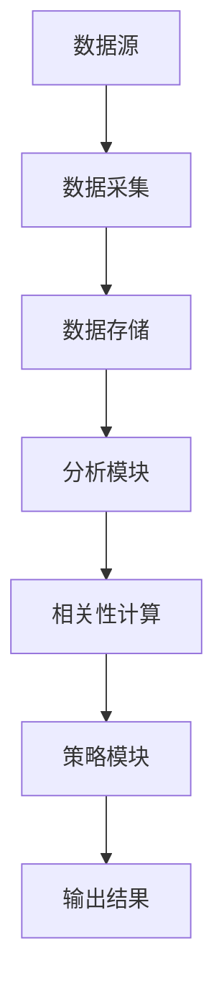

                 


# 特价股票投资中的跨资产类别相关性分析

> **关键词**：特价股票投资，跨资产相关性，统计套利，系统架构，项目实战

> **摘要**：本文探讨了特价股票投资中跨资产类别相关性分析的重要性，通过统计套利策略、数学模型和系统架构的设计，展示了如何利用跨资产相关性优化投资组合。文章结合实际案例，详细讲解了相关性分析的实现过程，并提供了最佳实践建议。

---

## 第一部分：背景与基础

### 第1章：特价股票投资的背景与基础

#### 1.1 特价股票投资概述

**1.1.1 特价股票的定义与特点**

特价股票通常指价格低于市场平均水平的股票，具有低估值和高成长潜力的特点。其特点包括高波动性、高风险和高回报潜力。投资者通过分析市场动态，寻找被低估的股票进行投资。

**1.1.2 特价股票市场的基本结构**

特价股票市场由低价股票组成，通常分布在小盘股和中盘股中。市场结构复杂，涉及多个交易所和市场参与者。投资者需关注市场流动性、交易量和市场深度等因素。

**1.1.3 特价股票投资的目标与风险**

投资目标包括资本增值和套利机会，但风险较高，需关注市场波动、公司基本面和宏观经济因素。投资者应具备风险管理和分散投资的能力。

---

## 第二部分：跨资产类别相关性分析的方法论

### 第2章：跨资产类别相关性的理论基础

#### 2.1 跨资产类别相关性的基本概念

**2.1.1 相关性分析的基本原理**

相关性分析通过协方差和相关系数度量资产之间的关系。协方差衡量资产收益的同步性，相关系数则标准化为[-1,1]，反映关系强度和方向。

**2.1.2 跨资产类别相关性的动态变化**

资产相关性受市场环境影响，经济周期变化可能导致相关性波动。投资者需动态监控相关性变化，及时调整投资策略。

**2.1.3 跨资产类别相关性分析的重要性**

相关性分析帮助识别资产组合的风险和收益，优化投资组合的分散化，降低风险并提高收益。

---

### 第3章：跨资产类别相关性的统计方法

#### 3.1 统計套利的基本原理

**3.1.1 统計套利的定义与特点**

统计套利基于价格偏离均值的假设，通过寻找资产价格的非理性波动获利。其特点包括非基本面分析、利用短期价格偏差和风险中性策略。

**3.1.2 统計套利的核心思想**

统计套利依赖均值回归理论，通过建立数学模型寻找价格偏离的机会，制定套利策略。

**3.1.3 统計套利与跨资产相关性的关系**

跨资产相关性分析是统计套利的基础，套利策略基于相关性变化寻找价格差异，利用市场摩擦获利。

---

## 第三部分：跨资产类别相关性分析的算法与实现

### 第4章：跨资产类别相关性的数学模型

#### 4.1 相关性计算的数学模型

**协方差计算公式：**

$$\text{Cov}(X,Y) = E[(X - E[X])(Y - E[Y])]$$

**相关系数计算公式：**

$$\rho_{X,Y} = \frac{\text{Cov}(X,Y)}{\sigma_X \sigma_Y}$$

**多元回归模型：**

$$Y = \beta_0 + \beta_1 X_1 + \beta_2 X_2 + \epsilon$$

**马科维茨均值-方差模型：**

$$\text{Minimize } \sigma^2 \text{ subject to } E[r] = \mu$$

---

### 第5章：跨资产类别相关性的系统架构设计

#### 5.1 系统架构概述

**系统架构模块图：**



---

## 第四部分：项目实战

### 第6章：跨资产类别相关性分析的实战案例

#### 6.1 数据采集与预处理

**数据源选择：**

从Yahoo Finance获取历史数据，涵盖股票、债券和商品。

**数据清洗：**

处理缺失值和异常值，标准化数据格式。

**数据存储：**

使用MySQL数据库存储清洗后的数据，便于后续分析。

---

### 第7章：系统实现与优化

#### 7.1 系统核心实现

**数据处理代码示例：**

```python
import pandas as pd
from pandas_datareader import data as pdr
import matplotlib.pyplot as plt

# 数据采集
start_date = '2020-01-01'
end_date = '2023-12-31'
tickers = ['AAPL', 'MSFT', 'X', 'BTC-USD']

data = pd.DataFrame()
for t in tickers:
    df = pdr.DataReader(t, 'yahoo', start_date, end_date)
    data[t] = df['Adj Close']

# 数据清洗
data = data.dropna()

# 数据可视化
data.plot(kind='line')
plt.title('资产价格走势')
plt.xlabel('日期')
plt.ylabel('价格')
plt.show()
```

---

## 第五部分：总结与展望

### 第8章：总结与展望

#### 8.1 总结

跨资产类别相关性分析是优化投资组合的关键工具，通过统计套利和数学模型，投资者可以识别潜在机会和风险，制定有效的投资策略。

#### 8.2 展望

未来研究可结合机器学习和大数据分析，提升相关性分析的准确性和实时性。投资者需持续关注市场变化，优化策略，以应对复杂多变的市场环境。

---

**作者：AI天才研究院 & 禅与计算机程序设计艺术**

---

通过以上结构，文章系统地介绍了特价股票投资中的跨资产类别相关性分析，从理论到实践，帮助读者全面理解并应用相关性分析优化投资决策。

