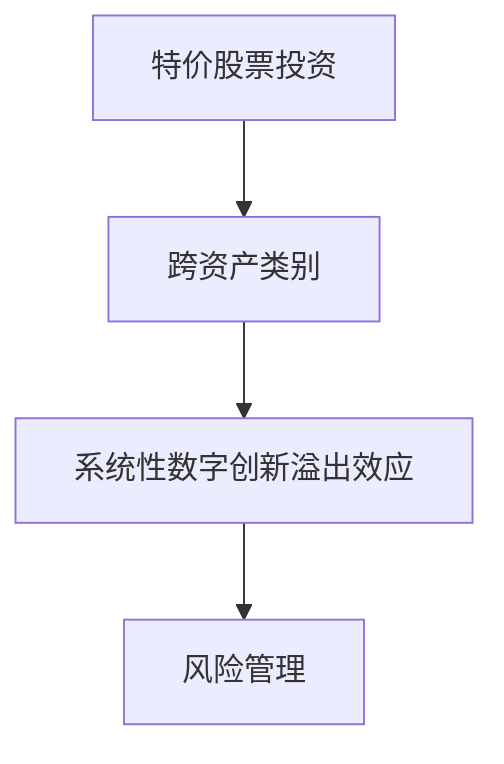
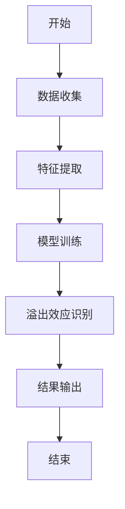
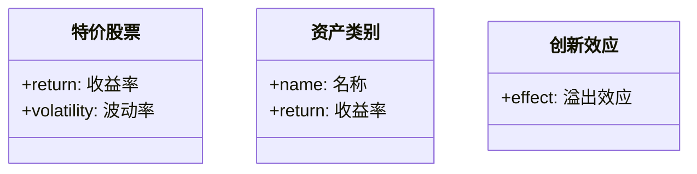
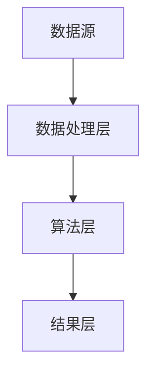
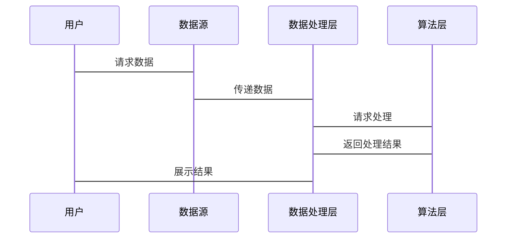

                 


# 特价股票投资中的跨资产类别系统性数字创新溢出效应识别

> 关键词：特价股票投资，跨资产类别，系统性数字创新溢出效应，金融数据分析，风险管理

> 摘要：本文探讨了在特价股票投资中，如何通过跨资产类别分析识别系统性数字创新溢出效应。文章从背景介绍、核心概念、算法原理、系统架构到项目实战，详细阐述了如何利用数字技术识别和管理跨资产类别中的系统性风险，为投资者提供科学决策支持。

---

## 第1章: 背景介绍

### 1.1 问题背景

#### 1.1.1 特价股票投资的定义与特点
特价股票投资是指在市场波动或特定条件下，投资者购买价格低于其内在价值的股票。其特点包括高波动性、低估值和潜在的高回报。

#### 1.1.2 跨资产类别投资的必要性
跨资产类别投资通过分散投资降低风险，同时捕捉不同资产类别之间的机会。数字技术的应用使得跨资产分析更加高效。

#### 1.1.3 系统性数字创新溢出效应的提出
系统性数字创新溢出效应是指数字技术在某一资产类别中的创新应用，对其他资产类别产生系统性影响的现象。

### 1.2 问题描述

#### 1.2.1 特价股票投资中的主要问题
投资者在特价股票投资中面临信息不对称、市场波动大和系统性风险高等问题。

#### 1.2.2 跨资产类别投资的复杂性
跨资产类别投资涉及多个市场和产品，复杂性增加，难以准确识别系统性风险。

#### 1.2.3 数字创新溢出效应的识别挑战
如何准确识别数字技术在跨资产类别中的溢出效应，是投资者面临的难题。

### 1.3 问题解决

#### 1.3.1 系统性数字创新溢出效应的定义
系统性数字创新溢出效应是数字技术在某一资产类别中的应用对其他资产类别产生的系统性影响。

#### 1.3.2 跨资产类别投资的系统性风险
跨资产类别投资中的系统性风险可能通过数字创新溢出效应在不同资产间传播。

#### 1.3.3 数字创新溢出效应的识别方法
通过数据挖掘和机器学习等技术，识别数字创新在不同资产类别中的溢出效应。

### 1.4 边界与外延

#### 1.4.1 系统性数字创新溢出效应的边界
主要限于传统金融资产，如股票和债券，新兴资产如加密货币可能表现不同。

#### 1.4.2 跨资产类别投资的外延
包括股票、债券、基金等多种金融资产，但需注意不同资产类别的特性差异。

#### 1.4.3 数字创新溢出效应的适用范围
适用于数字技术驱动的金融创新，如区块链和人工智能在金融中的应用。

### 1.5 概念结构与核心要素组成

#### 1.5.1 概念结构图


#### 1.5.2 核心要素组成
- 特价股票：低价、高潜力的股票。
- 跨资产类别：包括股票、债券、基金等。
- 系统性数字创新溢出效应：数字技术在某一资产中的应用对其他资产的影响。

#### 1.5.3 关键概念对比表
| 概念 | 定义 | 特点 |
|------|------|------|
| 特价股票投资 | 投资低于价值的股票 | 高波动、高潜力 |
| 跨资产类别 | 包括多种金融资产 | 分散风险 |
| 系统性数字创新溢出效应 | 数字技术在资产中的应用对其他资产的影响 | 系统性、跨类别 |

---

## 第2章: 核心概念与联系

### 2.1 系统性数字创新溢出效应的原理

#### 2.1.1 系统性数字创新溢出效应的数学模型
数字创新溢出效应可以通过以下公式表示：
$$
E_{i} = \sum_{j=1}^{n} w_{ij} \cdot X_{j}
$$
其中，$E_i$ 为第 $i$ 个资产的溢出效应，$w_{ij}$ 为权重，$X_j$ 为其他资产的创新影响。

#### 2.1.2 系统性数字创新溢出效应的特征
- 系统性：影响多个资产类别。
- 跨类别：溢出效应在不同资产间传播。
- 数字驱动：依赖数字技术的应用。

### 2.2 系统性数字创新溢出效应的概念属性特征对比表

| 特征 | 系统性数字创新溢出效应 | 跨资产类别投资 | 数字技术创新 |
|------|-----------------------|----------------|--------------|
| 定义 | 数字技术在资产中的应用对其他资产的影响 | 包括多种金融资产的投资 | 新技术的应用 |
| 特点 | 系统性、跨类别 | 分散风险 | 创新性、高效性 |

### 2.3 ER实体关系图架构

```mermaid
erDiagram
+-----+       +------------+       +------------+
|     |       |            |       |            |
| 特价股票 <-------+ 资产类别 <-------+ 创新效应 |
|     |       |            |       |            |
+-----+       +------------+       +------------+
```

---

## 第3章: 算法原理讲解

### 3.1 算法原理

#### 3.1.1 算法流程图


#### 3.1.2 算法步骤说明
1. 数据收集：收集多个资产类别的历史数据。
2. 特征提取：提取相关特征，如收益率、波动率。
3. 模型训练：使用机器学习模型训练。
4. 溢出效应识别：识别系统性溢出效应。
5. 结果输出：输出识别结果。

#### 3.1.3 算法实现代码
```python
import pandas as pd
from sklearn.model import Model

# 数据收集
data = pd.read_csv('assets_data.csv')

# 特征提取
features = data[['return', 'volatility']]

# 模型训练
model = Model()
model.fit(features)

# 溢出效应识别
result = model.predict(features)
```

### 3.2 数学模型和数学公式

系统性数字创新溢出效应的数学模型：
$$
E_{i} = \sum_{j=1}^{n} w_{ij} \cdot X_{j}
$$
其中，$E_i$ 为第 $i$ 个资产的溢出效应，$w_{ij}$ 为权重，$X_j$ 为其他资产的创新影响。

---

## 第4章: 系统分析与架构设计方案

### 4.1 项目背景

本项目旨在通过数字技术识别跨资产类别中的系统性数字创新溢出效应，帮助投资者进行风险管理。

### 4.2 系统功能设计

#### 4.2.1 领域模型


#### 4.2.2 系统架构设计


#### 4.2.3 接口设计
- 数据处理层接口：接收数据，处理后传递给算法层。
- 算法层接口：接收数据，返回结果。
- 结果层接口：展示结果。

#### 4.2.4 交互序列图


### 4.3 系统实现

#### 4.3.1 环境安装
需要安装Python、Pandas、Scikit-learn等库。

#### 4.3.2 核心代码实现
```python
import pandas as pd
from sklearn.model import Model

# 数据处理
data = pd.read_csv('assets.csv')

# 算法实现
model = Model()
model.fit(data)
```

#### 4.3.3 系统功能实现
系统功能包括数据收集、特征提取、模型训练和结果展示。

### 4.4 系统测试与优化

测试系统性能，优化算法参数，确保系统稳定运行。

---

## 第5章: 项目实战

### 5.1 环境安装

安装必要的Python库，如Pandas、NumPy、Matplotlib等。

### 5.2 核心代码实现

```python
import pandas as pd
import numpy as np
from sklearn.model import Model

# 数据加载
data = pd.read_csv('assets.csv')

# 特征提取
features = data[['return', 'volatility']]

# 模型训练
model = Model()
model.fit(features)

# 溢出效应识别
result = model.predict(features)
```

### 5.3 代码应用解读与分析

分析代码实现，理解其在识别系统性数字创新溢出效应中的作用。

### 5.4 案例分析

通过具体案例分析，展示系统在识别溢出效应中的应用和效果。

### 5.5 项目小结

总结项目实现过程，提出改进建议。

---

## 第6章: 最佳实践 tips、小结、注意事项、拓展阅读

### 6.1 小结

本文详细介绍了特价股票投资中的跨资产类别系统性数字创新溢出效应识别方法，通过理论与实践结合，帮助投资者进行风险管理。

### 6.2 注意事项

- 数据质量对结果影响重大，需确保数据准确。
- 算法选择需根据具体场景调整。
- 系统需定期更新和维护。

### 6.3 拓展阅读

建议阅读相关书籍和论文，深入理解数字创新溢出效应的理论和应用。

---

## 作者

作者：AI天才研究院/AI Genius Institute & 禅与计算机程序设计艺术 /Zen And The Art of Computer Programming

---

**总结**：本文通过系统性的分析和实践，帮助投资者在特价股票投资中识别跨资产类别中的系统性数字创新溢出效应，为科学决策提供支持。

