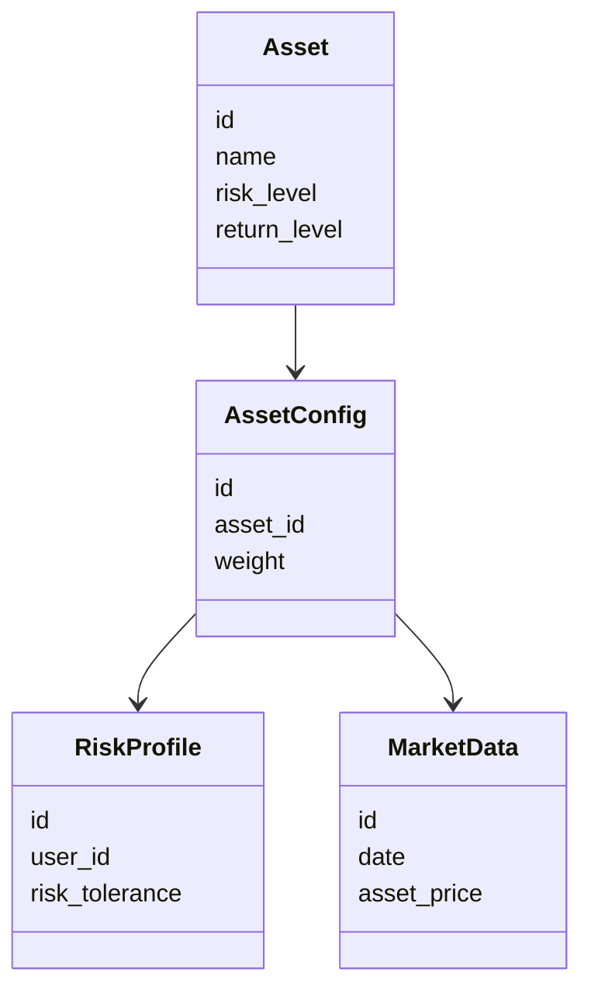
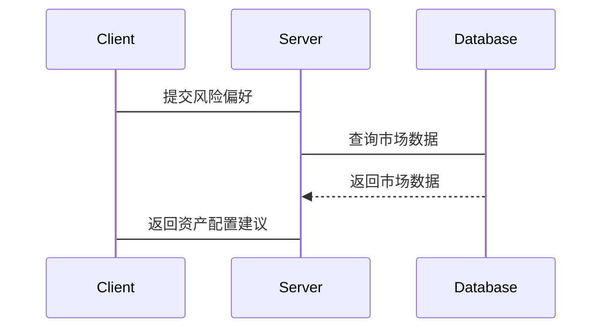

                 


# 特价股票投资中的跨资产类别配置方法

## 关键词

跨资产配置、特价股票、投资策略、风险管理、资产组合优化

## 摘要

在股票投资中，跨资产类别配置是一种有效的策略，尤其在特价股票投资中更为重要。本文将从跨资产配置的背景与重要性入手，深入探讨资产配置的基本理论与方法，分析债券与股票、基金与股票、黄金与股票等不同资产类别的配置策略。结合数学模型与算法，如均值-方差模型和风险平价模型，详细讲解如何构建高效的资产组合。同时，通过系统架构与设计，展示跨资产配置系统的实现方法，并结合实际案例进行分析，总结最佳实践和风险管理策略，为投资者提供科学的指导。

---

## 第一部分：跨资产配置的背景与重要性

### 第1章：跨资产配置的背景与重要性

#### 1.1 跨资产配置的基本概念

- **1.1.1 资产配置的定义**
  资产配置是指将资金分配到不同的资产类别（如股票、债券、基金、黄金等）中，以实现风险与收益的最佳平衡。跨资产配置则强调在多个资产类别之间进行优化配置，以分散风险并提高收益。

- **1.1.2 跨资产配置的内涵**
  跨资产配置不仅仅是将资金分配到多个资产类别，还需要考虑各资产类别的相关性、波动性、收益率等因素，通过科学的模型和方法进行优化。

- **1.1.3 跨资产配置的重要性**
  在特价股票投资中，跨资产配置可以帮助投资者在市场波动中分散风险，避免过度依赖单一资产，从而提高投资组合的稳定性。

#### 1.2 特价股票投资的特点

- **1.2.1 特价股票的定义**
  特价股票通常指市盈率、市净率等估值指标低于行业平均水平的股票，具有较高的安全边际和潜在的上涨空间。

- **1.2.2 特价股票的投资价值**
  特价股票通常被低估，具有较大的增值空间，但同时也可能面临市场认知不足或公司基本面恶化的风险。

- **1.2.3 特价股票的风险与机会**
  特价股票的投资机会在于其估值修复的可能性，但同时也存在较高的市场风险和公司特定风险。

#### 1.3 跨资产配置在股票投资中的作用

- **1.3.1 分散风险**
  通过将资金分配到不同资产类别中，投资者可以降低单一资产波动带来的风险。

- **1.3.2 提高收益稳定性**
  跨资产配置可以通过不同资产类别在不同市场环境下的表现，提高整体收益的稳定性。

- **1.3.3 适应市场变化**
  不同资产类别的表现通常与市场周期相关，跨资产配置可以帮助投资者更好地适应市场变化，抓住不同资产类别的机会。

---

## 第二部分：资产配置的理论与方法

### 第2章：现代投资组合理论与资产配置

#### 2.1 现代投资组合理论（MPT）

- **2.1.1 MPT的核心思想**
  现代投资组合理论由哈里·马科维茨提出，认为通过合理配置资产可以实现风险与收益的最佳平衡。投资者可以通过优化投资组合的波动性和预期收益来实现这一点。

- **2.1.2 有效前沿的概念**
  有效前沿是指在给定风险水平下，能够提供最高预期收益的资产组合所构成的曲线。投资者可以通过调整资产配置比例，找到位于有效前沿上的组合。

- **2.1.3 风险与收益的平衡**
  MPT强调在资产配置中，既要考虑预期收益，也要考虑风险，通过分散化投资降低组合的整体风险。

#### 2.2 资产配置的基本方法

- **2.2.1 基于风险偏好的配置**
  根据投资者的风险承受能力，调整不同资产类别在组合中的比例。风险厌恶型投资者可能更倾向于配置债券等低风险资产，而风险偏好型投资者则可能增加股票等高风险资产的配置比例。

- **2.2.2 基于市场周期的配置**
  不同市场周期下，不同资产类别的表现可能有所不同。在经济衰退期，债券和黄金等避险资产可能表现较好，而在经济复苏期，股票等风险资产可能表现更优。

- **2.2.3 基于资产类别特性的配置**
  不同资产类别具有不同的收益和风险特征。例如，股票具有较高的收益潜力和波动性，而债券则具有相对稳定的收益和较低的波动性。

---

### 第3章：风险与收益的平衡

#### 3.1 风险管理的基本原则

- **3.1.1 风险的定义与分类**
  风险是指投资收益的不确定性。在资产配置中，风险可以分为系统性风险（如市场风险）和非系统性风险（如公司特定风险）。

- **3.1.2 风险与收益的关系**
  高收益通常伴随着高风险，但通过合理的资产配置，可以在一定风险水平下实现更高的收益。

- **3.1.3 风险管理的目标**
  风险管理的目标是在可接受的风险水平下，实现投资收益的最大化。

#### 3.2 资产配置中的风险控制

- **3.2.1 风险分散化**
  通过将资金分配到不同的资产类别中，降低单一资产波动带来的风险。

- **3.2.2 风险对冲策略**
  使用衍生工具（如期货、期权）对冲特定风险，进一步降低组合的整体风险。

- **3.2.3 风险监控与调整**
  定期监控投资组合的风险敞口，并根据市场变化和投资者风险偏好进行调整。

---

## 第三部分：跨资产配置的具体策略

### 第4章：债券与股票的配置策略

#### 4.1 债券投资的特点与风险

- **4.1.1 债券的收益来源**
  债券的主要收益来源于利息收入和本金偿还。债券的收益率通常低于股票，但具有较高的稳定性。

- **4.1.2 债券的风险因素**
  债券的主要风险包括利率风险、信用风险和流动性风险。利率上升会降低债券的市场价格，信用风险是指债券发行人违约的风险。

- **4.1.3 债券与股票的收益相关性**
  通常情况下，债券与股票的收益相关性较低，这使得债券成为股票投资中的良好对冲工具。

#### 4.2 股票投资的策略

- **4.2.1 价值投资策略**
  价值投资策略强调以低于内在价值的价格买入股票，寻找被市场低估的公司。

- **4.2.2 成长投资策略**
  成长投资策略关注于具有较高成长潜力的公司，愿意以较高的价格买入股票，以期获得未来的高收益。

- **4.2.3 技术分析策略**
  技术分析策略通过分析股票的价格和成交量等技术指标，预测股票的未来走势。

#### 4.3 债券与股票的配置比例

- **4.3.1 不同市场环境下的配置比例**
  在经济衰退期，债券的配置比例可能需要增加以降低组合的整体风险；在经济复苏期，股票的配置比例可能需要增加以捕捉市场上涨的机会。

- **4.3.2 风险偏好对配置比例的影响**
  风险厌恶型投资者可能倾向于配置更多的债券，而风险偏好型投资者则可能增加股票的配置比例。

- **4.3.3 资产类别特性的考虑**
  根据债券和股票的收益和风险特征，调整配置比例以实现风险与收益的最佳平衡。

---

## 第四部分：数学模型与算法

### 第5章：数学模型与算法在资产配置中的应用

#### 5.1 均值-方差模型

- **5.1.1 均值-方差模型的核心思想**
  均值-方差模型由哈里·马科维茨提出，旨在通过优化资产组合的预期收益和方差（即风险）来实现风险与收益的最佳平衡。

- **5.1.2 数学公式**
  假设投资者有n种资产，每种资产的预期收益率为$\mu_i$，方差为$\sigma_i^2$，协方差为$\sigma_{ij}$。资产组合的预期收益率为$\mu_p$，方差为$\sigma_p^2$。目标是最小化$\sigma_p^2$，在给定的$\mu_p$下。

  优化问题可以表示为：
  $$
  \min_{w} \sigma_p^2 = w^T \Sigma w
  $$
  约束条件：
  $$
  w^T \mu = \mu_p
  $$
  其中，$w$是资产权重向量，$\Sigma$是资产之间的协方差矩阵。

- **5.1.3 优化过程**
  通过求解上述优化问题，可以得到最优的资产配置比例$w$，从而实现预期收益下的最小方差。

#### 5.2 风险平价模型

- **5.2.1 风险平价模型的核心思想**
  风险平价模型强调在组合中等量地分配风险，使得每种资产对组合总风险的贡献相等。

- **5.2.2 数学公式**
  风险平价模型的目标是使得每种资产的风险贡献相等，即：
  $$
  w_i^2 \sigma_i^2 = w_j^2 \sigma_j^2
  $$
  对于所有$i,j$，其中$w_i$是第i种资产的权重，$\sigma_i^2$是第i种资产的方差。

- **5.2.3 应用场景**
  风险平价模型适用于多种资产类别，尤其在市场波动性较高的情况下，可以帮助投资者实现更均衡的风险分配。

#### 5.3 算法实现

- **5.3.1 均值-方差模型的实现**
  使用Python中的优化库（如scipy.optimize）实现均值-方差模型的优化。

  ```python
  import numpy as np
  from scipy.optimize import minimize

  # 定义目标函数
  def objective(weights, Sigma, mu_p):
      return np.dot(weights.T, np.dot(Sigma, weights))

  # 定义约束条件
  def constraint(weights, mu, mu_p):
      return np.dot(weights.T, mu) - mu_p

  # 优化过程
  def optimize_weights(Sigma, mu, mu_p):
      n = Sigma.shape[0]
      init_weights = np.ones(n) / n
      constraints = {'type': 'eq', 'fun': lambda w: constraint(w, mu, mu_p)}
      bounds = [(0, 1) for _ in range(n)]
      result = minimize(objective, init_weights, args=(Sigma, mu_p), constraints=constraints, bounds=bounds)
      return result.x

  # 示例使用
  mu = np.array([0.1, 0.15, 0.05])
  Sigma = np.array([[0.05, 0.02, 0.01],
                    [0.02, 0.10, 0.03],
                    [0.01, 0.03, 0.08]])
  mu_p = 0.1
  weights = optimize_weights(Sigma, mu, mu_p)
  print("Optimal weights:", weights)
  ```

- **5.3.2 风险平价模型的实现**
  风险平价模型可以通过调整权重，使得每种资产的风险贡献相等。

  ```python
  import numpy as np

  def risk-parity_weights(cov_matrix, target_risk_contribution):
      n = cov_matrix.shape[0]
      inv_cov = np.linalg.inv(cov_matrix)
      denominator = np.dot(target_risk_contribution, np.ones(n))
      weights = np.dot(inv_cov, target_risk_contribution) / denominator
      return weights

  # 示例使用
  cov_matrix = np.array([[0.05, 0.02, 0.01],
                        [0.02, 0.10, 0.03],
                        [0.01, 0.03, 0.08]])
  target_risk_contribution = np.array([1, 1, 1])
  weights = risk-parity_weights(cov_matrix, target_risk_contribution)
  print("Risk-parity weights:", weights)
  ```

---

## 第五部分：系统架构与设计

### 第6章：跨资产配置系统的架构与设计

#### 6.1 问题场景介绍

- **6.1.1 问题描述**
  跨资产配置系统需要根据投资者的风险偏好和市场环境，提供最优的资产配置建议。

- **6.1.2 项目介绍**
  本项目旨在开发一个跨资产配置系统，能够根据市场数据和投资者需求，优化资产组合，实现风险与收益的最佳平衡。

#### 6.2 系统功能设计

- **6.2.1 领域模型（mermaid类图）**



- **6.2.2 系统架构设计（mermaid架构图）**

```mermaid
client
    / request
    / response
server
    / data
    \ request
    \ response
database
```

- **6.2.3 系统接口设计**
  - 输入接口：投资者风险偏好、市场数据
  - 输出接口：资产配置建议、投资组合报告

- **6.2.4 系统交互设计（mermaid序列图）**



---

## 第六部分：项目实战与案例分析

### 第7章：项目实战与案例分析

#### 7.1 环境安装

- **7.1.1 安装Python**
  安装Python 3.x，推荐使用Anaconda分布。

- **7.1.2 安装依赖库**
  使用以下命令安装所需的依赖库：
  ```
  pip install numpy scipy matplotlib pandas
  ```

#### 7.2 核心实现

- **7.2.1 优化算法实现**
  实现均值-方差模型和风险平价模型的优化算法，如上所述。

- **7.2.2 数据处理与分析**
  使用历史市场数据进行回测，验证资产配置策略的有效性。

#### 7.3 案例分析

- **7.3.1 案例背景**
  假设投资者风险偏好为中等，希望在股票、债券和黄金之间进行配置。

- **7.3.2 数据收集**
  收集过去10年的股票、债券和黄金的收益率数据。

- **7.3.3 模型应用**
  使用均值-方差模型优化资产配置比例。

- **7.3.4 结果分析**
  比较不同配置比例下的组合收益与风险，选择最优配置方案。

#### 7.4 小结

- **7.4.1 项目总结**
  跨资产配置系统能够有效帮助投资者实现风险与收益的最佳平衡。

- **7.4.2 经验与教训**
  市场数据的准确性、模型的适用性以及投资者的动态需求是系统设计中的关键因素。

---

## 第七部分：风险管理与优化

### 第8章：风险管理与优化

#### 8.1 风险管理策略

- **8.1.1 定期监控**
  定期审查投资组合的风险敞口，并根据市场变化进行调整。

- **8.1.2 风险对冲**
  使用衍生工具对冲特定风险，降低组合的整体风险。

- **8.1.3 灾难性风险管理**
  制定应对市场崩盘等极端情况的应急预案。

#### 8.2 资产配置的优化

- **8.2.1 动态调整**
  根据市场环境和投资者需求，动态调整资产配置比例。

- **8.2.2 定期评估**
  定期评估投资组合的表现，并根据评估结果进行优化。

#### 8.3 定期再平衡

- **8.3.1 再平衡的必要性**
  随着市场环境的变化，投资组合的配置比例可能偏离最优状态，需要定期再平衡。

- **8.3.2 再平衡的策略**
  根据市场表现和投资者需求，调整资产配置比例，确保组合的风险与收益的最佳平衡。

---

## 附录

- **附录A**：数学公式汇总
- **附录B**：系统架构图详细说明
- **附录C**：项目源代码

---

## 参考文献

- 哈里·马科维茨，《投资学精解》
- 鲍莫格鲁德，《资产配置的艺术》
- 张五常，《投资学原理》

---

## 作者

作者：AI天才研究院/AI Genius Institute & 禅与计算机程序设计艺术/Zen And The Art of Computer Programming

