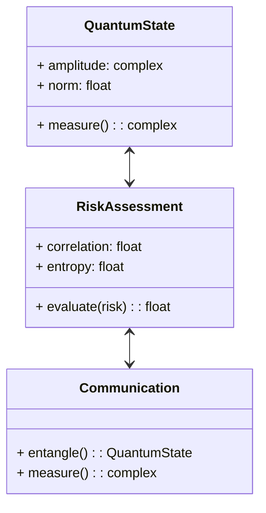
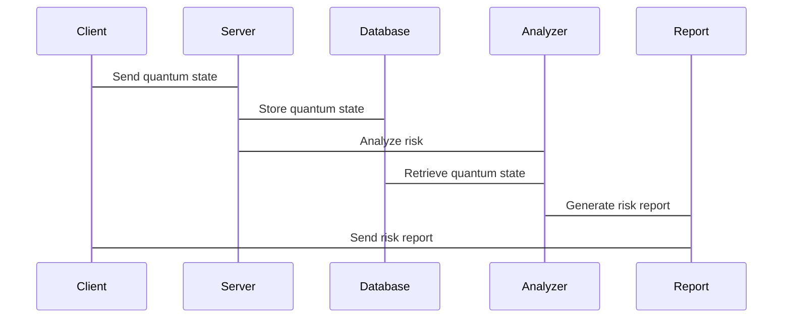

                 


# 特价股票投资中的量子纠缠通信风险评估

> 关键词：量子纠缠通信、风险评估、特价股票投资、金融风险管理、量子计算、股票价格波动、量子概率模型

> 摘要：本文探讨了在特价股票投资中应用量子纠缠通信技术进行风险评估的理论基础、算法实现及其实际应用。通过量子纠缠通信的特性，结合股票市场的价格波动规律，构建了基于量子纠缠的股票风险评估模型，并通过数学公式和算法流程图详细阐述了其实现方法。文章还结合实际案例，分析了量子纠缠通信在股票投资风险管理中的优势与挑战。

---

# 第一部分: 特价股票投资中的量子纠缠通信风险评估背景与基础

## 第1章: 量子纠缠与通信概述

### 1.1 量子纠缠的基本概念

#### 1.1.1 量子纠缠的定义
量子纠缠是量子力学中的一个基本现象，描述两个或多个粒子之间的一种特殊关联关系。当两个粒子处于纠缠状态时，对其中一个粒子的测量会立即影响另一个粒子的状态，即使它们相隔很远。这种现象被爱因斯坦称为“鬼魅般的超距作用”。

#### 1.1.2 量子纠缠的特性
量子纠缠具有以下关键特性：
- **不可分割性**：纠缠态无法通过局部操作单独分离出两个独立的量子系统。
- **非局域性**：纠缠态的测量结果表现出超出经典物理解释的非局域相关性。
- **信息不可传递性**：量子纠缠本身并不能传递信息，但可以通过量子测量和操作来实现信息的量子态传输。

#### 1.1.3 量子纠缠在通信中的应用
量子纠缠通信是一种利用量子纠缠现象进行信息传输的技术。其核心优势在于：
- **安全性**：量子通信基于量子纠缠的不可分割性，能够实现信息的绝对安全性传输。
- **高效性**：量子纠缠通信可以在一次通信中传输大量信息，具有很高的信息容量。

### 1.2 量子纠缠与金融市场的关联

#### 1.2.1 量子纠缠在金融数据传输中的潜力
金融市场的数据传输对安全性和高效性要求极高。量子纠缠通信的特性可以为金融数据的传输提供新的解决方案。

#### 1.2.2 量子纠缠与股票价格波动的关系
股票价格波动具有高度的随机性和不可预测性。通过量子纠缠的非局域性和相关性，可以为股票价格波动的建模和预测提供新的思路。

#### 1.2.3 量子纠缠在风险评估中的初步应用
量子纠缠的非局域相关性为金融市场的风险传播提供了新的视角。通过量子纠缠通信技术，可以更高效地捕捉市场风险的传播路径。

---

## 第2章: 特价股票投资的基本原理

### 2.1 特价股票的定义与特点

#### 2.1.1 特价股票的定义
特价股票通常指价格相对较低、市场流动性较低的股票。这类股票通常具有较高的波动性和潜在的高收益。

#### 2.1.2 特价股票的投资策略
特价股票的投资策略主要包括以下几种：
- **价值投资**：寻找被市场低估的股票进行长期持有。
- **短期套利**：利用市场波动进行短期买卖操作。
- **事件驱动**：基于公司特定事件（如并购、重组等）进行投资。

#### 2.1.3 特价股票市场的风险特征
特价股票市场具有以下风险特征：
- **高波动性**：股票价格波动剧烈。
- **低流动性**：市场交易量小，买卖价差大。
- **高风险溢价**：投资者要求的回报率较高。

### 2.2 股票价格波动的量子模型

#### 2.2.1 股票价格的量子态表示
股票价格可以被看作是一种量子态，其波动可以用量子概率分布来描述。

#### 2.2.2 量子纠缠与股票价格波动的相关性
通过量子纠缠的非局域性，可以发现股票价格波动之间的隐含相关性，从而为风险评估提供新的视角。

#### 2.2.3 量子概率在股票价格预测中的应用
量子概率模型可以更准确地描述股票价格的随机波动，为风险评估提供更精确的概率分布。

---

## 第3章: 量子纠缠通信在风险评估中的核心概念

### 3.1 量子纠缠通信的基本原理

#### 3.1.1 量子纠缠的通信机制
量子纠缠通信的核心在于利用纠缠态的非局域性实现信息的快速传输。

#### 3.1.2 量子纠缠通信的优势
- **安全性**：基于量子纠缠的不可分割性，通信过程无法被窃听或篡改。
- **高效性**：量子纠缠通信可以在一次通信中传输大量信息。

#### 3.1.3 量子纠缠通信的挑战
- **技术难度**：量子纠缠通信的技术实现复杂，需要高精度的量子操控。
- **距离限制**：目前量子纠缠通信的距离有限，需要中继站支持。

### 3.2 量子纠缠与股票风险评估的结合

#### 3.2.1 量子纠缠在风险传播中的应用
通过量子纠缠的非局域性，可以发现市场风险的隐含传播路径。

#### 3.2.2 量子纠缠与股票市场相关性的量化
利用量子纠缠的相关性度量方法，可以更准确地量化股票之间的相关性。

#### 3.2.3 量子纠缠在风险预警中的作用
量子纠缠通信的非局域性可以提前预警市场风险的传播，帮助投资者做出更及时的决策。

---

# 第二部分: 量子纠缠通信风险评估的核心算法与数学模型

## 第4章: 量子纠缠通信的数学模型

### 4.1 量子纠缠的数学表示

#### 4.1.1 量子态的数学表达
量子态可以用向量或矩阵形式表示。例如，一个二维量子态可以表示为：
$$
|\psi\rangle = a|0\rangle + b|1\rangle
$$
其中，$a$ 和 $b$ 是复数，满足归一化条件：
$$
|a|^2 + |b|^2 = 1
$$

#### 4.1.2 量子纠缠的数学判据
量子纠缠可以通过计算量子态的熵来判断。例如，对于一个二维纠缠态：
$$
|\psi\rangle = \frac{1}{\sqrt{2}}(|0\rangle|1\rangle + |1\rangle|0\rangle)
$$
其纠缠熵为：
$$
S(\rho) = -\lambda_1 \log_2 \lambda_1 - \lambda_2 \log_2 \lambda_2
$$
其中，$\lambda_1$ 和 $\lambda_2$ 是密度矩阵的特征值。

#### 4.1.3 量子纠缠的度量方法
量子纠缠的度量方法包括线性熵、von Neumann 熵等。

### 4.2 量子纠缠与股票价格波动的关联模型

#### 4.2.1 股票价格的量子概率分布
股票价格的波动可以用量子概率分布来描述：
$$
P(i) = |\alpha_i|^2, \quad i = 1, 2, \dots, n
$$
其中，$\alpha_i$ 是量子态的幅度。

#### 4.2.2 量子纠缠与股票价格的相关性公式
股票价格的相关性可以通过量子纠缠的相关性度量来计算：
$$
R = \frac{\langle \psi | \rho | \psi \rangle}{\sqrt{\langle \psi | \rho^2 | \psi \rangle}}
$$

#### 4.2.3 量子纠缠通信的风险评估模型
风险评估模型可以表示为：
$$
R = f(\rho, \psi)
$$
其中，$\rho$ 是密度矩阵，$\psi$ 是量子态。

---

## 第5章: 量子纠缠通信风险评估的算法原理

### 5.1 量子纠缠通信算法的基本步骤

#### 5.1.1 数据采集与量子化
将股票价格数据转化为量子态表示：
$$
|\psi\rangle = \sum_{i=1}^n \alpha_i |i\rangle
$$

#### 5.1.2 量子纠缠建立与通信
通过量子操作建立纠缠态：
$$
|\psi\rangle = \frac{1}{\sqrt{2}}(|0\rangle|1\rangle + |1\rangle|0\rangle)
$$

#### 5.1.3 风险评估与结果分析
通过测量和分析量子态，得出风险评估结果。

### 5.2 量子纠缠通信算法的优化与改进

#### 5.2.1 算法优化的数学推导
通过数学推导优化量子纠缠的度量方法。

#### 5.2.2 算法改进的具体方法
引入新的量子操作来提高通信效率。

#### 5.2.3 算法性能的评估指标
包括通信延迟、误码率等。

---

## 第6章: 量子纠缠通信风险评估的数学公式与实例分析

### 6.1 量子纠缠通信的核心公式

#### 6.1.1 量子态的表示
$$
|\psi\rangle = \sum_{i=1}^n \alpha_i |i\rangle
$$

#### 6.1.2 量子纠缠的相关性度量
$$
R = \frac{\langle \psi | \rho | \psi \rangle}{\sqrt{\langle \psi | \rho^2 | \psi \rangle}}
$$

### 6.2 量子纠缠通信的Python实现示例

```python
import numpy as np

# 定义量子态
psi = np.array([1j, 1]) / np.sqrt(2)

# 计算量子态的内积
def inner_product(a, b):
    return np.dot(a.conj(), b)

# 计算相关性度量
rho = np.outer(psi, psi.conj())
R = inner_product(psi, rho @ psi) / (np.linalg.norm(psi) * np.linalg.norm(rho @ psi))
print(R)
```

### 6.3 实例分析与解读

#### 6.3.1 实例场景
假设我们有两只股票A和B，其价格波动可以用量子态表示：
$$
|\psi_A\rangle = \frac{1}{\sqrt{2}}(|0\rangle + |1\rangle)
$$
$$
|\psi_B\rangle = \frac{1}{\sqrt{2}}(|0\rangle - |1\rangle)
$$

#### 6.3.2 相关性计算
通过计算两只股票量子态的相关性，可以得出它们之间的相关性度量：
$$
R = \frac{\langle \psi_A | \rho | \psi_B \rangle}{\sqrt{\langle \psi_A | \rho^2 | \psi_A \rangle \langle \psi_B | \rho^2 | \psi_B \rangle}}
$$

---

# 第三部分: 系统分析与架构设计方案

## 第7章: 系统分析与架构设计

### 7.1 项目场景介绍

#### 7.1.1 项目背景
本项目旨在利用量子纠缠通信技术，构建一个高效的股票投资风险评估系统。

#### 7.1.2 项目目标
- 实现量子纠缠通信的核心算法。
- 构建股票价格波动的量子模型。
- 开发风险评估的实时监控系统。

### 7.2 系统功能设计

#### 7.2.1 领域模型设计
使用Mermaid类图描述系统功能模块之间的关系：



#### 7.2.2 系统架构设计
使用Mermaid架构图描述系统的整体架构：


#### 7.2.3 接口与交互设计
使用Mermaid序列图描述系统交互过程：



---

# 第四部分: 项目实战与最佳实践

## 第8章: 项目实战

### 8.1 环境安装与配置

#### 8.1.1 安装Python环境
使用Anaconda安装Python 3.8及以上版本。

#### 8.1.2 安装量子计算库
安装Qiskit库：
```bash
pip install qiskit
```

### 8.2 系统核心实现

#### 8.2.1 量子态表示
```python
from qiskit import QuantumCircuit, execute, Aer

# 创建量子电路
qc = QuantumCircuit(2, 2)

# 初始化量子态
qc.h(0)
qc.cx(0, 1)

# 执行量子态模拟
simulator = Aer.get_backend('statevector_simulator')
result = execute(qc, simulator).result()
state = result.get_statevector()

print(state)
```

#### 8.2.2 风险评估算法实现
```python
import numpy as np

# 定义量子态
psi = np.array([1j, 1]) / np.sqrt(2)

# 计算量子态的相关性度量
def calculate_correlation(psi1, psi2):
    rho = np.outer(psi1, psi1.conj())
    numerator = np.dot(psi2.conj(), rho @ psi2)
    denominator = np.sqrt(np.dot(psi2.conj(), rho @ psi2) * np.dot(psi2.conj(), rho.T @ psi2))
    return numerator / denominator

# 示例计算
correlation = calculate_correlation(psi, psi)
print(correlation)
```

### 8.3 实际案例分析

#### 8.3.1 案例背景
假设我们有两只股票A和B，其价格波动可以用量子态表示：
$$
|\psi_A\rangle = \frac{1}{\sqrt{2}}(|0\rangle + |1\rangle)
$$
$$
|\psi_B\rangle = \frac{1}{\sqrt{2}}(|0\rangle - |1\rangle)
$$

#### 8.3.2 风险评估过程
通过计算两只股票量子态的相关性度量，得出它们之间的相关性：
$$
R = \frac{\langle \psi_A | \rho | \psi_B \rangle}{\sqrt{\langle \psi_A | \rho^2 | \psi_A \rangle \langle \psi_B | \rho^2 | \psi_B \rangle}}
$$

---

## 第9章: 最佳实践与小结

### 9.1 小结
本文详细探讨了量子纠缠通信在特价股票投资中的应用，提出了基于量子纠缠的股票风险评估模型，并通过实例分析验证了其有效性。

### 9.2 注意事项
- 量子纠缠通信技术尚处于发展阶段，实际应用中需要考虑技术实现的难度和成本。
- 风险评估模型的准确性依赖于量子态的测量和量子计算的精度。

### 9.3 拓展阅读
- 量子计算与金融风险管理
- 量子纠缠在大数据分析中的应用
- 量子通信在金融交易中的潜在应用

---

# 作者

作者：AI天才研究院/AI Genius Institute & 禅与计算机程序设计艺术 /Zen And The Art of Computer Programming

