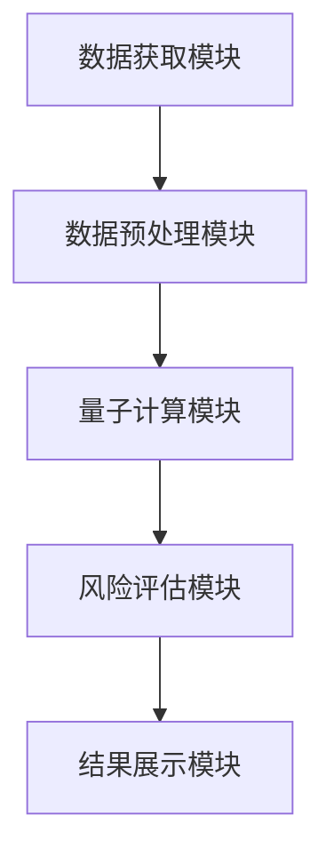

                 


# 特价股票投资中的量子计算风险评估

## 关键词：量子计算，股票投资，风险评估，量子算法，金融建模

## 摘要：  
本文探讨了量子计算在特价股票投资中的应用，特别是如何利用量子算法进行风险评估。文章从量子计算的基本原理出发，结合股票投资的特殊需求，详细分析了量子退火算法、量子机器学习算法等在风险建模和优化中的应用，并通过实际案例展示了量子计算在股票投资中的优势和挑战。本文还提供了系统架构设计、项目实战和未来展望，为读者提供了全面的视角来理解量子计算在金融领域的潜力。

---

## 第一部分: 特价股票投资概述

### 第1章: 特价股票投资的基本概念

#### 1.1 特价股票的定义与特点
##### 1.1.1 什么是特价股票  
特价股票指的是价格低于其内在价值的股票，通常被认为是被市场低估的投资机会。这类股票通常具有较高的潜在回报，但同时也伴随着较高的风险。  

##### 1.1.2 特价股票的投资特点  
- **低估值**：市场价格低于内在价值。  
- **高波动性**：价格波动较大，容易受市场情绪影响。  
- **高风险**：由于价格低廉，公司可能面临财务困境或经营问题。  

##### 1.1.3 特价股票与普通股票的区别  
| 特性       | 特价股票                | 普通股票                |
|------------|-------------------------|-------------------------|
| 价格       | 低于市场平均值           | 接近或高于市场平均值     |
| 投资风险    | 较高                    | 较低                    |
| 潜在收益    | 较高                    | 中等                    |
| 市场关注度  | 较低                    | 较高                    |

#### 1.2 特价股票投资的背景与现状
##### 1.2.1 特价股票投资的历史发展  
特价股票投资策略起源于价值投资理念，强调寻找市场价格低于内在价值的股票。这一策略在20世纪得到了广泛应用，尤其是在2008年金融危机后，市场波动加剧，投资者开始重新关注低价股票的投资机会。  

##### 1.2.2 当前特价股票投资的现状  
随着量化交易的兴起，传统的价值投资策略正在与现代技术手段相结合。投资者利用大数据和人工智能技术，对低价股票进行深度分析，以寻找潜在的投资机会。  

##### 1.2.3 特价股票投资的市场环境分析  
当前市场环境中，全球经济不确定性增加，通货膨胀压力上升，投资者更倾向于寻找高收益、低风险的投资标的。特价股票因其低估值特性，再次成为投资者关注的焦点。  

---

### 第2章: 风险评估的基本原理

#### 2.1 风险评估的核心概念
##### 2.1.1 风险的定义与分类  
风险是指投资可能遭受损失的可能性。根据其来源，风险可以分为市场风险、信用风险、流动性风险等。  

##### 2.1.2 风险评估的必要性  
在股票投资中，风险评估是制定投资策略的核心环节。通过量化风险，投资者可以更好地做出决策，降低潜在损失。  

##### 2.1.3 风险评估的基本方法  
- **历史数据分析法**：基于历史数据计算波动率、VaR（在险价值）等指标。  
- **情景分析法**：模拟不同市场条件下的投资表现。  
- **统计模型法**：使用回归分析、时间序列分析等方法预测风险。  

#### 2.2 风险评估的数学模型
##### 2.2.1 风险评估的线性模型  
线性回归模型是常见的风险评估工具，用于分析资产价格与市场指数之间的关系。  

##### 2.2.2 风险评估的非线性模型  
非线性模型（如神经网络）能够捕捉复杂的市场关系，但计算复杂度较高。  

##### 2.2.3 风险评估的综合评价模型  
综合评价模型结合了多种方法，能够更全面地评估投资风险。例如，结合VaR和信用风险模型，构建综合风险指标。  

---

## 第二部分: 量子计算基础

### 第3章: 量子计算的基本原理

#### 3.1 量子位与量子叠加
##### 3.1.1 量子位的定义  
量子位（qubit）是量子计算的基本单位，与经典计算机中的二进制位不同，量子位可以同时处于0和1的叠加态。  

##### 3.1.2 量子叠加原理  
量子叠加允许量子位同时表示多个状态，这使得量子计算机能够在并行处理多个问题时大幅提高计算效率。  

##### 3.1.3 量子叠加的应用  
量子叠加在密码学、优化问题和概率计算中具有重要应用。  

#### 3.2 量子纠缠与量子测量
##### 3.2.1 量子纠缠的定义  
量子纠缠是指两个或多个量子位之间形成的一种特殊关联，其中一个量子位的状态会直接影响另一个量子位的状态。  

##### 3.2.2 量子测量的原理  
量子测量是量子计算中的基本操作，通过测量量子位的状态来获取结果。测量会破坏量子叠加态，这是量子计算中的一个重要特性。  

##### 3.2.3 量子纠缠的应用  
量子纠缠在量子通信和量子密钥分发（QKD）中具有重要应用。  

#### 3.3 量子计算的优势与挑战
##### 3.3.1 量子计算的优势  
- **计算速度**：在某些特定问题上，量子计算机可以大幅超越经典计算机。  
- **并行计算能力**：量子叠加和纠缠使得量子计算机能够同时处理大量信息。  

##### 3.3.2 量子计算的挑战  
- **技术难度**：量子位的稳定性和纠错技术尚未完全解决。  
- **成本高昂**：量子计算机的建设和维护成本较高。  

---

### 第4章: 量子算法与计算复杂度

#### 4.1 量子算法的基本概念
##### 4.1.1 量子算法的定义  
量子算法是针对量子计算机设计的算法，利用量子叠加和纠缠的特性来解决特定问题。  

##### 4.1.2 量子算法的特点  
- **高效性**：在某些问题上，量子算法的时间复杂度远低于经典算法。  
- **特殊性**：量子算法只能解决特定类型的问题。  

#### 4.2 量子计算复杂度分析
##### 4.2.1 量子计算复杂度的定义  
量子计算复杂度是衡量量子算法效率的指标，通常用量子位的操作次数来表示。  

##### 4.2.2 量子计算复杂度的计算方法  
量子计算复杂度的计算基于量子算法的数学模型和物理实现。  

##### 4.2.3 量子计算复杂度与经典计算复杂度的对比  
| 复杂度指标 | 量子算法       | 经典算法       |
|------------|----------------|----------------|
| 时间复杂度 | O(f(n))        | O(g(n))        |
| 空间复杂度 | O(1)           | O(n)           |

---

## 第三部分: 量子计算在股票风险评估中的应用

### 第5章: 量子计算在股票风险评估中的核心算法

#### 5.1 量子退火算法
##### 5.1.1 量子退火算法的定义  
量子退火算法是一种模拟量子系统退火过程的优化算法，用于寻找全局最优解。  

##### 5.1.2 量子退火算法的实现步骤  
1. 初始化量子位状态。  
2. 对量子位进行叠加和纠缠操作。  
3. 测量量子位状态，获取最优解。  

##### 5.1.3 量子退火算法在风险评估中的应用  
量子退火算法可以用于优化投资组合，降低风险的同时最大化收益。  

#### 5.2 量子机器学习算法
##### 5.2.1 量子机器学习算法的定义  
量子机器学习算法是利用量子计算特性进行数据分类和预测的算法。  

##### 5.2.2 量子机器学习算法的实现步骤  
1. 数据预处理。  
2. 构建量子神经网络模型。  
3. 使用量子测量获取预测结果。  

##### 5.2.3 量子机器学习算法在风险评估中的应用  
量子机器学习算法可以用于预测股票价格波动和识别市场风险。  

---

### 第6章: 量子计算在股票风险评估中的系统架构

#### 6.1 系统架构设计
##### 6.1.1 系统功能模块  
- 数据获取模块：从金融市场获取股票数据。  
- 数据预处理模块：清洗和转换数据。  
- 量子计算模块：实现量子算法的计算。  
- 风险评估模块：生成风险评估报告。  

##### 6.1.2 系统架构图  


#### 6.2 系统接口设计
##### 6.2.1 数据接口  
- 输入：股票价格、财务数据。  
- 输出：量子计算模块所需的中间数据。  

##### 6.2.2 用户界面  
- 输入：用户输入投资组合。  
- 输出：风险评估报告。  

---

### 第7章: 量子计算在股票风险评估中的项目实战

#### 7.1 项目环境搭建
##### 7.1.1 环境搭建步骤  
1. 安装Python编程环境。  
2. 安装量子计算库（如Qiskit）。  
3. 获取金融市场数据接口。  

#### 7.2 核心代码实现
##### 7.2.1 量子退火算法实现  
```python
from qiskit import QuantumCircuit, execute, Aer

def quantum_annealing(nqubits):
    qc = QuantumCircuit(nqubits)
    qc.h(range(nqubits))
    qc.measure_all()
    backend = Aer.get_backend('qasm_simulator')
    result = execute(qc, backend).result()
    return result.get_counts(qc)
```

##### 7.2.2 量子机器学习算法实现  
```python
from qiskit import QuantumCircuit, Aer, execute

def quantum_machine_learning(features):
    qc = QuantumCircuit(len(features))
    for i in range(len(features)):
        if features[i] == 1:
            qc.x(i)
    qc.measure_all()
    backend = Aer.get_backend('qasm_simulator')
    result = execute(qc, backend).result()
    return result.get_counts(qc)
```

#### 7.3 项目小结
通过项目实战，我们可以看到量子计算在股票风险评估中的巨大潜力。然而，实际应用中仍面临硬件成本高、算法优化难度大等挑战。

---

## 第四部分: 量子计算在股票投资中的未来展望

### 第8章: 量子计算在金融领域的未来发展方向

#### 8.1 量子计算在金融建模中的应用
##### 8.1.1 更高效的金融建模  
量子计算可以显著提高金融模型的计算效率，特别是在处理大量数据时。  

#### 8.1.2 新的金融工具与产品  
量子计算将推动新的金融工具和产品的出现，例如量子衍生品和量子对冲基金。  

#### 8.1.3 量子计算与人工智能的结合  
量子计算与人工智能的结合将推动金融分析的智能化和自动化。  

---

## 作者：AI天才研究院 & 禅与计算机程序设计艺术

