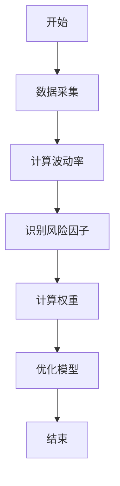
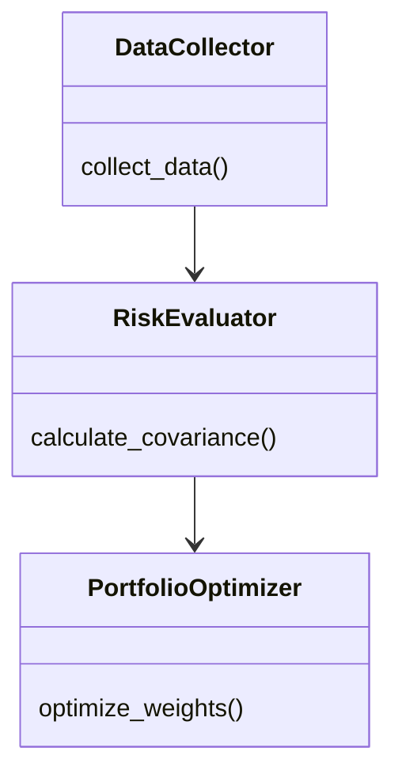
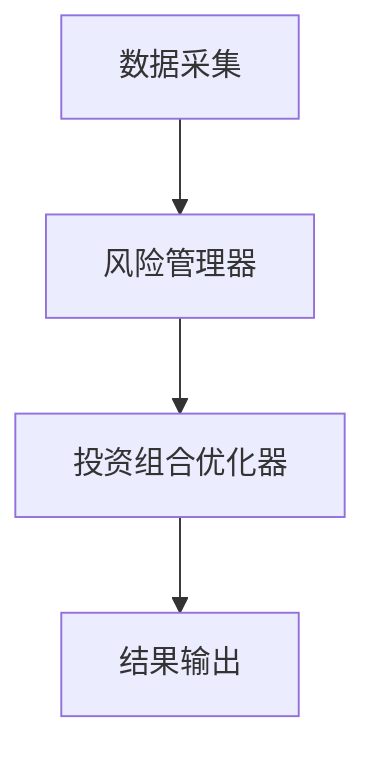
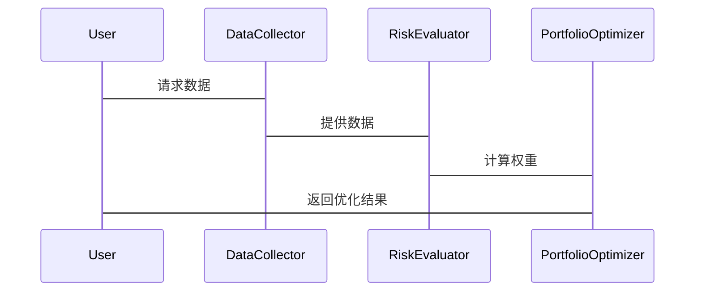

                 


# 特价股票投资中的风险平价理念应用

## 关键词：特价股票、风险平价、投资策略、风险控制、资产配置

## 摘要：本文探讨了在特价股票投资中应用风险平价理念的方法，分析了如何通过风险平价理念来优化资产配置，平衡风险，实现投资收益最大化。文章从背景介绍、核心概念、算法原理、系统分析、项目实战到最佳实践，详细阐述了风险平价理念在特价股票投资中的应用，为投资者提供了理论依据和实践指导。

---

# 特价股票投资中的风险平价理念应用

## 引言

在股票投资中，特价股票因其价格优势常被视为高回报的机会，但同时也伴随着较高的风险。传统的投资策略往往忽视风险的多样性，导致投资组合的风险过于集中，影响收益稳定性。风险平价理念作为一种新兴的投资方法，通过平衡不同风险因素，帮助投资者在控制风险的同时，实现收益最大化。

本文将从风险平价理念的背景、核心概念、算法原理、系统设计、实战应用等多个角度，详细分析其在特价股票投资中的应用，并通过具体案例和代码实现，帮助读者掌握这一方法。

---

## 第一部分：背景介绍

### 1. 特价股票投资的背景与现状

#### 1.1 特价股票的定义与特点

- **定义**：特价股票是指价格低于市场价值，具有潜在升值空间的股票。
- **特点**：
  - 价格低廉，适合小额投资者。
  - 市场波动较大，风险较高。
  - 常出现在市场低迷或公司困境时期。

#### 1.2 风险平价理念的起源与发展

- **起源**：风险平价理念源于现代投资组合理论，强调平衡不同资产的风险贡献。
- **发展**：随着金融市场的复杂化，风险平价理念逐渐从理论走向实践，成为机构投资者的重要工具。

#### 1.3 特价股票投资中的风险平价理念

- **结合点**：风险平价理念帮助投资者在特价股票投资中分散风险，平衡不同股票的权重。
- **优势**：通过量化风险因子，优化资产配置，降低整体投资风险。

---

## 第二部分：风险平价理念的核心概念与原理

### 2. 风险平价理念的核心概念

#### 2.1 风险平价的定义与核心要素

- **定义**：风险平价是指在投资组合中，根据各资产的风险贡献，调整其权重，使得每个资产的风险贡献相等。
- **核心要素**：
  - 资产配置：根据风险因子分配权重。
  - 风险因子：影响资产风险的关键因素，如波动率、流动性等。
  - 权重计算：通过优化模型确定各资产的权重。

#### 2.2 风险平价理念与资产配置的关系

- **关系**：风险平价理念指导资产配置，确保每个资产的风险贡献均衡。
- **对比**：传统投资策略注重收益，而风险平价注重风险控制。

#### 2.3 风险平价理念的数学模型

- **优化模型**：目标是最小化投资组合的总风险，同时确保各资产的风险贡献相等。
- **公式**：
  - 总风险：$$ \text{Total Risk} = \sum_{i=1}^n w_i^2 \sigma_i^2 $$
  - 风险贡献：$$ \text{Risk Contribution of Asset } i = w_i \cdot \sigma_i^2 \cdot \frac{1}{\sum_{j=1}^n w_j \sigma_j^2} $$

### 3. 风险平价理念与特价股票投资的结合

#### 3.1 特价股票投资中的风险因素分析

- **主要风险来源**：市场波动、公司基本面、流动性风险。
- **风险因子**：波动率、贝塔系数、流动性。

#### 3.2 风险平价理念在特价股票投资中的应用

- **资产配置**：根据风险因子分配各股票的权重。
- **风险控制**：通过平衡风险贡献，降低整体投资风险。

---

## 第三部分：风险平价理念的算法原理

### 4. 风险平价算法的核心步骤

#### 4.1 数据采集与预处理

- **数据来源**：历史价格、财务数据、市场指数。
- **预处理**：计算波动率、相关系数、协方差矩阵。

#### 4.2 风险因子的识别与量化

- **识别**：选取影响股票风险的关键因子。
- **量化**：计算各因子的权重。

#### 4.3 资产权重的计算与优化

- **优化模型**：使用拉格朗日乘数法求解最优权重。
- **权重计算**：确保各资产的风险贡献相等。

#### 4.4 算法流程图



### 5. 算法实现与案例分析

#### 5.1 Python代码实现

```python
import numpy as np

def risk_parity(weights, cov_matrix):
    risk_contribution = weights * np.diag(cov_matrix.dot(weights))
    return np.sum(risk_contribution ** 2)

def optimize(weights, cov_matrix):
    n = len(weights)
    return np.sum((weights - 1/n) ** 2)

# 示例数据
n = 5
cov_matrix = np.random.randn(n, n)
cov_matrix = cov_matrix.T.dot(cov_matrix)

# 初始权重
weights = np.array([1/5] * 5)

# 优化
from scipy.optimize import minimize

result = minimize(optimize, weights, method='SLSQP', bounds=[(0,1)]*5, constraints={'type': 'eq', 'fun': lambda x: sum(x)-1})
optimal_weights = result.x
```

#### 5.2 案例分析

- **案例**：假设投资组合包含5只特价股票，计算优化后的权重。
- **结果**：各股票的权重根据风险贡献调整，实现风险平价。

---

## 第四部分：系统分析与架构设计

### 6. 项目背景与系统功能设计

#### 6.1 项目背景

- **目标**：构建风险平价优化系统，辅助投资者进行特价股票投资。

#### 6.2 系统功能设计

- **数据采集模块**：获取股票数据。
- **风险评估模块**：计算波动率、协方差。
- **投资组合优化模块**：根据风险平价理念优化权重。

#### 6.3 领域模型类图



### 7. 系统架构设计

#### 7.1 系统架构图



#### 7.2 系统交互设计



---

## 第五部分：项目实战

### 8. 环境安装与代码实现

#### 8.1 环境安装

- **工具**：Python、NumPy、Scipy、Mermaid。
- **步骤**：安装所需库，配置开发环境。

#### 8.2 核心代码实现

- **数据采集**：使用Yahoo Finance获取股票数据。
- **风险评估**：计算协方差矩阵。
- **投资组合优化**：实现风险平价算法。

### 9. 实际案例分析

- **案例**：以某几只特价股票为例，计算优化后的权重，展示风险平价的应用效果。

### 10. 项目小结

- **总结**：通过系统分析和代码实现，验证了风险平价理念的有效性。
- **挑战**：数据获取、模型优化、计算效率等问题。

---

## 第六部分：最佳实践与小结

### 11. 最佳实践

- **数据质量**：确保数据准确，影响计算结果。
- **模型选择**：根据实际情况调整优化模型。
- **风险监控**：定期评估和调整投资组合。

### 12. 小结

风险平价理念为特价股票投资提供了新的思路，通过平衡风险因素，优化资产配置，帮助投资者在控制风险的同时，实现收益最大化。

### 13. 注意事项

- **市场波动**：特价股票市场波动较大，需谨慎操作。
- **数据依赖**：模型依赖历史数据，未来表现不确定。
- **计算复杂性**：优化过程计算复杂，需合理配置计算资源。

### 14. 拓展阅读

- 推荐书籍：《投资学》、《风险管理与金融创新》。
- 推荐文章：风险平价在机构投资中的应用。

---

## 作者信息

作者：AI天才研究院/AI Genius Institute & 禅与计算机程序设计艺术 /Zen And The Art of Computer Programming

---

通过本文的详细分析和实践，读者可以全面了解风险平价理念在特价股票投资中的应用，并通过实际案例和代码实现，掌握这一方法的具体操作步骤。希望本文能为投资者在特价股票投资中提供有价值的参考和指导。

