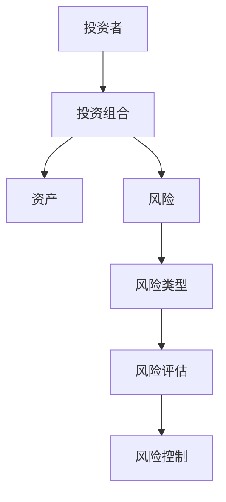
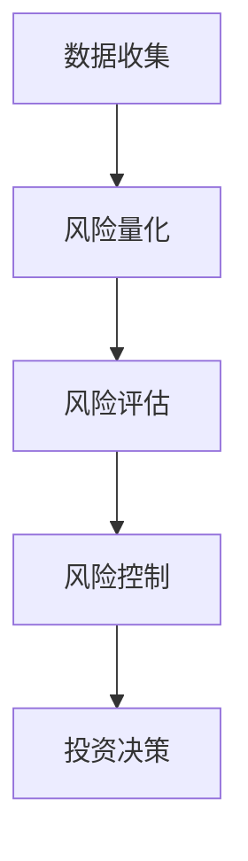
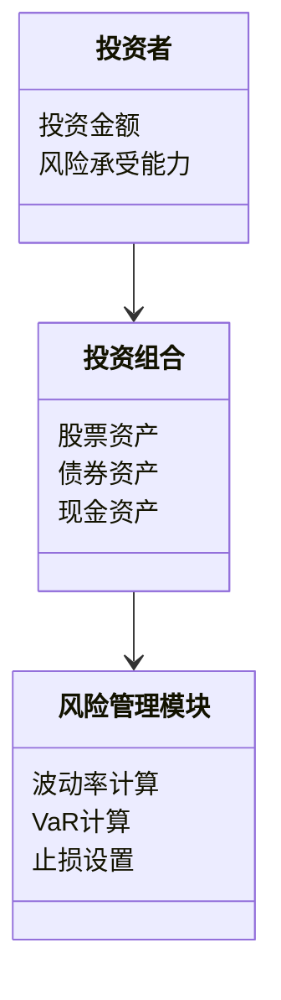
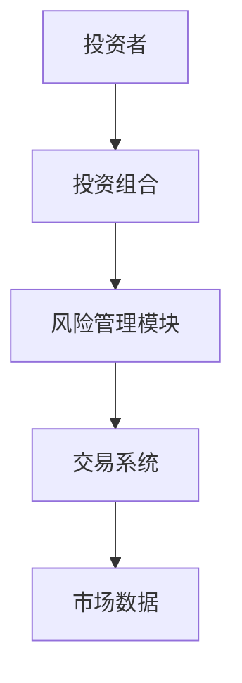
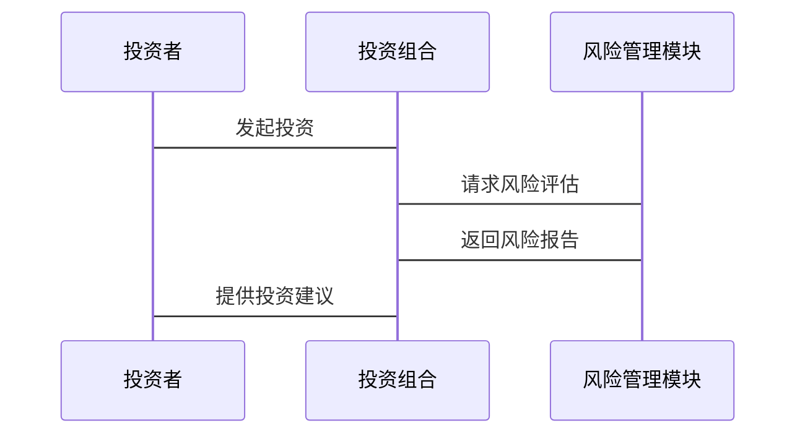

                 


---

# 特价股票投资中的风险管理

## 关键词：股票投资，风险管理，特价股票，投资策略，风险控制

## 摘要：  
特价股票投资是指以低于市场价买入股票的投资方式，其核心在于利用市场的低估机会获取超额收益。然而，特价股票投资也伴随着较高的风险，因此风险管理在这一投资策略中显得尤为重要。本文将从风险管理的基本原理、特价股票投资中的特殊风险、风险评估与控制策略、以及实际案例分析等方面展开讨论，帮助投资者在追求超额收益的同时，有效控制投资风险。

---

# 目录大纲

## 第一章：特价股票投资与风险管理概述

### 1.1 特价股票投资的定义与特点
- 1.1.1 特价股票的定义
- 1.1.2 特价股票投资的特点
  - 市场低估机会
  - 较高的波动性
  - 高风险与高回报并存
- 1.1.3 特价股票投资的优势与劣势
  - 优势：潜在的高回报，低位买入机会
  - 劣势：流动性风险，信息不对称，公司基本面不确定性

### 1.2 风险管理的核心概念
- 1.2.1 风险的定义与分类
  - 市场风险、流动性风险、信用风险、操作风险
- 1.2.2 风险管理的目标与原则
  - 保护资本，控制损失，追求风险调整后的收益
- 1.2.3 风险与收益的平衡
  - 风险与收益的正相关关系
  - 风险调整后的收益（夏普比率、特雷诺比率）

### 1.3 特价股票投资中的风险管理重要性
- 1.3.1 风险管理在投资中的作用
  - 控制损失，避免重大亏损
  - 确保投资组合的稳定性
- 1.3.2 特价股票投资中的特殊风险
  - 市场波动风险
  - 公司基本面突变风险
  - 流动性风险
- 1.3.3 风险管理与投资成功的关系
  - 风险管理是投资成功的关键因素
  - 长期稳定的回报来源于有效的风险管理

### 1.4 本章小结
- 特价股票投资的高回报与高风险并存
- 风险管理是确保投资成功的核心要素
- 下一章将深入探讨风险管理的核心原理与策略

---

## 第二章：风险管理的核心概念与联系

### 2.1 风险管理的核心原理
- 2.1.1 风险的量化方法
  - 波动率的计算（标准差、方差）
  - 最大回撤（Maximum Drawdown）
- 2.1.2 风险的评估模型
  - VaR（Value at Risk）
  - CVaR（Conditional Value at Risk）
- 2.1.3 风险的控制策略
  - 多元化投资
  - 仓位控制（Position Sizing）
  - 止损策略（Stop Loss）

### 2.2 风险管理的核心要素对比表格
| 风险类型 | 风险评估 | 风险控制策略 | 适用场景 |
|----------|----------|--------------|----------|
| 市场风险 | 波动率、VaR | 多元化、分散投资 | 特价股票投资 |
| 流动性风险 | 成交量、买卖价差 | 留长期限、避免频繁交易 | 小盘股投资 |
| 信用风险 | 公司财务状况、债券评级 | 严格筛选、分散投资 | 中期债券投资 |
| 操作风险 | 系统稳定性、人员操作 | 制度化流程、技术系统 | 交易执行 |

### 2.3 风险管理的ER实体关系图


### 2.4 本章小结
- 风险管理的核心在于量化、评估和控制风险
- 不同类型的风险需要采取不同的管理策略
- 风险管理的系统性是确保投资组合稳定性的关键

---

## 第三章：风险管理的算法原理讲解

### 3.1 风险管理的算法原理
- 3.1.1 风险管理算法的概述
  - 风险量化、评估和控制的系统化方法
  - 使用概率统计和数学模型进行风险分析
- 3.1.2 风险管理算法的核心步骤
  1. 数据收集与整理
  2. 风险量化（波动率、VaR等）
  3. 风险评估（情景分析、压力测试）
  4. 风险控制（止损、分散投资）
- 3.1.3 风险管理算法的优缺点
  - 优点：系统性、科学性
  - 缺点：忽略市场非理性因素，模型风险

### 3.2 风险管理算法的mermaid


### 3.3 风险管理的数学模型与公式
- 波动率的计算公式：
  $$ \sigma = \sqrt{\frac{1}{n-1} \sum_{i=1}^{n} (x_i - \bar{x})^2} $$
- VaR公式：
  $$ VaR = \alpha \cdot \sigma $$
  其中，$\alpha$是对应于置信水平的分位数
- 最大回撤（Maximum Drawdown）：
  $$ \text{MaxDD} = \max_{t} ( \max_{0 \leq s \leq t} P_s - P_t ) $$

### 3.4 本章小结
- 风险管理算法为投资者提供了科学的风险分析工具
- 数学模型在风险量化和评估中起着关键作用
- 需要结合实际情况对模型进行调整和优化

---

## 第四章：系统架构设计与风险管理

### 4.1 系统架构设计
- 4.1.1 领域模型mermaid类图


- 4.1.2 系统架构设计mermaid架构图


- 4.1.3 系统接口设计
  - 输入接口：投资者风险偏好、投资金额
  - 输出接口：风险评估报告、投资建议
- 4.1.4 系统交互mermaid序列图


### 4.2 本章小结
- 系统架构设计为风险管理提供了技术实现的基础
- 风险管理模块是整个投资系统的核心部分
- 通过系统化的架构设计，可以提高风险管理的效率和准确性

---

## 第五章：项目实战与风险管理应用

### 5.1 项目实战环境安装
- 需要的工具：
  - Python编程语言
  - 数据分析库（Pandas, NumPy）
  - 可视化库（Matplotlib, Seaborn）
  - 风险管理库（如Pyfolio）

### 5.2 核心代码实现
- 波动率计算代码：
  ```python
  import pandas as pd
  import numpy as np

  # 示例数据
  data = pd.Series([1, 2, 3, 4, 5])
  mean = data.mean()
  variance = np.sum((data - mean) ** 2) / (len(data) - 1)
  std_deviation = np.sqrt(variance)
  print("波动率：", std_deviation)
  ```
- VaR计算代码：
  ```python
  import numpy as np
  np.random.seed(123)
  returns = np.random.normal(0, 1, 1000)
  sorted_returns = np.sort(returns)
  alpha = 0.95
  var = sorted_returns[int(alpha * len(sorted_returns))]
  print("VaR：", var)
  ```

### 5.3 案例分析与解读
- 案例背景：
  - 投资者以特价买入一只小盘股，预期回报高，但风险也较大
- 风险评估：
  - 计算该股票的历史波动率和VaR
  - 分析市场风险、流动性风险
- 风险管理策略：
  - 设置止损点
  - 分散投资，避免过度集中
  - 定期复检投资组合

### 5.4 本章小结
- 通过实际案例分析，展示了风险管理在特价股票投资中的应用
- 核心代码的实现帮助投资者更好地理解和应用风险管理模型
- 风险管理是投资成功的关键，需要持续关注和优化

---

## 第六章：风险管理中的心理学因素

### 6.1 心理因素对风险管理的影响
- 6.1.1 投资者心理偏差
  - 过度自信
  - �uant的损失厌恶
  - 过度交易倾向
- 6.1.2 心理因素对决策的影响
  - 心理压力下的非理性决策
  - 情绪波动对风险管理的干扰

### 6.2 克服心理偏差的策略
- 6.2.1 建立理性的决策框架
  - 避免情绪化决策
  - 严格按照投资计划执行
- 6.2.2 提高自我认知
  - 认识自己的心理偏差
  - 通过训练提高心理韧性
- 6.2.3 建立有效的心理调节机制
  - 定期复盘和反思
  - 寻求专业的心理辅导

### 6.3 本章小结
- 心理因素在风险管理中起着重要作用
- 投资者需要克服心理偏差，建立理性的决策机制
- 通过自我调节和专业帮助，提高风险管理的效果

---

## 第七章：总结与展望

### 7.1 全文总结
- 特价股票投资的高回报与高风险并存
- 风险管理是确保投资成功的关键
- 系统化的风险管理策略能够有效控制风险

### 7.2 未来展望
- 风险管理技术的进一步发展
  - 人工智能在风险管理中的应用
  - 大数据技术的支持
- 投资者教育的重要性
  - 提高风险管理意识
  - 培养理性的投资心态

### 7.3 致谢
- 感谢读者的关注与支持
- 感谢在创作过程中提供帮助的团队成员

---

## 作者：AI天才研究院/AI Genius Institute & 禅与计算机程序设计艺术 /Zen And The Art of Computer Programming

---

以上是《特价股票投资中的风险管理》的详细目录大纲，涵盖了从基础概念到系统设计、项目实战以及心理学因素等多个方面。每一章都详细展开了核心知识点，并结合实际案例和数学模型，帮助读者全面理解和应用风险管理的策略和方法。

