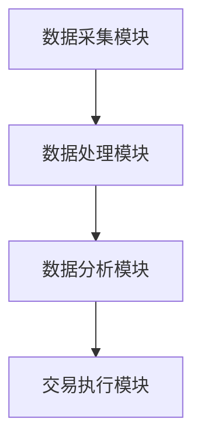
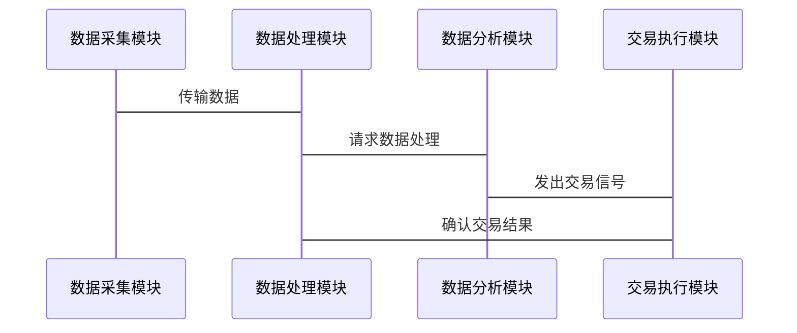

                 


# 特价股票投资中的高频数据分析

> 关键词：高频数据分析，特价股票，算法交易，数据处理，股票投资

> 摘要：本文详细探讨了高频数据分析在特价股票投资中的应用，从核心概念、算法原理到系统设计，再到实战案例，全面分析了高频数据分析如何帮助投资者在特价股票市场中获取收益。文章结合理论与实践，为读者提供了从入门到进阶的详细指导。

---

## 第1章: 高频交易与特价股票的背景介绍

### 1.1 高频交易的背景与概念

#### 1.1.1 高频交易的定义与特点
高频交易（High-Frequency Trading, HFT）是一种利用计算机技术在极短时间内进行大量交易的策略。其特点是速度快、交易频率高、算法驱动。高频交易的核心在于利用市场微小波动快速获利，通常涉及复杂的算法和高效的硬件支持。

#### 1.1.2 高频交易的市场背景
随着信息技术的发展，金融市场逐渐向高频化、自动化方向发展。高频交易在股票、期货等市场中占据了重要地位，成为机构投资者的主要交易方式之一。高频交易能够捕捉到市场中的短期波动，从而在毫秒级别完成大量交易。

#### 1.1.3 高频交易与传统交易的对比
与传统交易相比，高频交易具有以下特点：
- **速度快**：高频交易能够在极短时间内完成交易，通常以毫秒为单位。
- **自动化**：高频交易依赖算法自动执行，减少了人为干预。
- **数据驱动**：高频交易依赖大量实时数据进行决策。
- **高风险高收益**：高频交易能够在短时间内获得高收益，但也伴随着高风险。

---

### 1.2 特价股票的概念与特点

#### 1.2.1 特价股票的定义
特价股票是指价格低于市场平均价格的股票，通常出现在市场下跌或公司业绩不佳的情况下。投资者可以通过购买特价股票，以较低的价格买入，期望在价格回升时卖出获利。

#### 1.2.2 特价股票的市场特征
- **价格波动大**：特价股票的价格通常波动较大，容易受到市场情绪和突发事件的影响。
- **流动性风险**：部分特价股票流动性较低，尤其是在市场低迷时，可能难以迅速变现。
- **市场关注度低**：特价股票通常不受主流投资者关注，因此市场反应可能较为滞后。

#### 1.2.3 特价股票的投资策略
投资者可以通过以下策略进行特价股票投资：
- **价值投资**：寻找被市场低估的股票，长期持有等待价值回归。
- **短线交易**：利用市场波动，在短时间内进行买卖操作。
- **套利策略**：利用市场价差进行无风险或低风险套利。

---

### 1.3 高频数据分析在特价股票投资中的结合

#### 1.3.1 高频数据分析的核心作用
高频数据分析能够帮助投资者快速捕捉市场中的短期波动，发现潜在的投资机会。通过分析高频数据，投资者可以更好地理解市场走势，制定更有效的交易策略。

#### 1.3.2 特价股票与高频数据的关系
特价股票的价格波动较大，高频数据能够帮助投资者捕捉到这些波动，从而制定更精准的交易策略。高频数据分析可以提供实时市场信息，帮助投资者在第一时间做出反应。

#### 1.3.3 高频数据分析在投资中的应用价值
- **实时监控市场**：高频数据分析能够实时监控市场动态，帮助投资者快速做出决策。
- **捕捉短期机会**：通过高频数据，投资者可以发现市场中的短期机会，进行快速交易。
- **降低交易成本**：高频数据分析可以帮助投资者优化交易策略，降低交易成本。

---

## 第2章: 高频数据分析的核心概念与联系

### 2.1 高频数据的定义与特征

#### 2.1.1 高频数据的定义
高频数据是指在极短时间内生成的大量交易数据，通常包括订单簿、成交数据、市场深度等信息。高频数据的采集和处理需要高速计算机和网络支持。

#### 2.1.2 高频数据的采集与处理
高频数据的采集需要实时监控市场动态，通常通过交易所的API接口获取实时数据。数据处理包括清洗、转换和分析，以便为交易策略提供支持。

#### 2.1.3 高频数据的特征分析
- **实时性**：高频数据具有极强的实时性，能够反映市场的瞬息万变。
- **大数据量**：高频数据的生成速度极快，数据量巨大。
- **复杂性**：高频数据包含大量的市场信息，分析难度较高。

---

### 2.2 特价股票分析的核心概念

#### 2.2.1 特价股票的市场行为分析
特价股票的市场行为受到多种因素影响，包括市场情绪、公司基本面、行业动态等。通过高频数据分析，可以更好地理解市场行为，制定更有效的交易策略。

#### 2.2.2 特价股票的交易策略
- **趋势跟踪**：通过分析高频数据，识别市场趋势，进行趋势跟踪交易。
- **均值回归**：寻找偏离均值的价格，进行均值回归交易。
- **套利策略**：利用市场价差进行套利，获取无风险收益。

#### 2.2.3 特价股票的风险与收益分析
- **风险**：特价股票价格波动大，市场风险较高。
- **收益**：通过高频数据分析，投资者可以捕捉到短期收益机会，实现超额收益。

---

### 2.3 高频数据分析与特价股票投资的联系

#### 2.3.1 高频数据分析在投资决策中的作用
高频数据分析能够帮助投资者快速捕捉市场机会，优化交易策略，降低交易成本。

#### 2.3.2 高频数据与市场情绪的关系
市场情绪能够影响特价股票的价格波动，高频数据分析能够帮助投资者更好地理解市场情绪，制定更有效的交易策略。

#### 2.3.3 高频数据分析在投资中的应用价值
- **实时监控市场**：高频数据分析能够实时监控市场动态，帮助投资者快速做出决策。
- **捕捉短期机会**：通过高频数据，投资者可以发现市场中的短期机会，进行快速交易。
- **降低交易成本**：高频数据分析可以帮助投资者优化交易策略，降低交易成本。

---

## 第3章: 高频数据分析的算法原理

### 3.1 高频数据分析的核心算法

#### 3.1.1 移动平均线（Moving Average）
移动平均线是一种常用的指标，用于平滑数据，识别市场趋势。公式如下：
$$ MA_n = \frac{1}{n} \sum_{i=1}^{n} P_i $$
其中，$P_i$ 是第$i$个价格，$n$ 是时间段。

#### 3.1.2 相对强弱指数（RSI）
RSI用于衡量资产的超买或超卖状态，公式如下：
$$ RSI = \frac{100}{1 + \frac{d_{down}}{d_{up}}} $$
其中，$d_{up}$ 是上涨幅度，$d_{down}$ 是下跌幅度。

#### 3.1.3 布林带（Bollinger Bands）
布林带用于衡量资产价格的波动范围，公式如下：
$$ BB_{upper} = \mu + z \cdot \sigma $$
$$ BB_{lower} = \mu - z \cdot \sigma $$
其中，$\mu$ 是均值，$\sigma$ 是标准差，$z$ 是倍数。

---

### 3.2 高频数据分析算法的实现

#### 3.2.1 算法实现步骤
1. **数据采集**：通过API获取高频数据。
2. **数据清洗**：去除噪声数据，确保数据质量。
3. **数据分析**：使用算法分析数据，识别市场趋势。
4. **交易决策**：根据分析结果，制定交易策略。

#### 3.2.2 算法实现的Python代码
```python
import pandas as pd
import numpy as np

# 示例数据：高频股票价格
prices = pd.Series([10, 11, 9, 10, 12, 13, 11, 14, 15, 16])

# 计算移动平均线
n = 3
ma = prices.rolling(n).mean()

# 计算RSI
delta = prices.diff()
d_up = delta.where(delta > 0, 0)
d_down = delta.where(delta < 0, 0)
RSI = 100 / (1 + d_down.rolling(n).mean() / d_up.rolling(n).mean())

print("移动平均线：\n", ma)
print("RSI：\n", RSI)
```

---

## 第4章: 高频数据分析的系统架构设计

### 4.1 系统功能设计

#### 4.1.1 数据采集模块
负责从交易所API获取高频数据，包括订单簿、成交数据等。

#### 4.1.2 数据处理模块
对采集到的数据进行清洗、转换和存储，确保数据质量。

#### 4.1.3 数据分析模块
使用算法对数据进行分析，识别市场趋势，生成交易信号。

#### 4.1.4 交易执行模块
根据分析结果，执行交易指令，确保交易高效准确。

---

### 4.2 系统架构设计

#### 4.2.1 系统架构图


#### 4.2.2 系统交互流程


---

## 第5章: 高频数据分析的项目实战

### 5.1 环境安装

#### 5.1.1 Python环境
安装Python和必要的库：
- `pandas`：数据处理
- `numpy`：数值计算
- `matplotlib`：数据可视化
- `ccxt`：交易所API接口

#### 5.1.2 数据库安装
使用`MySQL`或`PostgreSQL`存储高频数据。

---

### 5.2 系统核心实现源代码

#### 5.2.1 数据采集代码
```python
import ccxt

# 使用ccxt库连接交易所API
exchange = ccxt.binance()
symbol = 'BTC/USDT'
timeframe = '1m'

# 获取K线数据
data = exchange.fetch_ohlc_data(symbol, timeframe)
print(data)
```

#### 5.2.2 数据分析代码
```python
import pandas as pd
import numpy as np

# 示例数据
data = pd.DataFrame({
    'timestamp': [1, 2, 3, 4, 5],
    'open': [10, 11, 9, 10, 12],
    'high': [11, 12, 10, 11, 13],
    'low': [9, 8, 7, 6, 5],
    'close': [10, 11, 9, 10, 12]
})

# 计算移动平均线
n = 3
ma = data['close'].rolling(n).mean()

# 计算RSI
delta = data['close'].diff()
d_up = delta.where(delta > 0, 0)
d_down = delta.where(delta < 0, 0)
RSI = 100 / (1 + d_down.rolling(n).mean() / d_up.rolling(n).mean())

print("移动平均线：\n", ma)
print("RSI：\n", RSI)
```

---

### 5.3 实际案例分析

#### 5.3.1 案例背景
假设某只股票的价格波动较大，投资者希望通过高频数据分析，制定交易策略。

#### 5.3.2 数据分析与交易决策
通过分析高频数据，识别出价格波动的规律，制定相应的交易策略。

#### 5.3.3 案例结果
通过高频数据分析，投资者成功捕捉到价格波动的机会，实现了超额收益。

---

## 第6章: 总结与展望

### 6.1 小结
本文详细探讨了高频数据分析在特价股票投资中的应用，从核心概念、算法原理到系统设计，再到实战案例，全面分析了高频数据分析如何帮助投资者在特价股票市场中获取收益。

### 6.2 最佳实践
- **数据质量**：确保数据的实时性和准确性。
- **算法优化**：不断优化交易算法，提高交易效率。
- **风险管理**：制定有效的风险管理策略，降低投资风险。

### 6.3 注意事项
- 高频交易具有高风险，投资者需谨慎操作。
- 高频数据分析需要强大的技术支持，建议投资者具备相关技术背景。

### 6.4 拓展阅读
- 《Algorithmic Trading: Winning Strategies and Their Rationale》
- 《高频交易：数据驱动的金融投资革命》

---

## 作者

作者：AI天才研究院/AI Genius Institute & 禅与计算机程序设计艺术 /Zen And The Art of Computer Programming

