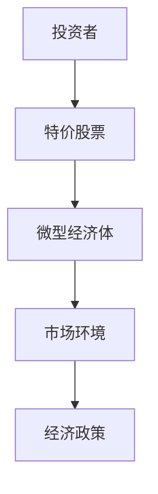
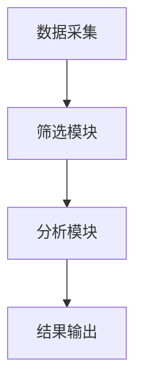
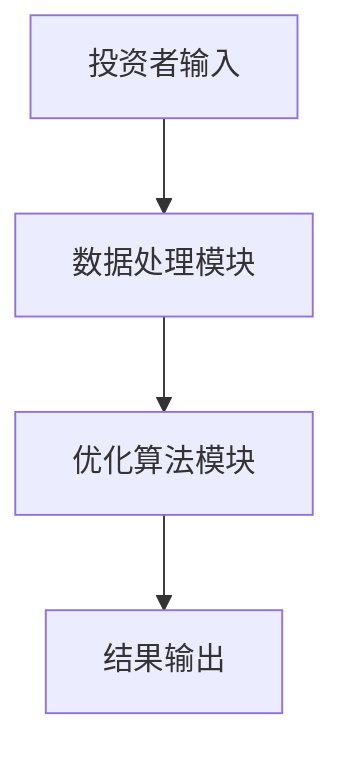

                 


# 特价股票投资策略在微型经济体中的适用性探讨

> 关键词：特价股票，微型经济体，投资策略，算法原理，系统架构

> 摘要：本文探讨了特价股票投资策略在微型经济体中的适用性。通过分析特价股票的基本概念、微型经济体的特征，以及两者的结合，本文提出了适用于微型经济体的投资策略，并通过数学模型和算法进行了验证。文章还结合实际案例，展示了策略的实施过程，并提出了优化建议。

---

# 第1章: 特价股票与微型经济体概述

## 1.1 特价股票的基本概念

### 1.1.1 特价股票的定义

特价股票是指价格被市场低估，具有较大潜在增值空间的股票。通常，这类股票的市盈率（P/E）或市净率（P/B）低于行业平均水平，表明其估值可能低于其实际价值。

### 1.1.2 特价股票的特征与分类

- **特征**：
  - 低估值：市盈率、市净率等指标低于行业平均水平。
  - 高股息率：部分特价股票公司会向股东分配较高股息。
  - 高ROE：净资产收益率较高，表明公司盈利能力强。
  
- **分类**：
  - 按行业：如金融、制造业等。
  - 按市值：如小盘股、中盘股等。
  - 按地域：如区域性企业的股票。

### 1.1.3 特价股票的投资价值分析

特价股票的投资价值主要体现在其低估的市场价格和较高的潜在回报。投资者可以通过分析公司的基本面指标（如ROE、净利润增长率）来判断其投资价值。

---

## 1.2 微型经济体的定义与特点

### 1.2.1 微型经济体的定义

微型经济体是指经济规模较小、市场参与者有限的经济体系，通常包括小型企业、地方性市场等。微型经济体具有规模小、灵活性高、依赖性强等特点。

### 1.2.2 微型经济体的经济结构特征

- **规模小**：经济活动集中在特定领域或地区。
- **市场参与者少**：企业数量有限，市场竞争力较弱。
- **依赖性强**：容易受到外部经济波动的影响。

### 1.2.3 微型经济体的市场特点

- **流动性低**：市场交易量小，股票流动性差。
- **信息不对称**：投资者获取信息的渠道有限。
- **波动性高**：市场容易受到外部因素影响，波动较大。

---

## 1.3 特价股票与微型经济体的结合

### 1.3.1 特价股票在微型经济体中的应用背景

微型经济体中的企业通常市值较小，股票价格也可能被低估。因此，特价股票的投资策略在微型经济体中具有较大的应用潜力。

### 1.3.2 特价股票与微型经济体的关联性分析

- **市场定位**：微型经济体中的企业可能尚未被市场充分挖掘，存在较大的投资机会。
- **风险与收益**：微型经济体中的特价股票风险较高，但潜在收益也较大。

### 1.3.3 特价股票在微型经济体中的潜在优势

- **低估值**：微型经济体中的企业可能因市场关注度低而被低估。
- **高增长潜力**：部分微型经济体中的企业可能具有较高的增长潜力。
- **灵活性**：微型经济体中的企业可能更容易调整经营策略以适应市场变化。

---

# 第2章: 特价股票投资策略的核心概念与联系

## 2.1 特价股票投资策略的原理

### 2.1.1 特价股票投资的基本原理

特价股票投资的核心在于寻找被市场低估的股票。投资者通过分析公司的基本面指标（如市盈率、市净率、ROE等）来判断股票的估值是否合理。

### 2.1.2 投资策略的核心要素

- **估值指标**：市盈率、市净率、ROE等。
- **行业分析**：分析行业发展趋势，选择具有增长潜力的行业。
- **公司基本面**：分析公司的财务状况、盈利能力等。

### 2.1.3 策略的适用范围与边界

- **适用范围**：适用于市场中被低估的股票。
- **边界**：不适用于市场过热或公司基本面较差的情况。

---

## 2.2 核心概念对比分析

### 2.2.1 特价股票与普通股票的对比

| 特性 | 特价股票 | 普通股票 |
|------|----------|----------|
| 估值 | 通常被低估 | 估值合理或高估 |
| 风险 | 风险较高 | 风险适中 |
| 收益 | 潜在收益较高 | 收益较为稳定 |

### 2.2.2 微型经济体与大型经济体的对比

| 特性 | 微型经济体 | 大型经济体 |
|------|----------|------------|
| 规模 | 小 | 大 |
| 市场参与者 | 少 | 多 |
| 波动性 | 高 | 较低 |
| 信息不对称 | 显著 | 较小 |

### 2.2.3 投资策略的优劣势分析

- **优势**：
  - 投资门槛低。
  - 潜在收益高。
- **劣势**：
  - 市场流动性差。
  - 信息获取困难。

---

## 2.3 实体关系架构图



---

# 第3章: 特价股票投资策略的算法原理

## 3.1 算法原理概述

特价股票投资策略的核心在于通过算法筛选出被低估的股票。常用的算法包括低市盈率法、低市净率法等。

### 3.1.1 算法流程

1. **数据收集**：收集目标市场的股票数据，包括市盈率、市净率、ROE等指标。
2. **筛选条件**：设定筛选条件，如市盈率低于行业平均水平。
3. **排序与选择**：根据筛选条件对股票进行排序，选择符合条件的股票。

### 3.1.2 算法实现

```python
def find_cheap_stocks(data, industry_avg):
    selected = []
    for stock in data:
        if stock['PE'] < industry_avg['PE'] and stock['ROE'] > industry_avg['ROE']:
            selected.append(stock)
    return selected
```

### 3.1.3 数学模型

股票的潜在价值可以通过以下公式进行估算：

$$
\text{潜在价值} = \text{市盈率} \times \text{行业平均市盈率} \times \text{净利润}
$$

---

## 3.2 系统分析与架构设计方案

### 3.2.1 问题场景介绍

在微型经济体中，投资者需要通过算法筛选出被低估的股票，同时考虑市场波动和经济政策的影响。

### 3.2.2 系统功能设计

- **数据采集模块**：收集股票数据。
- **筛选模块**：根据筛选条件筛选股票。
- **分析模块**：分析股票的潜在价值。

### 3.2.3 系统架构设计



---

## 3.3 项目实战

### 3.3.1 环境安装

安装必要的Python库：

```bash
pip install pandas numpy matplotlib
```

### 3.3.2 核心实现源代码

```python
import pandas as pd

# 数据加载
data = pd.read_csv('stocks.csv')

# 筛选条件
selected_stocks = data[(data['PE'] < data['PE'].mean()) & (data['ROE'] > data['ROE'].mean())]

# 输出结果
print(selected_stocks)
```

### 3.3.3 实际案例分析

假设我们有一个包含微型经济体中股票数据的CSV文件，我们可以使用上述代码筛选出符合筛选条件的股票。

### 3.3.4 代码应用解读与分析

通过上述代码，我们可以筛选出市盈率低于行业平均水平且ROE高于行业平均水平的股票，这些股票可能是被低估的股票。

---

## 3.4 小结

通过算法和系统架构设计，我们可以有效地筛选出微型经济体中的特价股票，为投资者提供科学的投资依据。

---

# 第4章: 微型经济体中的投资策略优化

## 4.1 策略优化思路

### 4.1.1 动态调整策略

根据市场环境的变化，动态调整筛选条件。

### 4.1.2 风险控制策略

通过分散投资、设置止损点等方法控制投资风险。

### 4.1.3 信息获取优化

通过多种渠道获取信息，减少信息不对称的影响。

---

## 4.2 策略优化的数学模型

$$
\text{最优投资组合} = \argmin \sum_{i=1}^{n} w_i \times \text{风险指标}
$$

---

## 4.3 优化策略的系统实现

### 4.3.1 系统接口设计

- **输入接口**：接收股票数据和筛选条件。
- **输出接口**：输出优化后的投资组合。

### 4.3.2 系统交互流程



---

## 4.4 优化策略的案例分析

通过优化策略，投资者可以在微型经济体中实现更高效的投资，降低风险并提高收益。

---

# 第5章: 结论与展望

## 5.1 研究结论

通过本文的分析和研究，我们可以得出以下结论：

- 特价股票投资策略在微型经济体中具有较大的适用性。
- 通过算法和系统架构设计，可以有效地筛选出被低估的股票。
- 优化策略可以进一步提高投资的效率和收益。

## 5.2 研究的局限性

- 数据获取困难。
- 市场波动较大，影响策略的稳定性。
- 算法的适应性有限，需要根据实际情况进行调整。

## 5.3 未来研究方向

- 研究更复杂的算法，如机器学习算法。
- 探讨微型经济体中的其他投资策略。
- 提高数据获取的效率和准确性。

---

# 作者

作者：AI天才研究院/AI Genius Institute & 禅与计算机程序设计艺术 /Zen And The Art of Computer Programming

