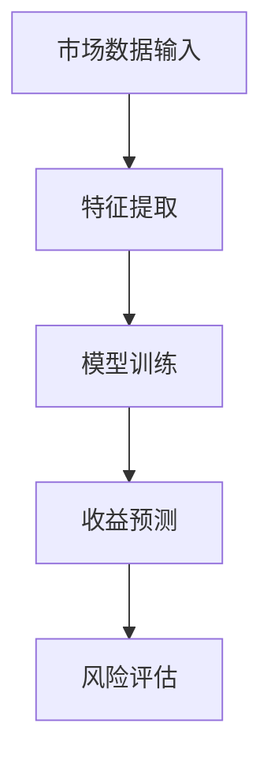

                 


# 特价股票投资策略在数字新兴市场中的适用性探讨

> 关键词：特价股票，数字新兴市场，投资策略，适用性分析，风险管理

> 摘要：本文探讨了特价股票投资策略在数字新兴市场中的适用性。首先，介绍了特价股票的基本概念、特点及其与传统股票的区别。接着，分析了数字新兴市场的特点与现状，包括市场规模、结构和参与者。然后，详细探讨了特价股票投资策略在数字新兴市场的关联性、可行性及其风险与挑战。通过构建数学模型与算法分析，提出了量化交易策略，并通过实际案例展示了策略的实现过程。最后，总结了最佳实践、注意事项与未来研究方向。

---

## 第1章：特价股票投资策略的基本概念

### 1.1 特价股票的定义与特点
特价股票是指在特定条件下以低于市场价出售的股票，通常用于吸引投资者或清理库存。其特点包括高波动性、高风险、高潜在收益等。与传统股票相比，特价股票具有更强的短期价格敏感性和市场流动性。

### 1.2 特价股票投资策略的核心要素
- **投资目标**：明确投资目的，如短期套利或长期增值。
- **策略分类**：包括价差套利、事件驱动投资等。
- **实施步骤**：从市场调研、策略制定到风险控制。

### 1.3 特价股票投资策略的优缺点分析
- **优点**：高收益潜力、操作灵活。
- **缺点**：高风险、市场波动剧烈、信息不对称。
- **适用场景**：适合高风险承受能力和短期投资者。

---

## 第2章：数字新兴市场的特点与现状

### 2.1 数字新兴市场的定义与范围
数字新兴市场指基于互联网和数字化技术的新兴经济领域，涵盖科技、金融科技、电子商务等领域。其参与者包括初创企业、科技巨头和投资者。

### 2.2 数字新兴市场的现状分析
- **市场规模**：增长迅速，吸引大量投资。
- **市场结构**：高度分散，竞争激烈。
- **市场风险**：波动性大，政策监管不确定性高。

### 2.3 数字新兴市场与传统市场的对比
| 特性       | 数字新兴市场 | 传统市场 |
|------------|--------------|----------|
| 市场结构     | 分散化       | 集中化   |
| 技术依赖     | 高           | 低       |
| 参与者       | 多元化       | 有限     |

---

## 第3章：特价股票投资策略在数字新兴市场中的适用性分析

### 3.1 特价股票与数字新兴市场的关联性
- **关联性**：数字新兴市场的波动性为特价股票提供了套利机会。
- **影响因素**：技术进步、政策变化、市场需求等。

### 3.2 特价股票投资策略的可行性
- **模型构建**：基于技术分析和市场情绪预测。
- **数据驱动**：利用大数据分析优化策略。

### 3.3 风险与挑战
- **市场波动**：数字新兴市场的高波动性增加策略复杂性。
- **信息透明度**：信息不对称影响策略效果。
- **政策风险**：监管政策变化可能影响市场环境。

---

## 第4章：特价股票投资策略的数学模型与算法分析

### 4.1 特价股票投资策略的数学模型
- **收益预测模型**：基于历史数据的线性回归模型。
$$
R = \beta_0 + \beta_1X + \epsilon
$$
其中，$R$ 为收益，$X$ 为市场变量，$\epsilon$ 为误差项。

- **风险评估模型**：使用VaR（Value at Risk）模型评估潜在损失。

### 4.2 算法实现
```python
import numpy as np
from sklearn.linear_model import LinearRegression

# 数据准备
X = np.array([[x1], [x2], ...])  # 市场变量
y = np.array([y1, y2, ...])      # 收益

# 模型训练
model = LinearRegression()
model.fit(X, y)

# 预测收益
predicted_R = model.predict(new_X)
```

### 4.3 算法流程图


---

## 第5章：系统分析与架构设计

### 5.1 系统功能设计
- **数据采集**：实时采集市场数据。
- **策略执行**：根据模型结果执行交易。
- **风险监控**：实时监控并调整策略。

### 5.2 系统架构图


### 5.3 接口设计
- **API接口**：提供数据接口，方便与其他系统集成。
- **用户界面**：直观展示数据和交易结果。

---

## 第6章：项目实战与案例分析

### 6.1 项目背景
以某金融科技公司为例，设计一个基于数字新兴市场的特价股票投资系统。

### 6.2 核心实现
- **数据采集**：使用爬虫技术获取实时数据。
- **策略实现**：基于机器学习的预测模型。
- **交易执行**：自动化交易系统。

### 6.3 案例分析
通过具体案例展示策略的实施过程和结果，分析其优缺点及改进方向。

---

## 第7章：总结与展望

### 7.1 最佳实践
- **风险管理**：制定严格的止损策略。
- **数据质量**：确保数据准确性和实时性。
- **技术进步**：持续优化算法和模型。

### 7.2 注意事项
- **市场变化**：密切关注政策和技术变化。
- **投资者教育**：提高投资者的市场认知和风险意识。

### 7.3 未来研究方向
- **多策略组合**：探索多种策略的组合优化。
- **智能风控**：利用AI技术提升风险管理能力。

---

## 作者：AI天才研究院/AI Genius Institute & 禅与计算机程序设计艺术 /Zen And The Art of Computer Programming

---

通过以上分析，本文系统地探讨了特价股票投资策略在数字新兴市场中的适用性，从理论到实践，为投资者提供了有价值的参考和指导。

