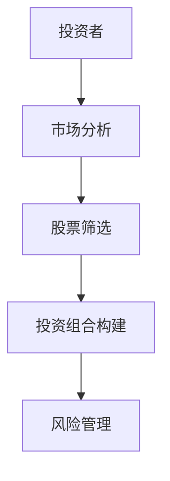
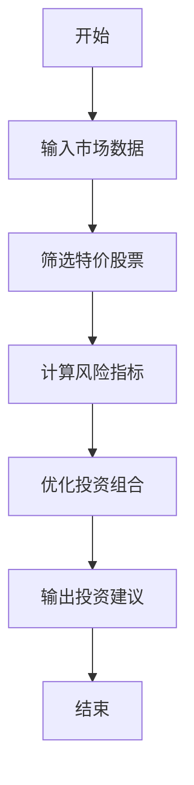
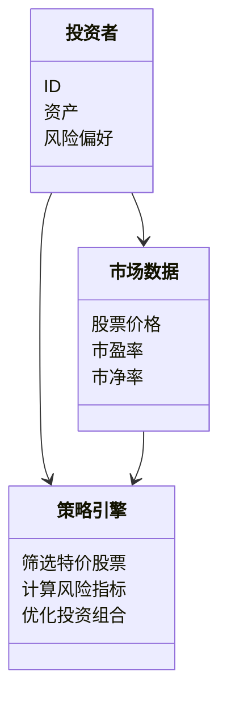
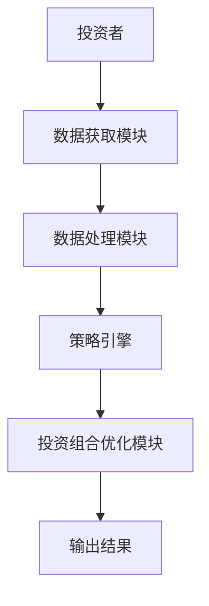
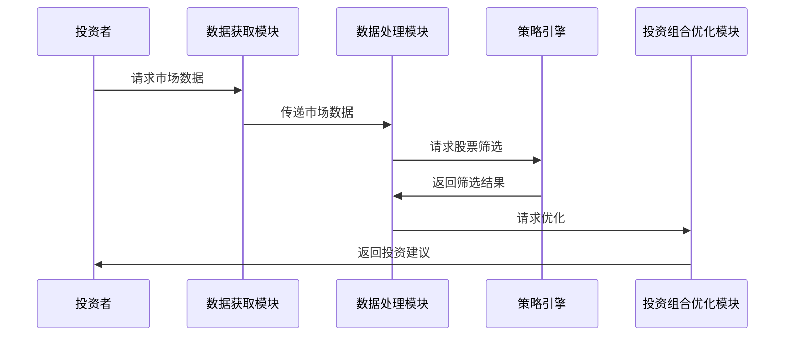

                 


# 特价股票投资策略在熊市中的防御性

## 关键词：特价股票，熊市，防御性投资，投资策略，风险管理，系统架构，项目实战

## 摘要：  
在熊市中，投资者通常面临市场波动加剧、资产价值下降的风险。特价股票作为一种低价股票的投资策略，能够在熊市中为投资者提供防御性保护。本文从理论到实践，系统地分析了特价股票投资策略在熊市中的应用，包括策略背景、核心概念、算法原理、数学模型、系统架构设计以及项目实战案例。通过本文的分析，读者可以掌握如何在熊市中利用特价股票进行防御性投资，降低投资风险，实现稳健收益。

---

## 第一部分: 特价股票投资策略在熊市中的防御性概述

### 第1章: 特价股票与熊市投资环境

#### 1.1 特价股票的定义与特点
特价股票是指价格相对较低的股票，通常具有较高的市盈率或市净率，反映了市场对公司的估值较低。其特点包括：
- **低价特性**：通常价格在1元至10元之间。
- **高波动性**：价格波动较大，适合短线交易。
- **高风险**：由于价格低，可能存在较高的退市风险。

#### 1.2 熊市的定义与特征
熊市是指市场整体表现低迷，股票价格普遍下跌的时期。其主要特征包括：
- **市场情绪低落**：投资者信心不足，交易量减少。
- **指数持续下跌**：主要股指连续下跌，跌幅超过20%。
- **高波动性**：市场波动加剧，股票价格大幅波动。

#### 1.3 防御性投资的含义与意义
防御性投资是指通过选择具有稳定收益和较低波动性的资产，降低投资组合风险的投资策略。其意义在于：
- **降低风险**：通过选择防御性资产，减少市场波动对投资组合的影响。
- **稳健收益**：在熊市中，防御性资产通常表现相对稳定，能够提供稳健的收益。

### 第2章: 特价股票投资策略的核心概念

#### 2.1 投资策略的背景介绍
**问题背景**：熊市中，投资者需要寻找一种能够在市场低迷时期稳定收益的投资策略。  
**问题描述**：特价股票价格低，但风险较高，如何在熊市中利用特价股票进行防御性投资？  
**问题解决**：通过分析特价股票的特性，结合市场环境，制定防御性投资策略。  
**边界与外延**：特价股票的投资范围不包括高价股和成长股，主要关注低价、低估值的股票。  
**核心要素组成**：市场分析、股票筛选、投资组合构建、风险管理。

#### 2.2 核心概念与联系
**核心概念原理**：特价股票在熊市中具有较高的安全边际，适合防御性投资。  
**核心概念属性特征对比表格**：

| 特性       | 特价股票 | 高价股票 | 成长股 |
|------------|----------|----------|--------|
| 价格       | 低价     | 高价     | 中高价 |
| 市盈率     | 低       | 高       | 高     |
| 市净率     | 低       | 高       | 高     |
| 风险       | 较高     | 较低     | 较高   |

**ER实体关系图架构的Mermaid流程图**：



---

## 第二部分: 特价股票投资策略的算法原理

### 第3章: 特价股票投资策略的算法原理

#### 3.1 算法原理讲解
**算法流程图**：



**算法步骤说明**：
1. **输入市场数据**：获取当前市场数据，包括股票价格、市盈率、市净率等。
2. **筛选特价股票**：根据预设条件筛选出价格低于设定值的股票。
3. **计算风险指标**：计算股票的风险指标，包括波动率、Beta值等。
4. **优化投资组合**：根据风险指标优化投资组合，降低整体风险。
5. **输出投资建议**：生成投资建议，指导投资者进行操作。

#### 3.2 数学模型与公式
**数学模型**：投资组合风险最小化模型。  
$$ \text{目标：} \min \sigma^2 \text{（投资组合的方差）} $$
$$ \text{约束：} \sum w_i = 1 \text{（权重之和为1）} $$

**公式详细解读**：
- $\sigma^2$：投资组合的方差，表示投资组合的风险。
- $w_i$：第i只股票的投资权重。

---

## 第三部分: 特价股票投资策略的系统分析与架构设计

### 第4章: 特价股票投资策略的系统分析与架构设计

#### 4.1 问题场景介绍
**问题场景**：熊市中，投资者需要实时监控市场数据，筛选特价股票，优化投资组合。  
**系统目标**：构建一个能够实时分析市场数据、筛选特价股票并优化投资组合的系统。  
**系统需求**：实时数据获取、股票筛选、风险评估、投资组合优化。

#### 4.2 系统功能设计
**领域模型Mermaid类图**：



**系统架构设计Mermaid架构图**：



**系统交互Mermaid序列图**：



---

## 第四部分: 特价股票投资策略的项目实战

### 第5章: 特价股票投资策略的项目实战

#### 5.1 环境安装与配置
**开发环境搭建**：建议使用Python和Jupyter Notebook进行开发。  
**工具安装与配置**：安装Pandas、NumPy、Matplotlib等库，配置数据源。

#### 5.2 系统核心实现源代码
**代码实现**：

```python
import pandas as pd
import numpy as np

# 数据获取
data = pd.read_csv('market_data.csv')

# 特价股票筛选
cheap Stocks = data[data['price'] < 5]

# 风险指标计算
def calculate_risk(portfolio):
    return np.sqrt(np.dot(portfolio.T, portfolio))

# 投资组合优化
def optimize_portfolio(weights):
    return calculate_risk(weights)

# 示例投资组合
weights = np.array([0.3, 0.2, 0.5])
print(f"投资组合风险：{optimize_portfolio(weights)}")
```

#### 5.3 代码应用解读与分析
- **数据获取**：从CSV文件中读取市场数据。
- **特价股票筛选**：筛选出价格低于5元的股票。
- **风险指标计算**：计算投资组合的风险。
- **投资组合优化**：通过优化权重降低投资组合风险。

#### 5.4 实际案例分析和详细讲解剖析
**案例分析**：假设市场中有三只特价股票，分别为A、B、C，价格分别为3、4、2元。通过优化权重，构建投资组合，降低风险。

---

## 第五部分: 特价股票投资策略的最佳实践

### 第6章: 特价股票投资策略的最佳实践

#### 6.1 心理素质与纪律性
- **保持冷静**：在熊市中，投资者需要保持冷静，避免情绪化决策。
- **严格执行纪律**：按照策略严格执行，避免随意更改投资计划。

#### 6.2 持续学习与优化
- **关注市场动态**：及时关注市场动态，调整投资策略。
- **优化模型**：根据市场变化，不断优化投资模型。

#### 6.3 风险管理与控制
- **设置止损点**：在投资组合中设置止损点，避免重大损失。
- **分散投资**：通过分散投资降低风险。

---

## 小结
通过本文的分析，读者可以系统地了解特价股票投资策略在熊市中的应用。从理论到实践，从策略到系统，再到实战案例，本文为投资者提供了一套完整的防御性投资方案。投资者可以结合自身情况，灵活运用这些策略，实现稳健收益。

---

## 参考文献
1. 《投资学基础》
2. 《风险管理与投资组合优化》
3. Python官方文档

---

作者：AI天才研究院 & 禅与计算机程序设计艺术

