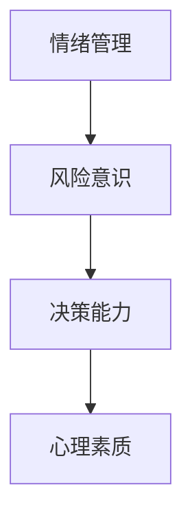

                 

# 特价股票投资者应具备的心理素质

> 关键词：特价股票，投资者心理素质，情绪管理，风险意识，投资决策，系统分析

> 摘要：本文从特价股票投资的心理素质角度出发，详细分析了投资者在面对特价股票市场时需要具备的核心心理素质，包括情绪管理、风险意识、耐心与纪律性等。文章结合数学模型和系统分析，深入探讨了心理素质对投资决策的影响，并提供了实用的心理素质培养方法和系统优化建议。通过实际案例分析和最佳实践总结，为投资者提供了提升心理素质的实用指导。

---

## 第一部分: 特价股票与投资者心理素质的背景

### 第1章: 特价股票的定义与特点

#### 1.1 特价股票的定义与特点

**1.1.1 特价股票的定义**

特价股票通常指价格低于某一特定阈值的股票，例如低于5元的股票。这类股票往往具有高波动性和高风险，但也可能带来高回报。特价股票的定义不仅包括价格因素，还包括其市场流动性、公司基本面等因素。

**1.1.2 特价股票的核心特点**

- **价格低**：通常被认为是“便宜”的股票，适合资金有限的投资者。
- **高波动性**：低价股票的波动性往往较高，容易受到市场情绪的影响。
- **高风险**：公司基本面较差，可能面临更大的经营风险。
- **高杠杆效应**：价格波动可能导致市值迅速变化，投资者的收益或损失放大。

**1.1.3 特价股票与普通股票的区别**

| 特价股票 | 普通股票 |
|----------|----------|
| 价格低   | 价格较高 |
| 波动性高  | 波动性低  |
| 风险高    | 风险适中  |
| 简单性高  | 简单性低  |

---

### 第2章: 投资者心理素质的定义与重要性

#### 2.1 投资者心理素质的定义

投资者心理素质是指投资者在面对市场波动、风险和不确定性时，表现出的心理特征和行为能力。这些素质包括情绪管理、风险意识、决策能力、耐心和纪律性等。

---

## 第二部分: 特价股票投资者心理素质的核心要素

### 第3章: 情绪管理与心理韧性

#### 3.1 情绪管理的重要性

在特价股票投资中，情绪管理是核心素质之一。投资者需要避免贪婪和恐惧的干扰，保持冷静。

**3.1.1 情绪管理的步骤**

1. **自我认知**：了解自己的情绪触发点。
2. **制定计划**：设定投资目标和止损点。
3. **执行纪律**：严格执行计划，避免情绪化决策。

**3.1.2 案例分析**

假设一位投资者买入一只低价股，股价下跌，投资者感到恐慌，急于止损，但错失后续反弹机会。这就是情绪管理不足导致的失败案例。

---

### 第4章: 风险意识与决策能力

#### 4.1 风险意识的培养

投资者需要意识到特价股票的高风险，并评估自己的风险承受能力。

**4.1.1 风险评估工具**

- **波动率分析**：通过历史数据评估股票的波动性。
- **VaR（在险价值）模型**：计算可能的最大损失。

**4.1.2 风险与收益的平衡**

使用以下公式计算风险调整后的收益：

$$ \text{风险调整后收益} = \text{预期收益} - \text{风险溢价} $$

---

## 第三部分: 特价股票投资者心理素质的数学模型与系统分析

### 第5章: 心理素质的数学模型

#### 5.1 心理素质模型的构建

心理素质可以看作是一个多变量函数：

$$ P = f(M, R, D) $$

其中：
- $P$ 是心理素质
- $M$ 是情绪管理
- $R$ 是风险意识
- $D$ 是决策能力

---

### 第6章: 系统分析与架构设计

#### 6.1 投资者心理系统的构成

使用Mermaid图展示心理系统的构成：

---

## 第四部分: 特价股票投资者心理素质的培养方法

### 第7章: 心理素质的培养策略

#### 7.1 自我认知与目标设定

**7.1.1 自我认知**

投资者需要通过自我反思，了解自己的心理特点和投资风格。

**7.1.2 目标设定**

设定短期和长期目标，例如：

- 短期目标：每天分析一只股票。
- 长期目标：建立稳定的收益模型。

---

### 第8章: 实战中的心理素质培养

#### 8.1 案例分析

**案例：**投资者A在持有低价股时，股价持续下跌，但通过心理素质的培养，最终获利。

---

## 第五部分: 总结与展望

### 第9章: 总结

通过本文的分析，投资者可以明确心理素质的重要性，并通过系统的培养方法提升自己的心理素质。

### 第10章: 展望

未来，心理素质的研究将更加注重个体差异，投资者需要根据自身特点制定个性化的心理素质培养计划。

---

## 作者信息

作者：AI天才研究院/AI Genius Institute & 禅与计算机程序设计艺术 /Zen And The Art of Computer Programming

---

通过本文的系统分析和详细讲解，投资者可以更好地理解特价股票投资中的心理素质问题，并通过科学的方法提升自己的心理素质，从而在投资中取得更好的成绩。

