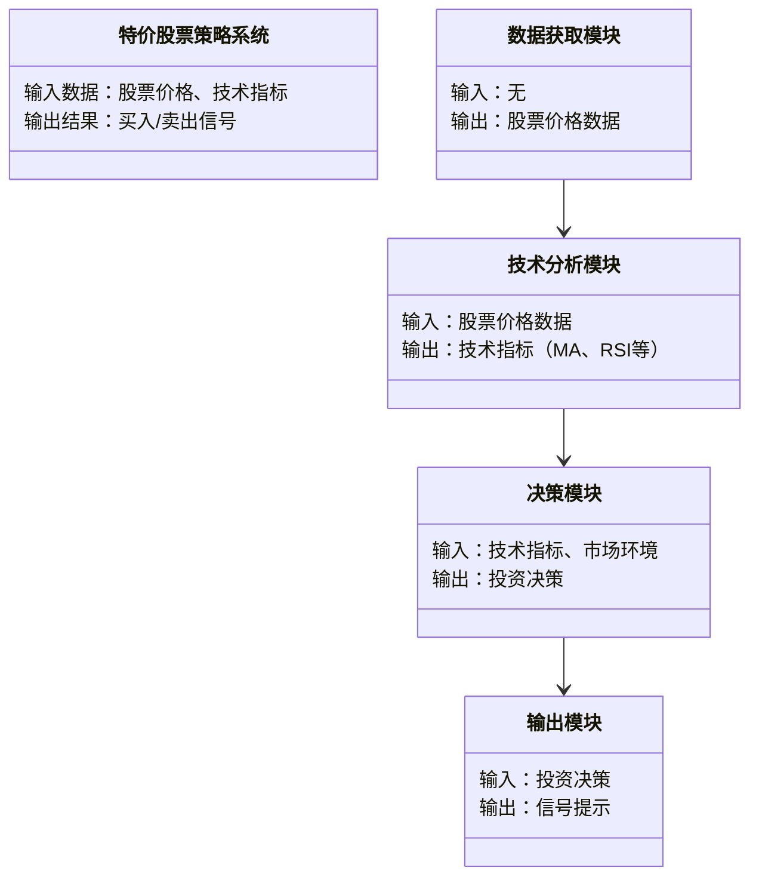

                 


# 特价股票策略在当前市场环境下的适用性

> **关键词**：特价股票策略，技术分析，市场波动，投资决策，风险管理

> **摘要**：本文探讨了特价股票策略在当前市场环境下的适用性，从背景、核心概念、算法原理、系统架构设计、项目实战到风险管理等多角度进行分析。通过技术分析和系统设计，结合具体案例，本文为投资者提供了全面的策略优化和风险管理建议。

---

## 第一部分：特价股票策略的背景与基础

### 第1章：特价股票策略的定义与背景

#### 1.1 特价股票的定义与特征

**1.1.1 特价股票的定义**

特价股票通常指价格低于某一特定阈值（如低于5元）的股票。这类股票通常被认为是低价股，具有较高的波动性和潜在的高收益或高风险特征。

**1.1.2 特价股票的特征**

- **低估值**：特价股票通常估值较低，市盈率、市净率等指标可能低于市场平均水平。
- **高波动性**：价格波动较大，适合短线交易者。
- **高风险**：由于价格较低，容易受到市场波动的影响，存在较高的投资风险。

**1.1.3 特价股票与其他股票的对比**

| 特性                | 特价股票       | 高价股         | 成长股         | 价值股         |
|---------------------|----------------|----------------|----------------|----------------|
| 价格范围            | 低于阈值       | 高于阈值        | 价格较高        | 价格适中        |
| 市盈率              | 较低           | 较高            | 较高            | 较低           |
| 市净率              | 较低           | 较高            | 较高            | 较低           |
| 波动性              | 高             | 中             | 中             | 低             |
| 投资风险            | 高             | 中             | 高             | 中             |
| 适用场景            | 短线交易、高风险高回报 | 长期持有、稳定性较高 | 长期投资、成长性驱动 | 估值驱动、长期稳定 |

---

#### 1.2 特价股票策略的背景

**1.2.1 特价股票策略的历史演变**

特价股票策略起源于早期的股票市场，投资者通过寻找低估值股票，试图在市场复苏时获得超额收益。随着市场的不断发展，特价股票策略逐渐演变为一种技术分析和基本面分析结合的投资方法。

**1.2.2 当前市场环境下的特价股票策略**

当前市场环境下，特价股票策略的适用性受到宏观经济、政策调控和技术进步的多重影响。例如，全球经济复苏、通货膨胀压力和政策监管的变化都会影响特价股票的表现。

**1.2.3 特价股票策略的适用场景**

- **短线交易**：适合技术分析高手，通过捕捉短期价格波动获利。
- **市场复苏期**：在市场低迷时，低价股可能因估值修复而上涨。
- **行业周期性**：某些行业（如周期性行业）可能在特定时期出现低价股投资机会。

---

## 第二部分：特价股票策略的核心概念与联系

### 第2章：特价股票的特征与属性

#### 2.1 特价股票的核心属性

**2.1.1 低估值特征**

低估值是特价股票的核心特征之一。通常，投资者会通过市盈率（P/E）和市净率（P/B）等指标来衡量股票的估值水平。例如：

- **市盈率（P/E）**：股价除以每股收益（EPS）。
  $$ P/E = \frac{\text{股价}}{\text{EPS}} $$

- **市净率（P/B）**：股价除以每股净资产（BPS）。
  $$ P/B = \frac{\text{股价}}{\text{BPS}} $$

**2.1.2 高波动性特征**

高波动性是特价股票的另一大特征。由于价格较低，市场参与者更容易利用价格波动进行短期交易。波动性可以用标准差或波动率来衡量。

**2.1.3 高风险特征**

高风险是特价股票的必然结果。由于价格波动大，投资者可能面临较大的本金损失风险。例如，在市场下跌时，低价股的跌幅可能超过市场平均水平。

---

#### 2.2 特价股票与其他股票的对比

**2.2.1 与高价股的对比**

高价股通常属于行业龙头或成长型企业，具有较高的市盈率和市净率，但波动性较低，风险较小。

**2.2.2 与成长股的对比**

成长股通常具有较高的市盈率和市净率，但增长潜力大。与特价股票相比，成长股的风险和收益都较高。

**2.2.3 与价值股的对比**

价值股通常具有较低的市盈率和市净率，但与特价股票相比，价值股的波动性较低，风险较小。

---

## 第三部分：当前市场环境对特价股票策略的影响

### 第3章：当前市场环境的分析

#### 3.1 宏观经济环境对特价股票的影响

**3.1.1 经济周期对特价股票的影响**

经济周期分为复苏、繁荣、衰退和萧条四个阶段。在衰退和萧条阶段，特价股票可能因估值修复而上涨。

**3.1.2 利率政策对特价股票的影响**

低利率环境通常会推高股票估值，而高利率环境可能导致股票估值下降。对于特价股票，利率变化的影响更为敏感。

**3.1.3 通货膨胀对特价股票的影响**

通货膨胀可能导致股票价格上涨，但也会推高企业的成本，影响企业盈利能力和股价表现。

---

#### 3.2 市场波动对特价股票的影响

**3.2.1 市场波动的定义与特征**

市场波动是指股票价格在短时间内频繁波动，通常由市场情绪、突发事件和资金流动等因素驱动。

**3.2.2 市场波动对特价股票策略的影响**

市场波动为特价股票提供了短期交易机会，但也增加了投资风险。

**3.2.3 如何在市场波动中把握特价股票机会**

- **技术分析**：通过K线图、移动平均线、相对强弱指数（RSI）等指标捕捉短期价格波动。
- **资金流动**：关注资金流向，抓住市场情绪的变化。

---

## 第四部分：特价股票策略的技术分析方法

### 第4章：技术分析在特价股票策略中的应用

#### 4.1 技术分析的定义与核心思想

技术分析是一种通过分析历史价格和成交量数据来预测未来价格走势的方法。其核心思想是市场行为反映所有信息，价格走势具有一定的规律性。

---

#### 4.2 移动平均线（MA）在特价股票策略中的应用

**4.2.1 移动平均线的定义**

移动平均线是将一定时期内的价格数据平均化，用于过滤短期波动，揭示价格趋势。

**4.2.2 移动平均线的计算公式**

$$ MA_n = \frac{1}{n} \sum_{i=1}^{n} P_i $$

其中，$P_i$ 是第i天的价格，$n$ 是计算天数。

---

#### 4.3 相对强弱指数（RSI）在特价股票策略中的应用

**4.3.1 RSI的定义**

RSI用于衡量价格的超买或超卖状态，通常取14天作为计算周期。

**4.3.2 RSI的计算公式**

$$ RSI = \frac{100}{1 + \frac{\text{上涨幅度}}{\text{下跌幅度}}} $$

---

#### 4.4 技术分析的优缺点

**优点**：
- 可以快速捕捉市场趋势和价格波动。
- 适合短线交易者。

**缺点**：
- 无法预测长期趋势。
- 受市场情绪影响较大。

---

## 第五部分：系统分析与架构设计

### 第5章：投资决策支持系统的设计

#### 5.1 系统功能设计

**5.1.1 领域模型**



---

## 第六部分：项目实战

### 第6章：基于Python的特价股票策略实现

#### 6.1 环境安装

- Python 3.8+
- pandas、numpy、matplotlib库

#### 6.2 核心代码实现

```python
import pandas as pd
import numpy as np
import matplotlib.pyplot as plt

# 示例数据：假设获取某只股票的收盘价
close_prices = [10, 9.8, 9.6, 9.5, 9.4, 9.3, 9.2, 9.1, 9.0, 8.9]

# 计算移动平均线（MA）
n = 5
ma = []
for i in range(len(close_prices)):
    if i >= n-1:
        ma_val = np.mean(close_prices[i-n:i+1])
        ma.append(ma_val)
    else:
        ma.append(None)

# 绘制K线图
plt.figure(figsize=(10, 6))
plt.plot(close_prices, label='Close Price', color='blue')
plt.plot(ma, label='MA(5)', color='red')
plt.xlabel('Time')
plt.ylabel('Price')
plt.legend()
plt.show()
```

---

## 第七部分：风险管理与优化

### 第7章：投资风险管理策略

#### 7.1 风险管理的核心思想

- **止损策略**：设定止损点，避免亏损扩大。
- **分散投资**：通过投资多个股票降低风险。
- **动态调整**：根据市场变化及时调整投资策略。

---

## 总结

特价股票策略在当前市场环境下的适用性取决于多种因素，包括市场波动、经济周期、政策变化等。通过技术分析和系统设计，投资者可以更好地把握投资机会，降低风险。然而，特价股票策略也存在较高的风险，投资者需要具备较强的技术分析能力和风险管理能力。

---

**作者：AI天才研究院/AI Genius Institute & 禅与计算机程序设计艺术 /Zen And The Art of Computer Programming**

