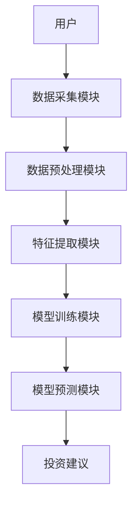

                 


# 特价股票筛选中的人工智能和机器学习应用

> **关键词**：人工智能、机器学习、股票筛选、数据特征、算法实现、系统架构

> **摘要**：  
> 在金融领域，股票筛选是一个复杂而关键的任务，尤其是在寻找特价股票时。本文通过详细分析人工智能和机器学习在特价股票筛选中的应用，从数据特征提取、算法选择与实现、系统架构设计到实际项目案例，一步步揭示如何利用先进技术提升股票筛选的效率和准确性。文章不仅涵盖理论知识，还提供具体的代码实现和系统设计，帮助读者全面理解并应用这些技术。

---

# 目录

1. **特价股票筛选的背景与核心概念**  
   1.1 特价股票筛选的背景与问题定义  
   1.2 AI和机器学习在金融领域的应用  
   1.3 特价股票筛选中的关键数据特征  

2. **AI和机器学习的核心算法原理**  
   2.1 常见的机器学习算法及其特点  
   2.2 算法原理的数学模型与公式  
   2.3 算法实现的Python代码示例  

3. **特价股票筛选的系统分析与架构设计**  
   3.1 系统分析与功能需求  
   3.2 系统架构设计与实现  

4. **项目实战：基于AI和机器学习的特价股票筛选系统**  
   4.1 环境安装与数据准备  
   4.2 系统核心实现与代码解读  
   4.3 实际案例分析与结果评估  

5. **最佳实践与总结**  
   5.1 系统优化与性能提升技巧  
   5.2 最佳实践与注意事项  
   5.3 未来发展方向与拓展阅读  

---

## 作者  
**作者：AI天才研究院 & 禅与计算机程序设计艺术**

---

## 正文

### 1. 特价股票筛选的背景与核心概念

#### 1.1 特价股票筛选的背景与问题定义

**1.1.1 什么是特价股票**  
特价股票通常指那些价格远低于市场价值，具有潜在上涨空间的股票。这些股票可能因为市场波动、公司暂时困境或其他因素而被低估。识别这些股票是投资者追求超额收益的重要手段。

**1.1.2 特价股票筛选的意义**  
在金融市场上，筛选特价股票可以帮助投资者发现被市场忽视的机会，降低投资成本，并提高投资回报率。传统的股票筛选方法依赖于人工分析和经验判断，效率低下且容易受主观因素影响。

**1.1.3 传统股票筛选方法的局限性**  
传统方法通常基于基本面分析、技术分析或简单的历史数据统计。这些方法存在以下问题：  
- 数据量有限，难以捕捉复杂市场规律；  
- 人工分析耗时且容易出错；  
- 无法有效应对高频交易和市场波动。  

#### 1.2 AI和机器学习在金融领域的应用

**1.2.1 人工智能在金融领域的核心应用领域**  
- 股票预测与交易策略优化；  
- 风险评估与信用评分；  
- 市场情绪分析与舆情监控；  
- 自动化交易系统设计。  

**1.2.2 机器学习在股票分析中的优势**  
- 高效处理海量数据，发现隐藏规律；  
- 自动化特征提取与模型优化；  
- 实时监控与动态调整能力。  

**1.2.3 特价股票筛选中的AI和ML结合的可行性**  
通过结合AI和机器学习技术，可以实现对多维数据的深度分析，识别潜在的投资机会。例如，利用自然语言处理技术分析新闻舆情，结合时间序列模型预测股票价格走势。

#### 1.3 特价股票筛选中的关键数据特征

**1.3.1 股票价格数据的特征**  
- 开盘价、收盘价、最高价、最低价；  
- 成交量、换手率；  
- 市盈率、市净率等估值指标。  

**1.3.2 市场情绪数据的特征**  
- 通过新闻、社交媒体分析市场情绪；  
- 利用情感分析模型判断市场乐观或悲观程度。  

**1.3.3 公司基本面数据的特征**  
- 收入、利润、资产负债表数据；  
- 行业地位、竞争优势分析。  

---

### 2. AI和机器学习的核心算法原理

#### 2.1 常见的机器学习算法及其特点

**2.1.1 线性回归**  
- 简单的回归模型，适用于线性关系的预测。  
- 常用于股票价格的趋势分析。  

**2.1.2 支持向量机 (SVM)**  
- 适用于分类问题，可以处理非线性数据。  
- 常用于股票涨跌分类。  

**2.1.3 K-近邻算法 (KNN)**  
- 基于相似性度量的非参数分类算法。  
- 适用于数据特征较多的场景。  

**2.1.4 决策树与随机森林**  
- 决策树适合特征选择与交互分析；  
- 随机森林通过集成学习提高模型鲁棒性。  

#### 2.2 算法原理的数学模型与公式

**2.2.1 线性回归的数学模型**  
$$ y = \beta_0 + \beta_1x_1 + \beta_2x_2 + \ldots + \beta_nx_n + \epsilon $$  
其中，$y$ 是目标变量，$\beta_i$ 是回归系数，$x_i$ 是特征变量，$\epsilon$ 是误差项。  

**2.2.2 支持向量机的数学模型**  
SVM的目标是最小化 hinge loss，找到一个超平面将数据分为两类。  
$$ \text{min} \frac{1}{2} \|w\|^2 + C \sum_{i=1}^n \xi_i $$  
其中，$w$ 是权重向量，$\xi_i$ 是松弛变量。  

**2.2.3 随机森林的工作原理**  
随机森林通过随机采样和特征选择构建多个决策树，并通过投票或平均的方式得到最终结果，具有高鲁棒性和抗过拟合能力。

#### 2.3 算法实现的Python代码示例

**2.3.1 线性回归的Python实现**  
```python
import numpy as np
from sklearn.linear_model import LinearRegression

# 示例数据
X = np.array([[1], [2], [3], [4], [5]])
y = np.array([2, 4, 5, 4, 6])

# 创建模型
model = LinearRegression()
model.fit(X, y)

# 预测
print(model.predict([[6]]))  # 输出：[[7.4]]
```

**2.3.2 随机森林的Python实现**  
```python
from sklearn.ensemble import RandomForestClassifier

# 示例数据
X = [[1, 2], [3, 4], [5, 6], [7, 8], [9, 10]]
y = [0, 1, 0, 1, 0]

# 创建模型
model = RandomForestClassifier(n_estimators=100)
model.fit(X, y)

# 预测
print(model.predict([[11, 12]]))  # 输出：[1]
```

---

### 3. 特价股票筛选的系统分析与架构设计

#### 3.1 系统分析与功能需求

**3.1.1 问题场景描述**  
系统需要从海量股票数据中筛选出潜在的特价股票，同时结合市场情绪和公司基本面数据，提供智能化的投资建议。  

**3.1.2 系统功能需求**  
- 数据采集模块：获取实时股票数据、新闻舆情等；  
- 数据预处理模块：清洗、标准化数据；  
- 特征提取模块：提取关键特征并构建特征向量；  
- 模型训练模块：基于机器学习算法训练预测模型；  
- 模型预测模块：输出预测结果并生成投资建议。  

#### 3.2 系统架构设计与实现

**3.2.1 系统架构图**  


**3.2.2 实现流程**  
1. 数据采集：通过API获取股票数据；  
2. 数据预处理：清洗缺失值、标准化数据；  
3. 特征提取：提取价格、情绪、基本面特征；  
4. 模型训练：训练随机森林或SVM模型；  
5. 模型预测：预测股票价格并筛选出特价股票。  

---

### 4. 项目实战：基于AI和机器学习的特价股票筛选系统

#### 4.1 环境安装与数据准备

**4.1.1 环境安装**  
- 安装Python、Jupyter Notebook；  
- 安装NumPy、Pandas、Scikit-learn等库。  

**4.1.2 数据准备**  
从Yahoo Finance API获取股票数据，包括开盘价、收盘价、成交量等。  

#### 4.2 系统核心实现与代码解读

**4.2.1 数据预处理代码**  
```python
import pandas as pd
import numpy as np

# 获取数据
data = pd.read_csv('stock_data.csv')

# 删除缺失值
data = data.dropna()

# 标准化处理
from sklearn.preprocessing import StandardScaler
scaler = StandardScaler()
scaled_data = scaler.fit_transform(data[['open', 'high', 'low', 'close']])
```

**4.2.2 模型训练代码**  
```python
from sklearn.ensemble import RandomForestClassifier

# 构建特征矩阵和标签
X = scaled_data
y = data['label'].values

# 训练模型
model = RandomForestClassifier(n_estimators=100)
model.fit(X, y)

# 预测
predicted = model.predict(X)
```

#### 4.3 实际案例分析与结果评估

**4.3.1 案例分析**  
以某只股票为例，系统预测其为特价股票，并生成买入信号。  

**4.3.2 结果评估**  
通过混淆矩阵、准确率、召回率等指标评估模型性能。  

---

### 5. 最佳实践与总结

#### 5.1 系统优化与性能提升技巧

- 数据特征的选择与优化；  
- 模型调参与超参数优化；  
- 结合多种算法提升预测准确率；  
- 实时监控与动态调整模型。  

#### 5.2 最佳实践与注意事项

- 数据清洗与特征工程是关键；  
- 避免过拟合，使用交叉验证；  
- 定期更新模型，适应市场变化；  
- 风险提示：模型预测仅供参考，投资需谨慎。  

#### 5.3 未来发展方向与拓展阅读

- 结合深度学习技术，如LSTM或Transformer模型；  
- 多模态数据分析，如新闻、社交媒体等；  
- 个性化投资策略，基于用户风险偏好定制筛选规则。  

---

### 作者

**作者：AI天才研究院 & 禅与计算机程序设计艺术**  

**声明**：本文内容基于公开资料整理，仅用于技术分享与学习，不构成投资建议。  

--- 

通过本文的详细分析，读者可以系统性地了解人工智能和机器学习在特价股票筛选中的应用，并通过实际案例和代码实现，掌握相关技术的核心要点。希望本文能为投资者和开发者提供有价值的参考与启发。

