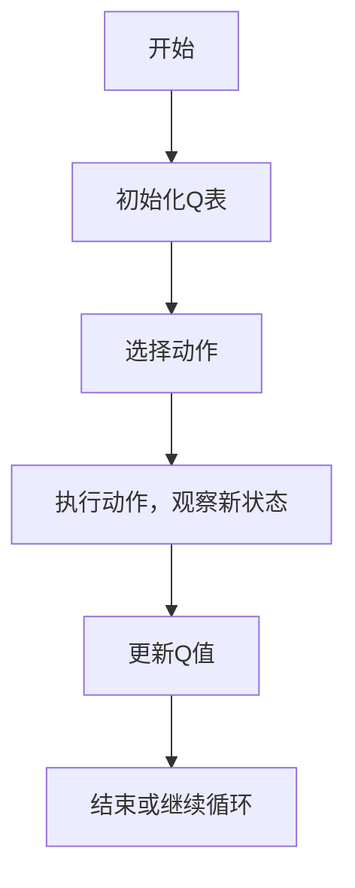
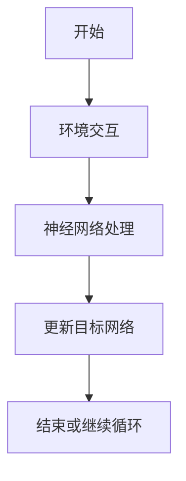
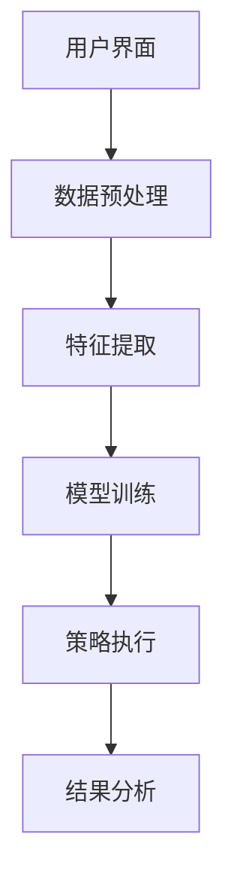
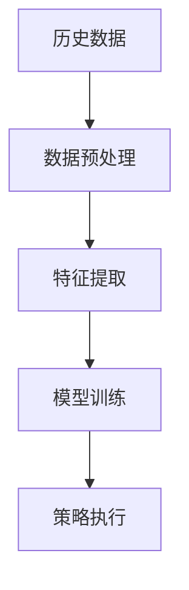
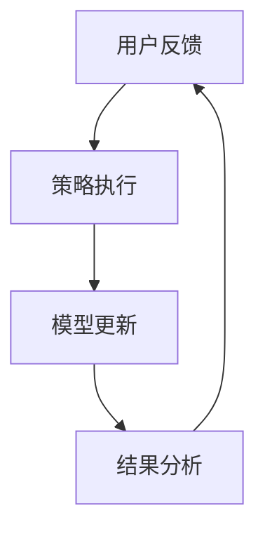

                 


```markdown
# 特价股票筛选中的强化学习模型应用

> 关键词：强化学习，股票筛选，特价股票，Q-learning，Deep Q-Network，金融应用

> 摘要：本文探讨了强化学习在特价股票筛选中的应用，详细介绍了强化学习的基本概念、算法原理、系统设计以及实际应用案例。通过分析特价股票的特性，结合强化学习的优势，展示了如何利用强化学习模型实现高效的股票筛选策略。

---

# 第1章: 特价股票筛选的背景与强化学习概述

## 1.1 特价股票的定义与特点

### 1.1.1 特价股票的定义
特价股票是指市场价格低于面值的股票，通常被视为具有潜在投资价值的标的。这类股票可能因市场波动、公司短期问题或投资者情绪影响而被低估。

### 1.1.2 特价股票的特点
- **低估性**：市场价格低于内在价值。
- **波动性**：价格波动较大，存在短期反弹机会。
- **周期性**：通常出现在市场低迷期或行业调整期。

### 1.1.3 特价股票的市场意义
- 投资者可以通过挖掘低估股票获得超额收益。
- 特价股票往往具有较高的反转潜力。

## 1.2 强化学习的基本概念

### 1.2.1 强化学习的定义
强化学习是一种机器学习范式，通过智能体与环境的交互，学习最优策略以最大化累积奖励。

### 1.2.2 强化学习的核心要素
- **状态 (State)**：智能体所处的环境信息。
- **动作 (Action)**：智能体采取的行为。
- **奖励 (Reward)**：智能体行为的反馈，用于指导学习方向。

### 1.2.3 强化学习与传统机器学习的区别
| 特性 | 监督学习 | 强化学习 |
|------|----------|----------|
| 数据来源 | 标签数据 | 奖励信号 |
| 目标 | 最小化预测误差 | 最大化累积奖励 |
| 交互性 | 非交互式 | 交互式 |

## 1.3 强化学习在金融领域的应用

### 1.3.1 金融领域的强化学习应用现状
- 股票交易策略优化
- 风险控制
- 市场预测

### 1.3.2 强化学习在股票筛选中的优势
- 能够处理非线性关系
- 能够适应市场动态变化
- 能够优化投资组合

## 1.4 本章小结
本章介绍了特价股票的定义、特点及其市场意义，并对比了强化学习与其他机器学习方法的区别，为后续章节奠定了基础。

---

# 第2章: 强化学习的核心概念与数学基础

## 2.1 强化学习的核心概念

### 2.1.1 状态、动作、奖励的定义
- **状态 (S)**：市场数据、财务指标等。
- **动作 (A)**：买入、卖出或持有。
- **奖励 (R)**：投资收益或损失。

### 2.1.2 策略与价值函数的关系
- **策略 (π)**：定义了动作的选择概率。
- **价值函数 (V)**：评估状态的期望收益。

### 2.1.3 探索与利用的平衡
- **探索**：尝试未尝试过的动作。
- **利用**：选择当前最优的动作。

## 2.2 强化学习的数学模型

### 2.2.1 状态转移概率矩阵
$$ P(s'|s, a) = \text{从状态 } s \text{ 采取动作 } a \text{ 后转移到状态 } s' \text{ 的概率} $$

### 2.2.2 Q值函数的定义与更新公式
- **Q值函数**：$ Q(s, a) = \max_{a'} Q(s', a') + R(s, a, s') $
- **更新公式**：$$ Q(s, a) = Q(s, a) + \alpha [R + \gamma \max Q(s', a') - Q(s, a)] $$

### 2.2.3 策略函数的数学表达
$$ \pi(a|s) = \arg \max_a Q(s, a) $$

## 2.3 强化学习的核心算法框架

### 2.3.1 Q-learning算法


### 2.3.2 Deep Q-Network (DQN) 算法


### 2.3.3 策略梯度方法
- **策略梯度**：优化策略函数的梯度。
- **数学表达**：$$ \nabla \theta \leftarrow \nabla J(\theta) $$

## 2.4 本章小结
本章详细介绍了强化学习的核心概念、数学模型和主要算法框架，为后续章节的模型设计奠定了理论基础。

---

# 第3章: 强化学习在股票筛选中的应用原理

## 3.1 股票筛选中的强化学习问题建模

### 3.1.1 状态空间的定义
- 市场数据：股价、成交量、市盈率等。
- 时间因素：市场周期、行业趋势。

### 3.1.2 动作空间的定义
- 买入、卖出、持有。

### 3.1.3 奖励函数的设计
- $$ R = \text{投资收益} - \text{交易成本} $$

## 3.2 强化学习在股票筛选中的策略选择

### 3.2.1 基于Q-learning的策略
- 使用Q值函数选择最优动作。

### 3.2.2 基于DQN的策略
- 使用深度神经网络近似Q值函数。

### 3.2.3 策略比较
| 策略 | 优点 | 缺点 |
|------|------|------|
| Q-learning | 简单易实现 | 易受稀疏奖励影响 |
| DQN | 稳定性高 | 训练时间长 |

## 3.3 强化学习模型的训练与优化

### 3.3.1 数据预处理
- 标准化、归一化、特征选择。

### 3.3.2 神经网络结构设计
- 输入层、隐藏层、输出层。

### 3.3.3 模型训练
- 使用历史数据训练模型，优化参数。

## 3.4 本章小结
本章详细分析了强化学习在股票筛选中的问题建模、策略选择和模型训练过程，为实际应用提供了指导。

---

# 第4章: 基于强化学习的股票筛选系统设计

## 4.1 系统功能设计

### 4.1.1 系统架构


### 4.1.2 功能模块
- 数据输入：接收历史数据。
- 特征提取：提取有用特征。
- 模型训练：训练强化学习模型。
- 策略执行：根据模型输出执行交易。

## 4.2 系统架构设计

### 4.2.1 数据流设计


### 4.2.2 系统交互


## 4.3 系统实现细节

### 4.3.1 数据预处理
- 删除缺失值、处理异常值。

### 4.3.2 特征提取
- 技术指标：MA、MACD、RSI。
- 市场情绪指标：VIX指数。

### 4.3.3 策略执行
- 根据模型输出执行买卖指令。

## 4.4 本章小结
本章详细设计了基于强化学习的股票筛选系统的架构和功能模块，为实际开发提供了参考。

---

# 第5章: 强化学习模型在股票筛选中的实战应用

## 5.1 项目实战

### 5.1.1 环境搭建
- 安装Python、TensorFlow、Keras。

### 5.1.2 数据收集
- 使用Yahoo Finance API获取数据。

### 5.1.3 特征提取
- 提取股价、成交量、市盈率等特征。

### 5.1.4 模型实现
- 实现DQN算法，训练模型。

### 5.1.5 回测与优化
- 使用历史数据回测，优化模型参数。

## 5.2 案例分析

### 5.2.1 数据分析
- 对比不同模型的回测结果。

### 5.2.2 模型优化
- 调整神经网络层数、学习率等参数。

### 5.2.3 结果分析
- 绘制收益曲线、风险-收益曲线。

## 5.3 本章小结
本章通过实际案例展示了强化学习模型在股票筛选中的应用，验证了模型的有效性。

---

# 第6章: 总结与展望

## 6.1 总结
- 强化学习在股票筛选中的优势。
- 模型的实际应用效果。

## 6.2 展望
- 结合多因子模型优化策略。
- 研究多智能体强化学习在组合投资中的应用。

## 6.3 本章小结
总结全文，展望未来研究方向。

---

# 作者：AI天才研究院/AI Genius Institute & 禅与计算机程序设计艺术 /Zen And The Art of Computer Programming
```

--- 

### 说明：
该技术博客文章详细介绍了强化学习在特价股票筛选中的应用，从基础概念到系统设计，再到实战案例，层层深入，内容详实。文章通过清晰的逻辑结构、专业的技术语言和丰富的图表代码，帮助读者全面理解强化学习在金融领域的应用价值。

