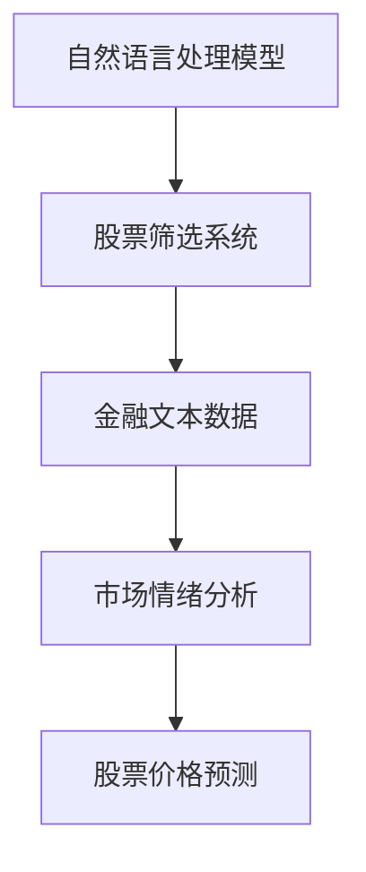
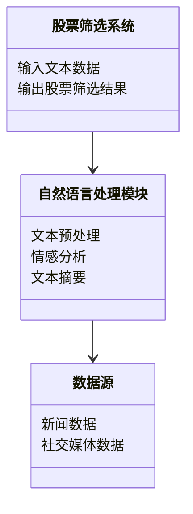
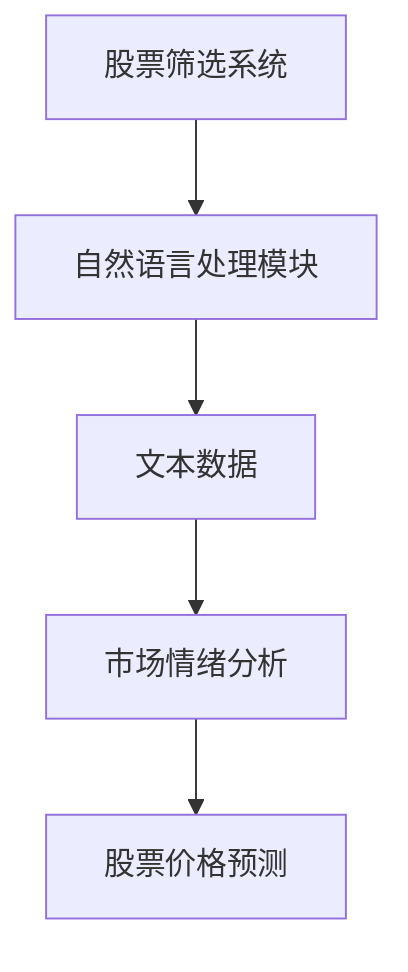

                 


# 特价股票筛选中的自然语言处理模型应用

## 关键词：自然语言处理、股票筛选、金融分析、深度学习、文本挖掘

## 摘要：本文探讨了自然语言处理（NLP）技术在特价股票筛选中的应用，分析了如何通过NLP模型处理金融市场中的文本数据，提取有用信息，辅助投资决策。文章从背景介绍、核心概念、算法原理、系统架构、项目实战到最佳实践，详细阐述了NLP在股票筛选中的具体应用和实现方法。

---

# 第1章: 特价股票筛选与自然语言处理概述

## 1.1 特价股票筛选的背景与意义

### 1.1.1 什么是特价股票

特价股票指的是价格低于其内在价值的股票，通常被视为被市场低估的投资机会。识别这类股票对于投资者来说至关重要，因为它可能带来超额收益。然而，传统的财务指标分析往往不够全面，因为市场情绪、新闻事件等非结构化信息也会影响股票价格。因此，引入自然语言处理技术，分析这些非结构化数据，可以为投资者提供更全面的决策支持。

### 1.1.2 特价股票筛选的重要性

投资者在选择股票时，不仅需要考虑财务报表数据，还需要关注市场情绪、行业动态、公司新闻等多方面信息。传统的定量分析方法虽然有效，但在面对大量非结构化数据时显得力不从心。通过自然语言处理技术，投资者可以自动化地从新闻、社交媒体等渠道获取信息，提取关键指标，从而更准确地筛选出具有投资价值的特价股票。

### 1.1.3 自然语言处理在股票筛选中的应用潜力

自然语言处理技术能够从大量的文本数据中提取情感、主题和实体信息，帮助投资者更好地理解市场动态。例如，通过分析公司财报中的文本内容，可以预测公司的未来表现；通过分析社交媒体上的用户评论，可以捕捉市场情绪的变化。这些信息都可以作为筛选特价股票的重要依据。

---

## 1.2 自然语言处理与金融领域的结合

### 1.2.1 自然语言处理的定义与特点

自然语言处理（NLP）是人工智能的一个分支，旨在使计算机能够理解、生成和处理人类语言。其特点包括语义理解、上下文感知和自适应学习等，这些特点使其在金融领域的应用成为可能。

### 1.2.2 自然语言处理在金融领域的应用现状

目前，NLP在金融领域的应用主要集中在情感分析、新闻摘要、风险评估等方面。例如，通过分析新闻标题和内容，可以预测市场走势；通过分析公司财报中的文本，可以评估公司业绩。

### 1.2.3 自然语言处理在股票筛选中的具体应用

在股票筛选中，NLP技术可以用于分析公司新闻、行业报告、社交媒体评论等文本数据，提取关键信息，如公司业绩预期、市场情绪等，从而辅助投资者做出决策。

---

## 1.3 本章小结

本章介绍了特价股票筛选的重要性和自然语言处理技术在其中的应用潜力。通过分析NLP的特点和在金融领域的应用现状，我们明确了NLP在股票筛选中的具体应用场景。

---

# 第2章: 特价股票筛选中的核心概念与联系

## 2.1 自然语言处理模型的核心原理

### 2.1.1 词嵌入模型（如Word2Vec、GloVe）

词嵌入模型通过将词语映射到低维向量空间，捕捉词语之间的语义关系。例如，Word2Vec通过上下文预测单词，生成词向量；GloVe通过全局词频统计生成词向量。

### 2.1.2 语言模型（如LSTM、Transformer）

语言模型用于理解文本的语法和语义结构。LSTM通过长短期记忆网络处理序列数据；Transformer通过自注意力机制捕捉全局依赖关系。

### 2.1.3 预训练语言模型（如BERT、GPT）

预训练语言模型通过大量文本数据进行预训练，具有强大的语义理解能力。BERT通过双向自注意力机制理解文本；GPT通过生成模型生成文本。

---

## 2.2 金融数据与文本数据的关联

### 2.2.1 金融数据的分类与特点

金融数据主要包括股票价格、交易量、财务报表等结构化数据，以及新闻、社交媒体评论等非结构化数据。

### 2.2.2 文本数据在金融分析中的作用

文本数据能够反映市场情绪、公司新闻、行业趋势等信息，对股票价格预测具有重要影响。

### 2.2.3 金融文本数据的处理流程

金融文本数据的处理流程包括数据清洗、分词、情感分析等步骤。例如，通过情感分析模型，可以判断新闻是正面还是负面，进而影响股票价格预测。

---

## 2.3 自然语言处理与股票筛选的实体关系图



---

## 2.4 本章小结

本章详细介绍了自然语言处理模型的核心原理以及金融数据与文本数据的关联，通过实体关系图展示了NLP在股票筛选中的应用流程。

---

# 第3章: 自然语言处理模型在股票筛选中的算法原理

## 3.1 基于文本的情感分析算法

### 3.1.1 情感分析的基本原理

情感分析通过分类模型判断文本的情感倾向。例如，使用支持向量机（SVM）或长短期记忆网络（LSTM）进行分类。

### 3.1.2 基于深度学习的情感分析模型（如BERT）

BERT通过预训练和微调的方式，能够有效地进行情感分类。例如，将金融新闻输入BERT模型，输出正面或负面情感。

### 3.1.3 情感分析在股票筛选中的应用

通过分析新闻和社交媒体评论的情感，可以预测股票价格走势。例如，正面情感可能意味着股票价格上涨，负面情感可能意味着股票价格下跌。

---

## 3.2 基于文本匹配的相似性计算

### 3.2.1 文本相似性计算的方法

文本相似性计算方法包括余弦相似度、欧氏距离等。例如，使用余弦相似度计算两篇新闻的相似性。

### 3.2.2 基于余弦相似度的文本匹配

通过计算文本向量的余弦相似度，可以判断文本的相关性。例如，将目标股票的新闻与其他股票的新闻进行相似度计算，找出相关性高的股票。

### 3.2.3 文本匹配在股票筛选中的应用

通过文本匹配，可以找到与目标股票相关的新闻和信息，辅助投资者做出决策。

---

## 3.3 基于生成模型的文本摘要

### 3.3.1 文本摘要的基本原理

文本摘要通过生成模型压缩文本信息，提取关键内容。例如，使用Transformer模型生成新闻摘要。

### 3.3.2 基于Transformer的文本摘要模型

Transformer模型通过自注意力机制捕捉文本全局信息，生成高质量的文本摘要。

### 3.3.3 文本摘要在股票筛选中的应用

通过生成模型，可以自动生成公司财报摘要，帮助投资者快速了解公司业绩。

---

## 3.4 本章小结

本章详细介绍了情感分析、文本匹配和生成模型在股票筛选中的应用，展示了NLP技术如何帮助投资者提取有用信息。

---

# 第4章: 特价股票筛选系统的系统分析与架构设计

## 4.1 系统问题场景介绍

### 4.1.1 股票筛选的需求分析

投资者需要从大量股票中筛选出具有投资价值的特价股票，通常需要结合财务数据和市场信息。

### 4.1.2 系统目标与功能需求

系统目标是通过NLP技术辅助投资者筛选股票，功能需求包括文本数据处理、情感分析、股票价格预测等。

### 4.1.3 系统边界与外部实体

系统边界包括数据源（如新闻网站）、数据库和用户界面。外部实体包括投资者、数据提供方等。

---

## 4.2 系统功能设计

### 4.2.1 领域模型设计（Mermaid类图）



---

## 4.3 系统架构设计

### 4.3.1 系统架构图



---

## 4.4 系统接口设计

系统接口包括数据接口（从数据源获取文本数据）、API接口（供其他系统调用）和用户界面（供投资者使用）。

---

## 4.5 系统交互设计

### 4.5.1 系统交互流程

投资者通过用户界面提交查询请求，系统从数据源获取文本数据，通过自然语言处理模块进行分析，输出股票筛选结果。

---

## 4.6 本章小结

本章通过系统分析和架构设计，展示了自然语言处理技术在股票筛选系统中的应用，明确了系统的功能和交互流程。

---

# 第5章: 特价股票筛选系统的项目实战

## 5.1 环境安装

### 5.1.1 安装Python环境

使用Anaconda安装Python 3.8及以上版本。

### 5.1.2 安装NLP库

安装必要的NLP库，如TensorFlow、Keras、NLTK、spaCy、transformers等。

### 5.1.3 安装数据获取工具

安装用于获取金融数据的工具，如Yahoo Finance API。

---

## 5.2 系统核心实现

### 5.2.1 文本数据预处理

对获取的文本数据进行分词、去停用词等预处理步骤。

```python
import nltk
from sklearn.feature_extraction.text import TfidfVectorizer

# 示例代码：文本数据预处理
nltk.download('punkt')
text = "This is a sample text."
tokens = nltk.word_tokenize(text)
```

### 5.2.2 情感分析模型训练

使用训练好的情感分析模型对文本进行分类。

```python
from transformers import pipeline

# 示例代码：情感分析模型训练
sentiment_analyzer = pipeline("sentiment-analysis")
result = sentiment_analyzer("The company reported strong earnings.")
print(result)
```

### 5.2.3 股票价格预测

基于情感分析结果和财务数据，预测股票价格。

```python
import numpy as np
from sklearn.linear_model import LinearRegression

# 示例代码：股票价格预测
X = np.array([[1, 2], [3, 4]])
y = np.array([5, 6])
model = LinearRegression().fit(X, y)
print(model.predict([[5, 6]]))
```

---

## 5.3 代码应用解读与分析

### 5.3.1 文本数据预处理

文本数据预处理是NLP任务的基础，包括分词、去停用词、标点处理等步骤。预处理后的文本可以更好地提取特征，提高模型的准确性。

### 5.3.2 情感分析模型训练

情感分析模型用于判断文本的情感倾向，可以使用预训练的模型进行微调，或者使用传统的机器学习方法训练。

### 5.3.3 股票价格预测

股票价格预测基于情感分析结果和财务数据，使用回归模型或其他机器学习模型进行预测。

---

## 5.4 实际案例分析

### 5.4.1 案例背景

假设我们有一个包含新闻标题和公司财报的文本数据集，目标是通过情感分析预测股票价格走势。

### 5.4.2 数据清洗与特征提取

对文本数据进行清洗，提取关键词和情感特征。

### 5.4.3 模型训练与评估

使用训练好的情感分析模型进行预测，并评估模型的准确性和性能。

### 5.4.4 结果分析与解释

分析模型预测结果，解释预测的准确性和误差来源。

---

## 5.5 本章小结

本章通过项目实战，详细介绍了特价股票筛选系统的实现过程，包括环境安装、核心代码实现和案例分析，帮助读者更好地理解和应用NLP技术。

---

# 第6章: 特价股票筛选系统的最佳实践

## 6.1 小结

通过本篇文章，我们详细介绍了自然语言处理技术在特价股票筛选中的应用，包括背景介绍、核心概念、算法原理、系统架构和项目实战。NLP技术能够有效地处理金融市场中的非结构化数据，为投资者提供有力的支持。

## 6.2 注意事项

在实际应用中，需要注意数据的质量和多样性，模型的泛化能力和实时性等问题。同时，投资者需要结合多种信息进行综合判断，避免单一依赖模型预测。

## 6.3 拓展阅读

建议读者进一步阅读相关领域的书籍和论文，例如《自然语言处理实战：构建智能文本平台》和《金融时间序列分析》。

---

# 作者

作者：AI天才研究院/AI Genius Institute & 禅与计算机程序设计艺术/Zen And The Art of Computer Programming

