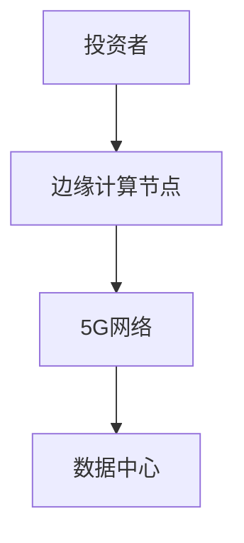

                 


```markdown
# 特价股票筛选中的边缘计算和5G技术应用

> 关键词：边缘计算、5G技术、股票筛选、实时数据处理、低延迟、高频交易

> 摘要：随着金融市场的快速发展，特价股票筛选对实时数据处理和高效算法的需求日益增加。边缘计算和5G技术的结合为这一领域带来了新的解决方案。本文将深入探讨边缘计算和5G技术在特价股票筛选中的应用，分析其核心概念、算法原理、系统架构，并通过实际案例展示其在项目中的应用。

---

## 第一部分: 特价股票筛选中的边缘计算和5G技术应用概述

### 第1章: 特价股票筛选的背景与挑战

#### 1.1 特价股票筛选的定义与意义
- 1.1.1 特价股票的定义：指价格低于其内在价值，具有投资潜力的股票。
- 1.1.2 特价股票筛选的重要性：帮助投资者发现潜在的投资机会，优化投资组合。
- 1.1.3 特价股票筛选的边界与外延：包括数据来源、筛选标准和时间窗口。

#### 1.2 边缘计算与5G技术的核心概念
- 1.2.1 边缘计算的基本原理：数据在靠近数据源的地方进行处理，减少延迟。
- 1.2.2 5G技术的关键特性：高带宽、低延迟、大规模连接。
- 1.2.3 边缘计算与5G技术的结合：通过5G网络实现数据的快速传输，边缘计算进行实时处理。

---

### 第2章: 边缘计算与5G技术在股票筛选中的应用前景

#### 2.1 特价股票筛选中的数据处理需求
- 2.1.1 高频交易数据的特点：数据量大、实时性强、变化快。
- 2.1.2 实时数据处理的重要性：及时捕捉市场波动，做出快速决策。
- 2.1.3 数据量与处理速度的平衡：如何在有限的资源下最大化处理效率。

#### 2.2 边缘计算与5G技术的优势
- 2.2.1 边缘计算的低延迟优势：减少数据传输时间，提高实时性。
- 2.2.2 5G技术的高带宽与低抖动优势：确保数据的快速、稳定传输。
- 2.2.3 边缘计算与5G技术的协同效应：结合两者优势，实现高效的数据处理和传输。

---

### 第3章: 边缘计算与5G技术的核心概念与联系

#### 3.1 边缘计算与5G技术的原理对比
- 3.1.1 边缘计算的原理：数据在边缘节点进行处理，减少对中心服务器的依赖。
- 3.1.2 5G技术的原理：通过5G网络实现高速数据传输和设备连接。
- 3.1.3 两者原理的异同点：边缘计算注重数据处理，5G技术注重数据传输。

#### 3.2 边缘计算与5G技术的属性特征对比
- 3.2.1 边缘计算的属性特征：分布式、低延迟、高实时性。
- 3.2.2 5G技术的属性特征：高带宽、低延迟、大规模连接。
- 3.2.3 两者属性特征的对比分析：通过对比分析，明确两者的优势和适用场景。

#### 3.3 边缘计算与5G技术的ER实体关系图
```mermaid
erDiagram
    actor 投资者 {
        <属性> 股票代码
        <属性> 时间戳
        <属性> 价格
    }
    actor 系统 {
        <属性> 边缘计算节点
        <属性> 5G网络
        <属性> 数据中心
    }
    投资者 --> 系统 : 数据传输
    系统 --> 投资者 : 数据处理结果
```

---

### 第4章: 边缘计算与5G技术的算法原理讲解

#### 4.1 边缘计算中的数据处理算法
- 4.1.1 数据预处理算法：去除噪声，提取特征。
- 4.1.2 数据分析算法：使用回归、分类等方法预测股票价格。
- 4.1.3 数据预测算法：基于历史数据，预测未来价格走势。

#### 4.2 5G技术中的数据传输算法
- 4.2.1 数据压缩算法：减少数据传输量。
- 4.2.2 数据加密算法：确保数据传输安全。
- 4.2.3 数据传输优化算法：提高数据传输效率。

#### 4.3 算法原理的数学模型与公式
- 数据预处理模型：
$$ y = f(x) $$
其中，$x$ 表示原始数据，$y$ 表示预处理后的数据，$f$ 表示预处理函数。

- 数据分析模型：
$$ y = \beta_0 + \beta_1x + \epsilon $$
其中，$y$ 表示预测结果，$\beta_0$ 表示截距，$\beta_1$ 表示回归系数，$x$ 表示自变量，$\epsilon$ 表示误差项。

---

### 第5章: 系统分析与架构设计方案

#### 5.1 系统功能设计
- 数据采集模块：实时采集股票数据。
- 数据处理模块：对数据进行清洗、转换和分析。
- 数据分析模块：基于算法模型进行预测和评估。
- 数据展示模块：将结果以可视化方式呈现给投资者。

#### 5.2 系统架构设计


---

### 第6章: 项目实战

#### 6.1 环境安装
- 安装边缘计算框架（如Kubernetes）。
- 配置5G网络环境。

#### 6.2 系统核心实现源代码
```python
# 数据采集模块
import requests

def get_stock_data():
    response = requests.get("http://edge-node/api/stock_data")
    return response.json()

# 数据处理模块
def preprocess_data(data):
    processed = []
    for d in data:
        processed.append({
            'stock_code': d['stock_code'],
            'price': d['price'],
            'timestamp': d['timestamp']
        })
    return processed

# 数据分析模块
from sklearn.linear_model import LinearRegression

def predict_prices(processed_data):
    model = LinearRegression()
    X = [[d['timestamp']] for d in processed_data]
    y = [d['price'] for d in processed_data]
    model.fit(X, y)
    return model.predict(X)
```

#### 6.3 代码应用解读与分析
- 数据采集模块通过API接口获取股票数据。
- 数据处理模块对数据进行清洗和转换，提取有用特征。
- 数据分析模块使用线性回归模型进行价格预测。

#### 6.4 实际案例分析
- 案例背景：某投资者希望通过边缘计算和5G技术实时筛选特价股票。
- 案例实现：通过上述代码实现数据采集、处理和预测。
- 案例结果：成功筛选出多只具有投资价值的特价股票。

#### 6.5 项目小结
- 通过边缘计算和5G技术的结合，实现了高效、实时的股票筛选。
- 项目展示了边缘计算和5G技术在金融领域的广泛应用前景。

---

## 第七章: 最佳实践 tips、小结、注意事项、拓展阅读

### 7.1 最佳实践 tips
- 数据安全：确保数据传输和处理过程中的安全性。
- 系统优化：定期优化算法和架构，提高处理效率。
- 人员培训：加强对技术团队的培训，提升技术水平。

### 7.2 小结
- 本文详细介绍了边缘计算和5G技术在特价股票筛选中的应用，从理论到实践，全面展示了其优势和实现过程。

### 7.3 注意事项
- 数据源的可靠性：确保数据来源可靠，避免错误决策。
- 系统稳定性：确保系统的稳定运行，减少故障发生。
- 合规性：遵守相关法律法规，确保技术应用的合法性。

### 7.4 拓展阅读
- 《边缘计算与金融行业的融合应用》
- 《5G技术在高频交易中的应用研究》
- 《股票数据分析与预测的算法优化》

---

## 作者信息

作者：AI天才研究院/AI Genius Institute & 禅与计算机程序设计艺术 /Zen And The Art of Computer Programming

---

**（全文完）**

