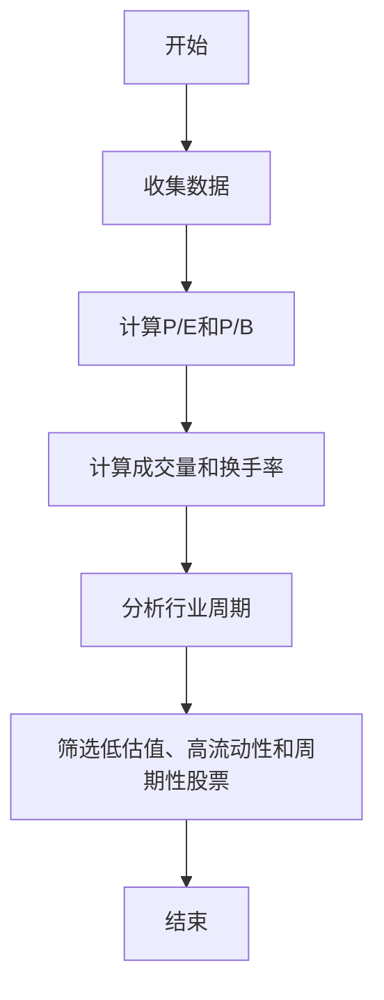
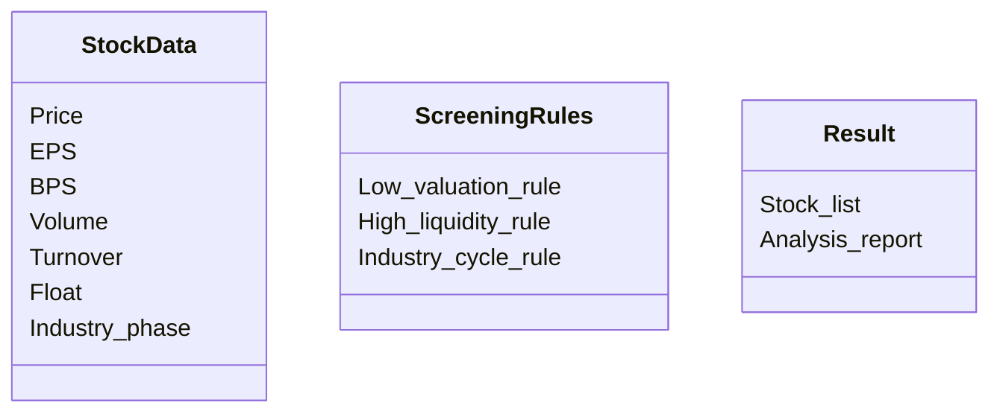

                 


# 特价股票筛选的三大核心规则

> 关键词：特价股票、股票筛选、低估值、高流动性、行业周期性

> 摘要：本文详细介绍了特价股票筛选的三大核心规则，包括低估值原则、高流动性原则和行业周期性原则。通过分析这些规则的定义、特征、优缺点及实施步骤，结合数学模型和算法，帮助投资者在股票市场中找到具有投资价值的特价股票。文章还提供了系统架构设计和项目实战，帮助读者更好地理解和应用这些规则。

---

# 第一部分: 特价股票筛选的背景与核心概念

## 第1章: 特价股票筛选的背景与意义

### 1.1 特价股票的定义与特征
#### 1.1.1 特价股票的定义
特价股票是指在特定时间段内，价格显著低于市场平均水平的股票。这些股票通常具有较高的投资潜力，但可能存在较高的风险。

#### 1.1.2 特价股票的市场特征
- 价格波动大
- 市盈率（P/E）和市净率（P/B）低于行业平均水平
- 交易量相对较低

#### 1.1.3 特价股票与普通股票的区别
- 投资风险：特价股票通常风险较高，普通股票风险相对较低
- 投资回报：特价股票可能有更高的回报潜力，但需要更多的分析和判断

### 1.2 特价股票筛选的重要性
#### 1.2.1 投资者需求与筛选目标
投资者希望通过筛选特价股票，找到具有较高增长潜力的股票，从而实现超额收益。

#### 1.2.2 市场波动对筛选策略的影响
市场波动可能导致特价股票的价格进一步下跌，因此筛选策略需要考虑市场周期和行业趋势。

#### 1.2.3 特价股票筛选的经济意义
通过筛选特价股票，投资者可以在市场低谷时介入，抓住潜在的收益机会，同时为企业的复苏和增长提供资金支持。

### 1.3 特价股票筛选的核心规则
#### 1.3.1 规则一：低估值原则
低估值是筛选特价股票的核心规则之一，通常通过市盈率和市净率等指标来衡量。

#### 1.3.2 规则二：高流动性原则
高流动性原则确保股票的买卖容易，不会因流动性不足而影响交易价格。

#### 1.3.3 规则三：行业周期性原则
行业周期性原则帮助投资者选择处于周期性低谷的行业中的股票，这些股票可能在行业复苏时实现更高的收益。

### 1.4 本章小结
本章介绍了特价股票的定义、特征以及筛选的重要性，并提出了三大核心规则：低估值原则、高流动性原则和行业周期性原则。

---

## 第2章: 特价股票筛选的核心规则解析

### 2.1 规则一：低估值原则
#### 2.1.1 低估值的定义与衡量标准
低估值是指股票的价格低于其内在价值。衡量标准包括市盈率（P/E）和市净率（P/B）等指标。

#### 2.1.2 市盈率与市净率的计算方法
- 市盈率（P/E）= 股价 / 每股收益（EPS）
- 市净率（P/B）= 股价 / 每股净资产（BPS）

#### 2.1.3 低估值股票的筛选步骤
1. 计算股票的市盈率和市净率
2. 比较市盈率和市净率与行业平均水平
3. 筛选出市盈率和市净率低于行业平均水平的股票

### 2.2 规则二：高流动性原则
#### 2.2.1 高流动性的定义与衡量标准
高流动性是指股票的交易量大，买卖价差小。衡量标准包括成交量和换手率。

#### 2.2.2 成交量与换手率的分析方法
- 成交量：一定时间内成交的股数
- 换手率：一定时间内成交股数占总流通股数的比例

#### 2.2.3 高流动性股票的筛选步骤
1. 计算股票的成交量和换手率
2. 比较成交量和换手率与行业平均水平
3. 筛选出成交量大、换手率高的股票

### 2.3 规则三：行业周期性原则
#### 2.3.1 行业周期的定义与分类
行业周期分为复苏期、增长期、成熟期和衰退期。

#### 2.3.2 牛市与熊市对行业周期的影响
- 牛市：大多数行业处于增长期
- 熊市：大多数行业处于衰退期

#### 2.3.3 行业周期性股票的筛选步骤
1. 分析行业所处的周期阶段
2. 选择处于周期低谷的行业
3. 筛选出行业内低估值的股票

### 2.4 本章小结
本章详细解析了三大核心规则，包括低估值原则、高流动性原则和行业周期性原则，并给出了具体的筛选步骤。

---

## 第3章: 特价股票筛选的数学模型与算法

### 3.1 特价股票筛选的数学模型
#### 3.1.1 低估值模型
$$ P/E_{ratio} = \frac{Price}{EPS} $$
$$ P/B_{ratio} = \frac{Price}{BPS} $$

#### 3.1.2 高流动性模型
$$ Volume_{ratio} = \frac{Volume}{Industry\_average\_volume} $$
$$ Turnover_{ratio} = \frac{Turnover}{Float} $$

#### 3.1.3 行业周期性模型
$$ Industry\_phase = \text{根据宏观经济指标判断} $$

### 3.2 算法原理与流程图



### 3.3 算法实现
```python
import pandas as pd

def screen_special_stocks(data):
    # 计算市盈率和市净率
    data['P/E'] = data['Price'] / data['EPS']
    data['P/B'] = data['Price'] / data['BPS']
    
    # 计算成交量和换手率
    data['Volume_ratio'] = data['Volume'] / data['Industry_average_volume']
    data['Turnover_ratio'] = data['Turnover'] / data['Float']
    
    # 行业周期分析
    data['Industry_phase'] = data.apply(lambda x: '复苏期' if x['GDP_growth'] > 2 else '衰退期', axis=1)
    
    # 筛选规则
    low_valuation = data[(data['P/E'] < data['Industry_P/E']) & (data['P/B'] < data['Industry_P/B'])]
    high_liquidity = low_valuation[(low_valuation['Volume_ratio'] > 1.5) & (low_valuation['Turnover_ratio'] > 0.5)]
    final_screen = high_liquidity[high_liquidity['Industry_phase'] == '衰退期']
    
    return final_screen
```

### 3.4 本章小结
本章通过数学模型和算法，详细介绍了特价股票筛选的实现过程，并给出了具体的Python代码示例。

---

## 第4章: 特价股票筛选的系统架构设计

### 4.1 系统功能设计
#### 4.1.1 领域模型


#### 4.1.2 系统架构


### 4.2 接口设计与交互流程
#### 4.2.1 数据采集接口
```python
def get_stock_data(ticker):
    # 从数据库或API获取股票数据
    return stock_data
```

#### 4.2.2 筛选策略接口
```python
def apply_screening_rules(stock_data):
    # 应用三大核心规则
    return screened_stocks
```

### 4.3 本章小结
本章设计了特价股票筛选系统的架构，包括数据采集、预处理、特征提取和结果展示等模块，并给出了具体的接口设计。

---

## 第5章: 特价股票筛选的项目实战

### 5.1 环境安装与数据准备
#### 5.1.1 环境安装
```bash
pip install pandas numpy matplotlib
```

#### 5.1.2 数据准备
```python
import pandas as pd

# 从CSV文件加载数据
data = pd.read_csv('stock_data.csv')
```

### 5.2 系统核心实现
#### 5.2.1 数据采集与预处理
```python
def preprocess_data(data):
    # 数据清洗
    data = data.dropna()
    # 标准化处理
    data = (data - data.mean()) / data.std()
    return data
```

#### 5.2.2 筛选策略实现
```python
def apply_screening_rules(data):
    # 低估值筛选
    low_valuation = data[data['P/E'] < data['Industry_P/E']]
    # 高流动性筛选
    high_liquidity = low_valuation[low_valuation['Turnover_ratio'] > 0.5]
    # 行业周期性筛选
    final_screen = high_liquidity[high_liquidity['Industry_phase'] == '衰退期']
    return final_screen
```

### 5.3 实际案例分析
#### 5.3.1 数据分析与可视化
```python
import matplotlib.pyplot as plt

data['P/E'].hist(bins=20)
plt.title('市盈率分布')
plt.show()
```

#### 5.3.2 筛选结果展示
```python
print(final_screen)
```

### 5.4 本章小结
本章通过实际案例，展示了特价股票筛选系统的实现过程，并给出了具体的代码和结果分析。

---

## 第6章: 特价股票筛选的最佳实践

### 6.1 小结
特价股票筛选的核心在于低估值、高流动性和行业周期性原则的综合应用。

### 6.2 注意事项
- 筛选结果仅供参考，需结合市场实际情况进行判断
- 风险控制是投资的重要部分，需合理分散投资

### 6.3 扩展阅读
- 廖雄教授的《股票投资策略》
- 《技术分析实战指南》

### 6.4 本章小结
本章总结了特价股票筛选的核心内容，并提供了实际投资中的注意事项和扩展阅读资料。

---

# 作者：AI天才研究院/AI Genius Institute & 禅与计算机程序设计艺术 /Zen And The Art of Computer Programming

