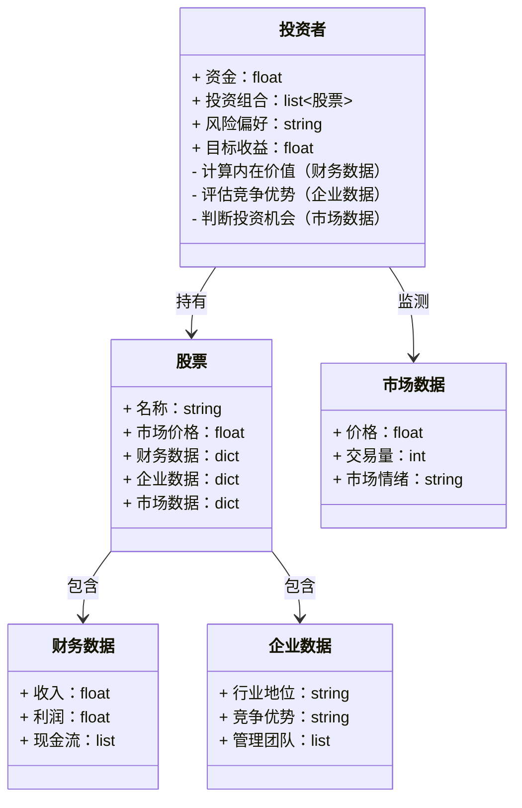
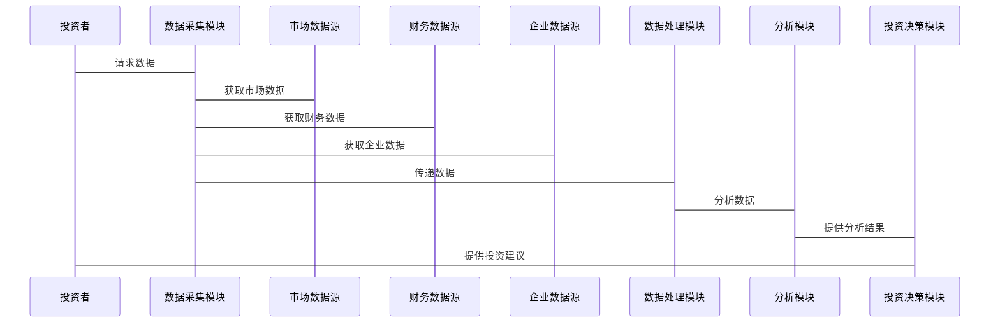

                 


# 玛丽·巴芙特的耐心资本：长期价值投资的力量

## 关键词：价值投资，长期投资，耐心资本，巴菲特，投资策略，数学模型，系统架构

## 摘要：本文深入探讨了玛丽·巴芙特的长期价值投资策略，结合技术语言和逻辑分析，详细阐述了价值投资的核心概念、算法原理、系统架构以及实际案例。通过对比分析、数学建模和系统设计，帮助读者全面理解长期价值投资的力量及其在现代投资中的应用。

---

## 第一部分: 背景介绍

### 第1章: 价值投资的起源与发展

#### 1.1 价值投资的起源
##### 1.1.1 投资学的起源与发展
- 投资学的起源可以追溯到古希腊时期，但现代投资学的奠基人是本杰明·格雷厄姆和戴维·多德，他们提出了“价值投资”的概念。
- 在20世纪30年代，格雷厄姆和多德的理论奠定了价值投资的基础，特别是在1934年出版的《安全分析》一书中，他们提出了寻找“烟屁股”股票的方法，即寻找被市场低估的股票。

##### 1.1.2 价值投资的核心理念
- 价值投资的核心理念是购买低于其内在价值的股票，并长期持有，直到市场重新认识到其价值。
- 强调安全边际，即买入价格低于内在价值，以确保即使出现错误，也能获得收益。

##### 1.1.3 巴菲特与价值投资的结合
- 巴菲特是格雷厄姆的学生，他将价值投资的理念发扬光大，并在实践中取得了巨大成功。
- 巴菲特强调投资优质企业，关注企业的内在价值和竞争优势，而不是市场波动。

#### 1.2 长期价值投资的定义与特点
##### 1.2.1 长期价值投资的定义
- 长期价值投资是指投资者以企业的内在价值为导向，长期持有优质股票，不被短期市场波动所影响的投资策略。

##### 1.2.2 长期价值投资的核心特点
- **长期持有**：避免频繁交易，减少交易成本和情绪干扰。
- **基本面分析**：通过分析企业的财务状况、行业地位、竞争优势等，寻找具有可持续增长潜力的企业。
- **安全边际**：买入价格低于内在价值，确保即使出现错误，也能获得正收益。

##### 1.2.3 长期价值投资与短期投资的区别
- **目标**：长期投资追求企业的内在价值增长，短期投资追求价格波动带来的收益。
- **时间框架**：长期投资通常持有3年以上，短期投资则以季度或月为单位。
- **风险承受**：长期投资者能够承受更大的短期波动，而短期投资者则更关注短期收益。

#### 1.3 耐心资本的重要性
##### 1.3.1 耐心资本的定义
- 耐心资本是指投资者在长期持有股票的过程中，能够忍受短期市场波动，不因市场的短期波动而改变投资决策的资金。

##### 1.3.2 耐心资本在投资中的作用
- 耐心资本能够帮助投资者避免因短期市场波动而做出错误的决策，从而实现长期的资本增值。
- 耐心资本能够降低交易成本和心理压力，使投资者专注于长期价值。

##### 1.3.3 耐心资本与投资回报的关系
- 耐心资本与投资回报呈正相关，长期持有优质股票能够获得更高的复利收益。
- 短期波动可能导致短期亏损，但长期来看，优质企业的内在价值增长能够抵消短期波动的影响。

### 第2章: 巴菲特的投资理念

#### 2.1 巴菲特的投资策略
##### 2.1.1 高质量企业的选择标准
- **行业地位**：选择行业龙头，具有强大的竞争优势。
- **财务状况**：企业财务健康，负债低，现金流稳定。
- **管理团队**：管理团队优秀，有长期的愿景和良好的道德记录。

##### 2.1.2 股价与内在价值的匹配
- 巴菲特强调买入价格低于内在价值，而不是追求市场最低价。
- 内在价值计算公式：$$\text{内在价值} = \text{未来现金流的现值}$$

##### 2.1.3 安全边际的概念与应用
- 安全边际是指买入价格与内在价值之间的差距，$$\text{安全边际} = \text{内在价值} - \text{买入价格}$$
- 安全边际越大，投资风险越小。

#### 2.2 巴菲特的投资哲学
##### 2.2.1 市场先生的比喻
- 巴菲特将市场比作“市场先生”，市场先生每天都会报出一个价格，投资者可以选择接受或拒绝。
- 投资者应该在市场先生报出低价时买入，高价时卖出。

##### 2.2.2 避免情绪化投资
- 投资者应避免贪婪和恐惧的情绪化投资，保持理性。
- 长期持有优质股票，避免因市场波动而频繁交易。

##### 2.2.3 长期持有优质资产
- 巴菲特认为，长期持有优质资产是实现财富增长的最佳方式。
- 优质资产具有持续的现金流和竞争优势。

#### 2.3 巴菲特的成功案例
##### 2.3.1 可口可乐的投资案例
- 可口可乐是巴菲特的经典投资案例之一，他长期持有可口可乐股票，获得了丰厚的回报。
- 可口可乐具有强大的品牌优势和全球市场，能够持续增长。

##### 2.3.2 伯克希尔 Hathaway 的投资历程
- 伯克希尔 Hathaway 是巴菲特的旗舰公司，他通过收购优质企业，不断扩大公司的规模和利润。
- 伯克希尔 Hathaway 的股票价格长期来看表现优异。

##### 2.3.3 其他经典投资案例分析
- 麦当劳：巴菲特投资麦当劳，看重其全球品牌和持续增长的潜力。
- 吉列刀片：巴菲特早期投资吉列刀片公司，获得了高额回报。

### 第3章: 长期价值投资的核心要素

#### 3.1 财务分析的基础
##### 3.1.1 资产负债表分析
- 资产负债表显示企业的资产、负债和所有者权益。
- 重点分析企业的资产质量、负债结构和所有者权益的变化。

##### 3.1.2 利润表分析
- 利润表显示企业的收入、成本和利润。
- 重点分析企业的盈利能力、成本控制能力和收入增长潜力。

##### 3.1.3 现金流量表分析
- 现金流量表显示企业的现金流入和流出。
- 重点分析企业的现金流健康状况，确保企业有足够的现金流支持运营和发展。

#### 3.2 企业竞争优势的评估
##### 3.2.1 投资壁垒的定义
- 投资壁垒是指企业在行业中具有竞争优势，其他企业难以复制或超越的优势。
- 例如，品牌优势、技术壁垒、成本优势等。

##### 3.2.2 企业竞争优势的来源
- 品牌优势：强大的品牌能够吸引更多的客户，提高市场份额。
- 技术优势：拥有独特的技术，能够在行业中保持领先地位。
- 成本优势：通过规模经济或成本控制，能够在价格上具有竞争力。

##### 3.2.3 可持续竞争优势的判断
- 可持续竞争优势是指企业在长期竞争中能够保持竞争优势的能力。
- 判断可持续竞争优势的关键在于企业的核心竞争力和行业发展趋势。

#### 3.3 风险管理的重要性
##### 3.3.1 风险的定义与分类
- 风险是指投资过程中可能发生的损失或不确定性。
- 风险可以分为系统性风险和非系统性风险。

##### 3.3.2 风险管理的策略
- 分散投资：通过投资不同的资产或行业来降低风险。
- 选择优质企业：投资具有强大竞争优势的企业，降低企业特有风险。
- 风险定价：通过合理的定价策略，降低投资风险。

##### 3.3.3 风险与回报的平衡
- 高风险投资通常伴随着高回报，但长期价值投资者更注重风险控制和回报的可持续性。
- 通过长期持有优质资产，投资者可以在较低风险的情况下获得较高的回报。

---

## 第二部分: 核心概念与联系

### 第4章: 核心概念的原理

#### 4.1 价值投资的核心原理
##### 4.1.1 内在价值的计算方法
- 内在价值是企业未来现金流的现值，计算公式为：$$\text{内在价值} = \sum_{t=1}^{n} \frac{CF_t}{(1+r)^t}$$
- 其中，$$CF_t$$ 是第t年的现金流，$$r$$ 是折现率。

##### 4.1.2 市场价格与内在价值的关系
- 市场价格围绕内在价值波动，长期来看，市场价格会回归内在价值。
- 投资者应在市场价格低于内在价值时买入，高于内在价值时卖出。

##### 4.1.3 安全边际的数学模型
- 安全边际 = 内在价值 - 市场价格
- 例如，如果内在价值为100，市场价格为80，安全边际为20，表示有20%的缓冲空间。

#### 4.2 耐心资本的数学模型
##### 4.2.1 时间价值的计算公式
- 时间价值是指资金在长期投资中由于复利效应而产生的增值。
- 复利公式为：$$A = P(1 + r)^t$$
- 其中，$$P$$ 是本金，$$r$$ 是年化收益率，$$t$$ 是投资时间。

##### 4.2.2 复利计算的原理
- 复利是价值投资的重要原理，长期持有优质股票能够获得复利收益。
- 例如，投资100元，年化收益率为10%，10年后的复利收益为：$$A = 100(1 + 0.1)^{10} = 259.37$$

##### 4.2.3 长期投资的收益模型
- 长期投资的收益主要来源于企业的内在价值增长和复利效应。
- 内在价值增长公式：$$\text{内在价值} = \text{当前内在价值} \times (1 + \text{增长率})^t$$
- 结合复利效应，长期投资的收益模型为：$$A = P(1 + r)^t$$

### 第5章: 核心概念对比与ER图

#### 5.1 价值投资与其他投资策略的对比
##### 5.1.1 价值投资与成长投资的对比
- **价值投资**：注重低估值，长期持有优质企业。
- **成长投资**：注重高增长，投资于成长型企业。
- 对比：价值投资更注重安全边际，成长投资更注重增长潜力。

##### 5.1.2 价值投资与趋势投资的对比
- **价值投资**：基于内在价值，长期持有。
- **趋势投资**：基于市场趋势，短期操作。
- 对比：价值投资注重长期，趋势投资注重短期。

##### 5.1.3 价值投资与套利投资的对比
- **价值投资**：寻找低估股票，长期持有。
- **套利投资**：寻找市场套利机会，短期操作。
- 对比：价值投资注重价值，套利投资注重机会。

#### 5.2 实体关系图（ER图）
##### 5.2.1 投资者与市场的关系
- 投资者通过市场进行交易，市场提供价格信息和交易机会。
- ER图展示：投资者与市场的关联。

##### 5.2.2 企业与资本的关系
- 企业通过发行股票或债券，吸引资本投资。
- ER图展示：企业与资本的关联。

##### 5.2.3 资产与风险的关系
- 资产具有不同的风险等级，投资者根据风险偏好选择资产。
- ER图展示：资产与风险的关联。

---

## 第三部分: 算法原理讲解

### 第6章: 价值投资的算法模型

#### 6.1 基本面分析的算法
##### 6.1.1 财务指标的计算与筛选
- 计算市盈率（P/E）、市净率（P/B）、股息率等财务指标。
- 筛选低于行业平均水平的股票。

##### 6.1.2 企业竞争优势的量化评估
- 通过市场份额、品牌影响力、技术专利等指标量化竞争优势。
- 例如，使用品牌价值评估模型：$$\text{品牌价值} = \text{收入} \times \text{品牌影响力}$$

##### 6.1.3 安全边际的计算
- 计算内在价值，比较市场价格与内在价值的差距。
- 例如，内在价值 = 100，市场价格 = 80，安全边际 = 20。

##### 6.1.4 投资决策的算法
- 如果市场价格 < 内在价值，且安全边际 > 10%，则买入。
- 否则，不买入。

#### 6.2 代码实现
##### 6.2.1 环境安装
- 使用Python和Pandas进行数据处理。
- 使用Matplotlib进行数据可视化。

##### 6.2.2 核心实现
```python
import pandas as pd
import numpy as np

def calculate_intrinsic_value(financial_data):
    # 假设financial_data是一个包含财务数据的DataFrame
    # 计算未来现金流的现值
    cash_flows = financial_data['cash_flow'].values
    discount_rate = 0.1  # 假设折现率为10%
    intrinsic_value = np.nansum(cash_flows / (1 + discount_rate)**np.arange(len(cash_flows)))
    return intrinsic_value

def value_investment_strategy(stock_data):
    # stock_data包含股票的市场价格和财务数据
    for stock in stock_data:
        iv = calculate_intrinsic_value(stock_data[stock])
        if iv > stock['price'] and (iv - stock['price']) / stock['price'] > 0.1:
            print(f"买入 {stock}，内在价值：{iv}")
        else:
            print(f"不买入 {stock}，内在价值：{iv}")

# 示例数据
stock_data = {
    'AAPL': {'price': 150, 'cash_flow': [100, 110, 120, 130]},
    'MSFT': {'price': 200, 'cash_flow': [80, 90, 100, 110]}
}

value_investment_strategy(stock_data)
```

##### 6.2.3 代码应用解读与分析
- 代码实现了一个简单的价值投资策略，计算股票的内在价值，并与市场价格进行比较。
- 如果内在价值高于市场价格，并且安全边际超过10%，则建议买入。

#### 6.3 数学模型与公式
##### 6.3.1 内在价值的计算公式
$$\text{内在价值} = \sum_{t=1}^{n} \frac{CF_t}{(1+r)^t}$$
- 其中，$$CF_t$$ 是第t年的现金流，$$r$$ 是折现率。

##### 6.3.2 安全边际的计算公式
$$\text{安全边际} = \text{内在价值} - \text{市场价格}$$

##### 6.3.3 投资决策的判断条件
- 如果 $$\text{市场价格} < \text{内在价值}$$ 且 $$\frac{\text{内在价值} - \text{市场价格}}{\text{市场价格}} > 0.1$$，则买入。

---

## 第四部分: 系统分析与架构设计方案

### 第7章: 系统架构设计

#### 7.1 问题场景介绍
- 投资者需要一个系统来帮助他们进行长期价值投资。
- 系统需要分析企业的财务数据，评估竞争优势，计算内在价值，判断投资机会。

#### 7.2 系统功能设计（领域模型）


#### 7.3 系统架构设计


#### 7.4 系统接口设计
- 数据采集接口：从市场数据源、财务数据源和企业数据源获取数据。
- 数据处理接口：对数据进行清洗、转换和存储。
- 分析接口：计算内在价值、评估竞争优势、判断安全边际。
- 投资决策接口：根据分析结果，生成投资建议。

#### 7.5 系统交互设计


---

## 第五部分: 项目实战

### 第8章: 项目实战

#### 8.1 环境安装
- 安装Python和必要的库（Pandas、NumPy、Matplotlib）。
- 安装数据分析工具（如Excel、SQL Server）。

#### 8.2 核心实现
##### 8.2.1 数据采集
- 从股票市场获取股票的市场价格和财务数据。
- 例如，使用Yahoo Finance API获取股票数据。

##### 8.2.2 数据分析
- 计算股票的内在价值和安全边际。
- 生成投资建议。

##### 8.2.3 投资决策
- 根据分析结果，生成买入、卖出或持有建议。

#### 8.3 代码实现
```python
import pandas as pd
import numpy as np

def calculate_intrinsic_value(stock_data):
    cash_flows = stock_data['cash_flow'].values
    discount_rate = 0.1
    intrinsic_value = np.nansum(cash_flows / (1 + discount_rate)**np.arange(len(cash_flows)))
    return intrinsic_value

def generate_investment_recommendation(stock_data):
    iv = calculate_intrinsic_value(stock_data)
    price = stock_data['price'].values[0]
    if iv > price and (iv - price) / price > 0.1:
        return "买入"
    elif iv < price and (price - iv) / iv > 0.1:
        return "卖出"
    else:
        return "持有"

# 示例数据
stock_data = {
    'AAPL': pd.DataFrame({
        'price': [150],
        'cash_flow': [100, 110, 120, 130]
    }),
    'MSFT': pd.DataFrame({
        'price': [200],
        'cash_flow': [80, 90, 100, 110]
    })
}

recommendation = generate_investment_recommendation(stock_data['AAPL'])
print(f"投资建议：{recommendation}")
```

#### 8.4 项目小结
- 通过实战项目，投资者可以掌握长期价值投资的核心算法和系统设计。
- 实战项目能够帮助投资者在实际操作中应用价值投资的理念，做出科学的投资决策。

---

## 第六部分: 最佳实践

### 第9章: 最佳实践

#### 9.1 小结
- 长期价值投资是一种科学的投资方法，需要投资者具备耐心、纪律性和长期视角。
- 通过基本面分析、安全边际计算和复利效应，投资者可以在长期获得稳定的回报。

#### 9.2 注意事项
- 投资者应避免情绪化投资，坚持长期持有优质资产。
- 投资者应定期审视投资组合，确保符合长期价值投资的理念。

#### 9.3 拓展阅读
- 《The Intelligent Investor》 by Benjamin Graham
- 《The Warren Buffett Way》 by Charles J. Ferrario
- 《价值投资实战手册》 by 巴菲特的信徒

---

## 作者：AI天才研究院/AI Genius Institute & 禅与计算机程序设计艺术 /Zen And The Art of Computer Programming

---

通过以上结构，我们可以清晰地看到长期价值投资的力量，并通过技术语言和逻辑分析，帮助投资者更好地理解和应用这一策略。

