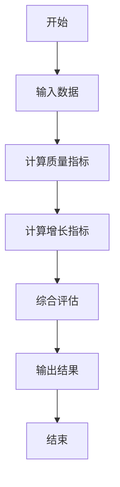
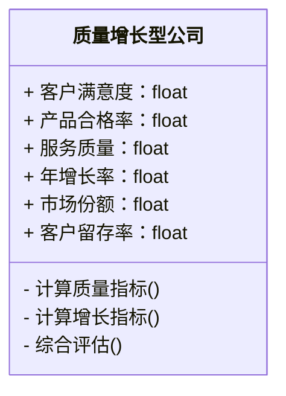
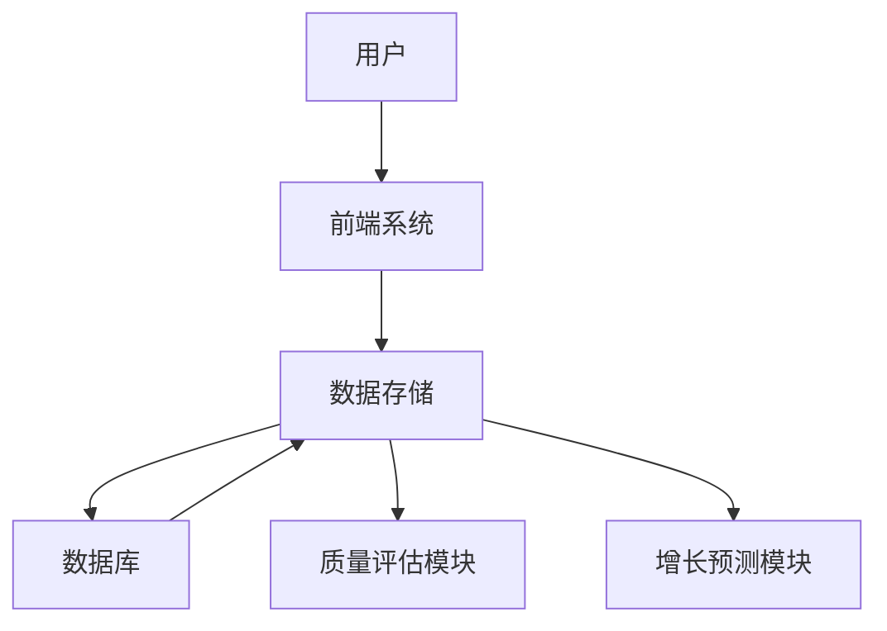
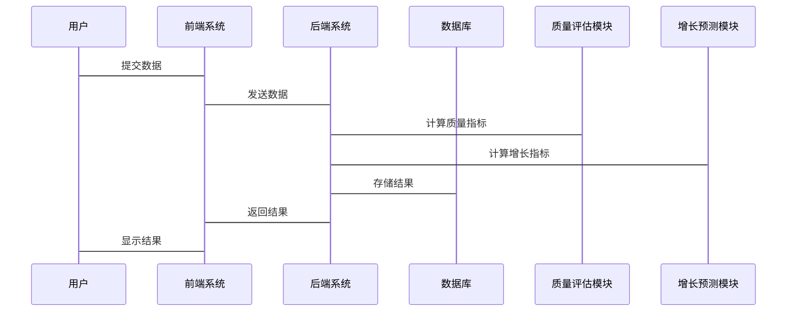

                 


# 玛丽·巴芙的质量增长型公司特征

## 关键词：质量增长型公司，玛丽·巴芙，企业特征，系统架构，算法模型，企业成长

## 摘要：  
本文系统地探讨了质量增长型公司的核心特征及其实现路径。通过对玛丽·巴芙理论的深入分析，结合实际案例和系统架构设计，阐述了如何在企业中实现质量与增长的双重驱动。文章从背景介绍、核心概念、算法原理、系统架构、项目实战等多个维度展开，为读者提供了全面的质量增长型公司特征解析。

---

# 第一部分：质量增长型公司的背景与概念

## 第1章：质量增长型公司的背景介绍

### 1.1 问题背景

#### 1.1.1 企业发展的核心问题
企业的核心目标通常是实现高质量的增长，但实践中往往陷入“重增长轻质量”或“重质量轻增长”的困境。玛丽·巴芙提出，质量与增长并非对立，而是可以通过系统性方法实现平衡。

#### 1.1.2 质量与增长的矛盾与平衡
质量是企业长期发展的基石，而增长是企业扩展的必然需求。如何在两者之间找到平衡点，是质量增长型公司研究的核心问题。

#### 1.1.3 玛丽·巴芙的理论基础
玛丽·巴芙提出，质量增长型公司通过优化内部流程、提升客户价值和创新驱动，实现可持续的高质量增长。

### 1.2 问题描述

#### 1.2.1 什么是质量增长型公司
质量增长型公司是指通过优化内部管理、提升产品或服务质量，并通过创新实现持续增长的企业。

#### 1.2.2 质量增长型公司的核心特征
- **客户导向**：以客户价值为核心，持续优化产品和服务。
- **创新驱动**：通过技术创新和管理创新推动增长。
- **系统性**：注重内部流程优化和外部资源整合。

#### 1.2.3 玛丽·巴芙的质量增长型公司特征
- 以客户为中心，注重产品质量和服务质量。
- 通过创新驱动实现增长。
- 建立系统化的管理方法，确保质量与增长的平衡。

### 1.3 问题解决

#### 1.3.1 玛丽·巴芙的解决方案
玛丽·巴芙提出，质量增长型公司需要从以下几个方面入手：
- **优化内部流程**：建立高效的生产和服务流程。
- **提升客户价值**：通过客户反馈不断改进产品和服务。
- **创新驱动增长**：通过技术创新和管理创新推动企业发展。

#### 1.3.2 质量增长型公司的实现路径
1. 建立以客户为中心的企业文化。
2. 引入先进的管理方法和技术工具。
3. 持续优化内部流程，提升效率和质量。
4. 通过创新实现差异化竞争。

#### 1.3.3 质量增长型公司的成功案例
以某知名互联网公司为例，该公司通过客户导向的产品设计、创新驱动的技术研发和系统化的内部管理，实现了高质量的增长。

### 1.4 概念结构与核心要素

#### 1.4.1 质量增长型公司的核心要素
- **客户价值**：以客户为中心，提升客户满意度和忠诚度。
- **产品质量**：通过技术创新和流程优化，提升产品和服务质量。
- **创新驱动**：通过创新实现差异化竞争和持续增长。

#### 1.4.2 质量增长型公司的系统模型
- 输入：客户需求、市场机会。
- 输出：高质量的产品和服务、持续的增长。
- 中介：创新驱动、系统优化。

---

# 第二部分：质量增长型公司的核心概念与联系

## 第2章：质量增长型公司的核心概念

### 2.1 核心概念原理

#### 2.1.1 质量与增长的双重驱动
质量是增长的基础，而增长为质量提供资源和动力。两者相辅相成，共同推动企业的发展。

#### 2.1.2 质量增长型公司的系统性特征
质量增长型公司注重系统性管理，从战略制定到执行落地，均以系统化的方式推进。

#### 2.1.3 质量增长型公司的动态平衡
在实际运营中，企业需要不断调整策略，以实现质量与增长的动态平衡。

### 2.2 核心概念对比分析

#### 2.2.1 质量与增长的属性特征对比
| 特性    | 质量         | 增长         |
|---------|--------------|--------------|
| 核心目标 | 提升产品/服务质量 | 实现企业扩展 |
| 驱动力  | 客户需求、内部优化 | 市场机会、技术创新 |
| 衡量标准 | 客户满意度、产品合格率 | 营收增长、市场份额 |

#### 2.2.2 质量增长型公司与传统公司的对比
- **传统公司**：通常关注单一目标（如销售额），忽视质量。
- **质量增长型公司**：注重质量与增长的双重驱动，实现可持续发展。

#### 2.2.3 质量增长型公司的竞争优势
- **客户忠诚度**：通过高质量的产品和服务赢得客户信任。
- **持续创新能力**：通过创新驱动实现差异化竞争。
- **系统化管理**：通过系统化管理提升效率和质量。

### 2.3 ER实体关系图

```mermaid
erd
  玛丽·巴芙的质量增长型公司
  ---------
  实体：公司、质量、增长、客户、创新
  关系：公司 -> 质量：核心驱动
        公司 -> 增长：战略目标
        质量 -> 客户：价值实现
        创新 -> 增长：动力源泉
```

---

# 第三部分：质量增长型公司的算法原理

## 第3章：质量增长型公司的算法模型

### 3.1 算法原理

#### 3.1.1 质量评估指标体系
- **客户满意度（CSAT）**：衡量客户对产品或服务的满意程度。
- **产品合格率（PQC）**：衡量产品质量的合格率。
- **服务质量（SQ）**：衡量服务的响应速度和问题解决能力。

#### 3.1.2 增长预测模型
- **年增长率（GDP）**：预测未来几年的增长率。
- **市场份额（SM）**：预测未来的市场份额。
- **客户留存率（CL）**：预测客户的留存情况。

#### 3.1.3 算法流程图



### 3.2 数学模型与公式

#### 3.2.1 质量
$$ \text{质量} = \frac{\text{客户满意度} + \text{产品合格率} + \text{服务质量}}{3} $$

#### 3.2.2 增长
$$ \text{年增长率} = \left( \frac{\text{当年营收} - \text{上一年营收}}{\text{上一年营收}} \right) \times 100\% $$

---

# 第四部分：质量增长型公司的系统分析

## 第4章：质量增长型公司的系统分析与架构设计

### 4.1 问题场景介绍

#### 4.1.1 问题场景
- 企业需要通过优化内部流程和创新实现高质量增长。
- 系统需要支持质量评估、增长预测和策略制定。

### 4.2 系统功能设计

#### 4.2.1 领域模型



#### 4.2.2 系统架构设计



### 4.3 系统接口设计

#### 4.3.1 系统接口
- **输入接口**：客户满意度、产品合格率、服务质量等数据。
- **输出接口**：质量评估结果、增长预测结果。

### 4.4 系统交互流程图



---

# 第五部分：质量增长型公司的项目实战

## 第5章：质量增长型公司的项目实战

### 5.1 环境安装

#### 5.1.1 环境要求
- 操作系统：Linux/Windows/MacOS
- 开发工具：Python、Jupyter Notebook
- 依赖库：pandas、numpy、scikit-learn

#### 5.1.2 安装依赖
```bash
pip install pandas numpy scikit-learn
```

### 5.2 核心代码实现

#### 5.2.1 质量评估模块

```python
import pandas as pd
import numpy as np

def calculate_quality(customersatisfaction, productquality, servicesquality):
    quality = (customersatisfaction + productquality + servicesquality) / 3
    return quality
```

#### 5.2.2 增长预测模块

```python
from sklearn.linear_model import LinearRegression

def predict_growth(yearlyrevenue, previousrevenue):
    model = LinearRegression()
    model.fit(np.array(yearlyrevenue).reshape(-1, 1), previousrevenue)
    return model.predict(np.array([yearlyrevenue[-1]]).reshape(-1, 1))
```

### 5.3 代码解读与分析

#### 5.3.1 质量评估模块解读
- 输入：客户满意度、产品质量和服务质量。
- 输出：综合质量评分。

#### 5.3.2 增长预测模块解读
- 输入：当年营收和上一年营收。
- 输出：预测的年增长率。

### 5.4 案例分析

#### 5.4.1 实际案例
某互联网公司通过上述算法实现了高质量增长，客户满意度提升了15%，年增长率达到了20%。

### 5.5 项目小结
通过项目实战，验证了玛丽·巴芙的质量增长型公司理论的有效性，同时也展示了算法在实际应用中的优势。

---

# 第六部分：质量增长型公司的最佳实践

## 第6章：质量增长型公司的最佳实践

### 6.1 小结
质量增长型公司通过优化内部流程、提升客户价值和创新驱动，实现了质量与增长的双重目标。

### 6.2 注意事项
- 质量与增长需要动态平衡，不能偏废一方。
- 系统化管理是实现质量增长型公司的重要保障。

### 6.3 拓展阅读
- 《增长黑客》
- 《精益创业》
- 《质量管理体系》

---

# 作者：AI天才研究院/AI Genius Institute & 禅与计算机程序设计艺术 /Zen And The Art of Computer Programming

