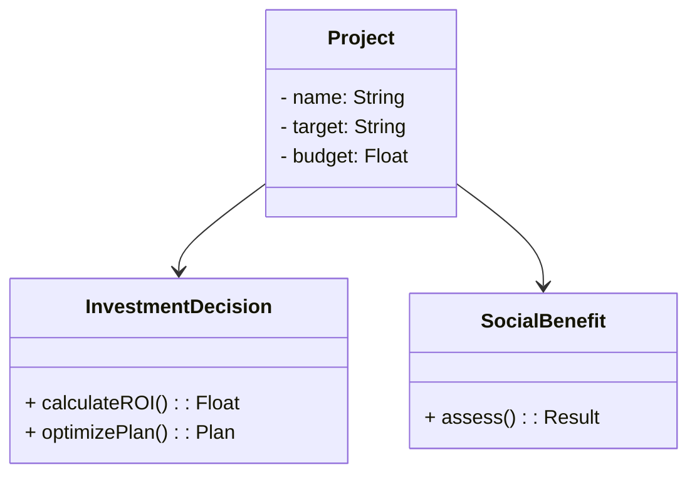
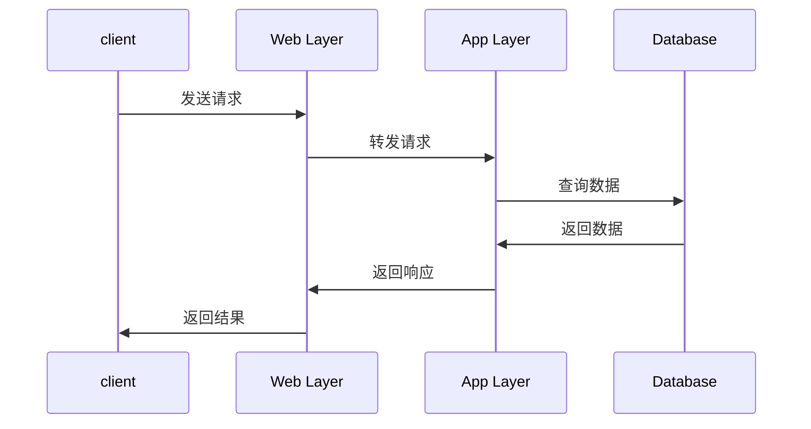

                 


# 生态修复项目的社会效益量化与投资决策

**关键词**：生态修复，社会效益量化，投资决策，环境经济学，项目管理

**摘要**：  
本文探讨了生态修复项目中社会效益的量化方法及其在投资决策中的应用。通过分析生态修复的核心概念、社会效益的评估模型以及投资决策的数学算法，结合实际案例，展示了如何通过系统化的方法实现生态修复项目的社会效益最大化与投资回报最优。本文旨在为生态修复项目的决策者提供理论支持和实践指导。

---

## 第1章: 生态修复项目概述

### 1.1 生态修复的基本概念

#### 1.1.1 生态修复的定义与内涵  
生态修复是指通过人为干预措施，恢复或改善因人类活动或自然因素导致退化的生态系统。其内涵包括生态系统的结构、功能和生产力的恢复，以及生物多样性的保护和提升。

#### 1.1.2 生态修复的重要性和必要性  
生态修复是解决环境问题、实现可持续发展的重要手段。它不仅能够改善生态环境，还能提升区域经济发展和社会福利。

#### 1.1.3 生态修复的分类与应用场景  
生态修复可按目标分为水土保持、植被恢复、湿地修复等类型，应用场景包括矿区复绿、河流治理、城市绿化等。

---

### 1.2 社会效益量化的重要性

#### 1.2.1 生态修复项目中的社会效益范畴  
社会效益包括生态系统的改善、居民健康提升、社会稳定增强等多个方面。

#### 1.2.2 社会效益量化的目标与意义  
量化社会效益旨在为政策制定和投资决策提供科学依据，确保生态修复项目的长期效益最大化。

#### 1.2.3 生态修复与社会发展的关系  
生态修复是实现人与自然和谐共生的关键，通过改善生态环境，促进社会经济的可持续发展。

---

### 1.3 投资决策在生态修复项目中的作用

#### 1.3.1 投资决策的基本概念  
投资决策是指在多个备选方案中选择最优方案的过程。

#### 1.3.2 生态修复项目投资决策的特点  
生态修复项目具有长期性、公益性和复杂性，其投资决策需要综合考虑经济效益和社会效益。

#### 1.3.3 投资决策与社会效益的关系  
社会效益是投资决策的重要考量因素，通过量化社会效益，可以更科学地制定投资方案。

---

## 第2章: 生态修复项目社会效益的量化方法

### 2.1 生态修复社会效益的指标体系

#### 2.1.1 社会效益的构成要素  
包括生态环境改善、居民健康、社会稳定、经济发展等多个方面。

#### 2.1.2 指标权重的确定方法  
采用层次分析法（AHP）确定各指标的权重，确保评估结果的科学性。

#### 2.1.3 指标的动态调整  
根据项目进展和环境变化，动态调整指标权重和评估标准。

---

### 2.2 生态修复社会效益的评估模型

#### 2.2.1 评估模型的基本框架  
构建包括指标体系、权重分配和综合评估的三层结构。

#### 2.2.2 常用的评估方法  
- **层次分析法（AHP）**：通过专家评分确定指标权重。
- **模糊综合评价法**：考虑指标的模糊性，提高评估结果的准确性。

#### 2.2.3 模型的优缺点分析  
AHP方法具有较强的逻辑性，但需要较多的专家参与；模糊综合评价法能够处理模糊性问题，但计算过程较为复杂。

---

### 2.3 生态修复社会效益的动态监测

#### 2.3.1 监测指标的选取与更新  
根据项目特点和环境变化，动态调整监测指标。

#### 2.3.2 监测数据的采集与处理  
采用遥感技术、实地调查等多种方法获取数据，建立数据处理模型。

#### 2.3.3 监测结果的分析与反馈  
定期分析监测结果，优化项目实施策略。

---

## 第3章: 生态修复项目投资决策的数学模型与算法

### 3.1 投资决策的基本原理

#### 3.1.1 投资决策的理论基础  
基于经济学和运筹学的理论，结合生态修复的特殊性，构建决策模型。

#### 3.1.2 投资决策的数学模型  
线性规划模型、动态规划模型和风险评估模型是常用的数学工具。

#### 3.1.3 投资决策的关键因素分析  
包括项目的收益、成本、风险和时间价值等因素。

---

### 3.2 生态修复项目投资决策的算法原理

#### 3.2.1 简单的线性规划模型  
目标函数：最大化社会效益；约束条件：资源有限、时间限制等。

#### 3.2.2 动态规划模型的应用  
将项目分为多个阶段，逐步优化各阶段的决策。

#### 3.2.3 风险评估模型的构建与应用  
通过概率分析和蒙特卡洛模拟，评估项目的风险并制定应对策略。

---

### 3.3 投资决策算法的实现

#### 3.3.1 算法实现的步骤与流程  
1. 确定目标和约束条件；
2. 建立数学模型；
3. 选择优化算法；
4. 实现算法并进行验证。

#### 3.3.2 算法的代码实现（伪代码）  
```python
def investment_decision(target, constraints):
    # 初始化变量
    initialize variables
    # 确定目标函数
    define objective function
    # 建立约束条件
    define constraints
    # 使用优化算法求解
    use optimization algorithm
    return optimal solution
```

#### 3.3.3 算法的优化与改进  
结合实际情况，对算法进行参数调整和优化，提高计算效率和准确性。

---

## 第4章: 生态修复项目社会效益与投资决策的系统架构设计

### 4.1 系统分析与需求分析

#### 4.1.1 系统分析的基本方法  
通过需求调研和问题分析，明确系统的目标和功能。

#### 4.1.2 系统需求的确定与分解  
将需求分解为功能需求和技术需求，确保系统设计的可行性。

#### 4.1.3 系统功能模块的划分  
包括数据采集、模型计算、结果展示等功能模块。

---

### 4.2 系统功能设计

#### 4.2.1 领域模型设计（Mermaid 类图）  


#### 4.2.2 系统架构设计（Mermaid 架构图）  


---

### 4.3 系统接口设计与交互流程

#### 4.3.1 系统接口设计  
定义API接口，实现数据的交互和功能调用。

#### 4.3.2 系统交互流程（Mermaid 序列图）  


---

## 第5章: 项目实战与案例分析

### 5.1 环境安装与配置

#### 5.1.1 开发环境的搭建  
安装Python、NumPy、Matplotlib等开发工具。

#### 5.1.2 数据库的配置  
选择适合的数据库管理系统，建立数据表。

---

### 5.2 核心代码实现

#### 5.2.1 社会效益评估代码  
```python
import numpy as np

def social_benefit_assessment(indicators, weights):
    return np.dot(indicators, weights)
```

#### 5.2.2 投资决策优化代码  
```python
from scipy.optimize import minimize

def investment_optimization(target, constraints):
    result = minimize(target, constraints)
    return result.x
```

---

### 5.3 案例分析与解读

#### 5.3.1 案例背景介绍  
某河流生态修复项目，目标是改善水质和恢复植被。

#### 5.3.2 数据分析与处理  
采集水质、植被覆盖等数据，建立评估模型。

#### 5.3.3 投资决策的实施  
通过优化算法确定最佳投资方案，实现社会效益最大化。

---

## 第6章: 最佳实践、小结与展望

### 6.1 最佳实践 tips

#### 6.1.1 数据采集与处理  
确保数据的准确性和完整性，选择合适的分析工具。

#### 6.1.2 模型优化与改进  
根据实际情况调整模型参数，提高评估结果的准确性。

---

### 6.2 小结

本文系统地探讨了生态修复项目社会效益量化与投资决策的方法，结合实际案例，展示了如何通过数学模型和系统架构设计实现科学决策。

---

### 6.3 注意事项

- 数据的准确性和可靠性是评估的基础；
- 投资决策需综合考虑经济效益和社会效益；
- 动态调整模型参数，适应环境变化。

---

### 6.4 拓展阅读

- 推荐阅读《环境经济学》和《投资决策的理论与实践》等相关书籍。

---

**作者：AI天才研究院 & 禅与计算机程序设计艺术**

