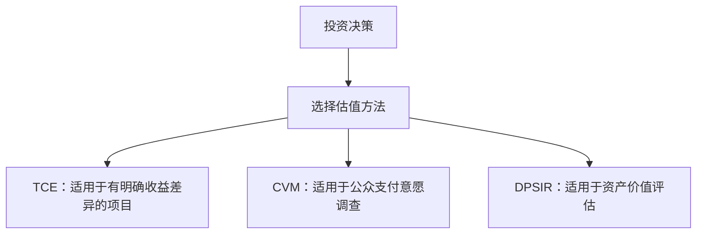
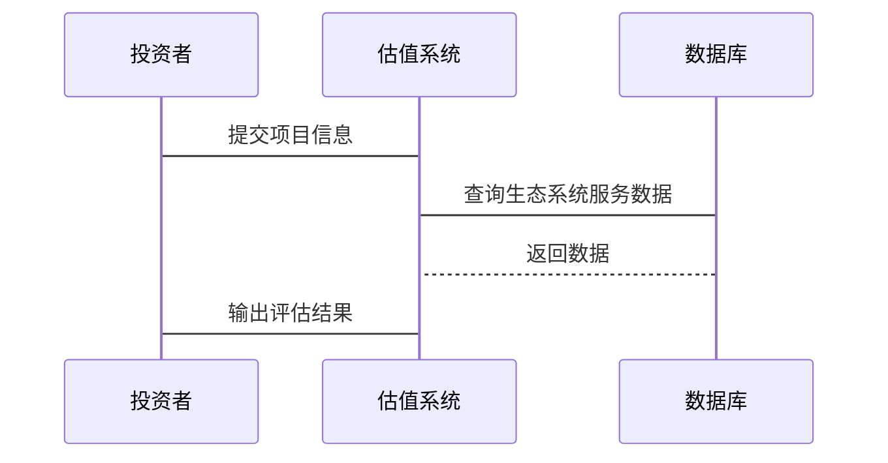

                 


# 生态系统服务估值方法在投资决策中的应用

> **关键词**：生态系统服务，投资决策，估值方法，环境经济学，可持续投资

> **摘要**：  
本文探讨了生态系统服务在投资决策中的重要性及其估值方法。通过分析生态系统服务的分类、估值原理和常见方法，结合系统架构设计和项目实战，详细阐述了如何将生态系统服务的价值纳入投资决策过程，为投资者提供科学依据，助力可持续投资。

---

## 第一章: 生态系统服务与投资决策的背景介绍

### 1.1 生态系统服务的基本概念

#### 1.1.1 生态系统服务的定义
生态系统服务是指自然生态系统提供的直接或间接的效益，包括供给服务（如食物、水）、调节服务（如气候调节、疾病控制）、文化和支持服务（如土壤肥力、养分循环）。

#### 1.1.2 生态系统服务的核心要素
- **供给**：自然资源的提供（如水、木材）。
- **调节**：生态系统的调节功能（如碳汇、洪水控制）。
- **支持**：维持生态系统的功能（如养分循环、土壤形成）。
- **文化**：精神、文化和社会价值（如旅游、教育）。

#### 1.1.3 生态系统服务与人类福祉的关系
生态系统服务是人类福祉的基础，直接影响经济活动、社会稳定和人类健康。

### 1.2 投资决策中的问题背景

#### 1.2.1 现代投资决策的复杂性
现代投资决策涉及环境、社会和治理（ESG）因素，生态系统服务作为关键的环境因素之一，其价值直接影响投资回报。

#### 1.2.2 环境因素在投资中的重要性
环境问题（如气候变化、资源枯竭）对企业的可持续性和盈利能力有深远影响。

#### 1.2.3 生态系统服务对投资决策的影响
生态系统服务的价值未被充分量化和考虑，可能导致投资决策的短期化和不可持续性。

### 1.3 生态系统服务的分类与特征

#### 1.3.1 生态系统服务的分类
| 分类 | 描述 | 示例 |
|------|------|------|
| 供给服务 | 提供自然资源 | 水、食物、木材 |
| 调节服务 | 维持生态平衡 | 气候调节、洪水控制 |
| 支持服务 | 维持生态功能 | 土壤肥力、养分循环 |
| 文化服务 | 提供精神和文化价值 | 旅游、教育 |

#### 1.3.2 生态系统服务的量化与评估
生态系统服务的量化需要结合生态学、经济学和数据科学的方法，建立科学的评估模型。

### 1.4 生态系统服务在投资决策中的应用前景

#### 1.4.1 生态系统服务在投资中的潜在价值
通过量化生态系统服务的价值，投资者可以更好地评估项目的风险和收益。

#### 1.4.2 投资者关注生态系统服务的原因
- 环境风险的规避。
- 可持续投资的需求。
- 长期价值的提升。

#### 1.4.3 生态系统服务对投资决策的长期影响
生态系统服务的价值将影响企业的长期盈利能力和社会责任感。

### 1.5 本章小结
生态系统服务是投资决策中不可忽视的因素，其价值量化对实现可持续投资至关重要。

---

## 第二章: 生态系统服务估值的核心概念与联系

### 2.1 生态系统服务的估值原理

#### 2.1.1 估值的基本概念与方法
- **市场价值**：基于市场交易价格的评估。
- **非市场价值**：无法直接通过市场交易获得，需通过替代方法评估。

#### 2.1.2 生态系统服务的非市场价值
- 非市场价值难以量化，需借助模型和假设。

#### 2.1.3 估值的核心要素与步骤
1. 确定生态系统服务的类型。
2. 收集相关数据。
3. 选择合适的估值方法。
4. 计算并调整价值。

### 2.2 生态系统服务与投资决策的关系

#### 2.2.1 生态系统服务对投资风险的影响
- 生态系统退化可能导致企业面临更高的环境风险。

#### 2.2.2 生态系统服务对投资收益的贡献
- 优质生态服务可以提升企业的社会形象和长期盈利能力。

#### 2.2.3 投资决策中生态系统服务的边界与外延
- 生态系统服务的边界需与投资项目的范围相匹配。

### 2.3 生态系统服务的分类与对比

#### 2.3.1 生态系统服务的分类
- 供给、调节、支持和文化服务。

#### 2.3.2 各类生态系统服务的ER实体关系图
```mermaid
erd
    entity 生态系统服务 {
        类别
        价值
        影响因素
    }
    entity 投资项目 {
        项目目标
        风险因素
        收益
    }
    生态系统服务 -->> 投资项目: 价值影响
```

---

## 第三章: 生态系统服务的估值方法

### 3.1 常见的生态系统服务估值方法

#### 3.1.1 损益转移法（TCE）
- **原理**：通过比较有无生态系统服务的收益差异来评估价值。

#### 3.1.2 意愿支付法（CVM）
- **原理**：通过调查确定人们对生态系统服务的支付意愿。

#### 3.1.3 资产价值法（DPSIR）
- **原理**：基于资产的市场价格评估其生态价值。

### 3.2 各种估值方法的优缺点对比

#### 3.2.1 方法适用场景的Mermaid流程图


#### 3.2.2 方法优缺点对比
| 方法 | 优点 | 缺点 |
|------|------|------|
| TCE | 简单直观 | 需明确有无对比 |
| CVM | 考虑支付意愿 | 调查成本高 |
| DPSIR | 基于市场价 | 依赖市场数据 |

### 3.3 估值方法的数学模型与公式

#### 3.3.1 损益转移法（TCE）
$$ V = \sum_{i=1}^{n} (P_i - C_i) $$
其中，$P_i$为有生态系统服务的收益，$C_i$为无服务的收益。

#### 3.3.2 意愿支付法（CVM）
$$ V = \sum_{i=1}^{n} P_i $$
其中，$P_i$为调查对象的支付意愿。

---

## 第四章: 生态系统服务估值的系统架构设计

### 4.1 问题场景介绍
- 投资者需要量化生态系统服务的价值，以优化投资决策。

### 4.2 系统功能设计

#### 4.2.1 领域模型（Mermaid类图）
```mermaid
classDiagram
    class 生态系统服务 {
        类别
        价值
        影响因素
    }
    class 投资项目 {
        项目目标
        风险因素
        收益
    }
    class 估值模型 {
        输入数据
        计算过程
        输出价值
    }
    生态系统服务 -->> 估值模型: 提供数据
    估值模型 --> 投资项目: 输出价值
```

### 4.3 系统架构设计

#### 4.3.1 系统架构（Mermaid架构图）
```mermaid
container 系统架构 {
    前端：用户界面
    后端：估值模型
    数据库：生态系统服务数据
}
```

### 4.4 系统接口设计
- **输入接口**：接收生态系统服务数据。
- **输出接口**：提供生态系统服务价值评估结果。

### 4.5 系统交互流程（Mermaid序列图）


---

## 第五章: 项目实战

### 5.1 环境安装
- 需要安装Python、NumPy、Pandas和Matplotlib库。

### 5.2 核心代码实现

#### 5.2.1 生态系统服务估值代码
```python
import numpy as np
import pandas as pd

def tce_value(P, C):
    return np.sum(P - C)

P = [100, 200, 150]
C = [80, 180, 120]
value = tce_value(P, C)
print(f"生态系统服务价值为：{value}")
```

### 5.3 案例分析

#### 5.3.1 案例背景
某投资项目涉及森林保护，需评估其碳汇价值。

#### 5.3.2 数据收集与处理
- 森林面积：100公顷。
- 年碳汇量：500吨/年。
- 市场碳价：$50/吨。

#### 5.3.3 估值计算
$$ V = 500 \times 50 = 25,000 \text{美元} $$

#### 5.3.4 结果分析
碳汇价值为25,000美元，需纳入投资收益分析。

### 5.4 项目小结
通过代码实现和案例分析，展示了生态系统服务估值在投资决策中的实际应用。

---

## 第六章: 最佳实践与总结

### 6.1 最佳实践 tips
- 结合多种估值方法提高准确性。
- 定期更新数据和模型。

### 6.2 小结
生态系统服务估值是投资决策中的关键因素，其科学评估有助于实现可持续投资。

### 6.3 注意事项
- 数据的准确性和完整性。
- 方法的选择与适用性。

### 6.4 拓展阅读
建议阅读相关环境经济学和可持续投资的书籍。

---

## 作者：AI天才研究院 & 禅与计算机程序设计艺术

---

通过以上内容，希望为投资者提供科学的生态系统服务估值方法，助力可持续投资决策。

