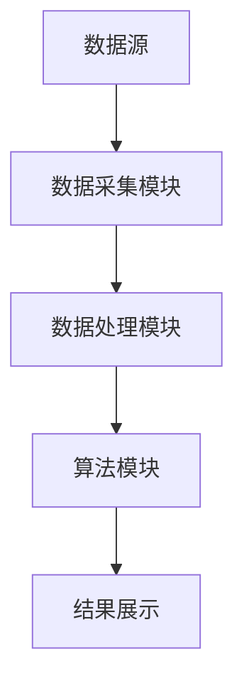
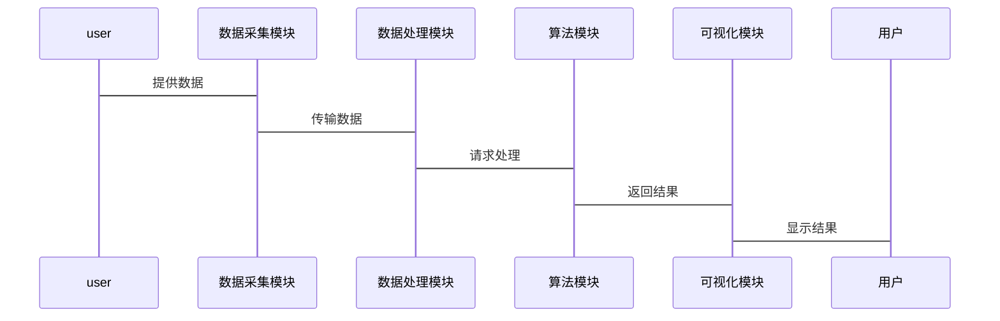

                 


# 生物多样性保护与生态投资机会

> 关键词：生物多样性保护，生态投资，可持续发展，人工智能，区块链技术，经济价值评估

> 摘要：本文探讨了生物多样性保护的重要性及其与生态投资的结合。通过分析现代技术的应用，如人工智能和区块链，本文展示了如何利用技术手段评估和优化生态投资，创造经济价值。文章还详细介绍了算法模型和系统架构，提供了实际案例和最佳实践建议。

---

# 第1章: 生物多样性保护的背景与意义

## 1.1 生物多样性保护的背景

### 1.1.1 全球生物多样性现状
全球生物多样性面临严重威胁，栖息地破坏、气候变化和非法捕猎等因素导致物种灭绝速度加快。根据联合国的数据，目前约有100万个物种面临灭绝的风险。

### 1.1.2 生物多样性保护的重要性
生物多样性是生态系统的核心组成部分，维持着生态系统的功能，如 pollination、水土保持和疾病控制。保护生物多样性对人类生存和经济发展至关重要。

### 1.1.3 现代技术在生物多样性保护中的应用
现代技术如遥感、人工智能和区块链等为生物多样性保护提供了新工具。例如，AI可以用于自动监测和识别物种，区块链可以用于追踪可持续产品。

## 1.2 生物多样性保护的目标与意义

### 1.2.1 生物多样性保护的目标
保护生物多样性不仅是为了维护生态系统的平衡，也是为了实现人类的可持续发展。目标包括防止物种灭绝、维护生态系统服务功能和促进人与自然的和谐。

### 1.2.2 生物多样性保护的经济价值
生物多样性保护具有显著的经济价值。例如，旅游业、农业和医药业都依赖于生物多样性。保护生物多样性可以创造就业、促进经济增长，并减少自然灾害的风险。

### 1.2.3 生物多样性保护与人类可持续发展的关系
生物多样性保护是实现可持续发展的基础。通过保护生物多样性，人类可以确保资源的可持续利用，减少环境压力，并提高生活质量。

---

# 第2章: 生物多样性保护的核心概念与联系

## 2.1 生物多样性的定义与分类

### 2.1.1 生物多样性的定义
生物多样性指地球上所有生物的多样性，包括基因、物种和生态系统的多样性。

### 2.1.2 生物多样性的分类
生物多样性可以分为遗传多样性、物种多样性和生态系统多样性。

## 2.2 生物多样性保护的原理与方法

### 2.2.1 生物多样性保护的原理
生物多样性保护的原理包括保护关键物种、维护生态系统的完整性和促进生态恢复。

### 2.2.2 生物多样性保护的主要方法
主要方法包括设立保护区、实施生态恢复项目和推动可持续发展。

## 2.3 生物多样性保护与生态投资的关系

### 2.3.1 生态投资的定义与特点
生态投资是指对环境保护和可持续发展的项目进行投资，具有社会效益和经济效益双重目标。

### 2.3.2 生物多样性保护与生态投资的联系
生物多样性保护是生态投资的重要组成部分，生态投资为生物多样性保护提供了资金和技术支持。

### 2.3.3 生态投资对生物多样性保护的促进作用
生态投资可以促进技术创新、扩大保护范围并提高保护效果。

---

# 第3章: 生物多样性保护的算法原理

## 3.1 生物多样性保护的评估模型

### 3.1.1 生物多样性价值评估模型
层次分析法（AHP）可以用于评估生物多样性保护的价值。通过构建层次结构，确定各因素的权重并进行综合评价。

### 3.1.2 生物多样性风险评估模型
使用线性回归模型分析生物多样性面临的各种风险因素，如气候变化和土地利用变化。

### 3.1.3 生物多样性保护效果预测模型
利用机器学习算法预测保护措施的实施效果，如随机森林模型。

## 3.2 生物多样性保护的算法流程

### 3.2.1 数据采集与处理
数据采集包括遥感数据、物种分布数据和环境数据。数据处理包括清洗、标准化和特征选择。

### 3.2.2 算法选择与实现
根据问题需求选择合适的算法，如层次分析法、线性回归和随机森林，并使用Python编写代码实现。

### 3.2.3 结果分析与优化
分析算法结果，评估模型的准确性和稳定性，并进行优化调整。

## 3.3 算法实现的数学模型

### 3.3.1 层次分析法（AHP）的应用
层次分析法通过构建判断矩阵和计算权重来评估各因素的重要性。

### 3.3.2 线性回归模型的应用
线性回归模型用于分析变量之间的关系，如气候变化对物种分布的影响。

### 3.3.3 聚类分析模型的应用
聚类分析用于将相似的物种或区域分组，便于制定保护策略。

## 3.4 算法实现的代码示例

### 3.4.1 层次分析法的Python实现
```python
import numpy as np

# 定义判断矩阵
matrix = np.array([[1, 3, 2], [1/3, 1, 2/3], [1/2, 3/2, 1]])

# 计算权重
# 这里仅展示计算思路，实际实现需考虑特征向量和一致性检验
```

### 3.4.2 线性回归模型的Python实现
```python
from sklearn.linear_model import LinearRegression

# 数据准备
X = [[1], [2], [3]]
y = [2, 4, 6]

# 模型训练
model = LinearRegression()
model.fit(X, y)

# 预测
print(model.predict([[4]]))  # 输出：[[8.]]
```

---

# 第4章: 生物多样性保护的系统架构设计

## 4.1 系统功能设计

### 4.1.1 数据采集模块
负责采集遥感数据、物种分布数据和环境数据。

### 4.1.2 数据处理模块
对数据进行清洗、标准化和特征选择。

### 4.1.3 算法模块
实现层次分析法、线性回归和随机森林等算法。

### 4.1.4 可视化模块
展示结果，如物种分布图和保护效果预测图。

## 4.2 系统架构设计

### 4.2.1 系统架构图


### 4.2.2 数据流图


## 4.3 系统接口设计

### 4.3.1 数据接口
定义数据接口格式和API，方便数据的传输和处理。

### 4.3.2 用户接口
设计友好的用户界面，方便用户交互和数据可视化。

## 4.4 系统交互设计

### 4.4.1 交互流程
用户输入数据，系统处理并返回结果。

### 4.4.2 交互序列图


---

# 第5章: 生物多样性保护的项目实战

## 5.1 环境安装

### 5.1.1 安装Python和相关库
```bash
pip install numpy pandas scikit-learn
```

### 5.1.2 安装mermaid和系统架构工具
安装必要的工具，如Visual Studio Code和相关插件。

## 5.2 核心代码实现

### 5.2.1 层次分析法代码
```python
import numpy as np

def calculate_weights(matrix):
    # 特征向量计算
    eigenvalues, eigenvectors = np.linalg.eig(matrix)
    weights = eigenvectors[:, 0] / np.sum(eigenvectors[:, 0])
    return weights
```

### 5.2.2 线性回归代码
```python
from sklearn.linear_model import LinearRegression

def linear_regression(X, y):
    model = LinearRegression()
    model.fit(X, y)
    return model
```

## 5.3 案例分析

### 5.3.1 案例介绍
以监测一个自然保护区的生物多样性为例，介绍数据采集、处理和分析的全过程。

### 5.3.2 数据分析结果
展示分析结果，如物种分布图和保护效果预测图。

## 5.4 项目总结

### 5.4.1 成果总结
总结项目的主要成果和意义。

### 5.4.2 经验教训
分享项目中的经验教训和改进建议。

---

# 第6章: 生物多样性保护的最佳实践与小结

## 6.1 投资策略与风险管理

### 6.1.1 投资策略
选择具有高潜力的生态投资项目，如可再生能源和可持续农业。

### 6.1.2 风险管理
评估和控制投资风险，如政策风险和环境风险。

## 6.2 技术应用建议

### 6.2.1 采用先进技术
如人工智能和区块链，提高保护效果和投资回报率。

### 6.2.2 持续优化
定期更新技术，跟踪项目进展并进行调整。

## 6.3 小结与展望

### 6.3.1 小结
总结全文，强调生物多样性保护的重要性及其与生态投资的结合。

### 6.3.2 展望
展望未来，技术的进步将进一步推动生物多样性保护和生态投资的发展。

---

# 附录: 扩展阅读

## 附录A: 相关书籍

### 1. 《生态经济学》
作者：XXX，内容介绍。

### 2. 《人工智能在环境保护中的应用》
作者：XXX，内容介绍。

## 附录B: 在线资源

### 1. Python机器学习库
链接：[Scikit-learn](https://scikit-learn.org)

### 2. Mermaid工具
链接：[Mermaid](https://mermaid-js.github.io/mermaid-graph-visualizer/)

---

# 作者：AI天才研究院/AI Genius Institute & 禅与计算机程序设计艺术 /Zen And The Art of Computer Programming

---

这篇文章详细探讨了生物多样性保护与生态投资的关系，结合了现代技术的应用和系统的架构设计。通过实际案例和最佳实践，帮助读者理解如何利用技术手段优化生物多样性保护，并创造经济价值。

